# Publicar uma aplicação no Power BI

No Power BI, pode criar conteúdos em pacote oficiais e, em seguida, distribuí-los para uma audiência vasta como uma *aplicação*. Crie aplicações nas *áreas de trabalho*, onde pode colaborar em conteúdos do Power BI com os seus colegas. Em seguida, pode publicar aplicações concluídas em grandes grupos de pessoas na sua organização. 

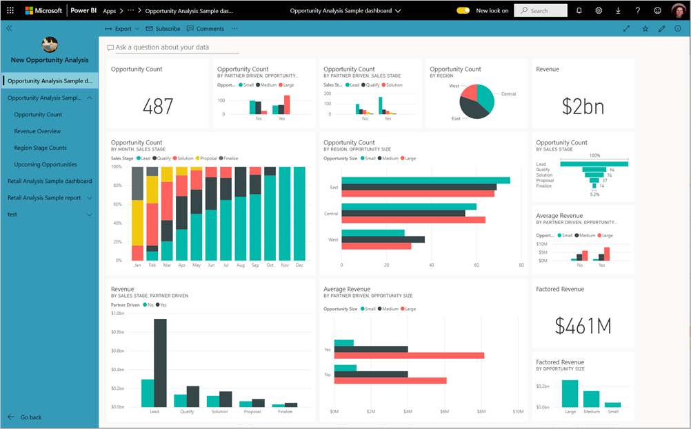

Muitas vezes, os utilizadores empresariais precisam de vários dashboards e relatórios do Power BI para realizarem os seus negócios. Nas aplicações do Power BI, pode criar coleções de dashboards e relatórios e publicar estas coleções como aplicações para toda a organização ou para pessoas específicas ou grupos. Enquanto criador ou administrador de relatórios, as aplicações facilitam a gestão de permissões nestas coleções.

Os utilizadores empresariais obtêm as suas aplicações de algumas formas diferentes:

- Podem encontrar e instalar a sua aplicação a partir do Microsoft AppSource.
- Pode enviar-lhes uma ligação direta.
- Pode instalar aplicações automaticamente nas contas do Power BI dos seus colegas de trabalho, se o administrador do Power BI lhe der permissão.
- O Power BI não envia nenhum e-mail aos utilizadores internos quando distribui ou atualiza uma aplicação. Se o distribuir para os utilizadores externos, estes receberão um e-mail com uma ligação direta. 

Pode criar a aplicação com a sua própria navegação incorporada, para que os utilizadores possam navegar facilmente nos seus conteúdos. Estes não podem modificar os conteúdos da aplicação. No entanto, podem interagir com a mesma no serviço Power BI ou numa das aplicações móveis para filtrar, realçar e ordenar os dados. Obtêm as atualizações automaticamente e pode controlar a frequência de atualização dos dados. Pode também conceder-lhes Permissão de compilação para se ligarem aos conjuntos de dados subjacentes e criarem cópias dos relatórios na aplicação. Saiba mais sobre a [permissão de compilação](../connect-data/service-datasets-build-permissions.md).

## Licenças para aplicações
Para criar ou atualizar uma aplicação, necessita de uma licença do Power BI Pro. Para os *consumidores* da aplicação, existem duas opções.

* **Opção 1** A área de trabalho desta aplicação *não* está numa capacidade Power BI Premium: todos os utilizadores empresariais precisam de licenças do Power BI Pro para ver a aplicação. 
* **Opção 2** A área de trabalho desta aplicação *está* numa capacidade Power BI Premium: Os utilizadores empresariais sem licenças do Power BI Pro na sua organização podem ver os conteúdos da aplicação. No entanto, não podem copiar os relatórios nem criar relatórios com base nos conjuntos de dados subjacentes. Para mais detalhes, leia [O que é o Power BI Premium?](../admin/service-premium-what-is.md).

## Publicar a aplicação
Quando os dashboards e relatórios na sua área de trabalho estiverem prontos, pode escolher quais pretende publicar e publicá-los como uma aplicação. 

1. Na vista de lista da área de trabalho, tem de decidir quais os dashboards e relatórios que pretende que sejam **Incluídos na aplicação**.

    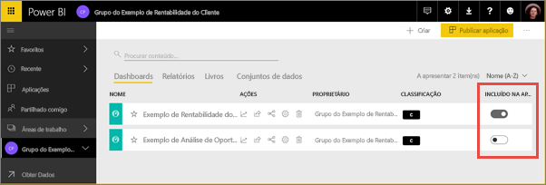

    Se optar por não incluir um relatório com um dashboard relacionado, verá um aviso junto ao relatório. Pode publicar a aplicação, mas o dashboard relacionado não terá os mosaicos desse relatório.

    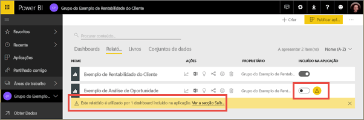

2. Selecione o botão **Publicar aplicação** no canto superior direito para iniciar o processo de criar e publicar uma aplicação a partir da área de trabalho.
   
    

3. Em **Configuração**, preencha o nome e a descrição para ajudar as pessoas a encontrarem a aplicação. Pode definir uma cor de tema para personalizá-la. Também pode adicionar uma ligação para um site de suporte.
   
    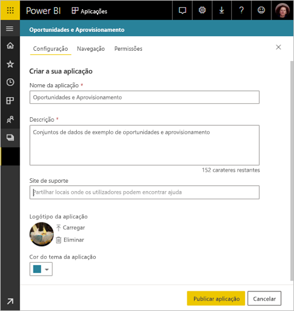

4. Em **Navegação**, selecione os conteúdos que pretende que sejam publicados como parte da aplicação. Em seguida, adicione a navegação da aplicação para organizar os conteúdos em secções. Veja [Conceber a experiência de navegação da aplicação](#design-the-navigation-experience) neste artigo para obter detalhes.
   
    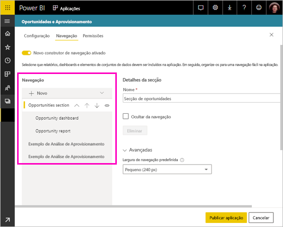

5. Em **Permissões**, decida quem vai ter acesso à aplicação e o que essas pessoas podem fazer com a mesma. 

    - Em [áreas de trabalho clássicas](service-create-workspaces.md): todas as pessoas na sua organização, pessoas específicas ou grupos de segurança do Azure Active Directory (AAD).
    - Na [nova experiência de áreas de trabalho](service-create-the-new-workspaces.md): pessoas específicas, grupos de segurança e listas de distribuição do AAD e Grupos do Microsoft 365. Todos os utilizadores da área de trabalho recebem automaticamente acesso à aplicação da mesma.
    - Pode permitir que os utilizadores da aplicação se liguem aos conjuntos de dados subjacentes da aplicação através da permissão Compilação. Verão estes conjuntos de dados quando estiverem a procurar conjuntos de dados partilhados. Leia mais sobre [permitir que os utilizadores se liguem aos conjuntos de dados da aplicação](#allow-users-to-connect-to-datasets) neste artigo.
    - Os utilizadores com permissão de compilação também podem ter permissão para copiar relatórios desta aplicação para outra área de trabalho. Leia mais sobre [permitir que os utilizadores copiem relatórios na aplicação](#allow-users-to-copy-reports), neste artigo.
    
    >[!IMPORTANT]
    >Se a sua aplicação se basear em conjuntos de dados de outras áreas de trabalho, é responsável por garantir que todos os utilizadores da aplicação têm acesso aos conjuntos de dados subjacentes.
    >Se a aplicação ou o relatório estiver na mesma área de trabalho que o conjunto de dados, certifique-se de que também adiciona à aplicação o relatório associado ao conjunto de dados.

6. Pode instalar a aplicação automaticamente para os destinatários se o seu administrador do Power BI tiver ativado esta definição no Portal de Administração do Power BI. Leia mais sobre como [instalar automaticamente uma aplicação](#automatically-install-apps-for-end-users) neste artigo.

    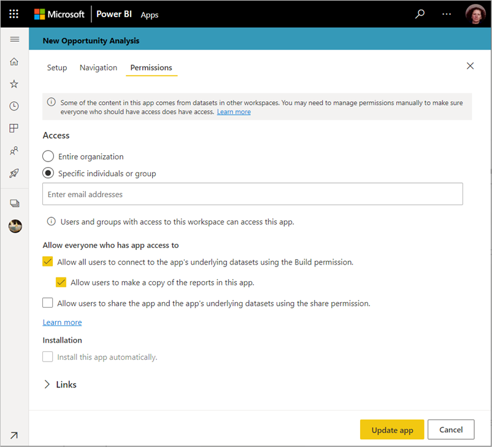

7. Quando selecionar **Publicar aplicação**, verá uma mensagem a confirmar que está pronto para publicar. Na caixa de diálogo **Partilhar esta aplicação**, pode copiar o URL que é uma ligação direta para esta aplicação.
   
    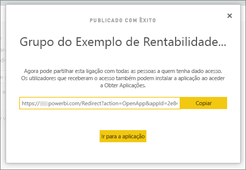

Pode enviar essa ligação direta para as pessoas com quem a partilhou ou pode localizar a aplicação no separador Aplicações ao aceder a **Transferir e explorar mais aplicações do AppSource**. Leia mais sobre a [experiência de aplicação para utilizadores empresariais](../consumer/end-user-apps.md).

## Alterar a aplicação publicada
Depois de publicar a aplicação, poderá querer alterá-la ou atualizá-la. É fácil atualizá-la se for um administrador ou membro da nova área de trabalho. 

1. Abra a área de trabalho que corresponde à aplicação. 
   
    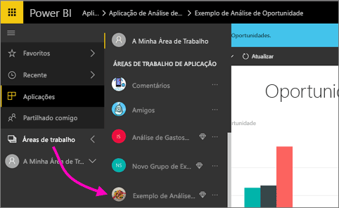

2. Faça as alterações que pretende aos dashboards ou relatórios.
 
    A área de trabalho é a área de teste, pelo que as suas alterações não são apresentadas em direto na aplicação até a publicar novamente. Isto permite-lhe efetuar alterações sem afetar as aplicações publicadas.  
 
    > [!IMPORTANT]
    > Se remover um relatório e atualizar a aplicação, mesmo que volte a adicioná-lo à mesma, os consumidores da sua aplicação irão perder todas as personalizações como marcadores, comentários, etc.  
 
3. Volte à lista de conteúdos da área de trabalho e selecione **Atualizar aplicação** no canto superior direito.
   
1. Atualize as secções **Configuração**, **Navegação** e **Permissões** se necessário e, em seguida, selecione **Atualizar aplicação**.
   
As pessoas com as quais publicou a aplicação veem automaticamente a versão atualizada da aplicação. 

## Conceber a experiência de navegação
A opção **Novo construtor de navegação** permite-lhe criar uma navegação personalizada para a sua aplicação. A navegação personalizada torna mais fácil para os seus utilizadores localizarem e utilizarem os conteúdos na aplicação. As aplicações existentes têm esta opção desativada e, por predefinição, as novas aplicações têm esta opção ativada.

Quando a opção está desativada, pode selecionar a **Página de destino da aplicação** como sendo de **Conteúdo específico** (por exemplo, um dashboard ou relatório) ou selecionar **Nenhum** para mostrar uma lista básica de conteúdos ao utilizador.

Quando ativar o **Novo construtor de navegação**, pode conceber uma navegação personalizada. Por predefinição, todos os relatórios, dashboards e livros do Excel que incluiu na sua aplicação são apresentados como uma lista não hierárquica. 

Pode personalizar ainda mais a navegação da aplicação ao:

* Reordenar os itens com as teclas Seta Para Cima/Seta Para Baixo. 
* Mudar o nome dos itens nos **Detalhes do relatório**, nos **Detalhes do dashboard** e nos **Detalhes do livro**.
* Ocultar determinados itens da navegação.
* Utilizar a opção **Novo** para adicionar **secções** a conteúdos relacionados com grupos.
* Utilizar a opção **Novo** para adicionar uma **ligação** a um recurso externo ao painel de navegação. 

Ao adicionar uma **ligação**, em **Detalhes da ligação** pode selecionar o local onde a ligação será aberta. Por predefinição, as ligações são abertas no **Separador atual**, mas pode selecionar as opções **Novo separador** ou **Área de conteúdo**. 

### Considerações sobre a utilização da opção Novo construtor de navegação
Seguem-se alguns aspetos gerais a ter em atenção ao utilizar o novo construtor de navegação:

* As páginas de relatórios são apresentadas na área de navegação da aplicação como uma secção expansível. Quando um relatório tem uma página visível, só é apresentado o nome do relatório. Clicar no nome do relatório na navegação abre a primeira página do relatório. 

    > [!NOTE]
    > O relatório pode ter apenas uma página visível porque configurou a navegação para o resto das páginas com botões ou ações de pormenorização.

* Se desativar o novo construtor de navegação e, em seguida, publicar ou atualizar a sua aplicação, irá perder as personalizações que efetuou. Por exemplo, as secções, ordenações, ligações e nomes personalizados dos itens de navegação serão perdidos.
* Está disponível a opção de não utilizar o construtor de aplicações.

Ao adicionar ligações à navegação da sua aplicação e ao selecionar a opção Área de conteúdo:
* Certifique-se de que a ligação pode ser incorporada. Alguns serviços impedem a incorporação dos respetivos conteúdos em sites de terceiros, como o Power BI.
* A incorporação de conteúdos do serviço Power BI como relatórios ou dashboards noutras áreas de trabalho não é suportada. 
* Incorpore conteúdos do Power BI Report Server através do respetivo URL incorporado nativo a partir de uma implementação no local. Siga os passos indicados em [Criar o URL do Power BI Report Server](../report-server/quickstart-embed.md#create-the-power-bi-report-url) para obter o URL. Tenha em atenção que são aplicadas regras de autenticação normais, pelo que a visualização de conteúdos requer uma ligação ao servidor no local. 
* Será apresentado um aviso de segurança na parte superior dos conteúdos incorporados para indicar que estes não se encontram no Power BI.

## Instalar automaticamente as aplicações para os utilizadores finais
Se um administrador lhe atribuir permissões, pode instalar aplicações de forma automática ao *emiti-las* por push para os utilizadores finais. Esta funcionalidade de push torna mais fácil distribuir as aplicações certas para as pessoas ou grupos certos. A sua aplicação é apresentada automaticamente na lista de conteúdos das Aplicações dos seus utilizadores finais. Estes não precisam de a procurar no Microsoft AppSource ou de seguir uma ligação de instalação. Veja como os administradores permitem a [emissão de aplicações por push para utilizadores finais](../admin/service-admin-portal.md#push-apps-to-end-users) no artigo do portal de administração do Power BI.

### Como emitir uma aplicação por push automaticamente para os utilizadores finais
Após o administrador lhe ter atribuído permissões, tem uma nova opção para **instalar a aplicação automaticamente**. Ao selecionar a caixa de verificação e selecionar **Publicar aplicação** (ou **Atualizar aplicação**), a aplicação é emitida por push para todos os utilizadores ou grupos incluídos na secção **Permissões** da aplicação, no separador **Acesso**.

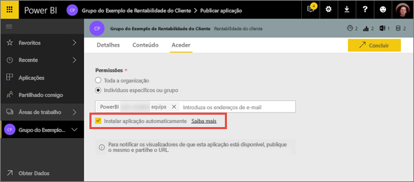

### Como os utilizadores obtêm as aplicações que lhes emitiu por push
Após emitir uma aplicação por push, esta é apresentada automaticamente na lista Aplicações dos utilizadores. Desta forma, pode organizar as aplicações que utilizadores ou cargos específicos na sua organização precisam de ter à disposição.

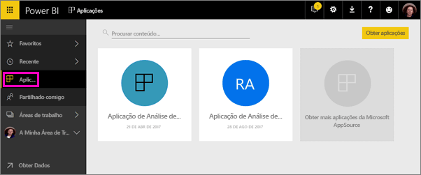

### Considerações para instalar automaticamente as aplicações
Seguem-se alguns aspetos a ter em atenção quando enviar aplicações por push para utilizadores finais:

* Instalar uma aplicação automaticamente para os utilizadores pode demorar algum tempo. A maioria das aplicações é instalada automaticamente, mas as aplicações emitidas por push podem demorar algum tempo.  Depende do número de itens na aplicação e do número de pessoas com acesso. Recomendamos que envie aplicações por push fora do horário de expediente e com bastante tempo de antecedência antes que os utilizadores precisem delas. Confirme com vários utilizadores antes de enviar comunicação abrangente sobre a disponibilidade das aplicações.

* Atualize o browser. Antes de ver a aplicação enviada por push na lista Aplicações, o utilizador poderá ter de atualizar ou fechar e abrir novamente o browser.

* Se os utilizadores não virem imediatamente a aplicação na lista Aplicações, devem atualizar ou fechar e abrir novamente o respetivo browser.

* Tente não sobrecarregar os utilizadores. Tenha cuidado e não envie demasiadas aplicações por push para que os seus utilizadores compreendam que as aplicações pré-instaladas são úteis. É recomendável controlar quem pode enviar aplicações por push para os utilizadores finais para coordenar os horários. Estabeleça um ponto de contacto para emitir aplicações por push para os utilizadores finais na sua organização.

* Os utilizadores convidados que não tiverem aceitado um convite não recebem as aplicações automaticamente instaladas.  

## Permitir que os utilizadores se liguem a conjuntos de dados

Ao marcar a opção para **Permitir que os utilizadores se liguem aos conjuntos de dados subjacentes da aplicação**, está a dar aos utilizadores da aplicação *permissão de compilação* nesses conjuntos de dados. Com esta permissão, podem executar várias ações importantes:

- [Utilizar os conjuntos de dados da aplicação](../connect-data/service-datasets-across-workspaces.md) como base para os relatórios.
- Procurar estes conjuntos de dados no Power BI Desktop e na experiência de obtenção de dados no serviço Power BI.
- Criar relatórios e dashboards com base nestes conjuntos de dados.

Ao desmarcar esta opção, os novos utilizadores que adicionar à aplicação não obterão a Permissão de compilação. No entanto, para utilizadores de aplicações existentes, as permissões nos conjuntos de dados subjacentes não serão alteradas. Pode remover manualmente a Permissão de compilação dos utilizadores da aplicação que já não deviam tê-la. Saiba mais sobre a [permissão de compilação](../connect-data/service-datasets-build-permissions.md).

## Permitir que os utilizadores copiem relatórios

Quando selecionar a opção **Permitir que os utilizadores façam uma cópia dos relatórios nesta aplicação**, os seus utilizadores podem guardar quaisquer relatórios na aplicação em A Minha Área de Trabalho ou noutra área de trabalho. Para criar uma cópia, os utilizadores precisam de uma licença Pro, mesmo que o relatório original esteja numa área de trabalho numa capacidade Premium. Desta forma, os utilizadores podem personalizar os relatórios consoante as suas necessidades. Primeiro tem de selecionar a opção **Permitir que todos os utilizadores se liguem aos conjuntos de dados subjacentes da aplicação através da Permissão de compilação**. Ao selecionar estas opções, está a ativar a nova capacidade [copiar relatórios de outras áreas de trabalho](../connect-data/service-datasets-copy-reports.md).

## Anular publicação de uma aplicação
Qualquer membro da área de trabalho pode anular a publicação da aplicação.

>[!IMPORTANT]
>Quando anular a publicação de uma aplicação, os utilizadores da aplicação perdem as suas personalizações. Estes perderão todos os marcadores pessoais, comentários ou subscrições associadas aos conteúdos na aplicação. Apenas anule a publicação de uma aplicação se precisar de a remover.
> 

* Na área de trabalho, selecione as reticências ( **...** ) no canto superior direito > **Anular aplicação**.
  
    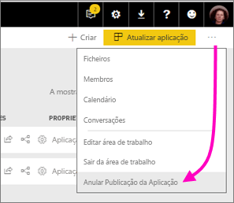

Esta ação desinstala a aplicação de todas as pessoas para as quais a publicou e já não terão acesso à mesma. Não elimina a área de trabalho nem os respetivos conteúdos.

## Ver a aplicação publicada

Quando os consumidores da sua aplicação abrirem a mesma, verão o painel de navegação que criou em vez do painel de navegação padrão do Power BI. As listas de navegação da aplicação apresentam os relatórios e dashboards nas secções que definiu. Também apresentam as páginas individuais em cada relatório em vez de apenas mostrarem o nome do relatório. Pode expandir e fechar a navegação à esquerda com as setas na barra de menus.

No modo de ecrã inteiro, pode mostrar ou ocultar a navegação ao selecionar a opção no canto.

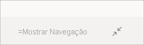

## Considerações e Limitações
Elementos a ter em conta sobre a publicação de aplicações:

* A página de permissões não altera a permissão em conjuntos de dados noutras áreas de trabalho. Vê um aviso a relembrá-lo para conceder acesso a esses conjuntos de dados de forma independente. A melhor prática é contactar o proprietário do conjunto de dados antes de começar a criar a sua aplicação para garantir que não há problema em dar a todos os utilizadores da aplicação acesso a esses conjuntos de dados. 
* Pode ter até 100 utilizadores ou grupos na lista de acesso à aplicação. No entanto, pode permitir o acesso à aplicação a mais de 100 utilizadores. Para tal, utilize um ou mais grupos de utilizadores que contenham todos os utilizadores pretendidos.
* Relativamente à nova experiência de área de trabalho, se o utilizador adicionado à lista de acesso à aplicação já tiver acesso à aplicação através da área de trabalho, não será apresentado na lista de acesso da aplicação.  
* O URL do site de suporte é mostrado no cartão de informação do item.
* As aplicações têm a opção de permitir que os utilizadores partilhem a aplicação e os conjuntos de dados subjacentes da aplicação ao utilizar a permissão de partilha. Para novas aplicações, esta opção está desativada por predefinição. Recomendamos que desative esta opção para as suas aplicações existentes e atualize a permissão nos conjuntos de dados subjacentes. A opção foi ativada para aplicações existentes porque as aplicações foram concebidas inicialmente para substituir pacotes de conteúdos que tinham este comportamento.
* As aplicações podem ter um máximo de 200 dashboards. 

## Próximos passos
* [Criar uma área de trabalho](service-create-workspaces.md)
* [Instalar e utilizar aplicações no Power BI](../consumer/end-user-apps.md)
* [Aplicações do Power BI para serviços externos](../connect-data/service-connect-to-services.md)
* [Portal de Administração do Power BI](../admin/service-admin-portal.md)
* Perguntas? [Experimente perguntar à Comunidade do Power BI](https://community.powerbi.com/)
