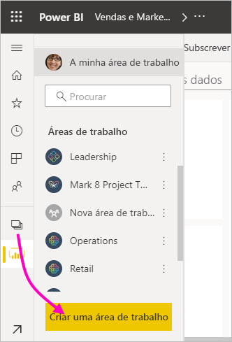
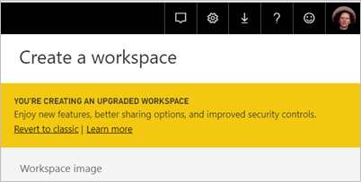
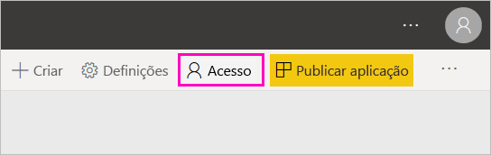
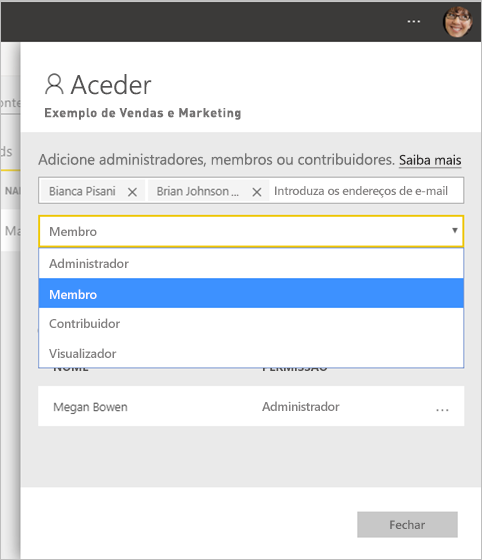
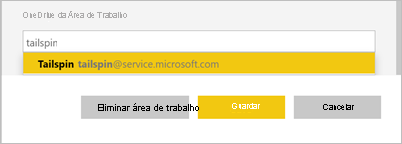
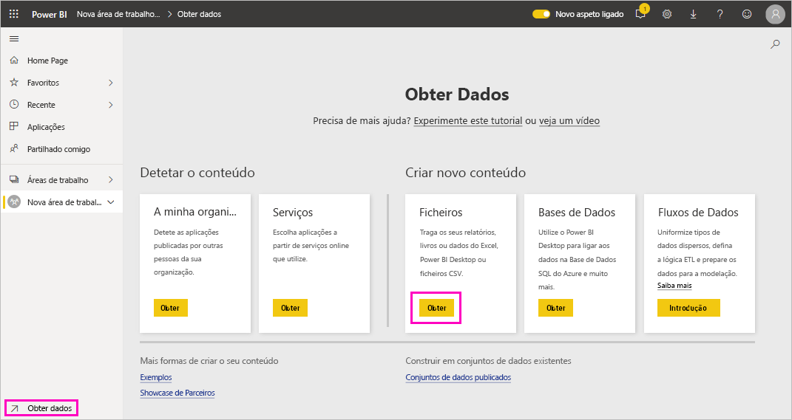
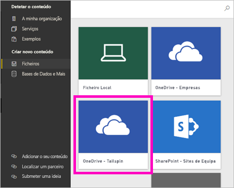
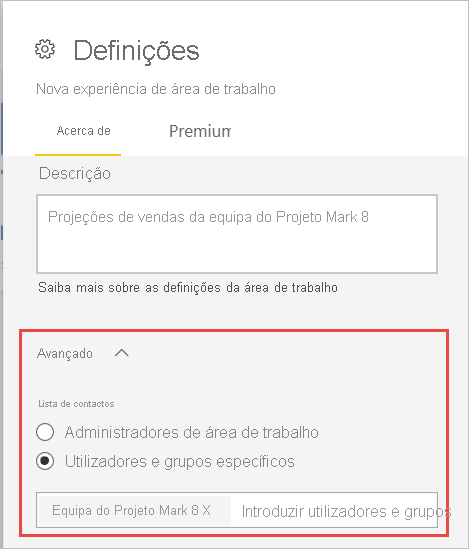

# Criar as novas áreas de trabalho no Power BI

Este artigo explica como criar uma das *novas áreas de trabalho* em vez de uma área de trabalho *clássica*. Ambos os tipos de áreas de trabalho são locais onde colabora com colegas. Pode criar coleções de dashboards, relatórios e relatórios paginados nas mesmas. Se quiser, também pode agrupar essa coleção numa *aplicação* e distribuí-la para um público mais vasto. Para obter mais informações, veja o artigo [novas áreas de trabalho](service-new-workspaces.md).

Pronto para migrar a área de trabalho clássica? Veja [Atualizar as áreas de trabalho clássicas para as novas áreas de trabalho no Power BI](service-upgrade-workspaces.md) para obter detalhes.

> [!NOTE]
> Para impor a segurança a nível da linha (RLS) para os utilizadores do Power BI Pro que procuram conteúdos numa área de trabalho, atribua a Função Visualizador aos mesmos. Veja [Funções nas novas áreas de trabalho](service-new-workspaces.md#roles-in-the-new-workspaces) para obter uma explicação sobre as diferentes funções.

## Criar uma das novas áreas de trabalho

1. Comece por criar a área de trabalho. Selecione **Áreas de trabalho** > **Criar área de trabalho**.
   
     

2. Está automaticamente a criar uma área de trabalho atualizada, a não ser que opte por **Reverter para a clássica**.
   
     
     
     Se selecionar **Reverter para clássica**, [cria uma área de trabalho clássica](service-create-workspaces.md) baseada num grupo do Microsoft 365.

2. Atribua um nome exclusivo à área de trabalho. Se o nome não estiver disponível, edite-o para criar um nome exclusivo.
   
     A aplicação que criar a partir da área de trabalho terá o mesmo nome e ícone que a área de trabalho.
   
1. Aqui estão alguns itens opcionais que pode definir para a área de trabalho:

    - Carregue uma **Imagem da área de trabalho**. Os ficheiros podem ser .png ou .jpg. O tamanho do ficheiro tem de ser inferior a 45 KB. 
    - [Especifique um OneDrive da Área de Trabalho](#set-a-workspace-onedrive) para utilizar uma localização de armazenamento dos ficheiros de um grupo do Microsoft 365.    
    - [Adicione uma Lista de contactos](#create-a-contact-list). Por predefinição, os administradores da área de trabalho são os contactos. 
    - [Permitir que os contribuidores atualizem a aplicação](#allow-contributors-to-update-the-app) da área de trabalho
    - Para atribuir a área de trabalho a uma **Capacidade dedicada**, no separador **Premium**, selecione **Capacidade dedicada**.

        

1. Selecione **Guardar**.

    O Power BI cria a área de trabalho e abre-a. Irá vê-la na lista de áreas de trabalho das quais é membro. 

## Conceder acesso à área de trabalho

Qualquer pessoa com função de administrador numa área de trabalho pode conceder acesso à mesma a outras pessoas ao adicioná-las a diferentes funções. Os criadores das áreas de trabalho são automaticamente administradores. Veja [Funções nas novas áreas de trabalho](service-new-workspaces.md#roles-in-the-new-workspaces) para obter uma explicação sobre as funções.

1. Uma vez que desempenha a função de administrador, vê a opção **Acesso** na página da lista de conteúdo da área de trabalho.

    

1. Adicione grupos de segurança, listas de distribuição, grupos do Microsoft 365 ou utilizadores individuais a estas áreas de trabalho como administradores, membros, contribuidores ou visualizadores. 

    

9. Selecione **Adicionar** > **Fechar**.

## Definir um OneDrive da área de trabalho

A funcionalidade OneDrive da Área de Trabalho permite-lhe configurar um grupo do Microsoft 365 cujo armazenamento de ficheiros da Biblioteca de Documentos do SharePoint está disponível para os utilizadores da área de trabalho. Crie primeiro o grupo fora do Power BI. 

O Power BI não sincroniza as permissões de utilizadores ou grupos que estão configurados para terem acesso à área de trabalho com a associação ao grupo do Microsoft 365. A melhor prática consiste em [conceder o acesso à área de trabalho](#give-access-to-your-workspace) ao mesmo grupo do Microsoft 365 cujo armazenamento de ficheiros configurar nesta definição do grupo do Microsoft 365. Em seguida, faça a gestão do acesso à área de trabalho ao gerir a associação do grupo do Microsoft 365. 

1. Aceda à nova definição da **Área de trabalho do OneDrive** de uma destas duas formas:

    No painel **Criar uma área de trabalho** quando a cria pela primeira vez.

    No painel de navegação, selecione a seta junto a **Áreas de trabalho**, selecione **Mais opções** (...) junto ao nome da área de trabalho > **Definições da área de trabalho**. O painel **Definições** é apresentado.

    

2. Em **Avançado** > **Área de trabalho do OneDrive**, introduza o nome do grupo do Microsoft 365 que criou anteriormente. Introduza apenas o nome, não o URL. O Power BI seleciona automaticamente o OneDrive para o grupo.

    

3. Selecione **Guardar**.

### Aceder à localização da área de trabalho OneDrive

Uma vez configurada a localização do OneDrive, poderá aceder da mesma forma que acede a outras origens de dados no serviço Power BI.

1. No painel de navegação, selecione **Obter Dados** e, na caixa **Ficheiros**, selecione **Obter**.

    

1.  A entrada **OneDrive – Empresas** é o seu OneDrive para Empresas pessoal. O segundo OneDrive é aquele que adicionou.

    

## Criar uma lista de contactos

Pode especificar os utilizadores que receberão notificações sobre problemas que afetam a área de trabalho. Por predefinição, qualquer utilizador ou grupo especificado como administrador da área de trabalho é notificado, mas pode adicionar outras pessoas à *lista de contactos*. Os utilizadores ou grupos na lista de contactos estão listados na interface de utilizador (IU) para ajudar os utilizadores a obter ajuda relacionada com a área de trabalho.

1. Aceda à configuração da nova **Lista de contactos** de uma destas duas formas:

    No painel **Criar uma área de trabalho** quando a cria pela primeira vez.

    No painel de navegação, selecione a seta junto a **Áreas de trabalho**, selecione **Mais opções** (...) junto ao nome da área de trabalho > **Definições da área de trabalho**. O painel **Definições** é apresentado.

    

2. Em **Avançadas**, **Lista de contactos**, aceite a predefinição, **Administradores da área de trabalho**, ou adicione a sua própria lista de **Utilizadores ou grupos específicos**. 

    

3. Selecione **Guardar**.

## Permitir que os contribuidores atualizem a aplicação

A definição **Permitir que os contribuidores atualizem a aplicação desta área de trabalho** permite que os Administradores da área de trabalho deleguem aos utilizadores na função Contribuidor a capacidade de atualizar a aplicação para a área de trabalho. Por predefinição, apenas os Administradores e Membros da área de trabalho podem publicar e atualizar a aplicação para a área de trabalho. 

1. Para aceder a esta definição, no painel de navegação, selecione a seta junto a **Áreas de trabalho**, selecione **Mais opções** (...) junto ao nome da área de trabalho > **Definições da área de trabalho**. O painel **Definições** é apresentado.

    

2. Em **Avançadas**, expanda a opção **Definições de segurança**. Selecione **Permitir que os contribuidores atualizem a aplicação desta área de trabalho**. 

Quando a opção estiver ativada, os contribuidores podem:
* Atualizar os metadados da aplicação, como nome, ícone, descrição, site de suporte e cor
* Adicionar ou remover itens incluídos na aplicação, como adicionar relatórios ou conjuntos de dados
* Alterar a navegação da aplicação ou o item predefinido em que a aplicação é aberta

Contudo, os contribuidores não podem:
* Publicar a aplicação pela primeira vez
* Alterar quem tem permissão para a aplicação

## Aplicações nas novas áreas de trabalho

Pode criar e consumir *aplicações* em vez de pacotes de conteúdos. As aplicações são coleções de dashboards, relatórios e conjuntos de dados que se ligam a serviços de terceiros e dados organizacionais. As aplicações facilitam a obtenção de dados de serviços como o Microsoft Dynamics CRM, o Salesforce e o Google Analytics.

Na nova experiência de áreas de trabalho, não pode criar ou consumir pacotes de conteúdos organizacionais. Peça às suas equipas internas que forneçam aplicações para os pacotes de conteúdos que está a utilizar atualmente. 

### Distribuir uma aplicação

Se quiser distribuir conteúdos oficiais para um grande público na sua organização, poderá publicar uma *aplicação* a partir da sua área de trabalho.  Quando os seus conteúdos estiverem prontos, pode selecionar que dashboards e relatórios quer publicar e publicá-los como uma aplicação. Pode criar uma aplicação a partir de cada área de trabalho.

Leia sobre como [publicar uma aplicação a partir das novas áreas de trabalho](service-create-distribute-apps.md).

## Próximos passos
* Leia mais no artigo [Organizar o trabalho na nova experiência de áreas de trabalho no Power BI](service-new-workspaces.md)
* [Criar as áreas de trabalho clássicas](service-create-workspaces.md)
* [Publicar uma aplicação a partir das novas áreas de trabalho no Power BI](service-create-distribute-apps.md)
* Perguntas? [Experimente perguntar à Comunidade do Power BI](https://community.powerbi.com/)
