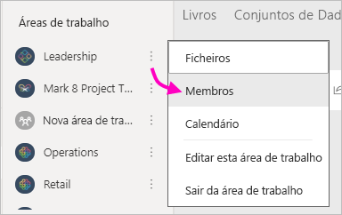

# Criar áreas de trabalho clássicas no Power BI

No Power BI, pode criar *áreas de trabalho*, ou seja, locais onde pode colaborar com colegas para criar e otimizar coleções de dashboards, relatórios e relatórios paginados. O Power BI tem as áreas de trabalho originais ou *clássicas* e as novas áreas de trabalho. Este artigo é sobre a criação de uma área de trabalho clássica.

**Sabia que?** O Power BI oferece uma nova experiência de áreas de trabalho, que é agora a predefinição. Para obter detalhes sobre as novas áreas de trabalho, leia [Organize work in the new workspaces](service-new-workspaces.md) (Organizar o seu trabalho nas novas áreas de trabalho). Pronto para migrar a sua área de trabalho clássica? Veja [Atualizar as áreas de trabalho clássicas para as novas áreas de trabalho no Power BI](service-upgrade-workspaces.md) para obter detalhes.

Ao criar uma área de trabalho clássica, está também a criar um grupo subjacente associado ao Microsoft 365. Todas as tarefas de administração da área de trabalho são realizadas no Microsoft 365. Pode adicionar colegas a estas áreas de trabalho como membros ou administradores. Na área de trabalho, todos podem colaborar nos dashboards, relatórios e outros artigos que planeiam publicar para um público mais vasto. Todas as pessoas que adicionar à área de trabalho precisam de ter uma licença do Power BI Pro.

## Vídeo: Aplicações e áreas de trabalho
<iframe width="640" height="360" src="https://www.youtube.com/embed/Ey5pyrr7Lk8?showinfo=0" frameborder="0" allowfullscreen></iframe>

## Criar uma área de trabalho clássica baseada num grupo do Microsoft 365

Quando cria uma área de trabalho, esta é criada com base num grupo do Microsoft 365.

[!INCLUDE [powerbi-service-create-app-workspace](../includes/powerbi-service-create-app-workspace.md)]

Ao criá-la pela primeira vez, poderá ter de aguardar aproximadamente uma hora para a área de trabalho ser propagada para o Microsoft 365.

### Adicionar uma imagem à área de trabalho do Microsoft 365 (opcional)
Por predefinição, o Power BI cria um círculo ligeiramente colorido para a aplicação, com as iniciais da aplicação. Mas talvez o queira personalizar com uma imagem. Para adicionar uma imagem, precisa de uma licença do Exchange Online.

1. Selecione **Áreas de trabalho**, selecione **Mais opções** (…) junto ao nome da área de trabalho e, em seguida, **Membros**. 
   
     
   
    A conta do Outlook do Microsoft 365 para a área de trabalho é aberta numa nova janela do browser.
2. Selecione o lápis **Editar**.
   
     
3. Selecione a imagem da câmera e localize a imagem que quer utilizar.
   
     

     As imagens podem ser ficheiros .png, .jpg ou .bmp. O ficheiro pode ter um tamanho grande, até 3 MB. 

4. Selecione **OK** e, em seguida, **Guardar**.
   
    A imagem substitui o círculo colorido na janela do Outlook do Microsoft 365.
   
     
   
    Em alguns minutos, irá ser também apresentada na aplicação do Power BI.

## Adicionar conteúdos à área de trabalho

Depois de ter criado uma área de trabalho, é altura de adicionar conteúdos à mesma. O processo é igual ao de adicionar conteúdos em A Minha Área de Trabalho, exceto que as outras pessoas na área de trabalho também a podem ver e trabalhar nela. Uma grande diferença é que, quando tiver concluído, pode publicar o conteúdo como uma aplicação. Ao visualizar os conteúdos na lista de conteúdos de uma área de trabalho, o nome da área de trabalho é indicado como sendo o do proprietário.

### Ligar a serviços de terceiros nas áreas de trabalho

As aplicações são disponibilizadas para todos os serviços de terceiros suportados pelo Power BI, para que possa obter dados dos serviços que utiliza mais facilmente, como o Microsoft Dynamics CRM, o Salesforce ou o Google Analytics. Pode publicar aplicações organizacionais para fornecer aos utilizadores os dados de que estes precisam.

Também pode ligar-se a serviços nas áreas de trabalho clássicas através de pacotes de conteúdos organizacionais e aplicações de terceiros, como o Microsoft Dynamics CRM, o Salesforce ou o Google Analytics. Os pacotes de conteúdos organizacionais estão a ser preteridos. Agora é uma boa altura para atualizar os seus pacotes de conteúdos para aplicações, se ainda não tiver começado. Consulte a secção de atualização da área de trabalho da publicação de blogue [Anunciar que os administradores do Power BI podem atualizar áreas de trabalho clássicas](https://powerbi.microsoft.com/blog/announcing-power-bi-admins-can-upgrade-classic-workspaces-and-roadmap-update/) para obter a linha cronológica.

## Distribuir uma aplicação

Se quiser distribuir conteúdos oficiais para um grande público na sua organização, poderá publicar uma aplicação a partir da sua área de trabalho.  Quando os conteúdos estiverem prontos, selecione os dashboards e relatórios que pretende publicar e, em seguida, publique-os como uma *aplicação*. Pode criar uma aplicação a partir de cada área de trabalho.

A lista Aplicações no painel de navegação mostra todas as aplicações que instalou. Os seus colegas podem obter a sua aplicação de algumas formas diferentes. 
- Podem encontrar e instalar a sua aplicação a partir do Microsoft AppSource
- Pode enviar-lhes uma ligação direta. 
- Pode instalar aplicações automaticamente nas contas do Power BI dos seus colegas de trabalho, se o administrador do Power BI lhe der permissão. 

Os utilizadores veem os conteúdos de aplicações atualizados automaticamente após publicar uma atualização a partir da sua área de trabalho. Pode controlar com que frequência os dados são atualizados ao configurar a agenda de atualizações nos conjuntos de dados utilizados pelos conteúdos de aplicação na sua área de trabalho. Consulte [Publish an app from the new workspaces in Power BI](service-create-distribute-apps.md) (Publicar uma aplicação a partir das novas áreas de trabalho no Power BI) para obter detalhes.

## FAQ sobre aplicações clássicas no Power BI

### Quais são as diferenças entre as aplicações e os pacotes de conteúdos organizacionais?
As aplicações são a evolução dos pacotes de conteúdos organizacionais, que estão a ser preteridos. Agora é uma boa altura para atualizar os seus pacotes de conteúdos para aplicações, se ainda não tiver começado. Consulte a secção de atualização da área de trabalho da publicação de blogue [Anunciar que os administradores do Power BI podem atualizar áreas de trabalho clássicas](https://powerbi.microsoft.com/blog/announcing-power-bi-admins-can-upgrade-classic-workspaces-and-roadmap-update/) para obter a linha cronológica. 

* Depois de os utilizadores empresariais instalarem um pacote de conteúdos, este perde a respetiva identidade agrupada: é apenas uma lista de dashboards e relatórios misturados com outros dashboards e relatórios. As aplicações, por outro lado, mantêm o respetivo agrupamento e identidade, mesmo após a instalação. Este agrupamento torna mais fácil aos utilizadores empresariais continuarem a navegar nas aplicações ao longo do tempo.
* Pode criar vários pacotes de conteúdos a partir de qualquer área de trabalho, mas uma aplicação tem uma relação de 1:1 com a respetiva área de trabalho. 
* Não poderá utilizar nem criar pacotes de conteúdos nas novas áreas de trabalho.

Veja [Diferenças entre a área de trabalho nova e a clássica](service-new-workspaces.md#new-and-classic-workspace-differences) para comparar as duas. 

## Próximos passos
* [Instalar e utilizar aplicações no Power BI](service-create-distribute-apps.md)
- [Criar as novas áreas de trabalho](service-create-the-new-workspaces.md)
* Perguntas? [Experimente perguntar à Comunidade do Power BI](https://community.powerbi.com/)
