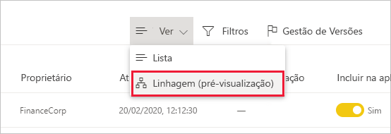
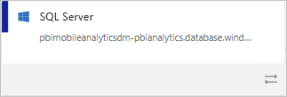

# Linhagem de dados
Em projetos modernos de business intelligence (BI), compreender o fluxo de dados desde a origem até ao destino pode ser um desafio. A dimensão deste desafio é ainda maior se tiver desenvolvido projetos de análise avançados que abranjam múltiplas origens de dados, artefactos e dependências. Responder a perguntas como "O que acontece se alterar estes dados?" ou "Porque é que este relatório não está atualizado?" pode ser difícil. A compreensão destas questões pode exigir o trabalho de uma equipa de peritos ou uma investigação profunda. Para ajudar a responder a estas perguntas, criámos uma vista de linhagem de dados.

 
O Power BI tem vários tipos de artefactos, como dashboards, relatórios, conjuntos de dados e fluxos de dados. Muitos conjuntos de dados e fluxos de dados ligam-se a origens de dados externas, como o SQL Server, e a conjuntos de dados externos noutras áreas de trabalho. Quando um conjunto de dados é externo a uma área de trabalho que lhe pertence, é possível que esteja numa área de trabalho de um colaborador de TI ou outro analista. Os conjuntos de dados e as origens de dados externas tornam difícil perceber de onde os dados são provenientes. Apresentamos a vista de linhagem tanto para projetos simples como complexos.

Na vista de linhagem, pode ver as relações de linhagem entre todos os artefactos numa área de trabalho, bem como todas as respetivas dependências externas. Mostra as ligações entre todos os artefactos da área de trabalho, incluindo as ligações a fluxos de dados de origem e destino.

## Explorar a vista de linhagem

Todas as áreas de trabalho, quer sejam novas ou clássicas, têm automaticamente uma vista de linhagem de dados. Precisa de, pelo menos, uma função de Contribuidor na área de trabalho para a ver. Veja a secção [Permissões](#permissions) neste artigo para obter mais detalhes.

* Para aceder à vista de linhagem, aceda à vista de lista da área de trabalho. Toque na seta junto a **Vista de lista** e selecione **Vista de linhagem**.

   

Nesta vista, pode ver todos os artefactos da área de trabalho e os fluxos de dados de um artefacto para outro.

**Origens de dados**

Verá as origens de dados a partir das quais os conjuntos de dados e fluxos de dados obtêm os dados. Nos cartões de origem de dados, verá mais informações que podem ajudar a identificar a origem. Por exemplo, para o Azure SQL Server, também verá o nome da base de dados.

 
**Gateways**

Se uma origem de dados estiver ligada através de um gateway no local, as informações do gateway serão adicionadas ao cartão da origem de dados. Se tiver permissões como administrador do gateway ou como utilizador da origem de dados, verá mais informações, como o nome do gateway.

**Conjuntos de dados e fluxos de dados**
 
Nos conjuntos de dados e nos fluxos de dados, poderá ver a data e hora da última atualização, bem como se o conjunto de dados ou o fluxo de dados foi certificado ou promovido.

 
Se um relatório na área de trabalho estiver incorporado num conjunto de dados ou num fluxo de dados localizado noutra área de trabalho, verá o nome da área de trabalho de origem no cartão desse conjunto de dados ou fluxo de dados. Selecione o nome da área de trabalho de origem para aceder a essa área de trabalho.

* Em qualquer artefacto, selecione **Mais opções (...)** para ver o menu de opções. Este menu apresenta as mesmas ações que estão disponíveis na vista de lista.

Para ver mais metadados em qualquer artefacto, selecione o cartão do próprio artefacto. Serão apresentadas informações adicionais sobre o artefacto num painel lateral. Na imagem abaixo, o painel lateral apresenta os metadados de um conjunto de dados selecionado.

 
## Mostrar a linhagem de qualquer artefacto 

Imagine que pretende ver a linhagem de um artefacto específico.

* Selecione as setas duplas por baixo do artefacto.

   

   O Power BI realça todos os artefactos relacionados com esse artefacto e esbate os restantes conteúdos. 

## Navegação e ecrã inteiro 

A vista de linhagem é uma tela interativa. Pode utilizar o rato e o touchpad para navegar na tela e para ampliar ou reduzir.

* Para ampliar ou reduzir, utilize o menu no canto inferior direito ou o rato/touchpad.
* Para ter mais espaço para o próprio gráfico, utilize a opção de ecrã inteiro no canto superior direito. 

    

## Permissões

* Precisa de uma licença do Power BI Pro para ver a vista de linhagem.
* A vista de linhagem só está disponível para os utilizadores com acesso à área de trabalho.
* Os utilizadores devem ter uma função de Administrador, Membro ou Contribuidor na área de trabalho. Os utilizadores com a função de Visualizador não podem mudar para a vista de linhagem de dados.

## Considerações e limitações

- A vista de linhagem não está disponível no Internet Explorer. Veja [Supported browsers for Power BI](../fundamentals/power-bi-browsers.md) (Browsers suportados para o Power BI) para obter detalhes.

## Próximas etapas

* [Introdução aos conjuntos de dados em áreas de trabalho (Pré-visualização)](../connect-data/service-datasets-across-workspaces.md)
* [Dataset impact analysis (Análise de impacto dos conjuntos de dados)](service-dataset-impact-analysis.md)
