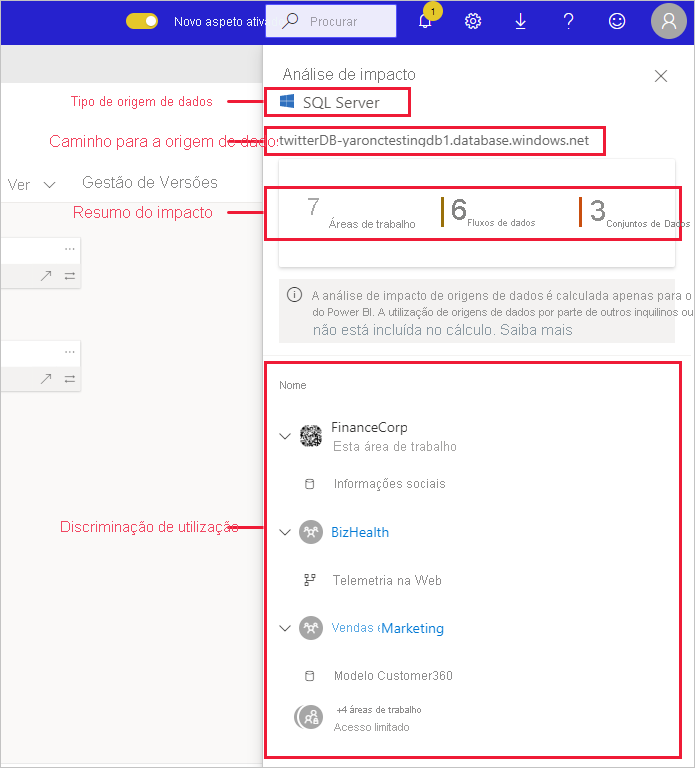
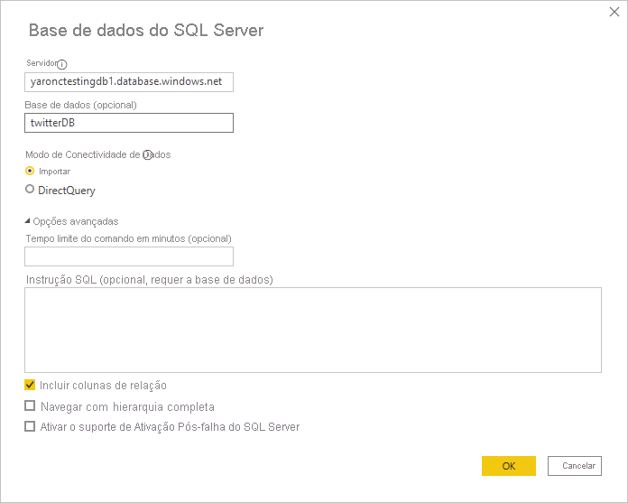
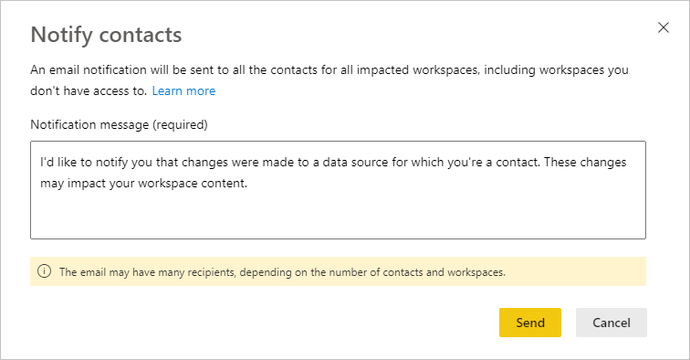

# Análise de impacto da origem de dados

A análise de impacto da origem de dados ajuda a ver onde a sua origem de dados está a ser utilizada em toda a organização. Esta análise pode ser útil quando a origem de dados é colocada offline temporária ou permanentemente e se quiser ter uma ideia sobre quem é afetado. Mostra quantas áreas de trabalho, fluxos de dados e conjuntos de dados utilizam a origem de dados. Além disso, fornece uma navegação fácil para as áreas de trabalho onde estão localizados os fluxos de dados e conjuntos de dados afetados, para que possa investigar mais.

A análise de impacto da origem de dados também podem ajudar a detetar dados duplicados no inquilino, tal como quando vários utilizadores diferentes criam modelos semelhantes sobre a mesma origem de dados. Ao ajudá-lo a descobrir esses conjuntos de dados e fluxos de dados redundantes, a análise de impacto da origem de dados apoia o objetivo de ter "uma única origem fidedigna".

## Executar a análise de impacto da origem de dados

Para executar a análise de impacto da origem de dados:

1. Aceda à área de trabalho que contém a origem de dados que pretende e abra a [Vista de linhagem](service-data-lineage.md).
1. Encontre o cartão da origem de dados e clica no ícone de análise de impacto.

    
 
O painel lateral de análise de impacto é aberto.

 
* **Tipo de origem de dados**: Indica o tipo de origem de dados
* **Caminho para a origem de dados**: Caminho para a origem de dados, conforme definido no Power BI Desktop. Por exemplo, na imagem acima, o caminho para a origem de dados da base de dados do SQL Server é a cadeia de ligação "twitterDB-yaronctestingdb1.database.windows.net", conforme definido no Power BI Desktop (mostrado abaixo). Consiste no nome da base de dados "twitterDB" e o nome do servidor "yaronctestingdb1.database.windows.net".

    
 
* **Resumo do impacto**: Mostra-lhe o número de áreas de trabalho, fluxos de dados e conjuntos de dados potencialmente afetados. Esta contagem inclui áreas de trabalho aos quais o utilizador não tem acesso.
* **Discriminação de utilização**: Mostra-lhe, para cada área de trabalho, os nomes dos fluxos de dados e conjuntos de dados afetados. Para explorar mais aprofundadamente o impacto numa determinada área de trabalho, clique no nome da área de trabalho para a abrir. Uma vez na área de trabalho afetada, utilize [a análise de impacto do conjunto de dados](service-dataset-impact-analysis.md) para ver os detalhes de utilização sobre relatórios e dashboards ligados.

## Notificar contactos

Se fez uma alteração a uma origem de dados ou estiver a pensar nisso, recomendamos que contacte os utilizadores relevantes para os informar. Ao notificar os contactos, é enviado um e-mail para as [listas de contactos](service-create-the-new-workspaces.md#create-a-contact-list) de todas as áreas de trabalho afetadas (no caso das áreas de trabalho clássicas, é enviado um e-mail para os respetivos administradores). O seu nome aparece no e-mail para que os contactos possam encontrá-lo e responder de volta num novo tópico de e-mail. 

1. Clique em **Notificar contactos** no painel lateral de análise de impacto. A caixa de diálogo Notificar contactos será apresentada.

   

1. Na caixa de texto, forneça alguns detalhes sobre a alteração.
1. Quando a mensagem estiver pronta, clique em **Enviar**.

## Privacidade

No painel lateral de análise de impacto, só vê os nomes reais das áreas de trabalho, conjuntos de dados e fluxos de dados a que tem acesso. Os itens a que não tem acesso estão listados como Acesso limitado. Isto é porque alguns nomes de itens podem conter informações pessoais.
As contagens de resumo do impacto incluem todos os fluxos de dados e conjuntos de dados afetados, mesmo aqueles que residem em áreas de trabalho aos quais não tem acesso.

## Limitações

A análise de impacto da origem de dados ainda não é suportada para relatórios paginados, pelo que não verá se a origem de dados tem algum impacto direto neste tipo de relatórios no inquilino.

## Próximos passos

* [Dataset impact analysis (Análise de impacto dos conjuntos de dados)](service-dataset-impact-analysis.md)
* [Linhagem de dados](service-data-lineage.md)