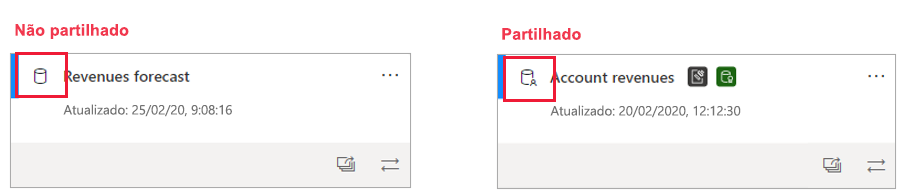

# Análise de impacto dos conjuntos de dados (pré-visualização)

Quando efetua alterações a um conjunto de dados ou está a considerar efetuar alterações, é importante conseguir avaliar o impacto que essas alterações terão em relatórios e dashboards a jusante que dependem desse conjunto de dados. A **análise de impacto dos conjuntos de dados** fornece informações que podem ajudá-lo a fazer esta avaliação.
* Mostra quantas áreas de trabalho, relatórios e dashboards podem ser afetados pela alteração e fornece uma navegação fácil para as áreas de trabalho onde estão localizados os relatórios e dashboards afetados, para que possa investigar mais.
* Mostra os visitantes exclusivos e o número de visualizações nos itens potencialmente afetados. Ajuda a determinar o impacto global da alteração para o item a jusante. Por exemplo, provavelmente é mais importante investigar o efeito de uma alteração num relatório que tem 20 000 visualizadores exclusivos do que investigar o efeito da alteração num relatório que tem três visualizadores.
* Fornece uma forma fácil de notificar pessoas relevantes sobre uma alteração que fez ou está a pensar fazer.

A análise de impacto dos conjuntos de dados é iniciada facilmente a partir da [vista de linhagem de dados](service-data-lineage.md).

## Identificar conjuntos de dados partilhados

Pode efetuar a análise de impacto dos conjuntos de dados em conjuntos de dados partilhados e não partilhados. No entanto, é particularmente útil para conjuntos de dados partilhados entre áreas de trabalho, onde é muito mais complicado obter uma imagem clara das dependências a jusante do que com conjuntos de dados não partilhados, cujas dependências estão localizadas na mesma área de trabalho que o próprio conjunto de dados.

Na vista de linhagem, pode ver a diferença entre conjuntos de dados partilhados e não partilhados por causa do ícone que aparece no canto superior esquerdo do cartão do conjunto de dados.

## Efetuar a análise de impacto dos conjuntos de dados

Pode efetuar a análise de impacto em qualquer conjunto de dados na área de trabalho, quer seja partilhado ou não. Não pode efetuar a análise de impacto em conjuntos de dados externos que são apresentados na vista de linhagem mas estão localizados noutra área de trabalho. Para efetuar a análise de impacto num conjunto de dados externo, tem de navegar para a área de trabalho de origem.

Para efetuar a análise de impacto dos conjuntos de dados, clique no botão de análise de impacto no cartão do conjunto de dados.

O painel lateral de análise de impacto é aberto.

* O **resumo do impacto** mostra o número de áreas de trabalho, relatórios e dashboards potencialmente afetados, bem como o número total de visualizações de todos os relatórios e dashboards a jusante que estão ligados ao conjunto de dados.
* A ligação **notificar contactos** abre uma caixa de diálogo onde pode criar e enviar uma mensagem sobre quaisquer alterações do conjunto de dados que efetue nas listas de contactos das áreas de trabalho afetadas. 
* A **discriminação de utilização** que mostra, para cada área de trabalho, o número total de visualizações de relatórios e dashboards potencialmente afetados que contém, e para cada relatório e dashboard, o número total de visualizadores e visualizações, em que
   * Visualizadores: o número de utilizadores distintos que viram um relatório ou dashboard.
   * Visualizações: o número de visualizações de um relatório ou dashboard

As métricas de utilização dizem respeito aos últimos 30 dias, excluindo o dia atual. A contagem inclui a utilização através de aplicações relacionadas. As métricas ajudam a compreender a utilização do conjunto de dados no inquilino, bem como avaliar o impacto que quaisquer alterações ao seu conjunto de dados podem ter.

## Notificar contactos

Se fez uma alteração a um conjunto de dados ou está a pensar fazer uma alteração, é recomendável contactar os utilizadores relevantes para os informar. Quando notifica os contactos, é enviado um e-mail para a [lista de contactos](../service-create-the-new-workspaces.md#workspace-contact-list) de todas as áreas de trabalho afetadas. O seu nome aparece no e-mail para que os contactos possam encontrá-lo e responder de volta num novo tópico de e-mail. 

1. Clique em **Notificar contactos** no painel lateral de análise de impacto. A caixa de diálogo Notificar contactos será apresentada.

   

1. Na caixa de texto, forneça alguns detalhes sobre a alteração.
1. Quando a mensagem estiver pronta, clique em **Enviar**.

> [!NOTE]
> A opção Notificar contactos não está disponível se o conjunto de dados em que está a efetuar a análise de impacto estiver numa área de trabalho clássica.

## Privacidade

Para efetuar a análise de impacto num conjunto de dados, tem de ter permissões de escrita. No painel lateral de análise de impacto, só vê os nomes reais das áreas de trabalho, relatórios e dashboards a que tem acesso. Os itens a que não tem acesso estão listados como **Acesso limitado**. Isto é porque alguns nomes de itens podem conter informações pessoais.

Mesmo que não tenha acesso a algumas áreas de trabalho, ainda verá métricas de utilização resumidas para essas áreas de trabalho e as mensagens de notificação de contactos chegarão às listas de contactos dessas áreas de trabalho.

## Análise de impacto do Power BI Desktop

Quando efetua uma alteração a um conjunto de dados no Power BI Desktop e, em seguida, o publica novamente no serviço Power BI, uma mensagem mostra quantas áreas de trabalho, relatórios e dashboards são potencialmente afetados pela alteração e pede para confirmar que pretende substituir o conjunto de dados publicado atualmente por aquele que modificou. A mensagem também fornece uma ligação para a análise completa de impacto dos conjuntos de dados no serviço Power BI, onde pode ver mais informações e efetuar ações para mitigar os riscos da alteração.

> [!NOTE]
> As informações apresentadas na mensagem indicam apenas o impacto potencial, não indicam necessariamente que algo está danificado. Muitas vezes, as alterações do conjunto de dados não têm efeito adverso nos relatórios e dashboards a jusante, mas ainda receberá esta mensagem que lhe dá clareza sobre o impacto potencial.
>
>Na mensagem, o número de áreas de trabalho só é apresentado se mais de uma área de trabalho contiver relatórios e dashboards afetados.

## Limitações

* Atualmente, as métricas de utilização não são suportadas para áreas de trabalho clássicas e pessoais.

## Próximos passos

* [Introdução aos conjuntos de dados em áreas de trabalho (Pré-visualização)](../service-datasets-across-workspaces.md)
* [Linhagem de dados](service-data-lineage.md)
