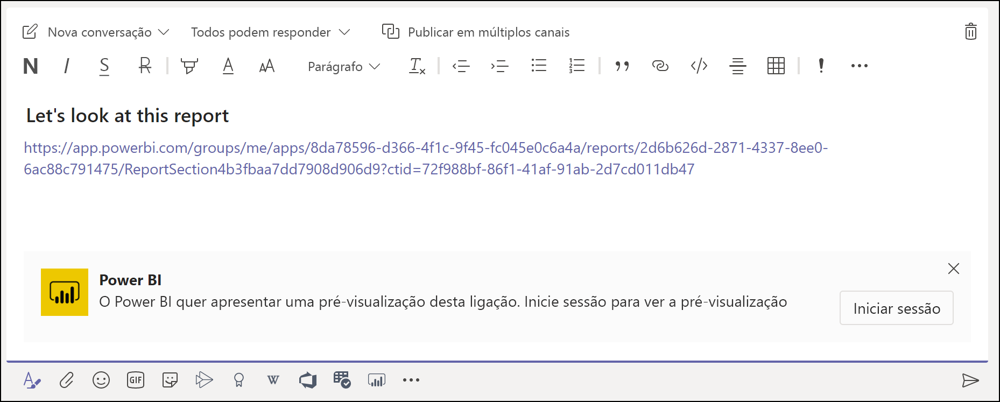
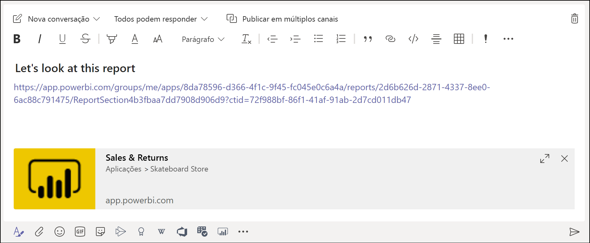

# Incorporar relatórios no Microsoft Teams com o separador Power BI

Com o separador Power BI para Microsoft Teams atualizado, pode facilmente incorporar relatórios interativos em canais e chats do Microsoft Teams. Utilize o separador Power BI para Microsoft Teams para ajudar os seus colegas a encontrar os dados que a sua equipa utiliza e a discutir os dados dentro dos canais da sua equipa.  Quando cola uma ligação para os seus relatórios, dashboards e aplicações na caixa de mensagens do Microsoft Teams, a pré-visualização da ligação mostra informações sobre os mesmos. Os seus utilizadores podem saber mais facilmente qual é o item para o qual a ligação os direciona.

## Requirements

Para que o **separador Power BI para Microsoft Teams** funcione, certifique-se de que:

- Os seus utilizadores têm uma licença do Power BI Pro ou que o relatório está incluído numa [capacidade Premium do Power BI (EM ou P SKU)](../admin/service-premium-what-is.md) com uma licença do Power BI.
- O Microsoft Teams tem o separador Power BI.
- Os utilizadores têm de iniciar sessão no serviço Power BI para ativar a respetiva licença do Power BI para consumir o relatório.
- Os utilizadores têm de ter permissão para ver o relatório.

Além disso, para que as **pré-visualizações de ligações** funcionem, certifique-se de que:
- Os utilizadores cumprem os requisitos para utilizar o separador Power BI para Microsoft Teams.
- Os utilizadores iniciaram sessão no serviço de Bot do Power BI. 

## Incorporar o seu relatório

Siga estes passos para incorporar o seu relatório num canal ou chat do Microsoft Teams.

1. Abra um canal ou chat no Microsoft Teams e selecione o ícone **+** .

    

2. Selecione o separador Power BI.

    

3. Utilize as opções fornecidas para selecionar um relatório de Área de trabalho, Partilhado comigo ou uma aplicação Power BI.

    

4. O nome do Separador é atualizado automaticamente para corresponder ao nome do relatório, mas pode alterá-lo. 

5. Prima **Guardar**.

## Relatórios suportados para incorporar o separador Power BI
Pode incorporar os seguintes tipos de relatórios no separador Power BI:

- Relatórios interativos e paginados.
- Relatórios em A minha área de trabalho, novas experiências de área de trabalho e áreas de trabalho clássicas.
- Relatórios nas aplicações Power BI.

## Obter uma pré-visualização da ligação

Siga estes passos para obter uma pré-visualização da ligação para conteúdos no serviço Power BI.

1. Copie uma ligação para um relatório, dashboard ou aplicação no serviço Power BI. Por exemplo, copie a ligação da barra de endereço do browser.

2. Cole a ligação na caixa de mensagens do Microsoft Teams. Inicie sessão no serviço de pré-visualização da ligação se tal lhe for pedido. Poderá ter de aguardar alguns segundos para que a pré-visualização da ligação seja carregada.

    

3. A pré-visualização da ligação básica é apresentada depois de iniciar sessão com êxito.

    

4. Selecione o ícone de expansão para o cartão de pré-visualização avançado ser apresentado.

    

5. O cartão de pré-visualização da ligação avançado mostra a ligação e os botões de ação relevantes

    

6. Envie a mensagem.

## Conceder acesso a relatórios

Incorporar um relatório no Microsoft Teams ou enviar uma ligação para um item não dá automaticamente permissão aos utilizadores para verem o relatório. Tem de [permitir que os utilizadores vejam o relatório no Power BI](service-share-dashboards.md). Pode utilizar um Grupo do Office 365 para a sua Equipa para facilitar o processo. 

> [!IMPORTANT]
> Certifique-se de que revê quem pode ver o relatório no serviço Power BI e conceda acesso aos que não estão listados.

Uma forma de garantir que todas as pessoas da sua equipa têm acesso aos relatórios é colocá-los numa única área de trabalho no Power BI e dar ao Grupo do Office 365 da sua equipa acesso à área de trabalho.

## Pré-visualizações de ligações 

São fornecidas pré-visualizações de ligações para os seguintes itens no Power BI:
- Relatórios
- Dashboards
- Aplicações

O serviço de pré-visualização da ligação exige que os seus utilizadores iniciem sessão. Para terminar sessão, selecione o ícone do Power BI na parte inferior da caixa de mensagens e, em seguida, selecione a opção para terminar sessão.

## Iniciar uma conversa

Quando adiciona um separador de relatório do Power BI ao Teams, o Teams cria automaticamente um separador de conversação para o relatório. 

- Selecione **Mostrar separador conversa** no canto superior direito.

    

    O primeiro comentário é uma ligação para o relatório. Todas as pessoas nesse canal do Teams podem ver e debater o relatório na conversa.

    

## Limitações e problemas conhecidos

- O Power BI não suporta os mesmos idiomas localizados que o Microsoft Teams. Como tal, poderá não ver uma devida localização no relatório incorporado.
- Os dashboards do Power BI não podem ser incorporados no separador Power BI para Microsoft Teams.
- Os utilizadores sem licença do Power BI ou permissão para o relatório verão uma mensagem a indicar "Conteúdo não disponível".
- Poderá ter problemas se estiver a utilizar o Internet Explorer 10. <!--You can look at the [browsers support for Power BI](../consumer/end-user-browsers.md) and for [Office 365](https://products.office.com/office-system-requirements#Browsers-section). -->
- Os [filtros de URL](service-url-filters.md) não são suportados com o separador Power BI para Microsoft Teams.
- Nas clouds nacionais, o novo separador Power BI não está disponível. Poderá estar disponível uma versão mais antiga que não suporta a nova experiência de área de trabalho ou relatórios em aplicações Power BI. 
- Depois de guardar o separador, não pode alterar o nome do separador através das definições do separador. Utilize a opção de alteração de nome para o alterar.
- O serviço de pré-visualização da ligação não suporta o início de sessão único.
- As pré-visualizações de ligações não funcionam em chats de reuniões ou canais privados.

## Próximos passos
- [Partilhar um dashboard com colegas e outros utilizadores](service-share-dashboards.md)  
- [Create and distribute an app in Power BI](service-create-distribute-apps.md) (Criar e distribuir uma aplicação no Power BI)  
- [O que é o Power BI Premium?](../admin/service-premium-what-is.md)

Mais perguntas? [Experimente perguntar à Comunidade do Power BI](https://community.powerbi.com/)
