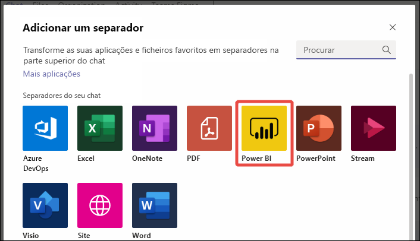
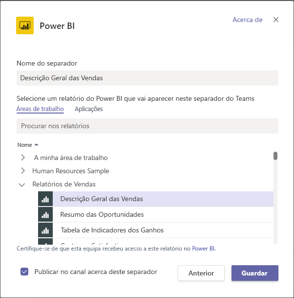
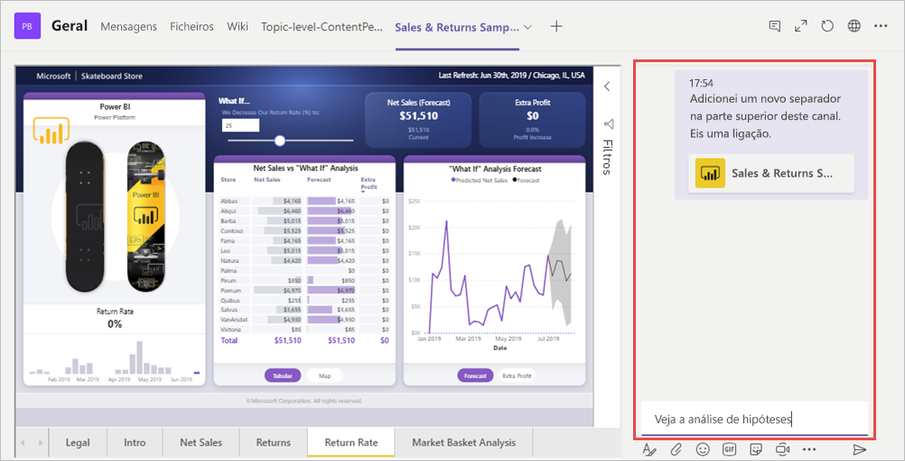

# Incorporar conteúdos do Power BI no Microsoft Teams

Pode facilmente incorporar relatórios interativos do Power BI em canais e chats do Microsoft Teams. 

Veja [Colaborar no Microsoft Teams com o Power BI](service-embed-report-microsoft-teams.md) para obter informações sobre como o Power BI e o Teams funcionam em conjunto, incluindo requisitos que precisa de cumprir.

## Incorporar um relatório no Teams

Siga estes passos para incorporar o seu relatório num canal ou chat do Microsoft Teams.

1. Abra um canal ou chat no Microsoft Teams e selecione o ícone **+** .

    

1. Selecione o separador **Power BI**.

    

1. Utilize as opções disponibilizadas para selecionar um relatório de uma área de trabalho ou de uma aplicação do Power BI.

    

1. O nome do separador é atualizado automaticamente para corresponder ao nome do relatório, mas pode alterá-lo.

1. Selecione **Guardar**.

### Relatórios que pode incorporar no separador Power BI

Pode incorporar os seguintes tipos de relatórios no separador **Power BI**:

- Relatórios interativos e paginados.
- Relatórios em **A minha área de trabalho**, novas experiências de área de trabalho e áreas de trabalho clássicas.
- Relatórios nas aplicações Power BI.

## Iniciar uma conversa

Quando adiciona um separador de relatório do Power BI ao Microsoft Teams, o Teams cria automaticamente um separador de conversa para o relatório.

- Selecione **Mostrar separador de conversa** no canto superior direito.

    

    O primeiro comentário é uma ligação para o relatório. Todas as pessoas nesse canal do Microsoft Teams podem ver e debater o relatório na conversa.

    

## Limitações e problemas conhecidos

- Não pode incorporar dashboards do Power BI no separador **Power BI** do Microsoft Teams.
- Os [filtros de URL](service-url-filters.md) não são suportados no separador **Power BI** do Microsoft Teams.
- Nas clouds nacionais, o novo separador **Power BI** não está disponível. Poderá estar disponível uma versão mais antiga que não suporta a nova experiência de área de trabalho ou relatórios em aplicações do Power BI.
- Depois de guardar o separador, não altere o nome do separador através das definições do separador. Utilize a opção **Mudar nome** para o alterar.
- Para outros problemas, veja a secção [Limitações e problemas conhecidos](service-collaborate-microsoft-teams.md#known-issues-and-limitations) do artigo "Colaborar no Microsoft Teams".

## Próximos passos

- [Colaborar no Microsoft Teams com o Power BI](service-collaborate-microsoft-teams.md)

Mais perguntas? [Experimente perguntar à Comunidade do Power BI](https://community.powerbi.com/).
