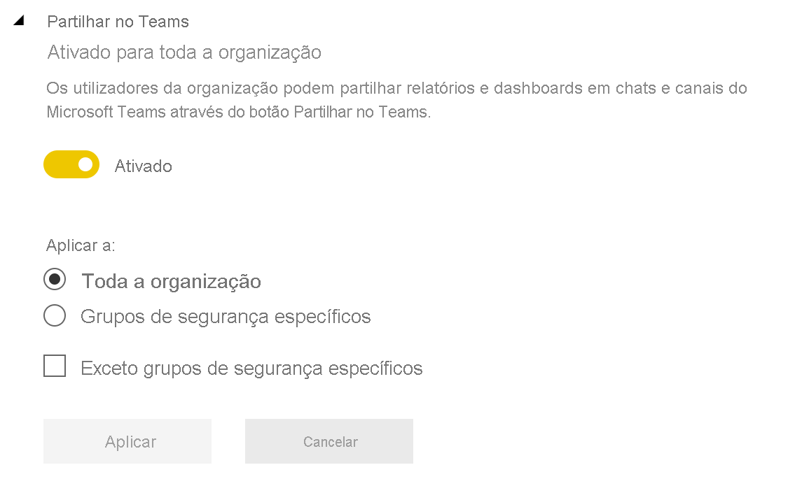

# Colaborar no Microsoft Teams com o Power BI

Com o separador **Power BI** do Microsoft Teams, pode incorporar facilmente relatórios interativos em canais e chats do Microsoft Teams. Utilize o separador **Power BI** do Microsoft Teams para ajudar os seus colegas a encontrar os dados que a sua equipa utiliza e a discutir os dados dentro dos canais da sua equipa. Quando cola uma ligação para os relatórios, dashboards e aplicações na caixa de mensagens do Microsoft Teams, a pré-visualização da ligação mostra informações sobre a mesma. Utilize os botões **Partilhar no Teams** para iniciar rapidamente conversas quando vê relatórios e dashboards no Power BI.

## Requirements

Para que o separador **Power BI** do Microsoft Teams funcione, verifique se:

- Os seus utilizadores têm uma licença do Power BI Pro ou que o relatório está incluído numa [capacidade Premium do Power BI (EM ou P SKU)](../admin/service-premium-what-is.md) com uma licença do Power BI.
- O Microsoft Teams tem o separador **Power BI**.
- Os utilizadores têm de iniciar sessão no serviço Power BI para ativar a respetiva licença do Power BI para consumir o relatório.
- Para adicionar um relatório no Microsoft Teams com o separador **Power BI**, tem de ter, pelo menos, uma função de Visualizador na área de trabalho que aloja o relatório. Para obter informações sobre as diferentes funções, veja [Funções nas novas áreas de trabalho](service-new-workspaces.md#roles-in-the-new-workspaces).
- Para verem o relatório no separador **Power BI** do Microsoft Teams, os utilizadores têm de ter permissão para ver o relatório.
- Os utilizadores têm de ser utilizadores do Microsoft Teams com acesso a canais e chats.

Para que as pré-visualizações de ligações funcionem, verifique se:

- Os utilizadores cumprem os requisitos para utilizar o separador **Power BI** do Microsoft Teams.
- Os utilizadores têm sessão iniciada no Power BI.

Para que os botões **Partilhar no Teams** funcionem, verifique se:

- Os utilizadores cumprem os requisitos para utilizar o separador **Power BI** do Microsoft Teams.
- Os utilizadores têm sessão iniciada no Power BI.
- Os administradores do Power BI não desativaram a definição do inquilino **Partilhar no Teams**.

## Incorporar o seu relatório

Siga estes passos para incorporar o seu relatório num canal ou chat do Microsoft Teams.

1. Abra um canal ou chat no Microsoft Teams e selecione o ícone **+** .

    

1. Selecione o separador **Power BI**.

    

1. Utilize as opções disponibilizadas para selecionar um relatório de uma área de trabalho ou de uma aplicação do Power BI.

    

1. O nome do separador é atualizado automaticamente para corresponder ao nome do relatório, mas pode alterá-lo.

1. Selecione **Guardar**.

## Relatórios suportados para incorporar o separador Power BI

Pode incorporar os seguintes tipos de relatórios no separador **Power BI**:

- Relatórios interativos e paginados.
- Relatórios em **A minha área de trabalho**, novas experiências de área de trabalho e áreas de trabalho clássicas.
- Relatórios nas aplicações Power BI.

## Obter uma pré-visualização da ligação

Siga estes passos para obter uma pré-visualização da ligação para conteúdos no serviço Power BI.

1. Copie uma ligação para um relatório, dashboard ou aplicação no serviço Power BI. Por exemplo, copie a ligação da barra de endereço do browser.

1. Cole a ligação na caixa de mensagens do Microsoft Teams. Inicie sessão no serviço de pré-visualização da ligação se tal lhe for pedido. Poderá ter de aguardar alguns segundos para que a pré-visualização da ligação seja carregada.

    

1. A pré-visualização da ligação básica é apresentada depois de iniciar sessão com êxito.

    

1. Selecione o ícone **Expandir** para o cartão de pré-visualização avançado ser apresentado.

    

1. O cartão de pré-visualização da ligação avançado mostra a ligação e os botões de ação relevantes.

    

1. Envie a mensagem.

## Botões Partilhar no Teams no serviço Power BI

Siga estes passos para partilhar ligações em canais e chats do Microsoft Teams quando visualizar relatórios ou dashboards no serviço Power BI.

1. Utilize os botões **Partilhar no Teams** na barra de ação ou no menu contextual num elemento visual específico.

   * Botão **Partilhar no Teams** na barra de ação:

       
    
   * Botão **Partilhar no Teams** no menu de contexto do elemento visual:
    
      

1. Na caixa de diálogo **Partilhar no Microsoft Teams**, selecione o canal ou as pessoas para as quais quer enviar a ligação. Se preferir, pode introduzir uma mensagem. Primeiro, pode ser-lhe pedido para iniciar sessão no Microsoft Teams.

    

1. Selecione **Partilhar** para enviar a ligação.
    
1. A ligação é adicionada às conversas existentes ou inicia um novo chat.

    

1. Selecione a ligação para abrir o item no serviço Power BI.

1. Se utilizar o menu contextual de um elemento visual específico, este será realçado quando o relatório for aberto.

    
    

## Conceder acesso a relatórios

Incorporar um relatório no Microsoft Teams ou enviar uma ligação para um item não dá automaticamente permissão aos utilizadores para verem o relatório. Tem de [permitir que os utilizadores vejam o relatório no Power BI](service-share-dashboards.md). Para facilitar o processo, pode utilizar um Grupo do Microsoft 365 para a equipa.

> [!IMPORTANT]
> Certifique-se de que revê quem pode ver o relatório no serviço Power BI e conceda acesso aos que não estão listados.

Uma forma de garantir que todas as pessoas numa equipa têm acesso aos relatórios é ao colocá-los numa única área de trabalho e dar acesso ao Grupo do Microsoft 365 da sua equipa.

## Pré-visualizações de ligações

São fornecidas pré-visualizações de ligações para os seguintes itens no Power BI:
- Relatórios
- Dashboards
- Aplicações

O serviço de pré-visualização da ligação exige que os seus utilizadores iniciem sessão. Para terminar sessão, selecione o ícone do **Power BI** na parte inferior da caixa de mensagens. Em seguida, selecione **Terminar sessão**.

## Iniciar uma conversa

Quando adiciona um separador de relatório do Power BI ao Microsoft Teams, o Teams cria automaticamente um separador de conversa para o relatório.

- Selecione **Mostrar separador de conversa** no canto superior direito.

    

    O primeiro comentário é uma ligação para o relatório. Todas as pessoas nesse canal do Microsoft Teams podem ver e debater o relatório na conversa.

    
    
## Definição do inquilino Partilhar no Teams

A definição do inquilino **Partilhar no Teams** no portal de administração do Power BI permite que as organizações ocultem os botões **Partilhar no Teams**. Quando estiverem desativados, os utilizadores não verão os botões **Partilhar no Teams** na barra de ação ou menus de contexto quando visualizarem relatórios e dashboards no serviço Power BI.

## Limitações e problemas conhecidos

- O Power BI não suporta os mesmos idiomas localizados que o Microsoft Teams. Como tal, poderá não ver uma localização correta no relatório incorporado.
- Os dashboards do Power BI não podem ser incorporados no separador **Power BI** do Microsoft Teams.
- Os utilizadores sem uma licença do Power BI ou permissão para aceder ao relatório verão uma mensagem a indicar “Conteúdo não disponível”.
- Poderá ter problemas se utilizar o Internet Explorer 10. <!--You can look at the [browsers support for Power BI](../consumer/end-user-browsers.md) and for [Microsoft 365](https://products.office.com/office-system-requirements#Browsers-section). -->
- Os [filtros de URL](service-url-filters.md) não são suportados no separador **Power BI** do Microsoft Teams.
- Nas clouds nacionais, o novo separador **Power BI** não está disponível. Poderá estar disponível uma versão mais antiga que não suporta a nova experiência de área de trabalho ou relatórios em aplicações do Power BI.
- Depois de guardar o separador, não pode alterar o nome do separador através das definições do separador. Utilize a opção **Mudar nome** para o alterar.
- O serviço de pré-visualização da ligação não suporta o início de sessão único.
- As pré-visualizações de ligações não funcionam em chats de reuniões ou canais privados.
- Os botões **Partilhar no Teams** poderão não funcionar se o browser utilizar definições de privacidade rigorosas. Utilize a opção **Continua a ter problemas? Tente abrir numa nova janela** se a caixa de diálogo não abrir corretamente.
- **Partilhar no Teams** não inclui uma pré-visualização de ligação.
- As pré-visualizações de ligações e **Partilhar no Teams** não dão permissão aos utilizadores para ver o item. As permissões têm de ser geridas separadamente.
- O botão **Partilhar no Teams** não está disponível nos menus de contexto do elemento visual quando um autor de relatório define a opção **Mais** como *Desativada* para o elemento visual.

## Próximos passos

- [Partilhar um dashboard com colegas e outros utilizadores](service-share-dashboards.md)
- [Create and distribute an app in Power BI](service-create-distribute-apps.md) (Criar e distribuir uma aplicação no Power BI)
- [O que é o Power BI Premium?](../admin/service-premium-what-is.md)

Mais perguntas? [Experimente perguntar à Comunidade do Power BI](https://community.powerbi.com/).
