# Incorporar uma peça Web de relatórios no SharePoint Online

Com a nova peça Web de relatórios do Power BI para o SharePoint Online, pode facilmente incorporar relatórios interativos do Power BI em páginas do SharePoint Online.

Ao utilizar a nova opção **Incorporar no SharePoint Online**, os relatórios incorporados respeitam todas as permissões de itens e segurança de dados através de [segurança ao nível da linha (RLS)](../admin/service-admin-rls.md), por isso pode criar portais internos seguros.

## Requirements

Para que os relatórios da opção **Incorporar no SharePoint Online** funcionem, existem os seguintes requisitos:

* Uma licença do Power BI Pro ou uma [capacidade Premium do Power BI (EM ou P SKU)](../admin/service-premium-what-is.md) com uma licença do Power BI.
* A peça Web do Power BI para o SharePoint Online requer as [Páginas Modernas](https://support.office.com/article/Allow-or-prevent-creation-of-modern-site-pages-by-end-users-c41d9cc8-c5c0-46b4-8b87-ea66abc6e63b).
* Para consumir um relatório incorporado, os utilizadores têm de iniciar sessão no serviço Power BI para ativar a respetiva licença do Power BI.

> [!Note]
> A licença gratuita não está disponível para organizações em Clouds nacionais do Power BI. Neste ambiente, todos os utilizadores que queiram aceder ao relatório incorporado no SharePoint precisam de ter uma licença do Power BI Pro.

## Incorporar o seu relatório
Para incorporar o seu relatório no SharePoint Online, tem de obter o URL do relatório e utilizá-lo com a peça Web do Power BI do SharePoint Online.

### Obter um URL de relatório

1. No Power BI, veja o relatório.

2. No menu pendente **Mais opções (...)** , selecione **Incorporar** > **SharePoint Online**.

    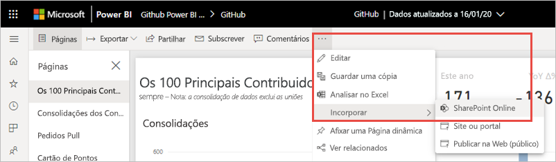

3. Copie o URL de relatório da caixa de diálogo.

    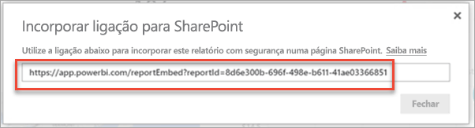

### Adicionar o relatório do Power BI a uma página do SharePoint Online

1. Abra a página de destino no SharePoint Online e selecione **Editar**.

    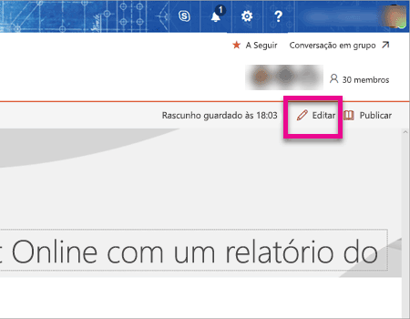

    Também pode selecionar **+ Novo** no SharePoint Online para criar uma nova página de site moderna.

    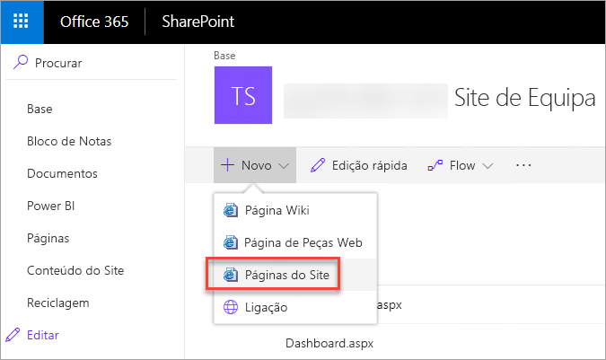

2. Selecione o menu pendente **+** e, em seguida, selecione a peça Web do **Power BI**.

    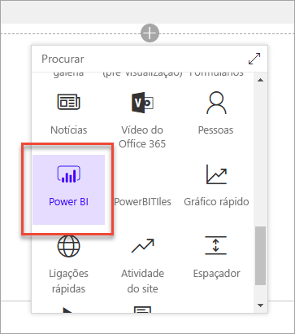

3. Selecione **Adicionar relatório**.

    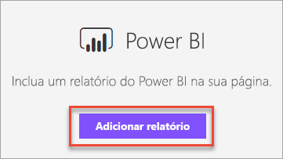  

4. Cole o URL de relatório copiado anteriormente no painel **Ligação de relatório do Power BI**. O relatório é carregado automaticamente.

    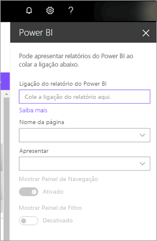

5. Selecione **Publicar** para tornar a alteração visível para os seus utilizadores do SharePoint Online.

    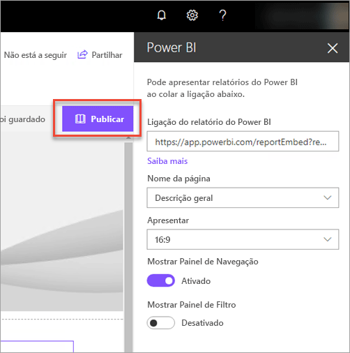

## Conceder acesso a relatórios

Incorporar um relatório no SharePoint Online não dá automaticamente permissão aos utilizadores para ver o relatório. Tem de definir as permissões de visualização no Power BI.

> [!IMPORTANT]
> Certifique-se de que revê quem pode ver o relatório no serviço Power BI e conceda acesso aos que não estão listados.

Há duas formas de fornecer acesso a relatórios no Power BI. A primeira forma, se estiver a utilizar um Grupo do Microsoft 365 para criar o seu site de equipa do SharePoint Online, é listar o utilizador como membro da **área de trabalho no serviço Power BI** e da **página do SharePoint**. Para obter mais informações, veja como [gerir uma área de trabalho](service-manage-app-workspace-in-power-bi-and-office-365.md).

A segunda forma é incorporar um relatório numa aplicação e partilhá-lo diretamente com os utilizadores:  

1. O autor, que tem de ser um utilizador Pro, cria um relatório na área de trabalho. Para partilhar com *utilizadores do Power BI gratuito*, a área de trabalho tem de ser definida como uma *Área de trabalho Premium*.

2. O autor publica a aplicação e instala-a. O autor tem de instalar a aplicação para que esta tenha acesso ao URL de relatório utilizado para a incorporação no SharePoint Online.

3. Agora, todos os utilizadores finais também têm de instalar a aplicação. Também pode utilizar a funcionalidade **Instalar aplicação automaticamente**, que pode ser ativada no [portal de administração do Power BI](../admin/service-admin-portal.md), para que a aplicação seja pré-instalada para os utilizadores finais.

   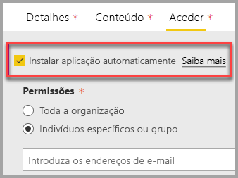

4. O autor abre a aplicação e vai para o relatório.

5. O autor copia o URL do relatório incorporado do relatório instalado pela aplicação. Não utilize o URL de relatório original da área de trabalho.

6. Crie um novo site de equipa no SharePoint Online.

7. Adicione o URL de relatório copiado anteriormente à peça Web do Power BI.

8. Adicione todos os utilizadores finais e/ou grupos que vão consumir os dados na página do SharePoint Online e na aplicação do Power BI que criou.

    > [!NOTE]
    > **Os utilizadores ou grupos precisam de aceder tanto à página do SharePoint Online como ao relatório na aplicação do Power BI para ver o relatório na página do SharePoint.**

Agora, o utilizador final pode ir para o site de equipa no SharePoint Online e ver os relatórios na página.

## Autenticação multifator

Se o seu ambiente do Power BI requerer que inicie sessão através da autenticação multifator, poderá ser-lhe pedido que inicie sessão com um dispositivo de segurança para verificar a sua identidade. Esta situação irá ocorrer se não tiver iniciado sessão no SharePoint Online através da autenticação multifator, mas o seu ambiente do Power BI exigir um dispositivo de segurança para validar uma conta.

> [!NOTE]
> O Power BI ainda não suporta a autenticação multifator com o Azure Active Directory 2.0 – será apresentada uma mensagem de erro aos utilizadores. Se o utilizador voltar a iniciar sessão no SharePoint Online através do respetivo dispositivo de segurança, este conseguirá ver o relatório.

## Definições de peças Web

Eis as definições que pode ajustar para a peça Web do Power BI do SharePoint Online.

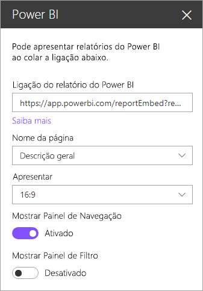

| Propriedade | Descrição |
| --- | --- |
| Nome da página |Define a página predefinida da peça Web. Selecione um valor no menu pendente. Se não forem apresentadas páginas, significa que o seu relatório tem uma página ou que o URL que colou contém um nome de página. Remova a secção de relatório do URL para selecionar uma página específica. |
| Apresentar |Define a forma como o relatório se ajusta à página do SharePoint Online. |
| Mostrar Painel de Navegação |Mostra ou oculta o painel de navegação de páginas. |
| Mostrar Painel de Filtro |Mostra ou oculta o painel de filtro. |

## Relatórios que não são carregados

Se o seu relatório não carregar na peça Web do Power BI, poderá ser apresentada a seguinte mensagem:

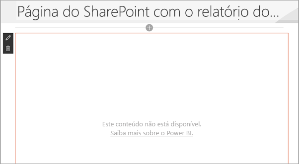

Existem dois motivos comuns para esta mensagem.

1. Não tem acesso ao relatório.
2. O relatório foi eliminado.

Contacte o proprietário da página do SharePoint Online, para que este ajude a resolver o problema.

## Licensing

Os utilizadores que visualizam um relatório no SharePoint precisam de uma **licença do Power BI Pro** ou os conteúdos precisam de estar numa área de trabalho com **[capacidade do Power BI Premium (SKU EM ou P)](../admin/service-admin-premium-purchase.md)** .

## Limitações e problemas conhecidos

* Erro: "Ocorreu um erro; tente terminar e voltar a iniciar sessão e, em seguida, revisite esta página. ID de Correlação: indefinido, estado de resposta de http: 400, código de erro de servidor 10001, mensagem: Token de atualização em falta"
  
  Se receber este erro, experimente um dos passos de resolução de problemas abaixo.
  
  1. Termine a sessão no SharePoint e volte a iniciá-la. Certifique-se de que fecha todas as janelas do browser antes de voltar a iniciar sessão.

  2. Se a sua conta de utilizador exigir autenticação multifator (MFA), inicie sessão no SharePoint através do seu dispositivo de MFA (aplicação para telemóvel, smart card, etc.).
  
  3. As contas de utilizadores Convidados do Azure B2B não são suportadas. Os utilizadores veem o logótipo do Power BI que mostra que a peça está a ser carregada, mas não será apresentado o relatório.

* O Power BI não suporta os mesmos idiomas localizados que o SharePoint Online. Como tal, poderá não ver uma devida localização no relatório incorporado.

* Poderá encontrar problemas se estiver a utilizar o Internet Explorer 10. <!--You can look at the [browsers support for Power BI](../consumer/end-user-browsers.md) and for [Microsoft 365](https://products.office.com/office-system-requirements#Browsers-section). -->

* A peça Web do Power BI não está disponível para [clouds nacionais](https://powerbi.microsoft.com/clouds/).

* O SharePoint Server clássico não é suportado com esta peça Web.

* Os [filtros de URL](service-url-filters.md) não são suportados na peça Web do SPO.

## Próximos passos

* [Allow or prevent creation of modern site pages by end users](https://support.office.com/article/Allow-or-prevent-creation-of-modern-site-pages-by-end-users-c41d9cc8-c5c0-46b4-8b87-ea66abc6e63b) (Permitir ou impedir a criação de páginas de sites modernos por utilizadores finais)  
* [Create and distribute an app in Power BI](service-create-distribute-apps.md) (Criar e distribuir uma aplicação no Power BI)  
* [Partilhar um dashboard com colegas e outros utilizadores](service-share-dashboards.md)  
* [O que é o Power BI Premium?](../admin/service-premium-what-is.md)
* [Incorporar relatório num site ou portal seguro](service-embed-secure.md)

Mais perguntas? [Experimente perguntar à Comunidade do Power BI](https://community.powerbi.com/)
