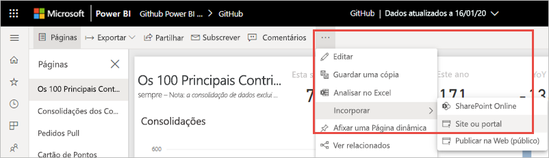
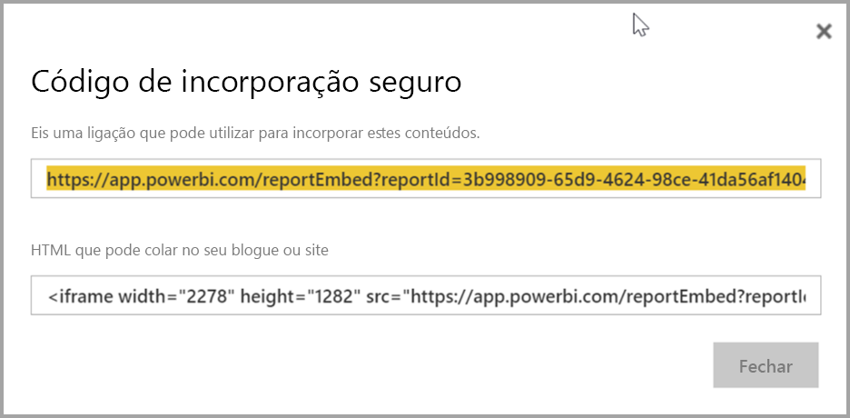
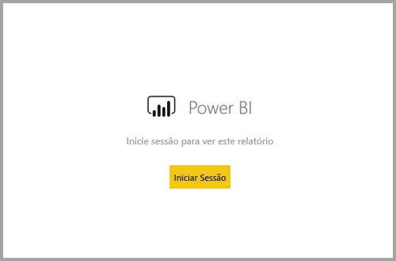
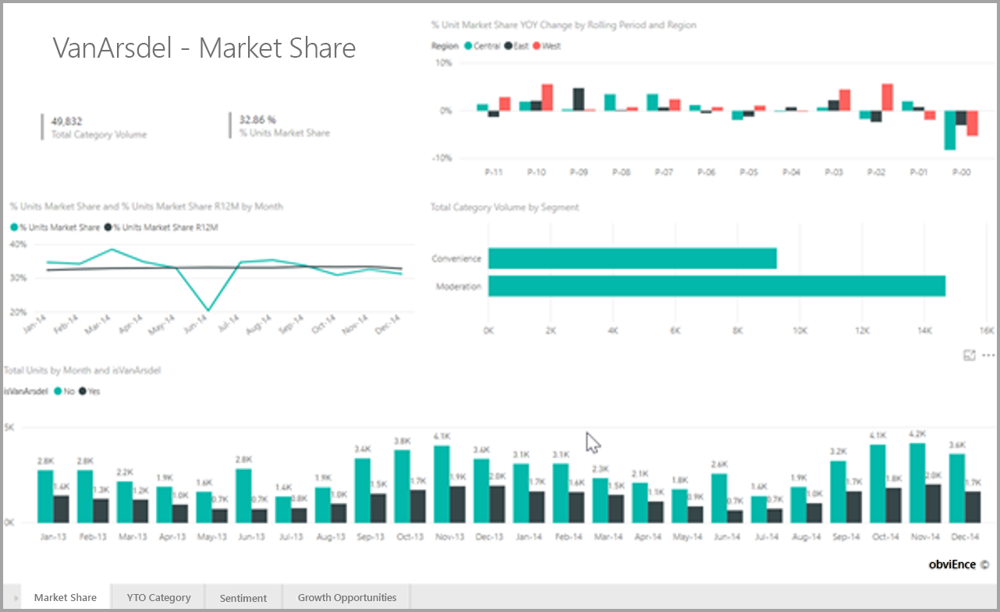

# <a name="embed-a-report-in-a-secure-portal-or-website"></a>Incorporar um relatório num site ou portal seguro

Com a nova opção **Incorporar** dos relatórios do Power BI, pode permitir que os utilizadores incorporem relatórios com facilidade e segurança em portais Web internos. Estes portais podem ser **baseados na cloud** ou **alojados no local**, como o SharePoint 2019. Os relatórios incorporados respeitam todas as permissões de itens e a segurança de dados através da [segurança ao nível da linha (RLS)](../admin/service-admin-rls.md). Fornecem incorporação sem código em qualquer portal que aceite um URL ou um iFrame. 

A opção **Incorporar** suporta [Filtros de URL](service-url-filters.md) e definições de URL. Permite-lhe integrar portais através de uma abordagem de código reduzido que apenas requer conhecimento básico de HTML e JavaScript.

## <a name="how-to-embed-power-bi-reports-into-portals"></a>Como incorporar relatórios do Power BI em portais

1. Abra um relatório no serviço Power BI.

2. No menu **Partilhar**, selecione **Incorporar relatório** >  **Site ou portal**.

    

2. Na caixa de diálogo **Código de incorporação seguro**, selecione a **ligação que pode utilizar para incorporar estes conteúdos** ou o **HTML que pode colar no seu blogue ou site** num iFrame.

    

3. Se um utilizador abrir um URL do relatório diretamente ou um URL incorporado num portal Web, o acesso ao relatório requer autenticação. O ecrã seguinte é apresentado se um utilizador não tiver iniciado sessão no Power BI na sessão do browser. Quando o utilizador seleciona **Iniciar sessão**, um novo separador ou janela do browser poderá ser aberto. Se não receber o pedido para iniciar sessão, o utilizador deve verificar se existem bloqueadores de janelas pop-up.

    

4. Depois de o utilizador iniciar sessão, o relatório é aberto e mostra os dados, permitindo que navegue nas páginas e defina filtros. Apenas os utilizadores com permissão de visualização podem ver o relatório no Power BI. Todas as regras de [segurança ao nível da linha (RLS)](../admin/service-admin-rls.md) também são aplicadas. Por último, o utilizador tem de estar licenciado corretamente, seja porque precisa de uma licença do Power BI Pro ou porque o relatório tem de estar numa área de trabalho que esteja numa capacidade do Power BI Premium. O utilizador precisa de iniciar sessão sempre que abrir uma nova janela do browser. No entanto, assim que tiver sessão iniciada, os outros relatórios são carregados automaticamente.

    

5. Quando utilizar um iFrame, poderá ter de editar a **altura** e a **largura** para se ajustar à página Web do portal.

    

## <a name="granting-report-access"></a>Conceder acesso ao relatório

A opção **Incorporar** não permite automaticamente aos utilizadores ver o relatório. As permissões de visualização são definidas no serviço Power BI.

No serviço Power BI, pode partilhar relatórios incorporados com utilizadores que precisam de acesso. Se estiver a utilizar um Grupo do Microsoft 365, pode listar o utilizador como membro da área de trabalho. Para obter mais informações, veja como [gerir a sua área de trabalho no Power BI e no Microsoft 365](service-manage-app-workspace-in-power-bi-and-office-365.md).

## <a name="licensing"></a>Licensing

Para ver o relatório incorporado, os utilizadores precisam de uma licença do Power BI Pro ou o conteúdo tem de estar numa área de trabalho com [capacidade do Power BI Premium (SKU EM ou P)](../admin/service-admin-premium-purchase.md).

## <a name="customize-your-embed-experience-using-url-settings"></a>Personalizar a experiência de incorporação com definições de URL

Pode personalizar a experiência de utilizador com as definições de introdução de URL de incorporação. No iFrame fornecido, pode atualizar as definições **src** do URL.

| Propriedade  | Descrição  |
|-----------|--------------|
| pageName  | Pode utilizar o parâmetro de cadeia de consulta **pageName** para definir a página de relatório que pretende abrir. Pode encontrar este valor no final do URL do relatório ao visualizar um relatório no serviço Power BI, conforme mostrado abaixo. |
| Filtros de URL  | Pode utilizar [Filtros de URL](service-url-filters.md) no URL de incorporação que recebeu da IU do Power BI para filtrar o conteúdo da incorporação. Desta forma, pode criar integrações de código reduzido tendo apenas experiência básica de HTML e JavaScript.  |

## <a name="set-which-page-opens-for-an-embedded-report"></a>Definir que página é aberta para um relatório incorporado 

Pode encontrar o valor **pageName** no final do URL do relatório ao visualizar um relatório no serviço Power BI.

1. Abra o relatório a partir do serviço Power BI no seu browser e, em seguida, copie o URL da barra de endereço.

    

2. Anexe a definição **pageName** ao URL.

    

## <a name="filter-report-content-using-url-filters"></a>Filtrar conteúdo do relatório com filtros de URL 

Pode utilizar [Filtros de URL](service-url-filters.md) para fornecer vistas de relatório diferentes. Por exemplo, o URL abaixo filtra o relatório para mostrar dados do setor da Energia.

A utilização da combinação de **pageName** e [Filtros de URL](service-url-filters.md) pode ser eficiente. Pode criar experiências com HTML e JavaScript básicos.

Por exemplo, eis um botão que pode adicionar a uma página HTML:

```html
<button class="textLarge" onclick='show("ReportSection", "Energy");' style="display: inline-block;">Show Energy</button>
```

Quando selecionado, o botão chama uma função para atualizar o iFrame com um URL atualizado, que inclui o filtro para o setor da Energia.

```javascript
function show(pageName, filterValue)

{

var newUrl = baseUrl + "&pageName=" + pageName;

if(null != filterValue && "" != filterValue)

{

newUrl += "&$filter=Industries/Industry eq '" + filterValue + "'";

}

//Assumes there's an iFrame on the page with id="iFrame"

var report = document.getElementById("iFrame")

report.src = newUrl;

}
```


Pode adicionar quantos botões quiser para criar uma experiência personalizada com código reduzido. 

## <a name="considerations-and-limitations"></a>Considerações e limitações

* Os relatórios paginados em cenários de incorporação segura são suportados, bem como os relatórios paginados com parâmetros URL. Saiba mais sobre como [transmitir parâmetros de relatório num URL para um relatório paginado](../paginated-reports/report-builder-url-pass-parameters.md).

* A incorporação segura funciona para os relatórios publicados no serviço Power BI.

* O utilizador precisa de iniciar sessão para ver o relatório sempre que abrir uma nova janela do browser.

* Nalguns browsers, terá de atualizar a página depois de iniciar sessão, especialmente nos modos InPrivate ou Incógnito.

* Poderão ocorrer problemas se utilizar versões do browser não suportadas. O Power BI suporta [a seguinte lista de browsers](../fundamentals/power-bi-browsers.md).

* O SharePoint Server clássico não é suportado, dado que requer versões do Internet Explorer anteriores à 11 ou que permitam o modo da vista de compatibilidade.

* Para obter uma experiência de início de sessão único, utilize a [opção Incorporar no SharePoint Online](service-embed-report-spo.md) ou crie uma integração personalizada através do método de incorporação de [o utilizador detém os dados](../developer/embedded/embed-sample-for-your-organization.md). 

* A capacidade de autenticação automática fornecida com a opção **Incorporar** não funciona com a API de JavaScript do Power BI. Para a API de JavaScript do Power BI, utilize o método de incorporação [O utilizador detém os dados](../developer/embedded/embed-sample-for-your-organization.md). 

* A duração do token de autenticação é controlada com base nas definições do AAD. Quando o token de autenticação expirar, o utilizador terá de atualizar o browser para obter um token de autenticação atualizado. A duração predefinida é uma hora, mas pode ser mais curta ou mais longa na sua organização.  Não há nenhuma capacidade para atualizar automaticamente o token neste cenário.

## <a name="next-steps"></a>Próximos passos

* [Formas de partilhar o seu trabalho no Power BI](service-how-to-collaborate-distribute-dashboards-reports.md)

* [Filtrar um relatório usando parâmetros de cadeia de consulta no URL](service-url-filters.md)

* [Incorporar com peças Web de relatórios no SharePoint Online](service-embed-report-spo.md)

* [Publicar na Web do Power BI](service-publish-to-web.md)
