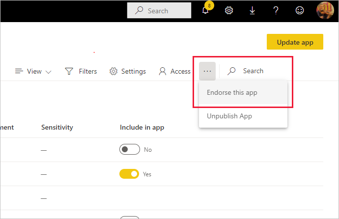

# Endossar os seus conteúdos

O Power BI fornece duas formas de endossar os seus conteúdos valiosos e de alta qualidade para aumentar a visibilidade: **promoção** e **certificação** .

* **Promoção** : a promoção é uma forma de destacar os conteúdos que considera valiosos e que valem a pena serem utilizados por outros utilizadores. Incentiva a utilização colaborativa e difusão de conteúdos numa organização.

    Um proprietário de conteúdos, bem como um membro com permissões de escrita na área de trabalho na qual estão localizados os conteúdos, pode promover os conteúdos quando considerar serem suficientemente bons para partilhar.

* **Certificação** : a certificação significa que os conteúdos cumprem os padrões de qualidade da organização e podem ser considerados confiáveis, autoritativos e que estão prontos para serem utilizados na organização.

    Apenas os revisores autorizados podem certificar conteúdos. Os proprietários de conteúdos que pretendem certificar os respetivos conteúdos e não têm autorização para fazê-lo têm de seguir as diretrizes da organização para que os conteúdos sejam certificados.

Atualmente, é possível endossar
* Conjuntos de dados
* Fluxos de dados (pré-visualização)
* Relatórios (pré-visualização)
* Aplicações (pré-visualização)

Este artigo descreve como [promover conteúdos](#promote-content), como [ certificar conteúdos](#certify-content) se for um revisor autorizado e como [pedir a certificação ](#request-content-certification) se não for.

Veja [Endosso: Promover e certificar conteúdos do Power BI](service-endorsement-overview.md) para saber mais sobre o endosso.

## Promover conteúdos

Para promover conteúdos, tem de ter permissões de escrita na área de trabalho na qual os conteúdos que pretende promover estão localizados.

>[!NOTE]
>Para fins ilustrativos, é apresentada abaixo a caixa de diálogo do endosso para conjuntos de dados. As caixas de diálogo para outros tipos de conteúdos são quase idênticas, com as mesmas opções de botão de opção. 

1. Aceda às [definições](#how-to-get-to-content-settings) dos conteúdos que pretende promover.

1. Expanda a secção Endossamento e selecione **Promovido** . Se estiver a promover um conjunto de dados, forneça uma breve descrição do conjunto de dados.

    

1. Selecione **Aplicar** .

## Certificar conteúdos

A certificação de conteúdos é uma grande responsabilidade e apenas os utilizadores autorizados podem fazê-lo. Outros utilizadores podem [pedir a certificação de conteúdos](#request-content-certification). Esta secção descreve como certificar conteúdos.

>[!NOTE]
>Para fins ilustrativos, é apresentada abaixo a caixa de diálogo do endosso para conjuntos de dados. As caixas de diálogo para outros tipos de conteúdos são quase idênticas, com as mesmas opções de botão de opção. 

1. Obtenha permissões de escrita na área de trabalho na qual residem os conteúdos que pretende certificar. Pode pedir estas permissões ao proprietário dos conteúdos ou a qualquer pessoa que tenha permissões de administrador na área de trabalho.

1. Analise cuidadosamente os conteúdos e determine se cumprem os padrões de certificação da sua organização.

1. Se decidir certificar os conteúdos, aceda à área de trabalho onde estes residem e, em seguida, abra as [definições](#how-to-get-to-content-settings) dos conteúdos que pretende certificar.

1. Expanda a secção Endosso e selecione **Certificado** . 

    

1. Selecione **Aplicar** .

## Pedir a certificação de conteúdos

Se quiser certificar os seus conteúdos mas não tiver autorização para fazê-lo, siga os passos abaixo.

>[!NOTE]
>Para fins ilustrativos, é apresentada abaixo a caixa de diálogo do endosso para conjuntos de dados. As caixas de diálogo para outros tipos de conteúdos são quase idênticas, com as mesmas opções de botão de opção. 

1. Aceda à área de trabalho em que os conteúdos que pretende certificar se encontram e, em seguida, abra as [definições](#how-to-get-to-content-settings) desses conteúdos.

1. Expanda a secção Endosso. O botão **Certificado** está a cinzento, pois não tem autorização para certificar conteúdos. Clique na ligação sobre como certificar os seus conteúdos.

    
    
    >[!NOTE]
    >Se tiver clicado na ligação acima mas não tiver sido redirecionado para esta nota, significa que o seu administrador do Power BI ainda não disponibilizou informações. Neste caso, contacte diretamente o administrador do Power BI.

## Como aceder às definições dos conteúdos

Pode aceder à caixa de diálogo Endosso através das definições dos conteúdos que pretende endossar. Siga as instruções abaixo para aceder às definições de cada tipo de conteúdo.

* **Conjuntos de dados** : na vista de lista, paire o cursor sobre o conjunto de dados que pretende endossar, clique em **Mais opções (...)** e, em seguida, selecione **Definições** a partir do menu que é apresentado.
* **Fluxos de dados** (pré-visualização): na vista de lista, paire o cursor sobre o fluxo de dados que pretende endossar, clique em **Mais opções (...)** e, em seguida, selecione **Definições** a partir do menu que é apresentado.

* **Relatórios** (pré-visualização): na vista de lista, paire o cursor sobre o relatório que pretende endossar, clique em **Mais opções (...)** e, em seguida, selecione **Definições** a partir do menu que é apresentado. Em alternativa, se o relatório estiver aberto, selecione **Ficheiro > Definições** .

* **Aplicações** (pré-visualização): aceda à área de trabalho da aplicação, clique em **Mais opções (...)** na barra de menus e selecione **Endosse esta aplicação** .

    

## Passos seguintes

* [Ler mais sobre o endosso de conteúdos](service-endorsement-overview.md)
* [Ativar a certificação de conteúdos](../admin/service-admin-setup-certification.md) (administradores do Power BI)
* Perguntas? [Experimente perguntar à Comunidade do Power BI](https://community.powerbi.com/)
