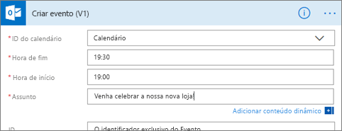

# Integrar alertas de dados no Power Automate

Utilize o [Power Automate](/power-automate/getting-started) para integrar o Power BI às aplicações e serviços favoritos. Com o Power Automate, cria fluxos de trabalho automatizados para obter notificações, sincronizar ficheiros, recolher dados e muito mais. Neste artigo, irá automatizar a geração de um e-mail a partir de uma alerta de dados do Power BI.

## Pré-requisitos
Este artigo mostra como criar dois fluxos diferentes: um a partir de um modelo e um de raiz. Para continuar, [crie um alerta de dados no Power BI](../create-reports/service-set-data-alerts.md) e [inscreva-se no Power Automate](https://flow.microsoft.com/#home-signup). É gratuito!

## Criar um fluxo a partir de um modelo
Nesta tarefa, vamos utilizar um modelo para criar um fluxo simples que é acionado por um alerta de dados do Power BI (notificação).

1. Inicie sessão no Power Automate (flow.microsoft.com).
2. Selecione **Modelos**, procure **Power BI** > **Enviar um e-mail a qualquer audiência quando for acionado um alerta de dados do Power BI**.
   
    :::image type="content" source="media/service-flow-integration/power-automate-templates.png" alt-text="Captura de ecrã a mostrar o modelo do Power Automate Enviar um e-mail a qualquer audiência quando for acionado um alerta de dados do Power BI.":::

### Compilar o fluxo
Este modelo tem um acionador, um alerta de dados do Power BI e uma ação de envio de e-mail. Ao selecionar um campo, o Power Automate mostra o conteúdo dinâmico que pode incluir.  Neste exemplo, vamos incluir o valor e o URL do mosaico no corpo da mensagem.

1. Selecione **Continuar**.

    :::image type="content" source="media/service-flow-integration/power-automate-power-bi-mail.png" alt-text="Captura de ecrã do Power Automate (Power BI para o correio).":::

1. Na caixa **ID do Alerta**, selecione um alerta de dados do Power BI. Para saber como criar um alerta, selecione [Alertas de dados no Power BI](../create-reports/service-set-data-alerts.md).
   
    :::image type="content" source="media/service-flow-integration/power-automate-select-alert-id.png" alt-text="Captura de ecrã a mostrar Selecionar um alerta na caixa ID do Alerta.":::
2. Introduza um ou mais endereços de e-mail válidos.

3. O Power Automate gera automaticamente um **Assunto** e um **Corpo** para manter ou modificar. O corpo do texto utiliza o formato HTML.

    :::image type="content" source="media/service-flow-integration/power-automate-autogenerated-email.png" alt-text="Captura de ecrã do texto de e-mail gerado automaticamente pelo Power Automate.":::

1. Quando terminar a mensagem, selecione **Passo seguinte** ou **Guardar**.  O fluxo é criado e avaliado.  O Power Automate avisa-o caso encontre erros.
2. Se forem encontrados erros, selecione **Editar fluxo** para corrigi-los. Caso contrário, selecione **Concluído** para executar o novo fluxo.
   
   
5. Quando o alerta de dados é acionado, o Power Automate envia um e-mail para os endereços que indicou.  
   
   

## Criar um fluxo a partir do zero
Nesta tarefa, vamos criar do zero um fluxo simples que é acionado por um alerta de dados do Power BI (notificação).

1. Inicie sessão no Power Automate (flow.microsoft.com).
2. Selecione **Criar** > **Fluxo automatizado**.

    :::image type="content" source="media/service-flow-integration/power-automate-create-automated-flow.png" alt-text="Captura de ecrã do Power Automate > Criar fluxo automatizado.":::   
3. Em **Criar um fluxo automatizado**, atribua um nome ao fluxo.
1. Em **Escolher o acionador do fluxo**, procure **Power BI**.
1. Selecione **Power BI – Quando um alerta de dados é acionado** > **Criar**.

    :::image type="content" source="media/service-flow-integration/power-automate-build-automated-flow.png" alt-text="Captura de ecrã da opção Criar um fluxo automatizado.":::

### Compilar o fluxo
1. Na caixa **ID do Alerta**, selecione o nome do alerta. Para saber como criar um alerta, selecione [Alertas de dados no Power BI](../create-reports/service-set-data-alerts.md).

    :::image type="content" source="media/service-flow-integration/power-automate-select-alert-id-scratch.png" alt-text="Captura de ecrã da opção Selecionar o nome do alerta.":::   

2. Selecione **Novo passo**.
   
3. Em **Escolher uma ação**, procure **Outlook** > **Criar evento**.

    :::image type="content" source="media/service-flow-integration/power-automate-choose-action-create-event.png" alt-text="Captura de ecrã de Escolher uma ação > Criar um evento.":::   
4. Preencha os campos do evento. Ao selecionar um campo, o Power Automate mostra o conteúdo dinâmico que pode incluir.
   
   
5. Selecione **Criar fluxo** depois de concluir.  O Power Automate guarda e avalia o fluxo. Se não houver erros, selecione **Concluído** para executar este fluxo.  O novo fluxo é adicionado à página **Os meus fluxos**.
   
   
6. Quando este fluxo for acionado pelo seu alerta de dados do Power BI, receberá uma notificação de evento do Outlook semelhante a esta.
   
    

## Passos seguintes
* [Introdução ao Power Automate](/power-automate/getting-started/)
* [Definir alertas de dados no serviço Power BI](../create-reports/service-set-data-alerts.md)
* [Definir alertas de dados no iPhone](../consumer/mobile/mobile-set-data-alerts-in-the-mobile-apps.md)
* Mais perguntas? [Pergunte à Comunidade do Power BI](https://community.powerbi.com/)
