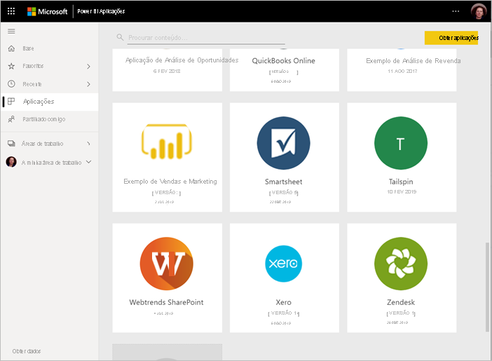
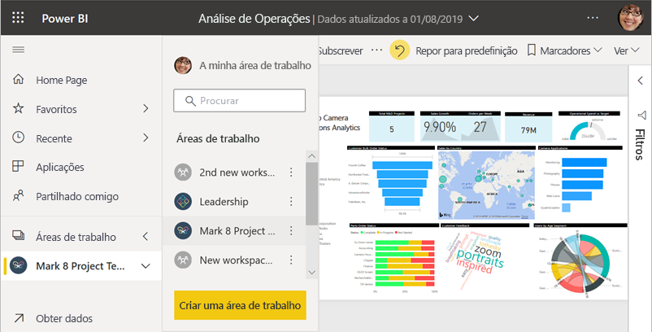
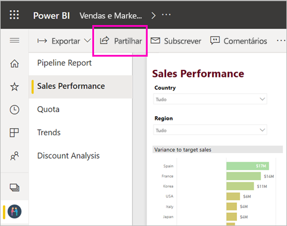
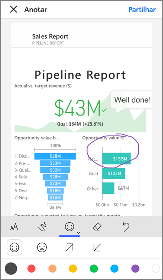
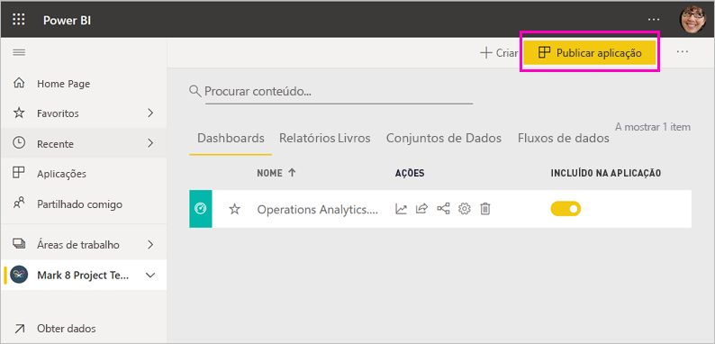
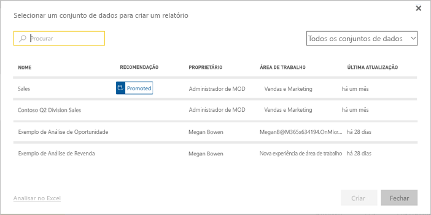

# Formas de colaborar e partilhar no Power BI

Acabou de criar dashboards e relatórios. Quer colaborar com os seus colegas nos mesmos. Ou talvez esteja preparado para os distribuir mais amplamente. Qual é a melhor forma de colaborar e de os partilhar? Neste artigo, comparamos as opções.

*Aplicações no serviço Power BI*

**Colaborar**

- [Colabore com colegas em *áreas de trabalho*](#collaborate-in-a-workspace) para criar relatórios e dashboards relevantes.
- [Colabore no *Microsoft Teams*](#collaborate-in-microsoft-teams).

**Distribuir ou partilhar dashboards e relatórios**

- [*Partilhe dashboards ou relatórios*](#share-dashboards-and-reports) a partir de A Minha Área de Trabalho ou de outra área de trabalho.
- Anote e [partilhe a partir das *aplicações móveis* do Power BI](#annotate-and-share-from-the-power-bi-mobile-apps).
- Agrupe dashboards e relatórios em áreas de trabalho em *aplicações* e [distribua-as](#distribute-insights-in-an-app) num grupo maior ou para toda a organização.
- [Incorpore relatórios](#embed-reports-in-secure-portals-or-public-web-sites) em *sites públicos* ou *portais seguros*.
- [Imprima relatórios](#print-or-save-as-pdf-or-other-static-file).
- [Crie uma *aplicação de modelo*](#create-and-deploy-template-apps) que possa ser distribuída para utilizadores externos do Power BI, através do Microsoft AppSource.
 
**Partilhar dados**

- [Crie *conjuntos de dados partilhados*](#share-a-dataset) que os seus colegas possam utilizar como base para os seus próprios relatórios, nas suas próprias áreas de trabalho.
- [Crie *fluxos de dados*](#create-dataflows) como uma forma de partilhar uma origem de dados comum.

Seja qual for a sua escolha, para partilhar os seus conteúdos, precisa de uma [licença do Power BI Pro](../fundamentals/service-features-license-type.md) ou os conteúdos precisam de estar numa [capacidade Premium](../admin/service-premium-what-is.md). Os requisitos de licença variam para os colegas que veem os seus conteúdos, consoante a opção que selecionar. As secções seguintes indicam detalhes. 

## Colaborar numa área de trabalho

Quando as equipas trabalham em conjunto, precisam de acesso aos mesmos documentos para poderem colaborar facilmente. Nas áreas de trabalho do Power BI, as equipas partilham a propriedade e gestão dos dashboards, dos relatórios, dos conjuntos de dados e dos livros. Por vezes, os utilizadores do Power BI organizam as áreas de trabalho com base em estruturas organizacionais ou criam-nas para projetos específicos. No entanto, existem outras organizações que utilizam várias áreas de trabalho para armazenar diferentes versões dos relatórios ou dashboards que utilizam. 

As áreas de trabalho disponibilizam funções que determinam as permissões que os seus colegas têm. Utilize essas funções para determinar quem pode gerir a área de trabalho, editar ou distribuir conteúdo, ou apenas ver conteúdo. Leia mais sobre as [funções nas novas áreas de trabalho](service-new-workspaces.md#roles-in-the-new-workspaces).

As áreas de trabalho funcionam melhor para a colaboração do que A Minha Área de Trabalho, já que permitem a propriedade partilhada de conteúdo. Você e toda a sua equipa podem fazer atualizações ou conceder acesso a terceiros facilmente. A Minha Área de Trabalho funciona melhor para conteúdos pontuais ou pessoais de utilizadores individuais.

Imaginemos que terminou um dashboard que precisa de partilhar com os seus colegas. Qual é a melhor forma de lhes conceder acesso ao dashboard? A resposta depende de vários fatores. 

- Se os colegas precisarem de manter o dashboard atualizado ou precisarem de acesso a todo o conteúdo na área de trabalho, adicione-os à área de trabalho como Membros ou Contribuidores. 
- Se os colegas apenas precisarem de ver o conteúdo na área de trabalho, adicione-os como Visualizadores.
- Se os colegas apenas precisarem de ver esse dashboard e não todo o conteúdo na área de trabalho, poderá partilhar o dashboard diretamente com eles.
- Se o dashboard fizer parte de um conjunto de dashboards e relatórios que precisa de distribuir por diversos colegas, publicar uma *aplicação* será provavelmente a melhor opção.

Leia mais sobre como [criar novas áreas de trabalho](service-create-the-new-workspaces.md). 

## Colaborar no Microsoft Teams

Aumente a colaboração orientada por dados na sua organização ao incorporar os seus relatórios do Power BI e os relatórios paginados do Power BI no Microsoft Teams. O serviço Power BI tem um botão **Conversar no Teams** para relatórios. Pode adicionar separadores do Power BI diferentes para cada relatório individual e dar a cada separador o nome do relatório ou qualquer outro nome. 

Quando adiciona um separador de relatório do Power BI ao Microsoft Teams, o Teams cria automaticamente um separador de conversa para o relatório. Todas as pessoas nesse canal do Microsoft Teams podem ver e debater o relatório na conversa. 

:::image type="content" source="media/service-how-to-collaborate-distribute-dashboards-reports/power-bi-teams-conversation-tab.png" alt-text="Separador de conversa do Microsoft Teams":::

Leia mais sobre como [colaborar no Microsoft Teams com o Power BI](service-collaborate-microsoft-teams.md).

## Partilhar dashboards e relatórios

Imaginemos que o seu relatório no Power BI Desktop está pronto e quer que outras pessoas tenham acesso ao mesmo. Uma forma de o conseguir é *partilhá-lo* no serviço Power BI. Pode publicá-lo na sua própria A Minha Área de Trabalho ou noutra área de trabalho. Talvez esteja preparado para criar um dashboard para o acompanhar.

Precisa de uma licença do Power BI Pro para partilhar o conteúdo. As pessoas com quem o partilhar ou o próprio conteúdo precisam de estar numa área de trabalho numa [capacidade Premium](../admin/service-premium-what-is.md). Ao partilhar um dashboard ou relatório, os destinatários podem ver e interagir com o mesmo. Se lhes der permissão, poderão editá-lo, fazer uma cópia e partilhá-lo com os colegas. As pessoas verão os mesmos dados que vê no dashboard ou relatório. Têm acesso a todos os dados do conjunto de dados subjacente, a menos que esteja aplicada a [segurança ao nível da linha (RLS)](../admin/service-admin-rls.md).

Pode também partilhar com pessoas fora da sua organização. Estas também podem ver e interagir com o dashboard ou relatório, mas não o podem partilhar. 

Leia mais sobre como [partilhar dashboards e relatórios](service-share-dashboards.md) no serviço Power BI. Também pode ler sobre como adicionar um filtro a uma ligação e [partilhar uma vista filtrada do relatório](service-share-reports.md).

## Anotar e partilhar a partir das aplicações móveis do Power BI

Nas aplicações móveis do Power BI para dispositivos iOS e Android, pode anotar um mosaico, relatório ou visual e, em seguida, partilhá-lo com qualquer pessoa através de e-mail.

Está a partilhar um instantâneo do mosaico, relatório ou elemento visual. Os destinatários veem-no exatamente como era quando enviou o e-mail. O e-mail também contém uma ligação para o dashboard ou relatório. Se os destinatários tiverem uma licença do Power BI Pro ou se o conteúdo estiver numa [capacidade Premium](../admin/service-premium-what-is.md) e já tiver partilhado o conteúdo com eles, estes poderão abri-los. Pode enviar instantâneos de mosaicos para qualquer pessoa e não apenas para colegas no mesmo domínio de e-mail.

Leia mais sobre como [anotar e partilhar mosaicos, relatórios e elementos visuais](../consumer/mobile/mobile-annotate-and-share-a-tile-from-the-mobile-apps.md) nas aplicações móveis para iOS e Android.

Também pode [partilhar um instantâneo de um mosaico](../consumer/mobile/mobile-windows-10-phone-app-get-started.md) na aplicação Power BI para dispositivos Windows 10, mas não os poderá anotar.

## Distribuir informações numa aplicação

Suponhamos que pretende distribuir o seu dashboard para um público alargado na sua organização. Você e os seus colegas criaram uma *área de trabalho* e, em seguida, criaram e refinaram dashboards, relatórios e conjuntos de dados na área de trabalho. Agora, selecione os dashboards e os relatórios e publique-os como uma *aplicação*, quer seja para um grupo ou para toda a organização.

É fácil encontrar e instalar aplicações no serviço Power BI ([https://app.powerbi.com](https://app.powerbi.com)). Pode enviar aos seus utilizadores empresariais uma ligação direta para a aplicação, ou estes podem pesquisá-la no AppSource. Se o seu administrador do Power BI lhe der permissões, pode instalar uma aplicação automaticamente nas contas do Power BI dos seus colegas. Leia sobre como [publicar uma aplicação](service-create-distribute-apps.md).

Depois de instalarem a aplicação, podem vê-la no browser ou no dispositivo móvel.

Para que os utilizadores vejam a aplicação, também precisam de uma licença do Power BI Pro ou a aplicação precisa de ser armazenada numa capacidade Premium do Power BI. Para mais detalhes, leia [O que é o Power BI Premium?](../admin/service-premium-what-is.md).

Também pode publicar aplicações para os utilizadores exteriores à sua organização. Estes podem ver e interagir com os conteúdos da aplicação, mas não podem partilhá-la com terceiros. Agora, já pode criar *aplicações de modelo* e implementá-las em qualquer cliente do Power BI.

## Incorporar relatórios em sites públicos ou portais seguros

### Incorporar em portais seguros

Pode incorporar relatórios do Power BI nos portais ou sites onde os seus utilizadores esperam vê-los.  
Com as opções **Incorporar no SharePoint Online** e **Incorporar** no serviço Power BI, pode incorporar relatórios para os utilizadores internos de forma segura. Independentemente da opção que escolher, o Power BI aplica todas as permissões e a segurança dos dados antes de os utilizadores verem os conteúdos. A pessoa que vir o relatório precisa da licença adequada.  

- A opção **Incorporar no SharePoint Online** funciona com a peça Web do Power BI para o SharePoint Online. Fornece uma experiência de início de sessão único com controlo sobre a forma como o relatório é incorporado. Leia mais sobre como [Incorporar no SharePoint Online](service-embed-report-spo.md).
- A opção **Incorporar** funciona com qualquer portal ou site que suporte a incorporação de conteúdos através de um URL ou iFrame. Leia mais sobre a opção [Incorporar](service-embed-secure.md).

### Publicar em sites públicos

A opção **Publicar na Web** permite-lhe publicar relatórios do Power BI para toda a Internet ao incorporar visualizações em mensagens de blogue, sites, redes sociais e outras comunicações online. Qualquer pessoa na Internet pode ver os seus relatórios e o utilizador não pode controlar quem vê o que publicou. As pessoas não precisam de uma licença do Power BI. A publicação na Web só está disponível para relatórios que o utilizador pode editar. Não pode publicar relatórios na Web se estes forem partilhados consigo ou se estiverem numa aplicação. Leia sobre como [publicar na Web](service-publish-to-web.md).

>[!Warning]
>Utilize a opção [Publicar na Web](service-publish-to-web.md) apenas para partilhar conteúdos publicamente e não internamente.

## Imprimir ou guardar como PDF ou outro ficheiro estático

No serviço Power BI, pode imprimir, guardar como PDF ou guardar como outro formato de ficheiro estático, qualquer um destes itens:

- Dashboard
- Mosaico de dashboard
- Página de relatório
- Relatório paginado
- Visualização do serviço Power BI 

Só é possível imprimir relatórios do Power BI uma página de cada vez. Não pode imprimir todo o relatório de uma só vez. Leia sobre como [imprimir ou guardar um relatório ou dashboard como um ficheiro estático](../consumer/end-user-print.md).

Por outro lado, os relatórios paginados são concebidos para serem impressos. Leia uma [comparação de relatórios e relatórios paginados do Power BI](../paginated-reports/paginated-reports-report-builder-power-bi.md#compare-power-bi-reports-and-paginated-reports) para obter mais detalhes. 

## Criar e implementar aplicações de modelo

As *aplicações de modelo* foram concebidas para serem distribuídas publicamente, muitas vezes no Microsoft AppSource. Cria uma aplicação e, com pouca ou nenhuma codificação, pode implementá-la para qualquer cliente do Power BI. Os seus clientes ligam-se aos seus próprios dados e criam uma instância das suas próprias contas. Saiba mais sobre as [aplicações de modelo do Power BI](../connect-data/service-template-apps-overview.md).

## Partilhar um conjunto de dados

Sejamos realistas, algumas pessoas são mais competentes na criação de modelos de dados de alta qualidade e bem estruturados nos seus relatórios. Talvez seja essa pessoa. Toda a sua organização pode beneficiar da utilização dos mesmos modelos de dados bem estruturados. Os *conjuntos de dados partilhados* preenchem essa função. Quando cria um relatório com um modelo de dados que todos os utilizadores devem utilizar, pode guardar esse relatório no serviço Power BI e conceder às pessoas certas permissão para utilizá-lo. Em seguida, estas podem criar os respetivos relatórios no seu conjunto de dados. Dessa forma, todas as pessoas estão a basear os respetivos relatórios nos mesmos dados e a ver a mesma versão.

Saiba mais sobre como [criar e utilizar conjuntos de dados partilhados](../connect-data/service-datasets-across-workspaces.md).

## Criar fluxos de dados

Os *fluxos de dados* são uma forma personalizada de uniformizar os dados de diferentes origens e prepará-los para a modelação. Os analistas criam fluxos de dados para ingerir, transformar, integrar e enriquecer os macrodados. Criam e gerem fluxos de dados em áreas de trabalho no serviço Power BI. Leia sobre a [preparação de dados personalizada com fluxos de dados](../transform-model/dataflows/dataflows-introduction-self-service.md).

## Considerações e limitações

- Não pode partilhar relatórios a partir do Power BI Report Server. Em vez disso, pode criar [subscrições para si ou para outras pessoas](/sql/reporting-services/working-with-subscriptions-web-portal).

## Próximos passos

- [Partilhar dashboards com colegas e outras pessoas](service-share-dashboards.md)
- [Criar e publicar uma aplicação no Power BI](service-create-distribute-apps.md)
- [Incorporar relatórios num site ou portal seguro](service-embed-secure.md)

Tem comentários? Vá ao [site da Comunidade do Power BI](https://community.powerbi.com/) e envie as suas sugestões.

Mais perguntas? [Pergunte à Comunidade do Power BI](https://community.powerbi.com/)