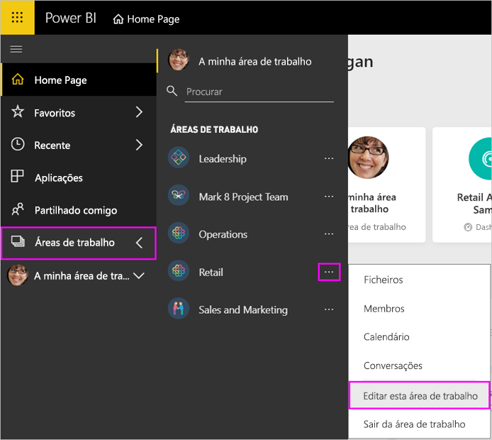
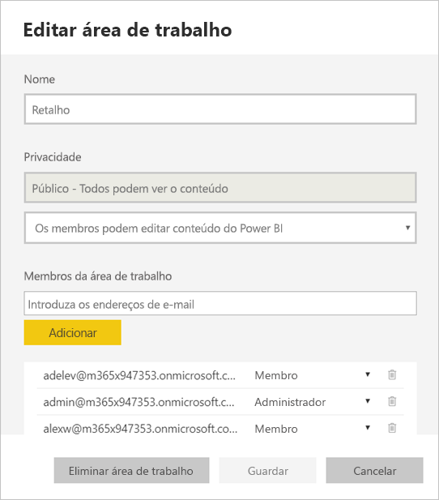
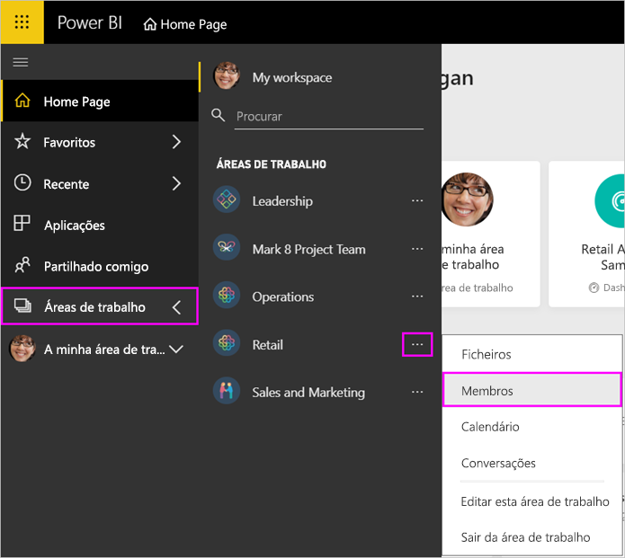
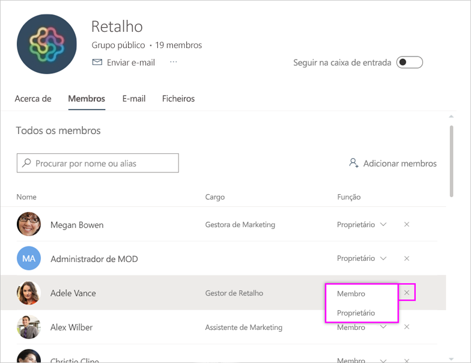
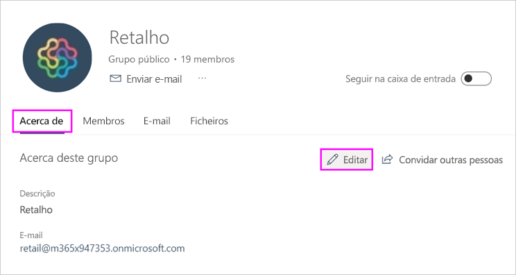
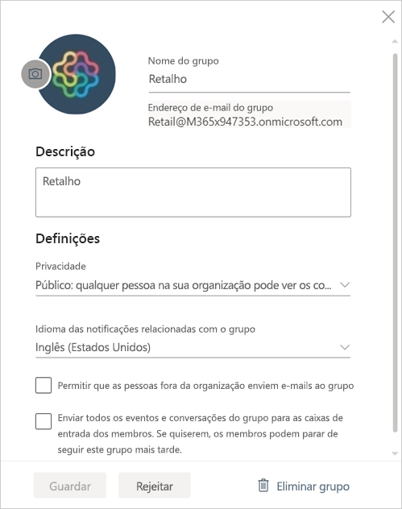

# Gerir a sua área de trabalho no Power BI e no Microsoft 365

Enquanto criador ou administrador de uma [área de trabalho no Power BI](service-create-distribute-apps.md) ou no Microsoft 365, gere alguns aspetos da área de trabalho no Power BI. Outros aspetos que gere no Microsoft 365.

> [!NOTE]
> A nova experiência de área de trabalho muda a relação entre as áreas de trabalho do Power BI e os grupos do Microsoft 365. Não estará a criar automaticamente um grupo do Microsoft 365 sempre que criar uma das novas áreas de trabalho. Leia mais sobre como [criar as novas áreas de trabalho](service-create-the-new-workspaces.md).

No **Power BI**, pode:

* Adicionar ou remover membros da área de trabalho, incluindo tornar um membro da área de trabalho administrador.
* Editar o nome da área de trabalho.
* Eliminar a área de trabalho, o que também elimina o grupo do Microsoft 365.

No **Microsoft 365**, pode:

* Adicionar ou remover membros do grupo da área de trabalho, incluindo tornar um membro proprietário.
* Editar o nome, a imagem e a descrição do grupo, bem como outras definições.
* Ver o endereço de e-mail do grupo.
* Eliminar o grupo.

Precisa de uma licença do [Power BI Pro](../fundamentals/service-features-license-type.md) para ser administrador ou membro de uma área de trabalho. Os utilizadores da aplicação também precisam de uma licença do Power BI Pro, a menos que a sua área de trabalho esteja numa capacidade Power BI Premium. Para mais detalhes, leia [O que é o Power BI Premium?](../admin/service-premium-what-is.md).

## Editar a sua área de trabalho no Power BI

1. No serviço Power BI, selecione a seta junto a **Áreas de Trabalho** > selecione **Mais opções** (...) junto ao nome da sua área de trabalho > **Editar esta área de trabalho**.

   

   > [!NOTE]
   > Só verá a opção **Editar esta área de trabalho** se for administrador da área de trabalho.

1. Aqui, pode mudar o nome da área de trabalho, adicionar ou remover membros, ou eliminar a área de trabalho.

   

1. Selecione **Guardar** ou **Cancelar**.

## Editar propriedades da área de trabalho do Power BI no Microsoft 365

Também pode editar aspetos de uma área de trabalho diretamente no Outlook para Microsoft 365.

### Editar os membros do grupo da área de trabalho

1. No serviço Power BI, selecione a seta junto a **Áreas de trabalho** > selecione **Mais opções** (…) junto ao nome da sua área de trabalho > **Membros**.

   

   Esta ação abre a vista de grupo do Outlook para o Microsoft 365 da sua área de trabalho. Poderá ter de iniciar sessão na sua conta empresarial.

1. Selecione a função junto ao nome de um colega de equipa para tornar essa pessoa um **Membro** ou **Proprietário**. Selecione o **X** para remover a pessoa do grupo.

   

### Adicionar uma imagem e definir outras propriedades da área de trabalho

Quando distribuir a aplicação a partir da área de trabalho, a imagem que adicionar aqui será a imagem da sua aplicação. Veja [Adicionar uma imagem à área de trabalho do Microsoft 365](service-create-workspaces.md#add-an-image-to-your-microsoft-365-workspace-optional) no artigo **Criar as novas áreas de trabalho**.

1. Na vista do Outlook para Microsoft 365 da sua área de trabalho, aceda ao separador **Acerca de** e selecione **Editar**.

    
1. Pode editar o nome, a descrição e o idioma das notificações de grupos. Também pode adicionar uma imagem e definir outras propriedades aqui.

   

1. Selecione **Guardar** ou **Eliminar**.

## Próximos passos

* [Publicar uma aplicação no Power BI](service-create-distribute-apps.md)

* Mais perguntas? [Pergunte à Comunidade do Power BI](https://community.powerbi.com/)
