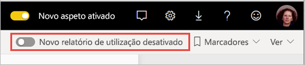
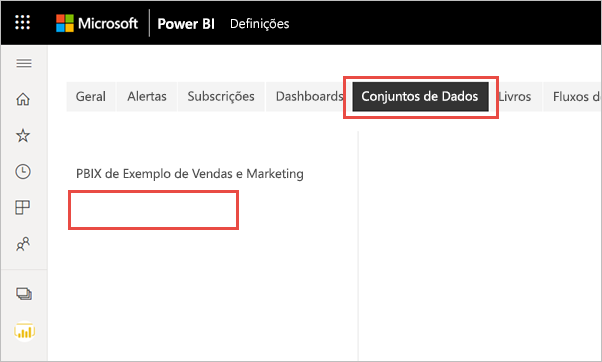

# Monitorizar as métricas de utilização na nova experiência de área de trabalho (pré-visualização)

Saber como o seu conteúdo está a ser utilizado ajuda-o a demonstrar o impacto e a atribuir prioridades aos esforços. A métrica de utilização pode mostrar que um dos seus relatórios é utilizado diariamente por um vasto segmento da organização e mostrar que um dashboard que criou não está a ser visualizado. Este tipo de comentários são valiosos para ajudá-lo nos seus esforços de trabalho.

Se criar relatórios em áreas de trabalho modernas, poderá ter acesso aos relatórios de métricas de utilização melhorados que lhe permitem saber como esses relatórios estão a ser utilizados em toda a sua organização e quem os está a utilizar. Também pode identificar problemas de desempenho de alto nível. Os relatórios de utilização melhorados na experiência de Área de trabalho moderna substituem os relatórios de métricas de utilização existentes documentados em [Monitorizar as métricas de utilização para dashboards e relatórios do Power BI](service-usage-metrics.md).

> [!NOTE]
> Pode executar relatórios de métricas de utilização apenas no serviço Power BI. No entanto, se guardar um relatório de métricas de utilização ou o afixar num dashboard, pode abrir e interagir com esse relatório em dispositivos móveis.

## Pré-requisitos

- Precisa de uma licença do Power BI Pro para executar e aceder aos dados de métricas de utilização. No entanto, a funcionalidade de métrica de utilização recolhe informações de utilização de todos os utilizadores, independentemente da licença que têm atribuída.
- Para aceder às métricas de utilização melhoradas de um relatório, o relatório tem de residir numa área de trabalho moderna e o utilizador tem de ter acesso de edição nesse relatório.
- O administrador do Power BI deve ter ativado as métricas de utilização para os criadores de conteúdo. O administrador do Power BI pode também ter ativado a recolha de dados por utilizador em métricas de utilização. Saiba mais sobre como [ativar estas opções no portal de administração](../admin/service-admin-portal.md#control-usage-metrics).

## Criar e ver um relatório de métricas de utilização melhorado

Apenas os utilizadores com permissões de administrador, membro ou contribuidor podem ver o relatório de métricas de utilização melhorado. As permissões de visualizador não são suficientes. Se tiver pelo menos a permissão de contribuidor numa área de trabalho moderna no qual o relatório reside, poderá utilizar o procedimento a seguir para apresentar as métricas de utilização melhoradas:

1. Abra a área de trabalho que contém o relatório no qual quer analisar as métricas de utilização.
2. Na lista de conteúdos da área de trabalho, abra o menu de contexto do relatório e selecione **Ver relatório de métricas de utilização**. Em alternativa, abra o relatório, abra o menu de contexto na barra de comandos e, em seguida, selecione **Métricas de utilização**.

    

1. Quando o faz pela primeira vez, o Power BI cria o relatório de métrica de utilização e permite-lhe saber quando está pronto.

    

1. Para ver os resultados, selecione **Ver métricas de utilização**.
2. Se for a primeira vez que o faz, o Power BI poderá abrir o relatório de métricas de utilização antigo. Para apresentar o relatório de métricas de utilização melhorado, no canto superior direito, mude o botão de Novo relatório de utilização desativado para **Ativado**.

    

    > [!NOTE]
    > Só poderá ver o botão de Novo relatório de utilização se o relatório residir numa área de trabalho moderna. As áreas de trabalho legadas não oferecem relatórios de métricas de utilização melhorados.

## Acerca do relatório de métricas de utilização melhorado

Quando apresenta o relatório de métricas de utilização melhorado com o procedimento acima, o Power BI gera um relatório previamente criado com as métricas de utilização desse conteúdo dos últimos 30 dias. O relatório tem um aspeto semelhante aos relatórios do Power BI com que já está familiarizado. Poderá segmentar com base na forma como os utilizadores finais receberam acesso, quer estivessem a aceder através da Web ou da aplicação móvel, etc. À medida que os relatórios evoluem, o mesmo se passa com o relatório de métricas de utilização, que é atualizado todos os dias com novos dados.

> [!NOTE]
> Os relatórios de métricas de utilização não aparecem nas listas Recente, Áreas de trabalho, Favoritos ou outras listas de conteúdos. Não podem ser adicionados a uma aplicação. Se afixar um mosaico de um relatório de métrica de utilização a um dashboard, não poderá adicionar esse dashboard a uma aplicação.

### Conjunto de dados Relatório de métricas de utilização

O relatório de métricas de utilização melhorado baseia-se num conjunto de dados Relatório de Métricas de Utilização, que o Power BI cria automaticamente quando inicia o relatório de métricas de utilização melhorado pela primeira vez. O Power BI atualiza este conjunto de dados diariamente. Apesar de não poder alterar o agendamento das atualizações, pode atualizar as credenciais que o Power BI utiliza para atualizar os dados das métricas de utilização. Este procedimento poderá ser necessário para retomar a atualização agendada caso as credenciais expirem ou se tiver removido o utilizador que iniciou pela primeira vez o relatório de métricas de utilização a partir da área de trabalho onde reside o conjunto de dados.

> [!NOTE]
> Enquanto ainda está em pré-visualização, o conjunto de dados das métricas de utilização pode ter pequenas alterações que afetam os relatórios personalizados.  

### Páginas do relatório de métricas de utilização

O relatório de métricas de utilização melhorado inclui as seguintes páginas de relatório:

- **Utilização do relatório** – apresenta informações sobre as visualizações do relatório e os visualizadores do relatório, como quantos utilizadores viram o relatório ordenados por data.
- **Desempenho do relatório** – mostra os tempos normais de abertura do relatório divididos por método de consumo e tipos de browser.
- **FAQ** – apresenta respostas a perguntas frequentes, como O que é um “Visualizador” e o que é uma “Visualização”?

### Quais são as métricas reportadas?

| **Página** | **Métrica** | **Descrição** |
| --- | --- | --- |
| Comunicar utilização | Visualizações do relatório | Sempre que alguém abre um relatório, é registada uma visualização do relatório. Tenha em atenção que a definição de visualização é diferente da dos relatórios de métricas de utilização anteriores. Alterar as páginas do relatório já não é considerado uma visualização adicional. Atividades como partilhar e afixar já não são consideradas nas métricas de utilização.|
| Comunicar utilização | Visualizadores únicos | Um visualizador é alguém que abriu o relatório, pelo menos, uma vez durante o período de tempo (com base na conta de utilizador do AAD). |
| Comunicar utilização | Tendência das visualizações | A tendência das visualizações reflete as alterações nas contagens das visualizações ao longo do tempo. Compara a primeira metade do período de tempo selecionado com a segunda metade. |
| Comunicar utilização | Segmentação de datas | Pode alterar o período de tempo na página Utilização do relatório, por exemplo, para calcular as tendências semana a semana ou quinzenalmente. No canto inferior esquerdo da página Utilização do relatório, pode determinar a data mais antiga e a mais recente para as quais os dados de utilização estão disponíveis no relatório selecionado. |
| Comunicar utilização | Posição | Com base na contagem das visualizações, a classificação mostra a popularidade de um relatório em comparação com todos os outros relatórios na organização. Uma classificação de 1 significaria que o relatório é o mais visto entre todos os relatórios da organização.   |
| Comunicar utilização | Visualizações do relatório por dia | Número total de visualizações por dia. |
| Comunicar utilização | Visualizadores do relatório por dia | Número total de utilizadores diferentes que visualizaram o relatório (com base na conta de utilizador do AAD). |
| Comunicar utilização | Método de distribuição | A forma como os utilizadores obtiveram acesso ao relatório, por exemplo, são membros de uma área de trabalho, através da partilha de um relatório com eles ou através da instalação de uma aplicação. |
| Comunicar utilização | Segmentação de plataformas | Se acedeu ao relatório através do serviço Power BI (powerbi.com), do Power BI Embedded ou de um dispositivo móvel. |
| Comunicar utilização | Utilizadores com visualizações do relatório | Mostra a lista de utilizadores que abriram o relatório ordenados por contagem de visualizações. |
| Comunicar utilização | Páginas | Se o relatório tem mais de 1 página, segmente o relatório pela(s) página (s) que foi(ram) visualizada(s). Se vir uma opção de lista para "Em branco", isso significa que uma página do relatório foi adicionada recentemente (dentro de 24 horas, o nome real da nova página é apresentado na lista de segmentação de dados) e/ou as páginas de relatórios foram eliminadas. "Em branco" captura estes tipos de situações. |
| Desempenho do relatório | Tempo normal de abertura | O tempo normal de abertura do relatório corresponde ao percentil 50 do tempo necessário para abrir o relatório. Por outras palavras, é o tempo abaixo do qual 50% das ações de abertura do relatório são concluídas. A página Desempenho do relatório também divide o tempo normal de abertura do relatório por método de consumo e por tipo de browser.   |
| Desempenho do relatório | Tendência dos tempos de abertura | A tendência dos tempos de abertura reflete as alterações no desempenho da abertura do relatório ao longo do tempo. Compara os tempos de abertura do relatório da primeira metade do período de tempo selecionado com os tempos de abertura da segunda metade. |
| Desempenho do relatório | Segmentação de datas | Pode alterar o período de tempo na página Desempenho do relatório, por exemplo, para calcular as tendências semana a semana ou quinzenalmente. No canto inferior esquerdo da página Desempenho do relatório, pode determinar a data mais antiga e a mais recente para as quais os dados de utilização estão disponíveis no relatório selecionado. |
| Desempenho do relatório | Desempenho diário | O desempenho para 10%, 50% e 90% das ações de abertura do relatório calculadas para cada dia individual. |
| Desempenho do relatório | Desempenho de sete dias | O desempenho para 10%, 50%, e 90% das ações de abertura do relatório calculadas ao longo dos últimos sete dias para cada data. |
| Desempenho do relatório | Método de consumo | A forma como os utilizadores abrem o relatório, por exemplo, através do serviço Power BI (powerbi.com), do Power BI Embedded ou de um dispositivo móvel. |
| Desempenho do relatório | Navegadores | Que browser os utilizadores utilizaram para abrir o relatório, por exemplo, Firefox, Edge e Chrome. |

## Atualizar as credenciais do relatório de métricas de utilização

Utilize o seguinte procedimento para obter o controlo de um conjunto de dados Relatório de Métricas de Utilização e atualizar as credenciais.

1. Abra a área de trabalho que contém o relatório para o qual quer atualizar o conjunto de dados Relatório de Métricas de Utilização.
2. Na barra de cabeçalho preta na parte superior, selecione o ícone **Definições** e, em seguida, **Definições**.

    

3. Mude para o separador **Conjuntos de dados**.

1. Selecione o conjunto de dados Relatório de Métricas de Utilização. 

    
    
    Se não for o proprietário atual do conjunto de dados, deverá assumir a propriedade para poder atualizar as credenciais da origem de dados. 
    
5. Selecione o botão **Obter controlo** e, em seguida, na caixa de diálogo **Obter controlo das definições do conjunto de dados**, selecione **Obter controlo** novamente.

1. Em **Credenciais da origem de dados**, selecione **Editar credenciais**.

    

2. Na caixa de diálogo **Configurar Relatório de Métricas de Utilização**, selecione **Iniciar sessão**.

    

1. Complete a sequência de início de sessão e observe a notificação a indicar que a origem de dados foi atualizada com êxito.

    > [!NOTE]
    > O conjunto de dados Relatório de Métricas de Utilização contém dados de utilização dos últimos 30 dias. A importação dos novos dados de utilização pode demorar até 24 horas. Não pode acionar uma atualização manual com a interface de utilizador do Power BI.

## Desativar os relatórios de métricas de utilização

Os relatórios de métricas de utilização são uma funcionalidade que o administrador do Power BI ou o administrador global pode ativar ou desativar. Os administradores têm controlo granular através do qual os utilizadores têm acesso à métrica de utilização. Por predefinição, estão ativados para todos os utilizadores na organização. Veja [Controlar métricas de utilização](../admin/service-admin-portal.md#control-usage-metrics) no artigo do Portal de administração para obter detalhes sobre estas definições.

> [!NOTE]
> Apenas os administradores do inquilino do Power BI podem ver o portal de administração e editar as definições.

## Excluir as informações dos utilizadores dos relatórios de métricas de utilização

Por predefinição, os dados por utilizador estão ativados para métricas de utilização e as informações da conta do consumidor de conteúdos estão incluídas no relatório de métricas. Se os administradores não quiserem expor estas informações a alguns ou a todos os utilizadores, poderão excluir as informações dos utilizadores do relatório de utilização ao desativar Dados por utilizador em métricas de utilização para criadores de conteúdo nas definições do inquilino do portal de administração do Power BI para grupos de segurança especificados ou para toda a organização.

1. No separador **Definições do inquilino** no portal de administração, em **Definições de utilização e auditoria**, expanda **Dados por utilizador em métricas para criadores de conteúdo** e selecione **Desativado**.

2. Decida se deve **Eliminar todos os dados por utilizador existente no conteúdo atual de métricas de utilização** e selecione **Aplicar**.

    

Se as informações dos utilizadores forem excluídas, o relatório de utilização apresentará os utilizadores como Sem nome.

Ao desativar as métricas de utilização para toda a organização, os administradores podem utilizar a opção Eliminar todo o conteúdo das métricas de utilização existente para eliminar todos os relatórios e mosaicos de dashboards existentes que foram criados com os relatórios de métricas de utilização. Esta opção remove todo o acesso a dados da métrica de utilização por parte de todos os utilizadores na organização que possam estar a utilizá-lo. A eliminação do conteúdo das métricas de utilização existente é irreversível.

> [!NOTE]
> Apenas os administradores do inquilino do Power BI podem ver o Portal de administração e configurar a definição Dados por utilizador em métricas de utilização para criadores de conteúdo.

## Personalizar o relatório de métricas de utilização

Para examinar os dados do relatório ou criar os seus próprios relatórios com base no conjunto de dados subjacentes, tem várias opções:

- **[Criar uma cópia do relatório](#create-a-copy-of-the-usage-report) no serviço Power BI.**   Utilize **Guardar uma cópia** para criar uma instância separada do relatório de métricas de utilização, que pode personalizar para responder às suas necessidades específicas.
- **[Ligar-se ao conjunto de dados](#create-a-new-usage-report-in-power-bi-desktop) com um novo relatório.**   Em cada área de trabalho, o conjunto de dados tem o nome “Relatório de Métricas de Utilização”, como explicado anteriormente na secção [Conjunto de dados Relatório de métricas de utilização](#usage-metrics-report-dataset). Pode utilizar o Power BI Desktop para criar relatórios de métricas de utilização personalizados com base no conjunto de dados subjacente.
- **[Utilizar Analisar no Excel](#analyze-usage-data-in-excel).**   Também pode tirar partido das funcionalidades de segmentação, gráficos e Tabelas Dinâmicas do Microsoft Excel 2010 SP1 ou posterior para analisar os dados de utilização do Power BI. Leia mais sobre a funcionalidade [Analisar no Excel](service-analyze-in-excel.md).

### Criar uma cópia do relatório de utilização

Quando cria uma cópia do relatório de utilização previamente criado só de leitura, o Power BI cria uma instância editável do mesmo. À primeira vista, parece igual. Contudo, agora pode abrir o relatório na vista de Edição, adicionar novas visualizações, filtros e páginas, modificar ou eliminar visualizações existentes, etc. O Power BI guarda o relatório novo na área de trabalho atual.

1. No novo relatório de métricas de utilização, selecione o menu **Mais opções** (...) e, em seguida, **Guardar uma cópia**.

    

2. Na caixa de diálogo **Guardar relatório**, introduza um nome e, em seguida, selecione **Guardar**.

    O Power BI cria um relatório do Power BI editável, guardado na área de trabalho atual, e abre a cópia de relatório. 

3. Selecione o menu **Mais opções** (...) e, em seguida, **Editar** para mudar para a Vista de edição. 

    Por exemplo, pode alterar os filtros adicionar novas páginas, criar novas visualizações, formatar os tipos de letra e cores, etc.

1. O novo relatório é guardado no separador Relatórios na área de trabalho atual e é adicionado à lista de conteúdo Recente.

    
    
> [!NOTE]
> Quando guarda uma cópia do relatório de métricas de utilização, a mesma é tratada como um relatório do Power BI normal. Estará acessível a todos os utilizadores com permissões de visualização na área de trabalho, incluindo utilizadores na função de Visualizador.

### Criar um novo relatório de utilização no Power BI Desktop

Pode criar um novo relatório de utilização no Power BI Desktop, com base no conjunto de dados Relatório de Métricas de Utilização. Para estabelecer uma ligação ao conjunto de dados Relatório de Métricas de Utilização e criar o seu próprio relatório, tem de ter sessão iniciada no serviço Power BI no Power BI Desktop. 

1. Abra o Power BI Desktop.

2. Se não tiver sessão iniciada no serviço Power BI, no menu **Ficheiro**, selecione **Iniciar sessão**.

1. Para ligar ao conjunto de dados Relatório de Métricas de Utilização, no friso **Base**, selecione **Obter Dados**.

4. No painel esquerdo, selecione **Power Platform** e, em seguida, **Conjuntos de dados do Power BI** > **Ligar**.

    

1. Desloque-se para o conjunto de dados desejado ou escreva *Relatório de Métricas de Utilização* na caixa de pesquisa. 

6. Na coluna Área de trabalho, verifique se está a selecionar o conjunto de dados correto e, em seguida, selecione **Criar**. 

    

7. Veja a lista Campos no Power BI Desktop, que lhe permite obter acesso às tabelas, colunas e medidas no conjunto de dados selecionado.

    

1. Pode agora criar e partilhar relatórios de utilização personalizados, todos a partir do mesmo conjunto de dados Relatório de Métricas de Utilização.

### Analisar os dados de utilização no Excel

Quando se liga aos dados de utilização no Excel, pode criar Tabelas Dinâmicas que utilizam as medidas predefinidas. Tenha em atenção que as Tabelas Dinâmicas do Excel não suportam a agregação “arrastar e largar” de campos numéricos ao ligar-se a um conjunto de dados do Power BI.

1. Primeiro, se ainda não o tiver feito, [crie uma cópia do relatório de métricas de utilização](#create-a-copy-of-the-usage-report). 

2. Abra o novo relatório de métricas de utilização, selecione o menu **Mais opções** (...) e, em seguida, **Analisar no Excel**.

    

1. Se vir a caixa de diálogo **Primeiro, precisa de algumas atualizações do Excel**, selecione **Transferir** e instale as atualizações mais recentes para obter a conectividade do Power BI ou selecione **Já instalei estas atualizações**.

    

    > [!NOTE]
    > Algumas empresas podem ter regras da Política de Grupo para impedir a instalação das atualizações necessárias da funcionalidade “Analisar no Excel” no Excel. Se não conseguir instalar as atualizações, consulte o seu administrador.

1. Na caixa de diálogo do browser que lhe pergunta o que quer fazer com o ficheiro Usage Metrics report.odc, selecione **Abrir**.

    

1. O Power BI inicia o Excel. Verifique o nome e o caminho do ficheiro .odc e, em seguida, selecione **Ativar**.

    

1. Agora que o Excel está aberto e tem uma Tabela Dinâmica vazia, pode arrastar campos para as caixas Linhas, Colunas, Filtros e Valores e criar visualizações personalizadas nos dados de utilização.

    

## Métricas de utilização em clouds nacionais

O Power BI está disponível em clouds nacionais separadas. Estas clouds oferecem os mesmos níveis de segurança, privacidade, conformidade e transparência que a versão global do Power BI, combinado com um modelo exclusivo para regulamentações locais sobre a entrega do serviço, residência dos dados, acesso e controlo. As métricas de utilização modernas estão atualmente disponíveis nas seguintes clouds nacionais: 

- Cloud da Comunidade de Administração Pública dos E.U.A.
- Cloud da Comunidade Governamental dos EUA Elevada
- Departamento de Defesa dos EUA
- China

Para obter mais informações, veja as [clouds nacionais](https://powerbi.microsoft.com/clouds/).

## Considerações e limitações

É importante compreender que podem existir diferenças ao comparar o relatório de métricas de utilização melhorado com o seu antecessor. Em particular, as métricas de utilização do relatório são agora baseadas nos dados de atividade recolhidos do serviço Power BI. As versões anteriores do relatório de métricas de utilização baseavam-se na telemetria do cliente, o que nem sempre corresponde às métricas de utilização recolhidas no serviço. Além disso, o relatório de métricas de utilização melhorado utiliza uma definição diferente para “Visualização”. Uma visualização é um evento de abertura do relatório, conforme registado no serviço sempre que alguém abre um relatório. Alterar as páginas do relatório já não é considerado uma visualização adicional.

> [!NOTE]
> Dado que o relatório de métricas de utilização melhorado depende dos dados de atividade recolhidos no serviço Power BI, as métricas de utilização agora correspondem às contagens de atividades nos registos de auditoria e nos registos de atividades. A contagem de atividades muito baixa ou em excesso devido a ligações de rede inconsistentes, a bloqueadores de publicidade ou a outros problemas do lado do cliente já não distorcem as contagens dos visualizadores e das visualizações.

Para além das diferenças indicadas acima entre os relatórios de métricas de utilização melhorados e os anteriores, deve observar as seguintes limitações da versão de pré-visualização:

- As métricas de utilização do dashboard ainda dependem da versão anterior dos relatórios de métricas de utilização.
- Os relatórios de métricas de utilização melhorados só estão disponíveis para os relatórios em áreas de trabalho modernas. Os relatórios em áreas de trabalho legadas suportam apenas a versão anterior dos relatórios de métricas de utilização.
- As métricas de desempenho do relatório baseiam-se na telemetria do cliente. Certos tipos de visualizações não são incluídos nas medições do desempenho. Por exemplo, quando um utilizador seleciona a ligação para um relatório numa mensagem de e-mail, a visualização é contabilizada na utilização do relatório, mas não existe nenhum evento nas métricas de desempenho.
- As métricas de desempenho do relatório não estão disponíveis para os Relatórios Paginados. O separador Páginas na página Utilização do relatório, bem como os gráficos na página Desempenho do relatório, não mostra os dados para este tipo de relatórios.
- A máscara de utilizador não está a funcionar conforme esperado ao utilizar grupos aninhados. Se a sua organização tiver desativado os Dados por utilizador em métricas de utilização para criadores de conteúdo nas definições do inquilino do portal de administração do Power BI, apenas os membros no nível superior serão mascarados. Os membros dos subgrupos ainda são visíveis.
- A inicialização do conjunto de dados Relatório de Métricas de Utilização pode demorar alguns minutos, o que resulta na apresentação de um relatório de métricas de utilização em branco dado que a interface de utilizador do Power BI não espera até que a atualização termine. Verifique o histórico de atualizações nas definições do conjunto de dados Relatório de Métricas de Utilização para confirmar se a operação de atualização ocorreu com êxito.
- A inicialização do conjunto de dados Relatório de Métricas de Utilização poderá falhar se o tempo limite for excedido durante a atualização. Veja a secção Resolução de problemas abaixo para resolver este problema.
- A partilha está desativada no relatório das métricas de utilização. Para atribuir às pessoas acesso de leitura ao relatório, primeiro é preciso dar-lhes acesso à área de trabalho.
- Em alguns cenários, poderá reparar que estão a faltar os dados de desempenho. Isso pode ocorrer se o utilizador abrir um relatório e interagir com o mesmo antes de esse relatório ter sido completamente carregado ou se tiver ocorrido um erro durante o seu carregamento.
- Os dados de desempenho dependem do envio de dados do cliente/dispositivo para o Power BI. Dependendo da latência de rede, bloqueadores de anúncios, firewalls e regras de rede definidas pela sua organização, os dados de desempenho podem nunca chegar ao Power BI. Portanto, os dados de desempenho só podem apresentar uma amostra e não podem incluir ou mostrar todos os utilizadores. 

## Perguntas frequentes

Para além das considerações e limitações acima, as seguintes perguntas e respostas sobre as métricas de utilização podem ser úteis para os utilizadores e os administradores:

**P:** Não consigo executar métricas de utilização num relatório.

**R:** Só consegue ver as métricas de utilização dos relatórios que detém ou para os quais tem permissões de edição.

**P:** Por que não consigo ver o Novo relatório de utilização aquando da ativação no canto superior direito do meu relatório de métricas de utilização existente?

**R:** O relatório de métricas de utilização melhorado só está disponível para relatórios em áreas de trabalho modernas.

**P:** Que período de tempo é abrangido pelo relatório?

**R:** O relatório de utilização baseia-se nos dados de atividade dos últimos 30 dias, excluindo as atividades do dia atual. Pode limitar o período de tempo com a Segmentação de datas na página Utilização do relatório para, por exemplo, analisar apenas os dados da última semana.

**P:** Quando poderei ver os dados de atividade mais recentes?

**R:** O relatório de utilização inclui dados de atividade até ao último dia completo com base no fuso horário UTC. Os dados apresentados no relatório estão também dependentes do tempo de atualização do conjunto de dados. O Power BI atualiza o conjunto de dados uma vez por dia.

**P:** Os dados não parecem estar atualizados.

**R:** Tenha em conta que pode demorar até 24 horas para aparecerem novos dados de atividade no relatório de utilização.

**P:** Qual é a origem de dados dos dados de utilização?

**R:** O conjunto de dados Relatório de Métricas de Utilização importa os dados de um arquivo de métricas de utilização interno do Power BI com um Conector de Dados personalizado das Métricas de Utilização. Pode atualizar as credenciais do Conector de Dados das Métricas de Utilização na página de definições do conjunto de dados Relatório de Métricas de Utilização.

**P:** Como me posso ligar aos dados? Ou alterar o relatório predefinido?

**R:** Pode criar uma cópia do relatório de utilização previamente criado só de leitura. A cópia do relatório liga-se ao mesmo conjunto de dados Relatório de Métricas de Utilização e permite-lhe editar os detalhes do relatório.

**P:** O que é um “Visualizador” e o que é uma “Visualização”?

**R:** Um visualizador é alguém que abriu o relatório, pelo menos, uma vez durante o período de tempo. Uma visualização é um evento de abertura do relatório. Sempre que alguém abre um relatório, é registada uma visualização do relatório.

Tenha em atenção que a definição de visualização é diferente da dos relatórios de métricas de utilização anteriores. Alterar as páginas do relatório já não é considerado uma visualização adicional.

**P:** Como é calculada a “Tendência das visualizações”?

**R:** A tendência das visualizações reflete as alterações nas contagens das visualizações ao longo do tempo. Compara a primeira metade do período de tempo selecionado com a segunda metade. Pode alterar o período de tempo com a Segmentação de datas na página Utilização do relatório para, por exemplo, calcular as tendências semana a semana ou quinzenalmente.

**P:** O que significa “Distribuição” e “Plataforma”?

**R:** A distribuição mostra como os visualizadores obtiveram acesso a um relatório: partilhado diretamente, através do acesso à área de trabalho ou através de uma aplicação.

A Plataforma indica a tecnologia que um visualizador utilizou para abrir um relatório: através do PowerBI.com, de um Dispositivo Móvel ou do Power BI Embedded.

**P:** Como funciona a classificação de relatórios?

**R:** Com base na contagem das visualizações, a classificação mostra a popularidade de um relatório em comparação com todos os outros relatórios na organização. Uma classificação de 1 significaria que o relatório é o mais visto entre todos os relatórios da organização.

**P:** O que são “Utilizadores Sem Nome”?

**R:** A sua organização pode decidir excluir as informações dos utilizadores do relatório de utilização. Se forem excluídas, o relatório de utilização apresentará os utilizadores como Sem nome.

**P:** O que é o “Tempo normal de abertura do relatório”?

**R:** O tempo normal de abertura do relatório corresponde ao percentil 50 do tempo necessário para abrir o relatório. Por outras palavras, é o tempo abaixo do qual 50% das ações de abertura do relatório são concluídas. A página Desempenho do relatório também divide o tempo normal de abertura do relatório por método de consumo e por tipo de browser.

**P:** Como é calculada a “Tendência dos tempos de abertura”?

**R:** A tendência dos tempos de abertura reflete as alterações no desempenho da abertura do relatório ao longo do tempo. Compara os tempos de abertura do relatório da primeira metade do período de tempo selecionado com os tempos de abertura da segunda metade. Pode alterar o período de tempo com a Segmentação de datas na página Desempenho do relatório para, por exemplo, calcular as tendências semana a semana ou quinzenalmente.

**P:**  Existem quatro relatórios na versão anterior do relatório de métricas de utilização, mas a versão melhorada apresenta apenas três.

**R:**  O relatório de métricas de utilização melhorado inclui apenas relatórios que foram abertos nos últimos 30 dias, enquanto a versão anterior abrange os últimos 90 dias. Se um relatório não estiver incluído no relatório de métricas de utilização melhorado, provavelmente não foi utilizado há mais de 30 dias.

## Resolução de Problemas: Eliminar o conjunto de dados

Se suspeitar de problemas de consistência de dados ou de atualização, poderá fazer sentido eliminar o conjunto de dados Relatório de Métricas de Utilização existente. Em seguida, pode executar novamente as Métricas de Utilização das Visualizações para gerar um novo conjunto de dados com os relatórios de métricas de utilização melhorados associados. Siga estes passos.

### Eliminar o conjunto de dados

1. Abra a área de trabalho que contém o relatório para o qual quer repor o conjunto de dados Relatório de Métricas de Utilização.

2. Na barra de cabeçalho preta na parte superior, selecione o ícone **Definições** e, em seguida, **Definições**.

    

3. Mude para o separador **Conjuntos de dados** e selecione o conjunto de dados Relatório de Métricas de Utilização. 

    

5. Copie os IDs do conjunto de dados e da área de trabalho do URL apresentado na barra de endereço do browser.

    

1. No browser, aceda a [https://docs.microsoft.com/rest/api/power-bi/datasets/deletedatasetingroup](/rest/api/power-bi/datasets/deletedatasetingroup) e selecione o botão **Experimentar**.

    

1. Inicie sessão no Power BI, cole o ID da Área de trabalho na caixa de texto **groupId** e o ID do conjunto de dados na caixa de texto **datasetId** e, em seguida, selecione **Executar**. 

    

1. Sob o botão **Executar**, confirme que o serviço devolve um Código de Resposta **200**. Este código indica que o conjunto de dados e os relatórios de métricas de utilização associados foram eliminados com êxito.

    

### Criar um novo relatório de métricas de utilização

1. Novamente no serviço Power BI, pode ver que o conjunto de dados desapareceu.

    

2. Se ainda estiver a ver o relatório Métricas de Utilização na lista Relatórios, atualize o browser.

3. [Criar um novo relatório de métricas de utilização](#create--view-an-improved-usage-metrics-report).

## Próximos passos

[Administrar o Power BI no portal de administração](../admin/service-admin-portal.md)

Mais perguntas? [Pergunte à Comunidade do Power BI](https://community.powerbi.com/)