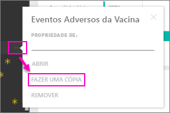

# Pacotes de conteúdos organizacionais: copiar, atualizar e obter acesso

Quando um pacote de conteúdos organizacionais é publicado, todos os destinatários veem o mesmo dashboard, os mesmos relatórios, os mesmos livros do Excel, conjuntos de dados e dados (a menos que seja uma origem de dados SQL Server Analysis Services [SSAS]).  [Apenas o criador do pacote de conteúdos pode editar e publicar novamente](service-organizational-content-pack-manage-update-delete.md) o pacote de conteúdos.  No entanto, todos os destinatários podem guardar uma cópia do pacote de conteúdos, que pode permanecer junto do original.

Criar pacotes de conteúdos é diferente de partilhar dashboards ou colaborar nos mesmos num grupo. Leia [Como devo colaborar e partilhar os meus dashboards e relatórios?](service-how-to-collaborate-distribute-dashboards-reports.md) para decidir qual a opção mais adequada à sua situação.

> [!NOTE]
> Não pode criar nem instalar pacotes de conteúdos organizacionais nas novas experiências de áreas de trabalho. Agora é uma boa altura para atualizar os seus pacotes de conteúdos para aplicações, se ainda não tiver começado. Saiba [mais sobre a nova experiência de área de trabalho](service-create-the-new-workspaces.md).
>

## Criar uma cópia de um pacote de conteúdos organizacionais
Crie a sua cópia do pacote de conteúdos, que não é visível para outras pessoas.

1. Selecione **Mais opções** (…) junto ao dashboard do pacote de conteúdos > Fazer uma cópia.

    
2. Selecione **Guardar**.  

Tem agora uma cópia que pode alterar. Ninguém estará autorizado a visualizar as alterações que fizer.

> [!NOTE]
> Anteriormente, sempre que instalava um pacote de conteúdos ou criava uma cópia, um novo conjunto de dados aparecia na lista de conteúdos da área de trabalho. Uma atualização recente simplifica a experiência para mostrar apenas um item com o novo ícone de conjunto de dados de referência:
>
> 
>

## Ajuda!  Já não consigo aceder ao pacote de conteúdos
Isto pode ocorrer por diversos motivos:

* **Alterações de associação**:  os pacotes de conteúdos são publicados em grupos de distribuição de e-mail, grupos de segurança e [grupos do Power BI baseados no Microsoft 365](https://support.office.com/article/Create-a-group-in-Office-365-7124dc4c-1de9-40d4-b096-e8add19209e9).  Se for removido do grupo, deixará de ter acesso ao pacote de conteúdos.
* **Alterações de distribuição**: o criador do pacote de conteúdos altera a distribuição. Por exemplo, se o pacote de conteúdos foi publicado originalmente para toda a organização, mas o criador o publicou novamente para um público menor, poderá já não estar incluído.
* **Alterações às configurações de segurança**: se o dashboard e os relatórios forem ligados a origens de dados SSAS no local e forem feitas alterações às configurações de segurança, as suas permissões para esse servidor poderão ser revogadas.

## Como são atualizados os pacotes de conteúdos organizacionais?
Quando o pacote de conteúdos é criado, as configurações de atualização são herdadas com o conjunto de dados.  Quando cria uma cópia do pacote de conteúdos, a nova versão mantém a ligação ao conjunto de dados original e ao agendamento de atualização.

Veja [Gerir, atualizar e eliminar pacotes de conteúdos organizacionais](service-organizational-content-pack-manage-update-delete.md).

## Próximos passos
* [Introdução aos pacotes de conteúdos organizacionais](service-organizational-content-pack-introduction.md)
* [Criar um grupo no Power BI](service-create-distribute-apps.md)
* Mais perguntas? [Pergunte à Comunidade do Power BI](https://community.powerbi.com/)
