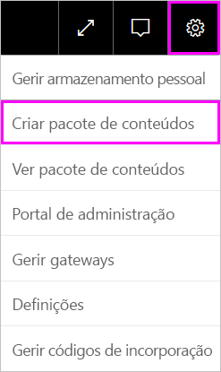
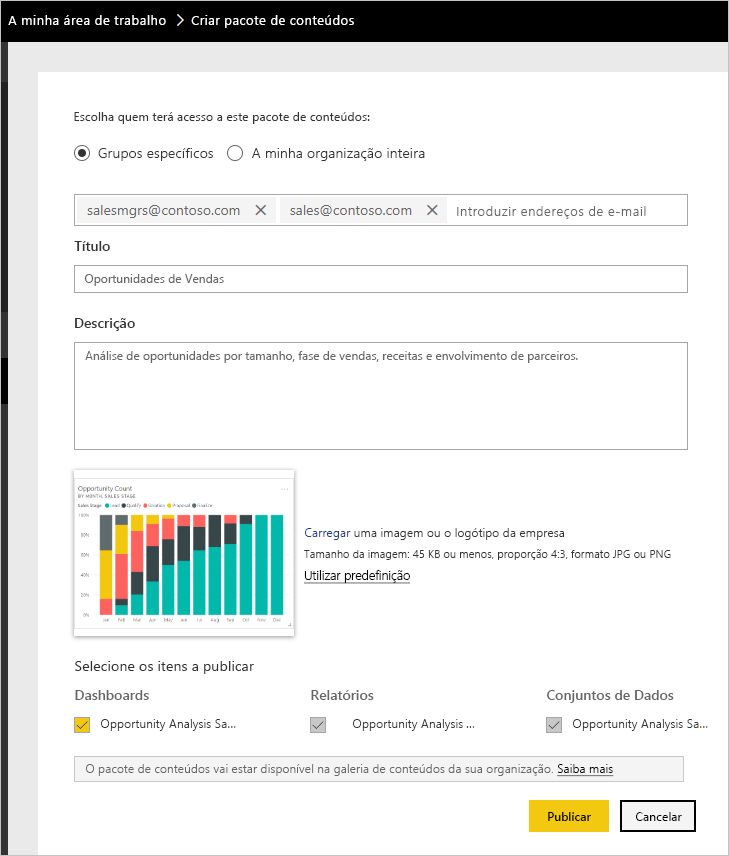
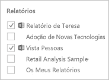
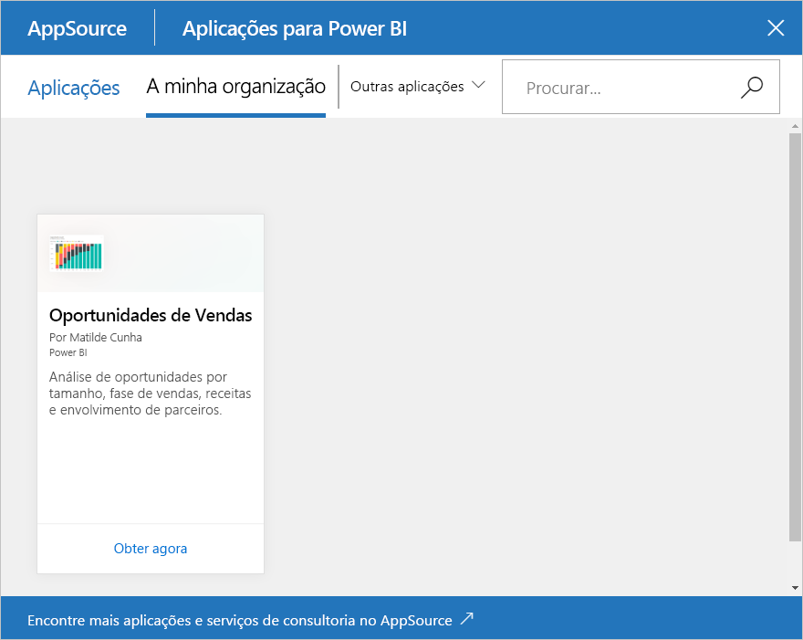

# Tutorial: Criar e publicar um pacote de conteúdos organizacionais do Power BI

Neste tutorial, vai criar um pacote de conteúdos organizacionais, conceder acesso a um grupo específico e publicá-lo na biblioteca de pacotes de conteúdos da sua organização no Power BI.

Criar pacotes de conteúdos é diferente de partilhar dashboards ou colaborar nos mesmos num grupo. Leia [Formas de partilhar o seu trabalho no Power BI](service-how-to-collaborate-distribute-dashboards-reports.md) para decidir qual a melhor opção para a sua situação.

Criar um pacote de conteúdos organizacionais requer uma [conta do Power BI Pro](https://powerbi.microsoft.com/pricing) para si e para os seus colegas.

> [!NOTE]
> Não pode criar nem instalar pacotes de conteúdos organizacionais nas novas experiências de áreas de trabalho. Agora é uma boa altura para atualizar os seus pacotes de conteúdos para aplicações, se ainda não tiver começado. Saiba [mais sobre a nova experiência de área de trabalho](service-create-the-new-workspaces.md).

## Criar e publicar um pacote de conteúdos

Imagine que é o Gestor de Versão da Contoso e está a preparar-se para o lançamento de um novo produto.  Criou um dashboard com os relatórios que pretende partilhar. Outros colaboradores que estejam encarregues do lançamento podem considerá-los úteis. Pretende ter uma forma de formatar o dashboard e os relatórios como uma solução para utilização por parte dos seus colegas.

Quer acompanhar? No [serviço Power BI](https://powerbi.com), aceda a **A Minha Área de Trabalho**. Em seguida, aceda a **Obter Dados** > **Exemplos** > **Exemplo de Análise de Oportunidade** > **Ligar** para obter a sua cópia.

1. No painel de navegação, selecione **Áreas de trabalho** > **As minhas áreas de trabalho**.

1. No painel de navegação superior, selecione o ícone de engrenagem  > **Criar pacote de conteúdos**.

   

1. Na janela **Criar pacote de conteúdos**, introduza as seguintes informações.  

   Tenha em conta que a biblioteca de pacotes de conteúdos da sua organização poderá encher rapidamente. A biblioteca de pacotes de conteúdos da sua organização pode acabar com centenas de pacotes de conteúdos publicados para a organização ou para grupos. Reserve um tempo para dar um nome relevante ao seu pacote de conteúdos, adicionar uma boa descrição e selecionar o público certo.  Utilize palavras que tornarão o seu pacote de conteúdos fácil de localizar através da pesquisa. Desta forma, será mais fácil localizá-lo no futuro.

      

    1. Selecione **Grupos Específicos**.

    1. Introduza os endereços de e-mail completos das pessoas, dos [grupos do Microsoft 365](https://support.office.com/article/Create-a-group-in-Office-365-7124dc4c-1de9-40d4-b096-e8add19209e9), dos grupos de distribuição ou dos grupos de segurança. Por exemplo: salesmgrs@contoso.com; sales@contoso.com

        Neste tutorial, experimente utilizar o endereço de e-mail do seu grupo.

    1. Dê o nome *Oportunidades de Vendas* ao pacote de conteúdos.

        > [!TIP]
        > Considere incluir o nome do dashboard no nome do pacote de conteúdos. Dessa forma, os seus colegas podem encontrar o seu dashboard mais facilmente após ligarem-se ao seu pacote de conteúdos.

    1. Recomendado: adicione uma descrição. Isto ajuda os colegas de trabalho a encontrarem mais facilmente os pacotes de conteúdos de que precisam. Além de uma descrição, adicione palavras-chave que os seus colegas de trabalho possam usar para procurar este pacote de conteúdos. Inclua informações de contacto, caso os seus colegas de trabalho tenham alguma dúvida ou precisem de ajuda.

    1. Carregue uma imagem ou um logótipo para que os membros do grupo consigam encontrar mais facilmente o pacote de conteúdos.

        É mais fácil procurar uma imagem do que texto. A captura de ecrã mostra uma imagem do mosaico do gráfico de colunas **Contagem de Oportunidades**.

    1. Selecione o dashboard **Exemplo de Análise de Oportunidades** para adicioná-lo ao pacote de conteúdos.

        O Power BI adiciona automaticamente o relatório associado e um conjunto de dados. Se pretender, pode adicionar outros.

       > [!NOTE]
       > O Power BI apresenta apenas os dashboards, relatórios, conjuntos de dados e livros que pode editar. Isto significa que a aplicação não irá apresentar os que forem partilhados consigo.

   1. Se tiver livros do Excel, estes serão apresentados em **Relatórios**, com um ícone do Excel. Também pode adicioná-los ao pacote de conteúdos.

      

      > [!NOTE]
      > Se os membros do grupo não conseguirem ver o livro do Excel, talvez precise de [partilhar o livro com eles no OneDrive para Empresas](https://support.office.com/article/Share-documents-or-folders-in-Office-365-1fe37332-0f9a-4719-970e-d2578da4941c).

1. Selecione **Publicar** para adicionar o pacote de conteúdos à biblioteca de pacotes de conteúdos organizacionais do grupo.  

   Vê uma mensagem de êxito quando é publicado com êxito.

1. Quando os membros do seu grupo acederem a **Obter Dados** > **Pacotes de Conteúdos Organizacionais** , verão o seu pacote de conteúdos.

   

   > [!TIP]
   > O URL mostrado no browser é um endereço exclusivo para este pacote de conteúdos.  Quer contar aos seus colegas de trabalho sobre este novo pacote de conteúdos?  Cole o URL num e-mail.

1. Quando os membros do grupo selecionarem **Ligar**, poderão [ver e trabalhar com o seu pacote de conteúdos](service-organizational-content-pack-copy-refresh-access.md).

## Próximos passos

* [Introdução aos pacotes de conteúdos organizacionais no Power BI](service-organizational-content-pack-introduction.md).

* [Gerir, atualizar e eliminar pacotes de conteúdos organizacional](service-organizational-content-pack-manage-update-delete.md).

* [Publicar uma aplicação no Power BI](service-create-distribute-apps.md).

* [O que é o OneDrive para Empresas?](https://support.office.com/article/What-is-OneDrive-for-Business-187f90af-056f-47c0-9656-cc0ddca7fdc2)

* Mais perguntas? [Pergunte à Comunidade do Power BI](https://community.powerbi.com/)
