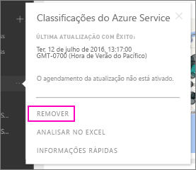

# Remover a ligação a um pacote de conteúdos organizacionais do Power BI

> [!NOTE]
> Os pacotes de conteúdos organizacionais estão a ser preteridos. Agora é uma boa altura para atualizar os seus pacotes de conteúdos para aplicações, se ainda não tiver começado. Para obter a linha cronológica, veja a secção de mapa de objetivos de atualização da área de trabalho desta publicação de blogue [Anúncio de que os administradores do Power BI podem atualizar áreas de trabalho clássicas](https://powerbi.microsoft.com/blog/announcing-power-bi-admins-can-upgrade-classic-workspaces-and-roadmap-update/).
> 

Um colega de trabalho criou um pacote de conteúdos. Descobriu-o no AppSource e adicionou-o à sua área de trabalho do Power BI. Mas já não precisa mais dele.  Como pode removê-lo?

Para remover um pacote de conteúdos, remova o respetivo conjunto de dados.  

* No painel de navegação, selecione o botão de reticências à direita do conjunto de dados e selecione **Remover\> Sim**.  
  
  

Remover o conjunto de dados também remove todos os relatórios e dashboards associados. Contudo, a remoção da ligação ao pacote de conteúdos não elimina o pacote de conteúdos do AppSource da sua organização.  Pode sempre voltar ao AppSource e adicionar o pacote de conteúdos à sua área de trabalho. Só pode [eliminar um pacote de conteúdos do AppSource](service-organizational-content-pack-manage-update-delete.md) se foi quem o criou.

## Próximas etapas
* [Introdução aos pacotes de conteúdos organizacionais](service-organizational-content-pack-introduction.md) 
* [Create and distribute an app in Power BI](service-create-distribute-apps.md) (Criar e distribuir uma aplicação no Power BI) 
* [Conceitos básicos para designers no serviço Power BI](../fundamentals/service-basic-concepts.md)  
* Mais perguntas? [Pergunte à Comunidade do Power BI](https://community.powerbi.com/)
