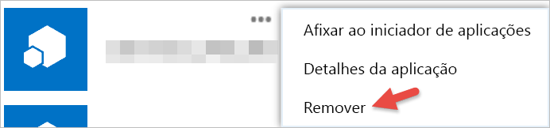

# Introdução com aplicações de terceiros

Com o Power BI, pode utilizar uma aplicação criada por uma empresa ou indivíduo diferente da Microsoft. Por exemplo, pode utilizar uma aplicação de terceiros que integre mosaicos do Power BI numa aplicação Web interna personalizada. Quando utiliza uma aplicação de terceiros, ser-lhe-á pedido que conceda a essa aplicação determinadas permissões para a conta e os recursos do Power BI. É importante que conceda apenas permissões às aplicações que conhece e confia. As permissões para uma aplicação podem ser revogadas em qualquer momento. Consulte [Revogar permissões de aplicações de terceiros](#revoke).

Aqui estão os tipos de acesso que uma aplicação pode pedir.

## Permissões de Aplicação do Power BI

* **Ver todos os dashboards**
  
  * Esta permissão permite a uma aplicação ver todos os dashboards a que tem acesso. Isto inclui dashboards de que é proprietário, que obteve a partir de pacotes de conteúdos, que foram partilhados consigo e que estão em grupos a que pertenceu. A aplicação não pode efetuar quaisquer alterações ao dashboard. Entre outras coisas, esta permissão pode ser utilizada por uma aplicação para incorporar o conteúdo do dashboard nas suas experiências.

* **Ver todos os relatórios**
  
  * Esta permissão permite a uma aplicação ver todos os relatórios a que tem acesso. Isto inclui dashboards de que é proprietário, que obteve a partir de pacotes de conteúdos e que estão em grupos a que pertenceu. Parte da visualização do relatório significa que a aplicação também pode ver os respetivos dados. A aplicação não pode fazer modificações aos relatórios em si. Entre outras coisas, esta permissão pode ser utilizada por uma aplicação para incorporar o conteúdo do relatório nas suas experiências.

* **Ver todos os conjuntos de Dados**
  
  * Esta permissão permite a uma aplicação listar todos os conjuntos de dados aos quais tem acesso. Isto inclui conjuntos de dados de que é proprietário, que obteve a partir de pacotes de conteúdos e que estão em grupos a que pertenceu. Uma aplicação pode ver os nomes de todos os seus conjuntos de dados, bem como a estrutura, incluindo nomes de tabela e coluna. Esta permissão concede direitos para ler os dados num conjunto de dados. A permissão não concede à aplicação direitos para adicionar ou fazer alterações a um conjunto de dados.
* **Ler e escrever todos os conjuntos de dados**
  
  * Esta permissão permite a uma aplicação listar todos os conjuntos de dados aos quais tem acesso. Isto inclui conjuntos de dados de que é proprietário, que obteve a partir de pacotes de conteúdos e que estão em grupos a que pertenceu. Uma aplicação pode ver os nomes de todos os seus conjuntos de dados, bem como a estrutura, incluindo nomes de tabela e coluna. Esta permissão concede direitos para ler e escrever os dados num conjunto de dados. A aplicação também pode criar novos conjuntos de dados ou efetuar alterações aos já existentes. Isto é normalmente utilizado por uma aplicação para enviar dados diretamente para o Power BI.

* **Ver grupos do utilizador**
  
  * Esta permissão permite à aplicação listar todos os grupos dos quais é membro. Pode utilizar esta permissão, juntamente com algumas das outras permissões listados, para ver ou atualizar conteúdos de um grupo específico. A aplicação não pode fazer modificações ao grupo em si.

<a name="revoke"/>

## Revogar permissões de aplicações de terceiros

Pode revogar as permissões de uma aplicação de terceiros ao aceder ao site As Minhas Aplicações do Office 365.

No site **As minhas aplicações do Office 365** , eis como revogar permissões de terceiros:

1. Aceda ao [site As minhas aplicações do Office 365](https://portal.office.com/myapps).

2. Na página **As minhas aplicações** , localize a aplicação de terceiros.

3. Coloque o cursor sobre o mosaico da aplicação, clique no botão **(…)**  e em **Remover** .

   