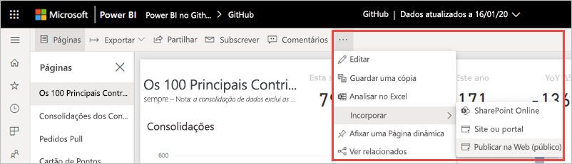
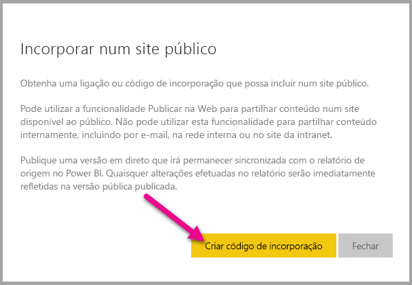
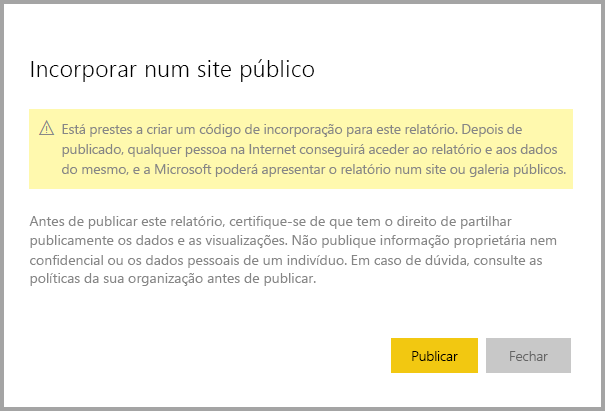
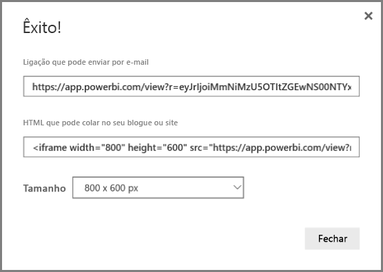
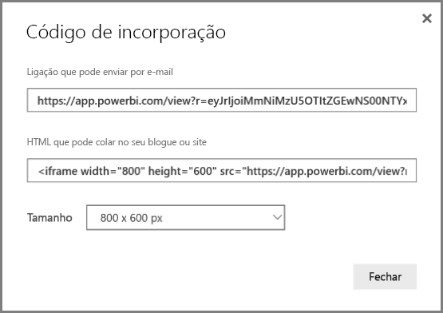
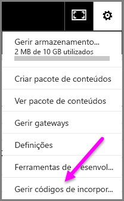
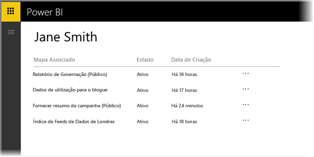
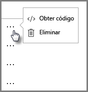
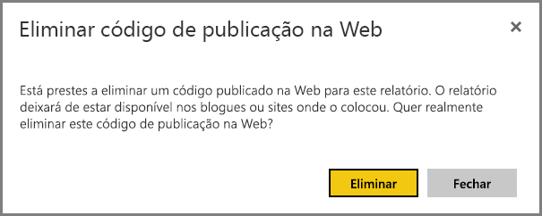

# Publicar na Web do Power BI

Com a opção **Publicar na Web** do Power BI, pode incorporar facilmente conteúdos do Power BI em publicações de blogue, sites, e-mails ou redes sociais. Também pode facilmente editar, atualizar ou parar de partilhar os seus elementos visuais publicados.

> [!WARNING]
> Quando utilizar a funcionalidade **Publicar na Web**, qualquer pessoa poderá ver os seus relatórios ou elementos visuais publicados. A visualização não requer autenticação. Está incluída a visualização de dados detalhados agregados pelos seus relatórios. Antes de publicar um relatório, certifique-se de que pode partilhar os dados e as visualizações publicamente. Não publique informações confidenciais ou proprietárias. Se tiver dúvidas, consulte as políticas da sua organização antes da publicação.

>[!Note]
>Pode incorporar o seu conteúdo de forma segura num portal interno ou num site. Utilize as opções [Incorporar](service-embed-secure.md) ou [Incorporar no SharePoint Online](service-embed-report-spo.md). Estas opções garantem que todas as permissões e a segurança de dados são impostas quando os utilizadores veem os seus dados internos.

## Criar códigos incorporados com a funcionalidade Publicar na Web

A funcionalidade **Publicar na Web** está disponível para relatórios editáveis na sua área de trabalho pessoal ou de grupo.  Não está disponível para relatórios partilhados consigo ou cuja segurança de dados dependa da segurança ao nível da linha. Consulte a secção [**Limitações**](#limitations) para obter uma lista completa dos casos em que a funcionalidade **Publicar na Web** não é suportada. Consulte o **Aviso** indicado anteriormente neste artigo antes de utilizar a funcionalidade **Publicar na Web**.

Os passos seguintes descrevem como utilizar a funcionalidade **Publicar na Web**.

1. Abra um relatório numa área de trabalho que possa editar e selecione **Mais opções (...)**   > **Incorporar** > **Publicar na Web (público)** .

   
   
2. Se o seu administrador do Power BI não lhe concedeu permissão para criar códigos incorporados, poderá ter de o contactar.

   
   
   Para obter ajuda para encontrar a pessoa que pode ativar a funcionalidade Publicar na Web na sua organização, veja [Encontrar o seu administrador do Power BI](#find-your-power-bi-administrator) mais adiante neste artigo.

3. Consulte o conteúdo da caixa de diálogo e selecione **Criar código de incorporação**.

   

4. Consulte o aviso, como aqui mostrado, e certifique-se de que os dados podem ser incorporados num site público. Se sim, selecione **Publicar**.

   

5. Na caixa de diálogo **Êxito**, verá uma pré-visualização do aspeto do relatório. Selecione o **Tamanho** e a **Página predefinida**. 

    Também pode adicionar uma imagem de **Marcador de posição**, para acelerar o carregamento da página Web. Com uma imagem de marcador de posição, as pessoas a aceder ao seu relatório na Web verão um botão **Ver conteúdo interativo** que podem selecionar para verem o próprio relatório. 

    Faça essas alterações em primeiro lugar. Em seguida, copie a ligação para a enviar por e-mail ou copie o HTML e cole-o num site. Pode incorporar a ligação em código, por exemplo, num iFrame, ou colá-la diretamente numa página Web ou num blogue.

   

6. Se já tiver criado um código de incorporação para um relatório e selecionar **Publicar na Web**, não verá as caixas de diálogo nos passos 2-4. Em vez disso, verá a caixa de diálogo **Código de incorporação**.

   

   Só pode criar um código de incorporação para cada relatório.

### Sugestões para os modos de visualização

Normalmente, ao incorporar conteúdos numa publicação de um blogue, é necessário ajustá-los a um tamanho de ecrã específico.  Pode ajustar a altura e largura na etiqueta iFrame, conforme necessário. No entanto, tem de certificar-se de que o seu relatório cabe na área de iFrame fornecida. Assim, defina um Modo de Visualização adequado ao editar o relatório.

A seguinte tabela fornece instruções sobre o Modo de Visualização e a forma como será apresentado quando for incorporado.

| Modo de Visualização | O aspeto que terá quando incorporado |
| --- | --- |
|  |A opção **Ajustar à página** respeita a altura e a largura de página do seu relatório. Se definir a página para proporções *dinâmicas*, como 16:9 ou 4:3, os conteúdos serão dimensionados para caber no iFrame. Quando incorporado num iFrame, utilizar a opção **Ajustar à página** poderá resultar em *letterboxing*: é apresentado um fundo cinzento nas áreas do iFrame após os conteúdos serem ajustados de forma a caber no mesmo. Para minimizar o letterboxing, defina adequadamente a altura e a largura do iFrame. |
|  |A opção **Tamanho real** garante que o relatório mantém o tamanho definido na página de relatórios. Isto poderá originar barras de deslocamento no seu iFrame. Defina a altura e largura do iFrame para evitar as barras de deslocamento. |
|  |A opção **Ajustar à largura** garante que os conteúdos preenchem a área horizontal do iFrame. Continua a ser apresentado um limite, mas os conteúdos ajustam-se de forma a ocupar todo o espaço horizontal disponível. |

### Sugestões para a altura e a largura do iFrame

Um código de incorporação da definição **Publicar na Web** é semelhante ao exemplo seguinte:

 
Pode editar a largura e altura manualmente para garantir um melhor dimensionamento na página em que está a fazer a incorporação.

Para obter um melhor ajuste, experimente adicionar 56 pixéis à altura do iFrame para acomodar o tamanho atual da barra inferior. Se a sua página de relatório utilizar o tamanho dinâmico, a seguinte tabela apresenta alguns tamanhos que pode utilizar para obter um ajuste sem letterboxing.

| Proporção | Tamanho | Dimensão (largura x altura) |
| --- | --- | --- |
| 16:9 |Small |640 x 416 px |
| 16:9 |Média |800 x 506 px |
| 16:9 |Grande |960 x 596 px |
| 4:3 |Pequeno |640 x 536 px |
| 4:3 |Médio |800 x 656 px |
| 4:3 |Grande |960 x 776 px |

## Gerir códigos de incorporação

Depois de criar um código de incorporação **Publicar na Web**, poderá gerir os seus códigos a partir do menu **Definições** no Power BI. A gestão de códigos de incorporação inclui a capacidade de remover o relatório ou elemento visual de destino de um código (tornando o código de incorporação inutilizável) ou de obter o código de incorporação novamente.

1. Para gerir os seus códigos de incorporação da funcionalidade **Publicar na Web**, abra a engrenagem das **Definições** e selecione **Gerir códigos de incorporação**.

   

2. Os seus códigos de incorporação são apresentados.

   

3. Pode obter ou eliminar um código de incorporação. Eliminá-lo desativa todas as ligações para esse relatório ou elemento visual.

   

4. Se selecionar **Eliminar**, ser-lhe-á pedida uma confirmação.

   

## Atualizações a relatórios e atualização de dados

Depois de criar o seu código de incorporação de **Publicar na Web** e partilhá-lo, o relatório será atualizado com as alterações que fizer. A ligação do código de incorporação fica ativa imediatamente. Qualquer pessoa que abra a ligação poderá vê-lo. Os dados são colocados em cache durante uma hora a partir do momento em que são obtidos. Não recomendamos a utilização de Publicar na Web para obter dados que têm de ser atualizados com frequência. Para obter mais informações, consulte a secção [**Como funciona**](#howitworks), mais à frente neste artigo. 

### Atualização de dados

As atualizações de dados são refletidas automaticamente no relatório ou visual incorporado. Quando os dados são atualizados para um modelo de importação de dados no serviço Power BI, o serviço limpa a cache de dados, o que faz com que os dados sejam atualizados rapidamente. Para desativar as atualizações automáticas, selecione **não atualizar** no agendamento do conjunto de dados que o relatório utiliza.  

### Utilização intensiva

Pode ocorrer uma experiência de utilização intensiva quando um relatório recebe demasiadas consultas num curto espaço de tempo. Quando ocorre uma utilização intensiva, os utilizadores não conseguem ver nem interagir com o relatório até o período de utilização intensiva passar. 

Recomendamos que defina uma imagem de marcador de posição para o seu relatório. Se ocorrer uma utilização intensiva, os utilizadores veem a imagem de marcador de posição. 

Para ajudar a evitar uma experiência de utilização intensiva, limite o número de consultas distintas que o seu relatório pode gerar e a frequência da atualização de dados. Veja o [Guia de otimização do Power BI](../guidance/power-bi-optimization.md) para obter sugestões sobre a simplificação dos seus relatórios.

## Elementos Visuais do Power BI

Os elementos visuais do Power BI são suportados na funcionalidade **Publicar na Web**. Ao utilizar a funcionalidade **Publicar na Web**, os utilizadores com quem partilha os elementos visuais publicados não precisam de ativar os elementos visuais do Power BI para ver o relatório.

## Compreender a coluna do estado do código de incorporação

>[!Note]
>Consulte os códigos de incorporação que publicou com frequência. Remova os que já não precisarem de estar disponíveis publicamente.

A página **Gerir códigos de incorporação** inclui uma coluna de estado. Os códigos de incorporação estão predefinidos como **Ativos**, mas também poderá encontrar um dos estados descritos abaixo.

| Estado | Descrição |
| --- | --- |
| **Ativo** |O relatório está disponível para visualização e interação por utilizadores da Internet. |
| **Bloqueado** |O conteúdo do relatório infringe os [Termos de Serviço do Power BI](https://powerbi.microsoft.com/terms-of-service). A Microsoft bloqueou o relatório. Se achar que o bloqueio dos conteúdos foi um erro, contacte o suporte. |
| **Não suportado** |O conjunto de dados do relatório está a utilizar segurança ao nível da linha ou outra configuração não suportada. Consulte a secção [**Limitações**](#limitations) para obter uma lista completa. |
| **Em violação** |O código de incorporação está fora da política de inquilino definida. Normalmente, este estado ocorre quando um código de incorporação foi criado e a definição de inquilino da funcionalidade **Publicar na Web** foi alterada para excluir o utilizador a quem pertence o código de incorporação. Se a definição de inquilino tiver sido desativada ou o utilizador já não tiver permissão para criar códigos de incorporação, os códigos de incorporação existentes apresentarão o estado **Em violação**. Veja a secção [Encontrar o seu administrador do Power BI](#find-your-power-bi-administrator) neste artigo para obter mais detalhes. |

## Comunicar um problema relacionado com conteúdos da funcionalidade Publicar na Web

Para comunicar um problema relacionado com os conteúdos da funcionalidade **Publicar na Web** incorporados num site ou num blogue, selecione o ícone de **Sinalização** na barra inferior do relatório da funcionalidade **Publicar na Web**.

É-lhe pedido que envie um e-mail para a Microsoft a explicar o problema. A Microsoft avalia os conteúdos com base nos [Termos de Serviço do Power BI](https://powerbi.microsoft.com/terms-of-service) e toma as medidas adequadas.

## Licensing

Tem de ser utilizador do Microsoft Power BI para utilizar a funcionalidade **Publicar na Web**. As pessoas que veem o seu relatório não têm de ser utilizadores do Power BI.

## Como funciona (detalhes técnicos)

Quando cria um código de incorporação através da funcionalidade **Publicar na Web**, o relatório fica visível para os utilizadores na Internet. Encontra-se disponível publicamente, pelo que é expectável que os utilizadores partilhem facilmente o relatório através das redes sociais. Os utilizadores veem o relatório se abrirem o URL público direto ou se o virem incorporado numa página Web ou blogue. Quando o fazem, o Power BI coloca em cache a definição do relatório e os resultados das consultas necessárias para ver o relatório. Esta colocação em cache garante que milhares de utilizadores podem ver o relatório em simultâneo, sem afetar o desempenho.

Os dados são colocados em cache durante uma hora a partir do momento em que são obtidos. Se atualizar a definição do relatório (por exemplo, se alterar o Modo de visualização) ou atualizar os dados do relatório, poderá demorar algum tempo para que as alterações se reflitam na versão do relatório vista pelos utilizadores. Quando ocorre uma atualização de dados para um modelo de dados de importação, o serviço limpa os dados em cache e obtém novos dados. Na maioria dos casos, os dados são atualizados quase em simultâneo com a importação dos dados. No entanto, a atualização pode demorar algum tempo em relatórios com muitas consultas distintas. Uma vez que cada elemento e valor de dados é colocado em cache independentemente, quando uma atualização de dados ocorre, um utilizador pode ver uma mistura de valores atuais e anteriores. Por conseguinte, recomendamos que teste o seu trabalho antecipadamente e crie o código de incorporação **Publicar na Web** apenas quando estiver satisfeito com as definições. Se os seus dados se atualizarem, minimize o número de atualizações e execute as atualizações durante horas de inatividade. Não recomendamos a utilização de Publicar na Web para obter dados que têm de ser atualizados com frequência.

## Encontrar o seu administrador do Power BI

O portal de administração do Power BI tem definições que controlam quem pode publicar na Web. Trabalhe em conjunto com o [administrador do Power BI](../admin/service-admin-role.md) da sua organização para alterar as [definições de inquilino da funcionalidade Publicar na Web](../admin/service-admin-portal.md#publish-to-web) no portal de administração.

As organizações mais pequenas ou os indivíduos que se inscreveram no Power BI podem ainda não ter um administrador do Power BI. Siga o nosso [processo para a obtenção de controlo administrativo](/azure/active-directory/users-groups-roles/domains-admin-takeover). Assim que tiver um administrador do Power BI, este pode ativar a criação de códigos incorporados para si.

Geralmente, as organizações estabelecidas já têm um administrador do Power BI. As pessoas em qualquer uma das seguintes funções podem desempenhar o papel de administrador do Power BI:

- Administradores globais
- Utilizadores com a função de administrador do serviço Power BI no Microsoft Azure Active Directory

Precisa de [encontrar uma destas pessoas](/office365/admin/admin-overview/admin-overview#who-has-admin-permissions-in-my-business) na sua organização e pedir-lhes para atualizar as [definições de inquilino da funcionalidade Publicar na Web](../admin/service-admin-portal.md#publish-to-web) no portal de administração.

## Limitações

A funcionalidade **Publicar na Web** é suportada para a grande maioria das origens de dados e relatórios no serviço Power BI. No entanto, os seguintes tipos de relatórios não são atualmente suportados ou não estão disponíveis com a funcionalidade **Publicar na Web**:

- Relatórios com segurança ao nível da linha.
- Relatórios que utilizam qualquer origem de dados de Ligação em Direto, incluindo Tabelas do Analysis Services no local, modelos Multidimensionais do Analysis Services e o Azure Analysis Services.
- Relatórios que utilizam um [conjunto de dados partilhado](../connect-data/service-datasets-across-workspaces.md) armazenado numa área de trabalho diferente da do relatório.
- [Conjuntos de dados partilhados e certificados](../connect-data/service-datasets-share.md).
- Relatórios partilhados diretamente consigo ou através de um pacote de conteúdos organizacionais.
- Relatórios numa área de trabalho na qual não é um membro de edição.
- Os elementos visuais "R" e Python não são atualmente suportados nos relatórios da funcionalidade **Publicar na Web**.
- Exportar dados de elementos visuais num relatório publicado na Web.
- ArcGIS Maps para elementos visuais do Power BI.
- Perguntas e Respostas dos elementos visuais do Power BI.
- Relatórios que contêm medidas DAX ao nível do relatório.
- Modelos de consulta de dados de início de sessão único.
- Informações confidenciais ou proprietárias.
- A capacidade de autenticação automática fornecida com a opção **Incorporar** não funciona com a API de JavaScript do Power BI. Para a API de JavaScript do Power BI, utilize a abordagem [O utilizador detém os dados](../developer/embedded/embed-sample-for-your-organization.md) para incorporar.
- Os administradores podem bloquear o acesso público à Internet, como descrito em [Ligações privadas para aceder ao Power BI](../admin/service-security-private-links.md). Nesse caso, a opção **Publicar na Web** fica inativa no seu inquilino no portal de administração do Power BI. 

## Próximos passos

- [Peça Web de relatórios do SharePoint Online](service-embed-report-spo.md) 

- [Incorporar relatório num site ou portal seguro](service-embed-secure.md)

Mais perguntas? [Pergunte à Comunidade do Power BI](https://community.powerbi.com/)
