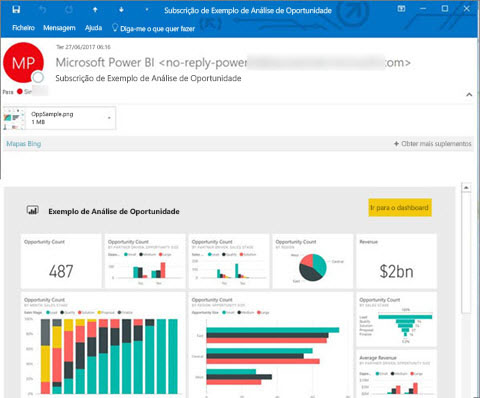
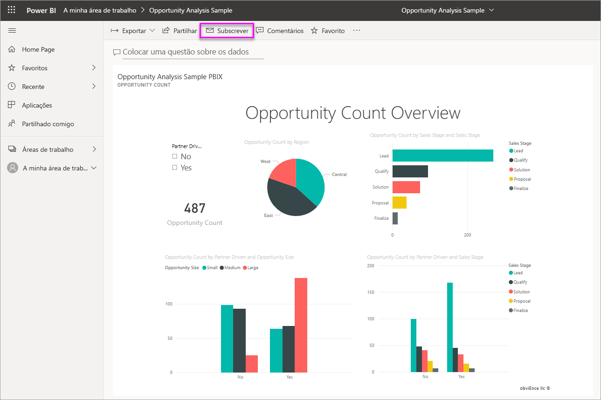
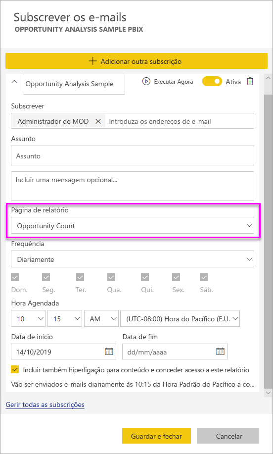
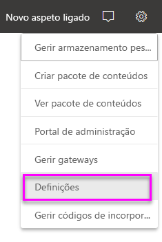
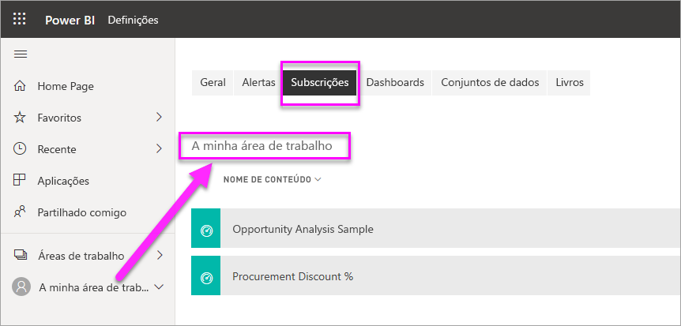

# Subscrever relatórios e dashboards no serviço Power BI para si e para outras pessoas

Pode subscrever as páginas de relatórios, os dashboards e os relatórios paginados mais importantes para si e para os seus colegas. As subscrições de e-mail do Power BI permitem-lhe:

- Decidir a frequência com que quer receber os e-mails: diariamente, semanalmente, mensalmente, de hora a hora ou uma vez por dia depois da atualização de dados inicial.
- Escolher a hora a que quer receber o e-mail, se escolher de hora a hora, diariamente, semanalmente ou mensalmente.
- Configurar 24 subscrições diferentes por relatório ou dashboard do Power BI.  Não existe um limite para o número de subscrições que pode configurar para relatórios paginados.
- Pedir que lhe seja enviado um e-mail com uma imagem do relatório e uma ligação para o relatório no serviço.  Nos dispositivos móveis com aplicações do Power BI instaladas, a seleção desta ligação inicia a aplicação Power BI, em vez de abrir o relatório ou dashboard no site do Power BI.
- Inclui um anexo do relatório completo, se subscrever um relatório paginado.
- Enviar e-mails para utilizadores fora do seu inquilino, se o conteúdo do Power BI estiver alojado numa capacidade Premium.  Os administradores podem controlar o acesso a quem pode enviar subscrições de e-mail a utilizadores externos ao aproveitar as definições de controlo de partilha externa existentes no centro de administração do Power BI.

 

## Requirements

Uma subscrição pode ser **criada** por:

- Utilizadores com uma licença do Power BI Pro 
- Os utilizadores que visualizam o conteúdo numa área de trabalho ou aplicação Premium também podem subscrever os conteúdos aí localizados, mesmo sem uma licença do Power BI Pro. 

Não precisa de permissões de edição para o conteúdo (dashboard ou relatório) para criar uma subscrição para si próprio, mas tem de ter permissões de edição para criar uma subscrição para outra pessoa.

## Subscrever um dashboard, uma página de relatórios ou um relatório paginado

Quer esteja a subscrever um dashboard, um relatório ou um relatório paginado, o processo é semelhante. O mesmo botão permite-lhe subscrever os dashboards e os relatórios do serviço Power BI.

A subscrição de relatórios paginados é ligeiramente diferente. Veja [Subscrever um relatório paginado no serviço Power BI para si e para outras pessoas](../consumer/paginated-reports-subscriptions.md) para obter mais informações.
 
.

1. Abra o dashboard ou o relatório.
2. Na barra de menus superior, selecione **Subscrever** ou selecione o ícone de envelope :::image type="icon" source="media/service-report-subscribe/power-bi-icon-envelope.png" border="false":::.
   
    

1. Utilize o controlo de deslize amarelo para ativar e desativar a subscrição. Definir o controlo de deslize para **Desativado** não elimina a subscrição. Para eliminar a subscrição, selecione o ícone de recipiente do lixo.

2. O seu e-mail já está na caixa **Subscrever** . Também pode adicionar outros endereços de e-mail no mesmo domínio à subscrição. Se o relatório ou dashboard estiver alojado na [capacidade Premium](../admin/service-premium-what-is.md), poderá subscrever outros endereços de e-mail individuais e de aliases de grupo, estejam no seu domínio ou não. Se o relatório ou dashboard não estiver alojado numa capacidade Premium, poderá subscrever outras pessoas, mas estas também terão de ter licenças do Power BI Pro. Para obter detalhes, veja [Considerações e resolução de problemas](#considerations-and-troubleshooting) abaixo.

3. Preencha os detalhes **Assunto** e **Mensagem** do e-mail.

4. Selecione uma **Frequência** para a sua subscrição:  **Diariamente** , **Hora a Hora** , **Semanalmente** , **Mensalmente** ou **Depois da Atualização de Dados (Uma Vez por Dia)** . Para receber o e-mail de subscrição apenas em determinados dias, selecione **Hora a hora** ou **Semanalmente** e selecione os dias em que o pretende receber. Por exemplo, se quiser receber o e-mail de subscrição apenas durante os dias úteis, selecione **Semanalmente** e desselecione as caixas **Sáb** e **Dom** . Se selecionar **Mensalmente** , introduza os dias do mês nos quais quer receber o e-mail de subscrição.

5. Se escolher **Diariamente** , **Hora a Hora** , **Mensalmente** ou **Semanalmente** , também pode escolher uma **Hora Agendada** para a subscrição. Pode definir para que seja executada a cada hora ou a cada 15, 30 ou 45 minutos. Selecione manhã ou tarde/noite. Também pode especificar o fuso horário. Se escolher **Hora a Hora** , selecione a **Hora Agendada** para o início da subscrição e esta será executada a cada hora.

6. Por predefinição, a data de início da sua subscrição é a data em que a criou. Tem a opção de selecionar uma data de fim. Se não definir uma data de fim, esta será definida automaticamente para um ano após a data de início. Pode alterá-la para qualquer data no futuro (até ao ano 9999) em qualquer altura antes de a subscrição terminar. Quando uma subscrição atinge a data de fim, esta é interrompida até que a volte a ativar. Receberá notificações antes da data de fim agendada a perguntar se quer prolongar a subscrição.

    Nas capturas de ecrã abaixo, repare que, na realidade, está a subscrever uma _página_ de relatórios ao subscrever um relatório. Para subscrever mais do que uma página num relatório, selecione **Adicionar outra subscrição** e selecione uma página diferente.
     
      

1. (Opcional) Selecione se quer incluir uma ligação de regresso ao conteúdo no Power BI e se quer conceder aos utilizadores acesso aos conteúdos aos quais os subscreveu.  Se optar por incluir uma ligação, para a melhor experiência, certifique-se de que todos os utilizadores têm acesso ao relatório.
2. Selecione **Guardar e fechar** . Os utilizadores subscritos receberão um e-mail e um instantâneo do dashboard ou da página de relatório com a frequência e na hora que selecionou. Pode criar até 24 subscrições por relatório ou dashboard e pode indicar frequências, horas e destinatários exclusivos para cada subscrição. Todas as subscrições definidas para **Depois da Atualização de Dados** para o dashboard ou relatório só enviarão um e-mail após a primeira atualização agendada.

    > [!NOTE]
    > Se editar a subscrição depois de guardar e fechar, a seleção para conceder aos utilizadores acesso ao conteúdo que está a subscrever está ativada, independentemente das suas seleções anteriores.
    >

    > [!TIP]
    > Quer enviar o e-mail de uma subscrição diretamente ou a pedido a qualquer momento? Selecione **Executar Agora** para as subscrições do dashboard ou relatório que pretende enviar. Verá uma notificação a informar que será enviado um e-mail para todos os utilizadores dessa subscrição específica. Realizar esta ação não conta para o seu limite de 24 execuções de subscrições agendadas por dia e por relatório ou dashboard. Esta ação NÃO irá acionar uma atualização de dados no conjunto de dados subjacente.
    >

## Gerir as subscrições

A subscrição só pode ser gerida pela pessoa que a criou. Existem dois caminhos para gerir as suas subscrições. O primeiro é selecionar **Gerir todas as subscrições** na caixa de diálogo **Subscrever e-mails** (ver passo 4 acima). O segundo é selecionar o ícone de engrenagem do Power BI  na barra de menus superior e selecionar **Definições** .

As subscrições apresentadas dependem da área de trabalho atualmente ativa. Para ver todas as subscrições de uma só vez para todas as áreas de trabalho, certifique-se de que a opção **A Minha Área de Trabalho** está ativa. Para ajudar a compreender as áreas de trabalho, veja [Áreas de Trabalho no Power BI](service-create-workspaces.md).

Uma subscrição termina em qualquer um dos seguintes casos:

- Expiração da licença do Pro.
- O proprietário eliminou o dashboard ou o relatório.
- A conta de utilizador utilizada para criar a subscrição foi eliminada.

Os administradores do Power BI podem utilizar os registos de auditoria do Power BI para visualizar detalhes relativos às subscrições. Estes detalhes incluem:

- Criada Por
- Data de Criação
- Conteúdo Subscrito
- Destinatários
- Frequência
- Modificado Por/
- Data de Modificação

## Considerações e resolução de problemas

### Geral

- Tal como outros produtos de BI, o período que definiu para a sua subscrição começa quando é iniciado o processamento da mesma.  Quando o processamento de relatório é concluído, a subscrição é colocada em fila e é enviada para os destinatários de e-mail.  Esforçamo-nos por processar e entregar as subscrições o mais rapidamente possível. No entanto, quando a procura for mais elevada, por vezes poderá observar um atraso maior devido ao número de subscrições que o Power BI consegue enviar de cada vez. A maioria dos clientes poderá observar um atraso não superior a 15 minutos no processamento e envio dos relatórios. Em determinadas alturas e para inquilinos com uma utilização especialmente elevada, poderá demorar até 30 minutos.  Não esperamos que os eventuais atrasos na entrega ultrapassem os 60 minutos, a partir do momento em que a subscrição é agendada.  Se observar um atraso assim tão grande, primeiro verifique se o endereço `no-reply-powerbi@microsoft.com` se encontra na lista de remetentes seguros do seu fornecedor de e-mail.  Se o e-mail não estiver bloqueado, contacte o suporte do Power BI para obter assistência.
- Atualmente, as subscrições por e-mail para relatórios e dashboards que utilizem conjuntos de dados com ligações em tempo real só são suportadas ao subscrever utilizadores que não o próprio, exceto para relatórios paginados. Pode subscrever outras pessoas num relatório paginado, com o seu contexto de segurança. Saiba mais sobre como [subscrever os relatórios paginados](../consumer/paginated-reports-subscriptions.md).
- O Power BI interrompe automaticamente a atualização nos conjuntos de dados associados a dashboards e relatórios que não tenham sido acedidos durante mais de dois meses. No entanto, se adicionar uma subscrição a um dashboard ou relatório, este não será interrompido, mesmo se não for acedido.
- Se não estiver a receber os e-mails da subscrição:

    - Certifique-se de que o seu Nome Principal de Utilizador (UPN) pode receber e-mails.
    - Embora tenha uma licença do Power BI Pro, é possível que não tenha uma licença do Microsoft Exchange. Caso não tenha, a sua conta do Azure Active Directory poderá não ter um e-mail ou um endereço de e-mail alternativo especificado. Nesse caso, embora a subscrição pareça ser enviada, acabará por não receber uma cópia.  Se o seu administrador do Power BI atribuir um endereço de email, o Power BI irá sincronizar a atualização da próxima vez que iniciar sessão e utilizará esse endereço de email para a subscrição.

- Se o dashboard ou relatório estiver em capacidade Premium, pode utilizar aliases de e-mail de grupo para subscrições, em vez de subscrever colegas individualmente através dos endereços de e-mail. Os aliases são baseados no Active Directory atual.
- Se os seus conteúdos não se encontrarem numa capacidade Premium, apenas os utilizadores do Power BI Pro poderão receber subscrições por e-mail. 
- Atualmente, as subscrições não suportam a utilização de marcadores.
- A opção para permitir o acesso ao relatório/dashboard é sempre apresentada como ativada ao editar uma subscrição existente.  Se desselecionar esta opção e guardar a subscrição, esse estado será guardado. No entanto, a opção será marcada por predefinição se editar novamente o relatório.
- Se tiver um endereço de e-mail alternativo, mas não tiver um principal, o Power BI irá utilizar o alternativo para enviar a subscrição.

### Dashboards

- É possível que os dashboards com mais de 25 mosaicos afixados ou mais de 4 páginas de relatórios dinâmicos afixadas não sejam apresentados por inteiro nos e-mails de subscrição enviados para os utilizadores. As subscrições de dashboards que ultrapassarem estes números de mosaicos não serão bloqueadas. No entanto, se tiver problemas, estas não terão suporte. Pondere modificá-las para ficar dentro de um intervalo suportado.
- Em ocasiões raras, as subscrições de e-mail poderão demorar mais de 15 minutos a serem entregues aos destinatários. Se for o caso, recomendamos que execute a atualização de dados e a subscrição de e-mail separadamente para assegurar uma entrega atempada. Se o problema persistir, contacte o suporte do Power BI.
- Para subscrições de e-mail do dashboard, se um mosaico tiver segurança ao nível da linha (RLS) aplicada, o mesmo não será apresentado.
- Para subscrições de dashboards, determinados tipos de mosaicos ainda não são suportados. Estes incluem: transmissão em fluxo de mosaicos, mosaicos de vídeos e mosaicos de conteúdo Web personalizados.
- Se partilhar um dashboard com um colega fora do seu inquilino, também não poderá criar uma subscrição para esse colega, *a não ser que* o dashboard esteja numa aplicação ou área de trabalho Premium. Por isso, se for `aaron@contoso.com`, poderá partilhar com `anyone@fabrikam.com`, mas ainda não poderá subscrever `anyone@fabrikam.com` e o mesmo não poderá subscrever o conteúdo partilhado.

### Relatórios

- Para subscrições de e-mail do relatório, se o conjunto de dados utilizar RLS, poderá criar uma subscrição para si próprio. Não pode subscrever outras pessoas num relatório com segurança ao nível da linha (RLS) aplicada, exceto em relatórios paginados. Pode subscrever outras pessoas num relatório paginado, com o seu contexto de segurança. Saiba mais sobre como [subscrever os relatórios paginados](../consumer/paginated-reports-subscriptions.md).
- As subscrições de páginas de relatório estão associadas ao nome da página de relatório. Se subscrever uma página de relatório e, em seguida, mudar o nome da mesma, terá de voltar a criar a sua subscrição.
- A sua organização pode configurar determinadas definições no Azure Active Directory que podem limitar a capacidade de utilizar as subscrições de e-mail no Power BI. Estas limitações incluem, mas não se limitam a, ter uma autenticação multifator ou restrições de intervalos de IP quando se acede a recursos.
- As subscrições de e-mail não suportam a maioria dos [elementos visuais personalizados](../developer/visuals/power-bi-custom-visuals.md). A única exceção são os elementos visuais personalizados que foram [certificados](../developer/visuals/power-bi-custom-visuals-certified.md).
- Neste momento, as subscrições de e-mail não suportam elementos visuais personalizados baseados em R.
- As subscrições por e-mail são enviadas com as estatísticas de filtro e segmentação de dados predefinidas do relatório. Quaisquer alterações às predefinições efetuadas depois da subscrição não irão aparecer no e-mail. Os Relatórios paginados suportam esta funcionalidade e permitem-lhe definir os valores de parâmetros específicos por subscrição.
- Imagine que tem um relatório com uma ligação em direto ao Analysis Services e tem a subscrição definida para executar após a atualização de dados. Será executada da primeira vez que o serviço Power BI detetar uma alteração no modelo no local quando consultar a instância do Analysis Services.  O Power BI verifica hora a hora a existência de uma alteração no modelo de dados do Analysis Services para determinar quando deve enviar a subscrição.

## Próximos passos

- [Subscrever um relatório paginado no serviço Power BI para si e para outras pessoas](../consumer/paginated-reports-subscriptions.md)
- Mais perguntas? [Experimente perguntar à Comunidade do Power BI](https://community.powerbi.com/)    
- [Ler a mensagem de blogue](https://powerbi.microsoft.com/blog/introducing-dashboard-email-subscriptions-a-360-degree-view-of-your-business-in-your-inbox-every-day/)
