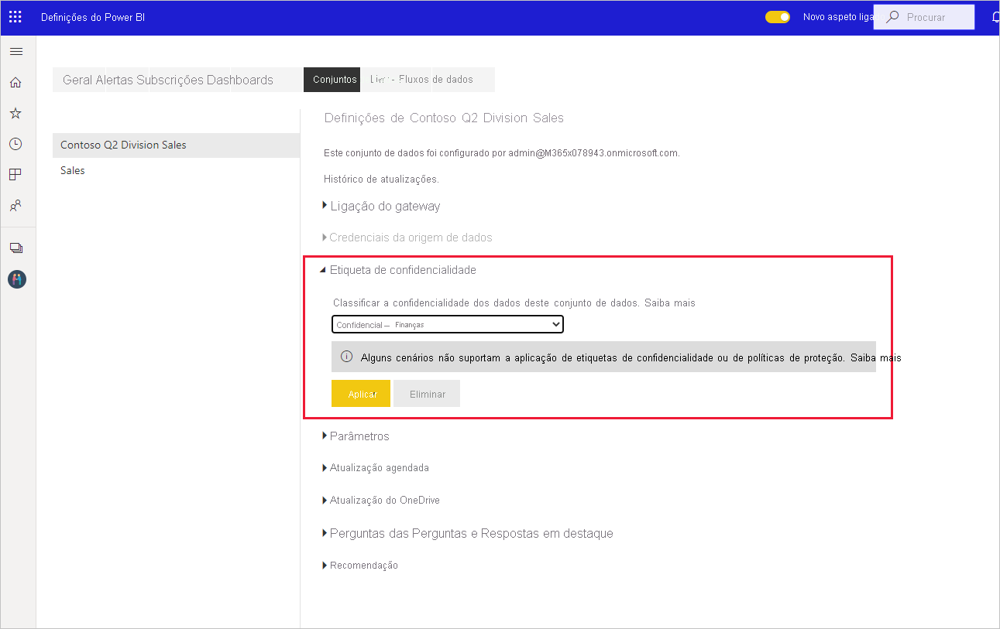
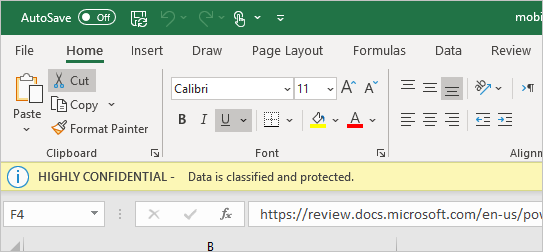

# Aplicar etiquetas de confidencialidade dos dados no Power BI

As etiquetas de confidencialidade da Proteção de Informações da Microsoft para os seus relatórios, dashboards, conjuntos de dados e fluxos de dados podem proteger o seu conteúdo confidencial contra o acesso não autorizado a dados e a fuga de dados. Se etiquetar os seus dados corretamente com etiquetas de confidencialidade dos dados, garante que apenas as pessoas autorizadas podem aceder aos seus dados. Este artigo mostra como pode aplicar etiquetas de confidencialidade ao seu conteúdo.

Para conseguir aplicar etiquetas de confidencialidade no Power BI:
* Tem de ter uma licença do Power BI Pro e permissões de edição em relação ao conteúdo que pretende etiquetar.
* O utilizador tem de pertencer a um grupo de segurança que tenha permissões para aplicar etiquetas de confidencialidade dos dados, conforme descrito no artigo intitulado [Ativar etiquetas de confidencialidade de dados no Power BI](../admin/service-security-enable-data-sensitivity-labels.md#enable-data-sensitivity-labels).
* Todos os [pré-requisitos](../admin/service-security-data-protection-overview.md#requirements-for-using-sensitivity-labels-in-power-bi) e os [requisitos de licenciamento](../admin/service-security-data-protection-overview.md#licensing) têm de ser cumpridos.

Para obter mais informações sobre as etiquetas de confidencialidade de dados no Power BI, consulte a [Descrição geral da proteção de dados no Power BI](../admin/service-security-data-protection-overview.md).

## Aplicar etiquetas de confidencialidade

Quando a proteção de dados estiver ativada no seu inquilino, as etiquetas de confidencialidade aparecem na coluna de confidencialidade na vista de lista dos dashboards, relatórios, conjuntos de dados e fluxos de dados.

**Para aplicar ou alterar uma etiqueta de confidencialidade num relatório ou dashboard**
1. Clique em **Mais opções (...)** .
1. Selecione **Definições**.
1. No painel lateral das definições, selecione a etiqueta de confidencialidade adequada.
1. Guarde as definições.

A imagem seguinte ilustra estes passos num relatório

**Para aplicar ou alterar uma etiqueta de confidencialidade num conjunto de dados ou fluxo de dados**

1. Clique em **Mais opções (...)** .
1. Selecione **Definições**.
1. No painel lateral das definições, selecione a etiqueta de confidencialidade adequada.
1. Aplique as definições.

As duas imagens seguintes ilustram estes passos num conjunto de dados.

Selecione **Mais opções (...)** e, em seguida, **Definições**.

Na página das definições, abra a secção da etiqueta de confidencialidade, selecione a etiqueta de confidencialidade pretendida e clique em **Aplicar**.

## Remover etiquetas de confidencialidade
Para remover uma etiqueta de confidencialidade de um relatório, dashboard, conjunto de dados ou fluxo de dados, siga o [mesmo procedimento que é utilizado para aplicar etiquetas](#applying-sensitivity-labels), mas selecione **(Nenhum)** quando lhe for pedido para classificar a confidencialidade dos dados. 

## Proteção de dados em ficheiros exportados

A proteção de dados associada às etiquetas de confidencialidade aplica-se aos dados apenas quando são exportados para ficheiros do Excel, PowerPoint ou PDF. Não é suportada para a funcionalidade Analisar no Excel, a exportação para .cvs, as transferências de conjuntos de dados (.pbix), o Live Connect do Serviço Power BI ou qualquer outro formato de exportação. As opções de exportação de dados são controladas pelas [definições de exportação](../service-admin-portal.md#export-and-sharing-settings) do administrador de inquilinos do Power BI.

Quando [exportar dados de um relatório](https://docs.microsoft.com/power-bi/consumer/end-user-export) que tenha uma etiqueta de confidencialidade para um ficheiro do Excel, PowerPoint ou PDF, a etiqueta de confidencialidade será herdada pelo ficheiro gerado. A etiqueta de confidencialidade fica visível no ficheiro e o acesso ao ficheiro fica restrito a quem tiver permissões suficientes.

## Considerações e limitações

A lista seguinte fornece algumas limitações de etiquetas de confidencialidade no Power BI:

**Geral**
* As etiquetas de confidencialidade só podem ser aplicadas em dashboards, relatórios, conjuntos de dados e fluxos de dados. Atualmente, não estão disponíveis para [relatórios paginados](../paginated-reports/report-builder-power-bi.md) e livros.
* As etiquetas de confidencialidade em recursos do Power BI estão visíveis nas vistas de lista de áreas de trabalho, linhagem, favoritos, recentes e aplicações. Neste momento, as etiquetas não estão visíveis na vista "partilhado comigo". No entanto, repare que uma etiqueta aplicada a um recurso do Power BI, mesmo que não esteja visível, persiste sempre nos dados exportados para ficheiros Excel, PowerPoint e PDF.
* As etiquetas de confidencialidade só são suportadas para inquilinos na cloud (pública) global. As etiquetas de confidencialidade não são suportadas para inquilinos noutras clouds.
* As etiquetas de confidencialidade de dados não são suportadas para aplicações de modelo. As etiquetas de confidencialidade definidas pelo criador de aplicações de modelo serão removidas quando a aplicação é extraída e instalada e as etiquetas de confidencialidade adicionadas a artefactos numa aplicação de modelo instalada pelo consumidor de aplicações serão perdidas (repostas a zero) quando a aplicação é atualizada.
* O Power BI não suporta etiquetas de confidencialidade dos tipos de proteção [Não Reencaminhar](https://docs.microsoft.com/microsoft-365/compliance/encryption-sensitivity-labels?view=o365-worldwide#let-users-assign-permissions), [definido pelo utilizador](https://docs.microsoft.com/microsoft-365/compliance/encryption-sensitivity-labels?view=o365-worldwide#let-users-assign-permissions) e [HYOK](https://docs.microsoft.com/azure/information-protection/configure-adrms-restrictions). Os tipos de proteção Não Reencaminhar e definido pelo utilizador fazem referência a etiquetas definidas no [centro de segurança do Microsoft 365](https://security.microsoft.com/) ou no [centro de conformidade do Microsoft 365](https://compliance.microsoft.com/).

**Exportação**
* Os controlos de proteção e etiquetas são impostos apenas quando os dados são exportados para ficheiros do Excel, PowerPoint ou PDF. Os controlos de proteção e etiquetas não são impostos quando os dados são exportados para ficheiros .csv ou .pbix, para a funcionalidade Analisar no Excel ou qualquer outro caminho de exportação.
* Aplicar uma etiqueta de confidencialidade e proteção a um ficheiro exportado não adiciona marcação de conteúdo ao ficheiro. No entanto, se a etiqueta for configurada para aplicar marcações de conteúdo, estas são automaticamente aplicadas pelo cliente de etiquetagem unificada do Azure Information Protection quando o ficheiro é aberto em aplicações de ambiente de trabalho do Office. As marcações de conteúdo não são aplicadas automaticamente quando utiliza a etiquetagem incorporada para computadores, dispositivos móveis ou aplicações Web. Para obter mais detalhes, consulte [When Office apps apply content marking and encryption](https://docs.microsoft.com/microsoft-365/compliance/sensitivity-labels-office-apps?view=o365-worldwide#when-office-apps-apply-content-marking-and-encryption) (Quando é que as aplicações do Office aplicam marcação de conteúdo e encriptação).
* Um utilizador que exporte um ficheiro do Power BI tem permissões para aceder a e editar esse ficheiro de acordo com as definições das etiquetas de confidencialidade. Um utilizador que exporte os dados não obtém permissões de proprietário em relação ao ficheiro.
* A exportação irá falhar se uma etiqueta não puder ser aplicada quando os dados forem exportados para um ficheiro. Para verificar se a exportação falhou porque a etiqueta não podia ser aplicada, clique no nome do relatório ou dashboard no centro da barra de título e verifique se diz "Não é possível carregar a etiqueta de confidencialidade" no menu pendente informativo que é aberto. Isto pode acontecer se o administrador de segurança tiver eliminado ou anulado a publicação da etiqueta aplicada ou como resultado de um problema temporário do sistema.

## Próximos passos

Este artigo descreveu como aplicar etiquetas de confidencialidade dos dados no Power BI. Os seguintes artigos fornecem mais detalhes sobre a proteção de dados no Power BI. 

* [Overview of data protection in Power BI](../admin/service-security-data-protection-overview.md) (Descrição geral da proteção de dados no Power BI)
* [Ativar etiquetas de confidencialidade de dados no Power BI](../admin/service-security-enable-data-sensitivity-labels.md)
* [Utilizar controlos do Microsoft Cloud App Security no Power BI](../admin/service-security-using-microsoft-cloud-app-security-controls.md)