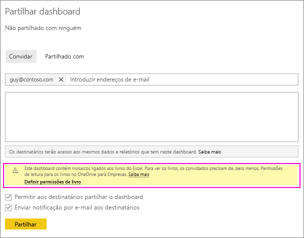
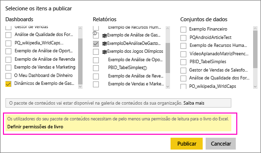
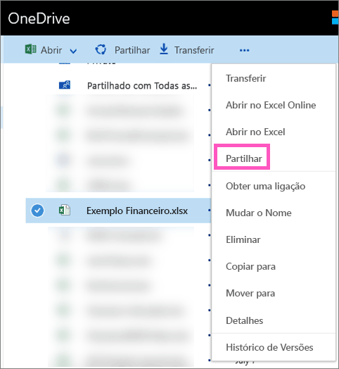

# Partilhar um dashboard do Power BI associado a um ficheiro do Excel no OneDrive
No Power BI, pode [ligar a livros do Excel no OneDrive para Empresas](../connect-data/service-excel-workbook-files.md) e afixar mosaicos a um dashboard desse livro. Quando partilha esse dashboard ou cria um pacote de conteúdos que o inclui:

* Os seus colegas podem ver os mosaicos sem precisarem de permissões para o respetivo livro. Por isso, pode criar um pacote de conteúdos e saber que os seus colegas podem ver os mosaicos criados no livro do Excel no OneDrive.
* Clicar no mosaico abre o livro no Power BI. O livro apenas será aberto se os seus colegas tiverem, pelo menos, [permissões de leitura](https://support.office.com/article/Share-documents-or-folders-in-Office-365-1fe37332-0f9a-4719-970e-d2578da4941c) para o livro no OneDrive para Empresas.

## Partilhar um dashboard que contém mosaicos do livro
Para partilhar um dashboard associado a um livro do Excel no OneDrive para Empresas, veja [Partilhar um dashboard](service-share-dashboards.md). A diferença é que tem a opção de modificar as permissões do livro do Excel associado antes da partilha.

  

1. Insira os endereços de e-mail dos seus colegas.
2. Para permitir que os seus colegas vejam o livro do Excel no Power BI, selecione **Ir para OneDrive para Empresas para definir permissões de livro**.
3. No OneDrive, [modifique as permissões](https://support.office.com/article/Share-files-and-folders-and-change-permissions-9fcc2f7d-de0c-4cec-93b0-a82024800c07) conforme necessário.
4. Selecione **Partilhar**.

>[!NOTE]
>Os seus colegas não conseguirão afixar mosaicos adicionais desse livro nem fazer alterações ao livro do Excel a partir do Power BI.
> 
> 

## Criar um pacote de conteúdos organizacional com um dashboard que contenha mosaicos do livro
Quando [publica um pacote de conteúdos](service-organizational-content-pack-create-and-publish.md), fornece acesso a colegas individuais ou grupos. Quando publica um pacote de conteúdos com ligações a livros, tem a opção de modificar as permissões do livro do Excel associado antes da publicação.

1. No ecrã **Criar pacote de conteúdos**, introduza os endereços de e-mail, dê um título e uma descrição ao pacote de conteúdos e carregue uma imagem.
2. Selecione o dashboard e/ou um relatório associado ao livro do Excel no OneDrive para Empresas.
   
    
3. Selecione **Ir para OneDrive para Empresas para definir permissões de livro**.
4. No OneDrive, [modifique as permissões](https://support.office.com/article/Share-files-and-folders-and-change-permissions-9fcc2f7d-de0c-4cec-93b0-a82024800c07) conforme necessário.
5. Selecione **Publicar**.

## Partilhar um dashboard a partir de uma área de trabalho do Power BI
A partilha de um dashboard a partir de uma área de trabalho do Power BI é semelhante à partilha de um dashboard a partir da sua própria área de trabalho, exceto os ficheiros estarem localizados num site da área de trabalho do Microsoft 365, em vez de estarem no OneDrive para Empresas privado. Modifique as permissões do livro do Excel antes de partilhar o dashboard com pessoas fora da área de trabalho.

## Próximos passos
* [Afixar um mosaico a um dashboard do Power BI a partir do Excel](../create-reports/service-dashboard-pin-tile-from-excel.md)
* [Conceitos básicos para designers no serviço Power BI](../fundamentals/service-basic-concepts.md)
* Mais perguntas? [Pergunte à Comunidade do Power BI](https://community.powerbi.com/)
