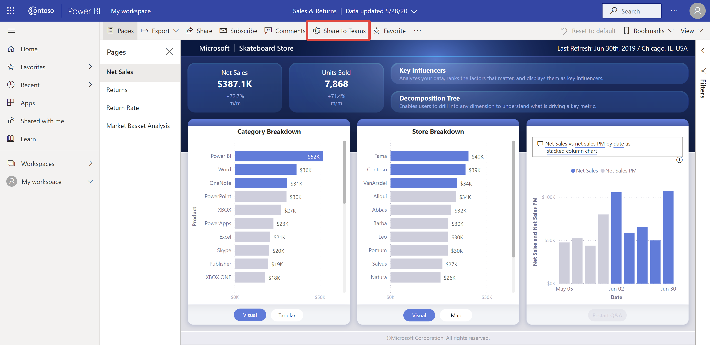
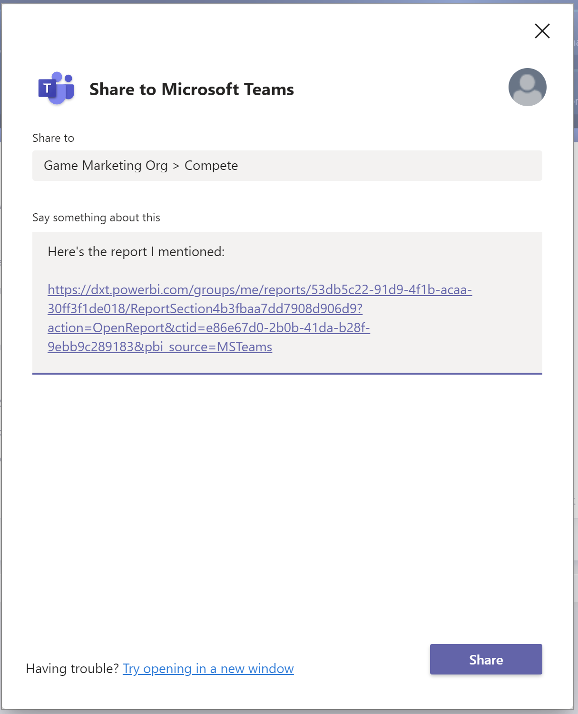

# Conversar no Microsoft Teams diretamente do serviço Power BI

Pode conversar sobre dashboards, relatórios e elementos visuais do Power BI diretamente para o Microsoft Teams a partir do serviço Power BI. Utilize a funcionalidade **Conversar no Teams** para iniciar rapidamente conversas quando vê relatórios e dashboards no serviço Power BI.

## Requirements

Para utilizar a funcionalidade **Conversar no Teams** no Power BI, certifique-se de que o administrador do Power BI não desativou a definição de inquilino **Partilhar no Teams** no portal de administração do Power BI. Esta definição permite que as organizações ocultem os botões **Conversar no Teams**. Para obter mais detalhes, veja o artigo do [portal de administração do Power BI](../admin/service-admin-portal.md#share-to-teams).

Veja [Colaborar no Microsoft Teams com o Power BI](service-collaborate-microsoft-teams.md) para obter informações sobre como o Power BI e o Microsoft Teams funcionam em conjunto, incluindo outros requisitos.

## Conversar sobre os conteúdos do Power BI no Microsoft Teams

Siga estes passos para partilhar ligações para relatórios, dashboards e elementos visuais no serviço Power BI e converse sobre os canais e chats do Microsoft Teams.

1. Selecione uma das seguintes opções:

   * **Conversar no Teams** na barra de ação de um dashboard ou relatório:

       
    
   * **Conversar no Teams** no menu de contexto de um único elemento visual:
    
      

1. Na caixa de diálogo **Partilhar no Microsoft Teams**, selecione a equipa ou o canal para onde quer enviar a ligação. Se preferir, pode introduzir uma mensagem. Primeiro, pode ser-lhe pedido para iniciar sessão no Microsoft Teams.

    

1. Selecione **Partilhar** para enviar a ligação.
    
1. A ligação é adicionada às conversas existentes ou inicia um novo chat.

    

1. Selecione a ligação para abrir o item no serviço Power BI.

1. Se utilizar o menu contextual de um elemento visual específico, este será realçado quando o relatório for aberto.

    

## Limitações e problemas conhecidos

- Os utilizadores sem uma licença do Power BI ou permissão para aceder ao relatório verão uma mensagem a indicar “Conteúdo não disponível”.
- Os botões **Conversar no Teams** poderão não funcionar se o browser utilizar definições de privacidade rigorosas. Utilize a opção **Continua a ter problemas? Tente abrir numa nova janela** se a caixa de diálogo não abrir corretamente.
- **Conversar no Teams** não inclui uma pré-visualização de ligação.
- As pré-visualizações de ligações e **Conversar no Teams** não dão permissão aos utilizadores para ver o item. As permissões têm de ser geridas separadamente.
- O botão **Conversar no Teams** não está disponível nos menus de contexto do elemento visual quando um autor de relatório define **Mais opções** como **Desativado** para o elemento visual.
- Para outros problemas, veja a secção [Limitações e problemas conhecidos](service-collaborate-microsoft-teams.md#known-issues-and-limitations) do artigo "Colaborar no Microsoft Teams".

## Próximos passos

- [Colaborar no Microsoft Teams com o Power BI](service-collaborate-microsoft-teams.md)

Mais perguntas? [Experimente perguntar à Comunidade do Power BI](https://community.powerbi.com/).
