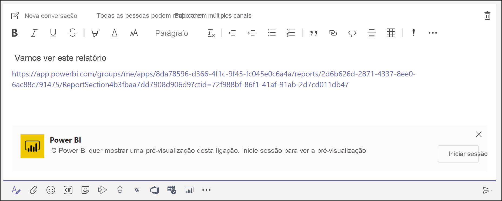
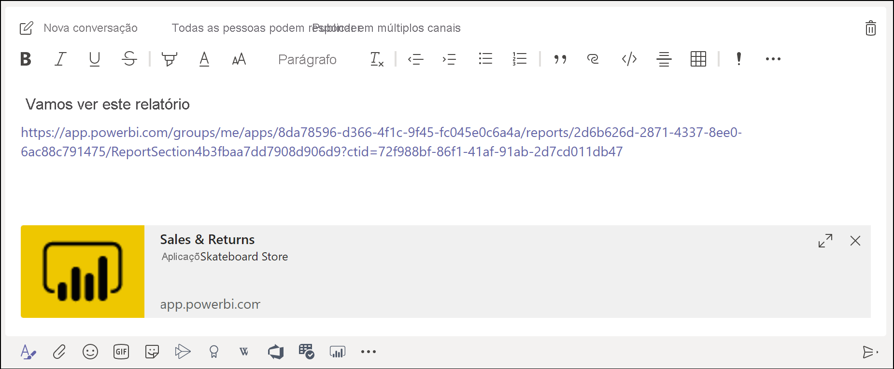
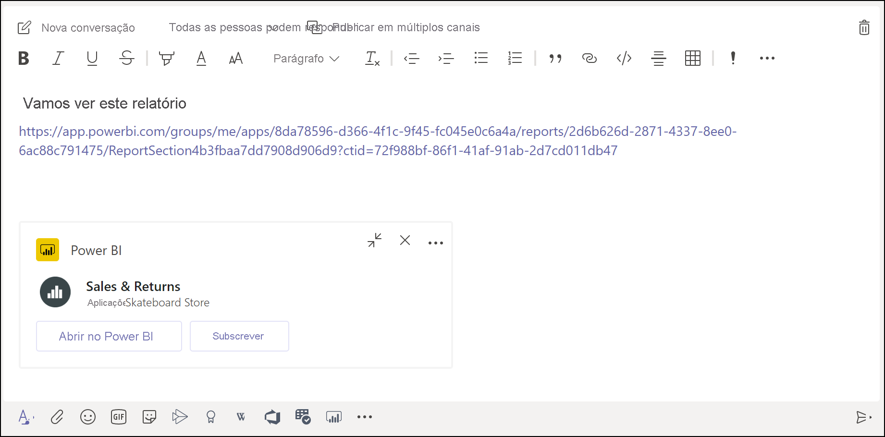

# Obter uma pré-visualização da ligação do Power BI no Microsoft Teams

Quando cola uma ligação para os relatórios, dashboards e aplicações na caixa de mensagens do Microsoft Teams, a pré-visualização da ligação mostra informações sobre a mesma. São fornecidas pré-visualizações de ligações para os seguintes itens no Power BI:

- Relatórios
- Dashboards
- Aplicações

O serviço de pré-visualização da ligação exige que os seus utilizadores iniciem sessão. Para terminar sessão, selecione o ícone do **Power BI** na parte inferior da caixa de mensagens. Em seguida, selecione **Terminar sessão**.

Veja [Colaborar no Microsoft Teams com o Power BI](service-collaborate-microsoft-teams.md) para obter informações sobre como o Power BI e o Microsoft Teams funcionam em conjunto, incluindo os requisitos que precisa de cumprir.

## Obter uma pré-visualização da ligação

Siga estes passos para obter uma pré-visualização da ligação para conteúdos no serviço Power BI.

1. Copie uma ligação para um relatório, dashboard ou aplicação no serviço Power BI. Por exemplo, copie a ligação da barra de endereço do browser.

1. Cole a ligação na caixa de mensagens do Microsoft Teams. Inicie sessão no serviço de pré-visualização da ligação se tal lhe for pedido. Poderá ter de aguardar alguns segundos para que a pré-visualização da ligação seja carregada.

    

1. A pré-visualização da ligação básica é apresentada depois de iniciar sessão com êxito.

    

1. Selecione o ícone **Expandir** para o cartão de pré-visualização avançado ser apresentado.

    

1. O cartão de pré-visualização da ligação avançado mostra a ligação e os botões de ação relevantes.

    

1. Envie a mensagem.

## Limitações e problemas conhecidos

- O serviço de pré-visualização da ligação não suporta o início de sessão único.
- As pré-visualizações de ligações não funcionam em chats de reuniões ou canais privados.
- Para outros problemas, veja a secção [Limitações e problemas conhecidos](service-collaborate-microsoft-teams.md#known-issues-and-limitations) do artigo "Colaborar no Microsoft Teams".

## Próximos passos

- [Colaborar no Microsoft Teams com o Power BI](service-collaborate-microsoft-teams.md)

Mais perguntas? [Experimente perguntar à Comunidade do Power BI](https://community.powerbi.com/).
