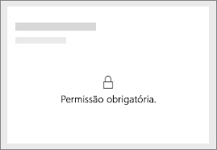
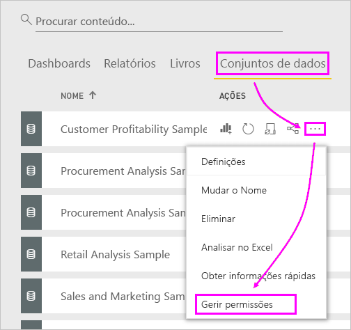
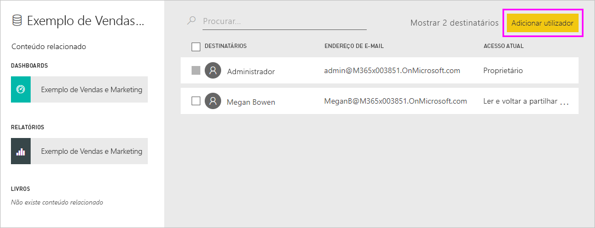
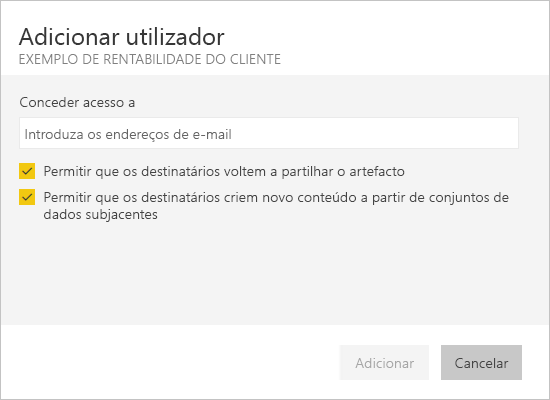
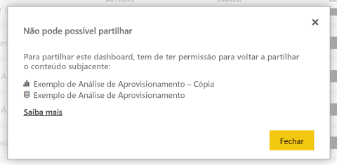

# Resolver problemas de partilha de dashboards e relatórios

Veja a seguir alguns problemas comuns que podem surgir quando partilha um dashboard ou relatório, ou quando alguém está a partilhar consigo. 

## Os destinatários do dashboard veem um ícone de bloqueio num mosaico

As pessoas com quem partilha vêm um ícone de cadeado num dashboard ou a mensagem "Permissão necessária" quanto tentam ver um relatório.

Se for o caso, terá de lhes conceder permissão para o conjunto de dados subjacente.

1. Aceda ao separador **Conjuntos de dados** na sua lista de conteúdos.

1. Selecione as reticências ( **...** ) junto ao conjunto de dados e, em seguida, selecione **Gerir permissões**.

    

1. Selecione **Adicionar utilizador**.

    

1. Introduza os endereços de e-mail completos de pessoas, grupos de distribuição ou grupos de segurança. Não pode partilhar com listas de distribuição dinâmicas.

    

1. Selecione **Adicionar**.

## Não consigo partilhar um dashboard nem um relatório

Para partilhar um dashboard ou relatório, precisa de permissão para voltar a partilhar os conteúdos subjacentes, ou seja, relatórios e conjuntos de dados relacionados. Se lhe for apresentada uma mensagem a informar que não pode partilhar, peça ao autor do relatório que lhe conceda permissão para voltar a partilhar esses relatórios e conjuntos de dados.

## Não tenho acesso a um dashboard ou relatório

Se vir uma mensagem “Pedir acesso” quando seleciona a ligação de um relatório ou dashboard, não terá permissão de visualização. Tem de [pedir o acesso](service-request-access.md).

## Próximos passos

- [Partilhar dashboards e relatórios do Power BI com colegas e outras pessoas](service-share-dashboards.md)
- [Como devo colaborar e partilhar os meus dashboards e relatórios?](service-how-to-collaborate-distribute-dashboards-reports.md)
-  [Partilhar um relatório do Power BI filtrado](service-share-reports.md)
- Perguntas? [Pergunte à Comunidade do Power BI](https://community.powerbi.com/)
