# Atualizar as áreas de trabalho clássicas para as novas áreas de trabalho no Power BI

Este artigo explica como atualizar ou *migrar* uma área de trabalho clássica para a nova experiência de área de trabalho. Pode atualizar qualquer área de trabalho clássica. As novas áreas de trabalho têm funções de área de trabalho mais granulares, para que possa gerir melhor o acesso ao conteúdo. Tem também maior flexibilidade para gerir as áreas de trabalho atualizadas, uma vez que estão ligadas mais livremente ao grupo original do Microsoft 365. Saiba mais sobre a [nova experiência de área de trabalho](service-new-workspaces.md).

>[!NOTE]
>A atualização da área de trabalho está disponível como uma Pré-visualização Pública. 

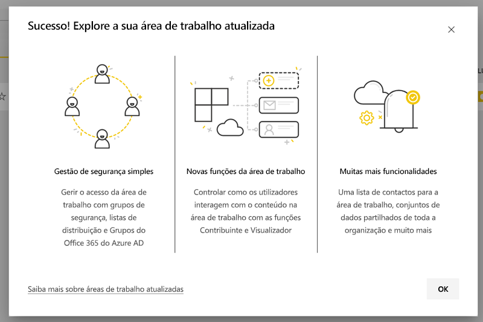

No entanto, deverá ter conhecimento de que a área de trabalho poderá sofrer algumas alterações, pelo que devem ser planeadas. Por exemplo, os pacotes de conteúdos não estão disponíveis na nova experiência de área de trabalho. Veja a seção [Considerações e limitações da atualização](#upgrade-considerations-and-limitations), mais adiante neste artigo.

## Coisas a realizar após a atualização

Deve fazer várias coisas *depois* de atualizar. É melhor planeá-las *antes* da atualização:
- Analise a lista de acesso e compreenda as [permissões após a atualização](#permissions-after-upgrade).
- Analise a [lista de contactos](#modify-the-contact-list) e confirme que está definida como desejado.
- Se ainda não o fez, saiba mais sobre a [nova experiência de área de trabalho](service-new-workspaces.md).

## Atualizar uma área de trabalho clássica

Qualquer administrador da área de trabalho pode atualizar a área de trabalho. Nas áreas de trabalho clássicas, para ser administrador da área de trabalho, deve ser Proprietário do grupo do Microsoft 365 subjacente. Para atualizar uma área de trabalho, siga estes passos.

1. Na lista de conteúdos da área de trabalho, selecione **Mais opções** ( **...** ) > **Editar esta área de trabalho**.

    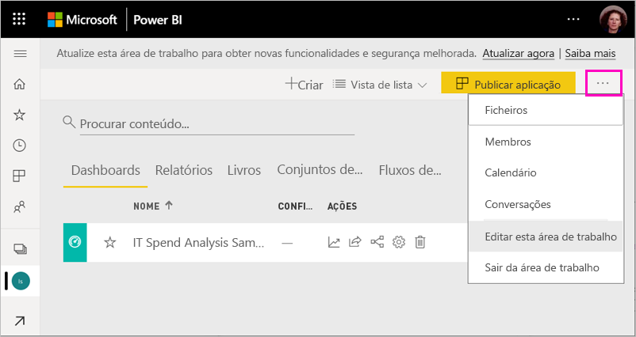

1. Expanda **Avançado** e selecione **Atualizar agora**.

    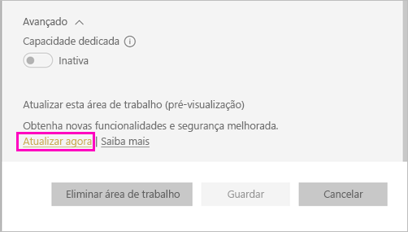

1. Analise as informações na caixa de diálogo. Serão apresentados avisos caso tenha publicado ou instalado pacotes de conteúdos na área de trabalho. Quando estiver pronto, marque **Estou pronto para atualizar esta área de trabalho** e selecione **Atualizar**.

    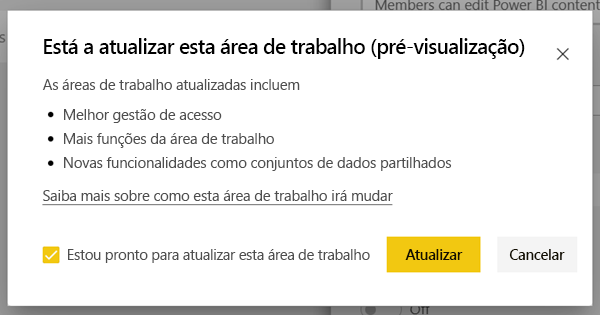

2. Durante a atualização, é apresentada a mensagem **A atualizar**. Normalmente, a atualização da área de trabalho demora menos de um minuto.

1. Após a conclusão da atualização, é apresentada a caixa de diálogo **Êxito**. É recomendável ler [Organizar o trabalho nas novas áreas de trabalho no Power BI](service-new-workspaces.md) para que se possa familiarizar com o modo como as novas áreas de trabalho diferem das áreas de trabalho clássicas.

### Impacto nos outros utilizadores da área de trabalho

É recomendável atualizar fora do horário laboral quando poucos utilizadores estiverem ativamente a visualizar ou a editar itens na área de trabalho.

Os utilizadores que estejam a utilizar ativamente a área de trabalho deverão a atualizar o browser. Os utilizadores que estejam a editar um relatório têm a opção de guardar antes da atualização.

## Considerações e limitações da atualização

- Os URLs e IDs da área de trabalho, o conteúdo e a aplicação publicada a partir da área de trabalho não são alterados. O conteúdo dos pacotes de conteúdos instalados na área de trabalho é tratado separadamente. Veja [Pacotes de conteúdos durante a atualização](#content-packs-during-upgrade) neste artigo para obter detalhes.
- Os pacotes de conteúdos não estão disponíveis na nova experiência de área de trabalho. Leia as seções relativas aos [pacotes de conteúdos publicados](#published-content-packs) ou aos [pacotes de conteúdos instalados](#installed-content-packs) para saber como são tratados durante a atualização. É recomendável eliminar os pacotes de conteúdos instalados ou publicados na área de trabalho antes da atualização.
- O grupo do Microsoft 365 da área de trabalho clássica não é afetado pela atualização da área de trabalho no Power BI. As Equipas, os sites do SharePoint, as caixas de correio ou outros recursos geridos pelo Microsoft 365 não são alterados. Permanecem inalterados depois de atualizar a área de trabalho do Power BI. O grupo do Microsoft 365 continua a existir como antes.
- Há alterações na forma como a área de trabalho é protegida após a atualização. Veja a seção [permissões da área de trabalho após a atualização](#permissions-after-upgrade) para obter detalhes.
- É fornecida uma opção para **reverter para uma área de trabalho clássica**, caso precise. No entanto, este procedimento não restaura totalmente alguns aspetos da área de trabalho presentes antes da atualização. Se começar a utilizar as funcionalidades que funcionam apenas na nova experiência de área de trabalho, não poderá retroceder. A opção para reverter está disponível durante 30 dias após a atualização.

## Permissões após a atualização

Selecione **Acesso** na barra de menus na parte superior da lista de conteúdos da área de trabalho para analisar as permissões após a atualização.

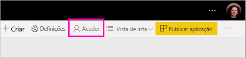

Cada Proprietário do grupo do Microsoft 365 é adicionado individualmente à função de Administrador da área de trabalho atualizada. O próprio grupo do Microsoft 365 é adicionado a uma função da área de trabalho. A função à qual é adicionado está dependente de a área de trabalho clássica ser *apenas de leitura* ou de *leitura/gravação*:

- Quando a área de trabalho é definida como **Os membros podem editar o conteúdo do Power BI**, após a atualização, o grupo do Microsoft 365 é adicionado à lista de acesso da área de trabalho com a função **Membro**.
- Quando a área de trabalho é definida como **Os membros apenas podem ler o conteúdo do Power BI**, após a atualização, o grupo do Microsoft 365 é adicionado à lista de acesso da área de trabalho com a função **Visualizador**.

Como o grupo do Microsoft 365 recebe uma função na área de trabalho, qualquer utilizador adicionado ao grupo do Microsoft 365 após a atualização tem essa função na área de trabalho. No entanto, se adicionar novos Proprietários ao grupo do Microsoft 365 após a atualização, estes não terão a função de Administrador para a área de trabalho.

### Diferenças nas funções antes e depois da atualização

As funções da área de trabalho são diferentes nas áreas de trabalho clássica e nova. A nova experiência de área de trabalho permite-lhe conceder funções da área de trabalho a grupos do Microsoft 365, grupos de segurança ou listas de distribuição.

- Os **membros** podem partilhar itens individuais e conceder acesso a toda a área de trabalho através das funções Membro, Contribuidor ou Visualizador
- Os **visualizadores** apenas podem visualizar o conteúdo, não podem exportar os dados subjacentes nem analisá-los no Excel para quaisquer conjuntos de dados da área de trabalho, a menos que tenham a permissão de Compilação.

Todos os utilizadores com acesso aos itens na área de trabalho através da permissão de aplicação e da partilha continuam a ter acesso a esses itens. Qualquer pessoa com acesso à área de trabalho também tem acesso à aplicação publicada a partir da área de trabalho. Estes utilizadores não estão listados na lista de acesso da aplicação.

É recomendável avaliar se a nova função de Contribuidor deve ser utilizada. Após a atualização, pode alterar o grupo do Microsoft 365 para que tenha a função de Contribuidor no painel Acesso.

Após a atualização, pode considerar criar um grupo de segurança ou do Microsoft 365 ou uma lista de distribuição para os administradores da área de trabalho, em vez de gerir o acesso através de atribuições de funções a utilizadores individuais.

Leia mais sobre as [funções nas novas áreas de trabalho](service-new-workspaces.md#roles-in-the-new-workspaces).

## Licenciamento após a atualização

Os utilizadores nas funções de Administrador, Membro ou Contribuidor da área de trabalho precisam de uma licença do Power BI Pro para aceder à área de trabalho.

Se a área de trabalho estiver na capacidade partilhada, os utilizadores na função Visualizador da área de trabalho também precisarão de uma licença do Power BI Pro para aceder à área de trabalho. No entanto, se a área de trabalho estiver numa capacidade Premium, os utilizadores na função Visualizador não precisarão de uma licença Pro para aceder à área de trabalho.

## Outras novas funcionalidades da área de trabalho

A nova experiência de área de trabalho possui funcionalidades que as áreas de trabalho clássicas não têm. Uma diferença é a capacidade de definir uma lista de contactos diferente dos administradores ou proprietários da área de trabalho. Uma semelhança é que esta ainda está ligada à biblioteca de documentos do SharePoint do grupo do Microsoft 365.

### Modificar a lista de contactos

1. Selecione **Definições** na barra de menus na parte superior da lista de conteúdos da área de trabalho para aceder às definições da área de trabalho.

    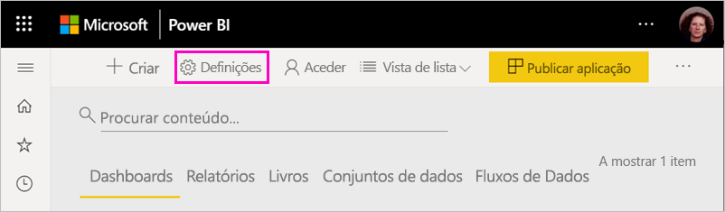

2. Em **Avançado**, a **Lista de contactos** da área de trabalho está configurada para ser o grupo do Microsoft 365 a partir do qual a área de trabalho foi atualizada. Pode adicionar mais utilizadores ou grupos à lista de contactos ou alterná-los para administradores da área de trabalho.

    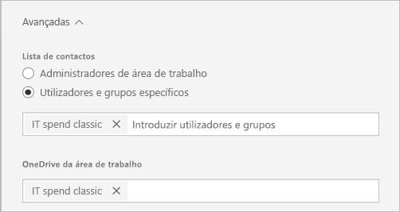

### Área de trabalho do OneDrive 

Após a atualização, a área de trabalho do **OneDrive** é ligada à biblioteca de documentos do SharePoint do grupo do Microsoft 365. Esta biblioteca de documentos é apresentada como a opção **OneDrive** na experiência **Obter Dados > Ficheiros**. Tenha em mente que nem todos os utilizadores da área de trabalho terão permissão para aceder a essa biblioteca de documentos se não estiverem no grupo do Microsoft 365.

## Pacotes de conteúdos durante a atualização

A nova experiência de área de trabalho não suporta pacotes de conteúdos. Em vez disso, utilize aplicações e conjuntos de dados partilhados para distribuir conteúdo na área de trabalho. É recomendável remover os pacotes de conteúdos publicados ou instalados a partir da área de trabalho antes da atualização. No entanto, se houver pacotes de conteúdos publicados ou instalados quando atualiza, o processo de atualização tenta preservar o conteúdo, conforme descrito abaixo.  Não há forma de restaurar o pacote de conteúdo ou a associação do conteúdo ao pacote de conteúdos após a atualização.

### Pacotes de conteúdos publicados

Os pacotes de conteúdos publicados a partir da área de trabalho são removidos durante a atualização. Não os poderá publicar nem atualizar após a atualização, mesmo que reverta para a área de trabalho clássica. Se outras pessoas tiverem instalado o pacote de conteúdos nas suas próprias áreas de trabalho, após a atualização, verão uma cópia do conteúdo do pacote de conteúdos nas suas áreas de trabalho. Veja a seção **pacotes de conteúdos instalados** para obter detalhes.

### Pacotes de conteúdos instalados

Quando atualiza a área de trabalho ou a área de trabalho a partir da qual o pacote de conteúdos é publicado, decorrem alterações importantes nos pacotes de conteúdos instalados. Após a atualização, a área de trabalho contém uma cópia do conteúdo do pacote de conteúdos, que está ligada ao conjunto de dados original na área de trabalho original.

No entanto, há alterações importantes:

- O conteúdo não deixará de ser atualizado se o pacote de conteúdos for atualizado.
- Os URLs e os identificadores dos itens são alterados e requerem que todos os marcadores ou todas as ligações que partilhou com outras pessoas sejam atualizados.
- Todas as personalizações dos utilizadores no pacote de conteúdos original da área de trabalho serão perdidas. As personalizações incluem subscrições, alertas, marcadores pessoais, filtros persistentes e favoritos.
- Os novos utilizadores poderão não ter acesso aos conjuntos de dados que estavam no pacote de conteúdos. Precisará de trabalhar com o proprietário do conjunto de dados para garantir que os utilizadores da área de trabalho têm acesso aos dados.

## Reverter para uma área de trabalho clássica

Como parte da experiência de atualização, tem a opção de reverter para uma área de trabalho clássica até 30 dias após a atualização. Esta capacidade restaura a associação do conteúdo da área de trabalho ao grupo original do Microsoft 365. Está disponível caso a sua organização se depare com problemas graves com a utilização da nova experiência de área de trabalho. No entanto, há limitações. Leia [Considerações para mudar para a área de trabalho clássica](#considerations-for-switching-back-to-classic) neste artigo primeiro.

Para reverter, precisa de ser Proprietário do grupo do Microsoft 365 ao qual a área de trabalho foi associada antes de ser atualizada. Siga estes passos.

1. Na lista conteúdos da área de trabalho, selecione **Mais opções** ( **...** ) > **Definições da área de trabalho**.

    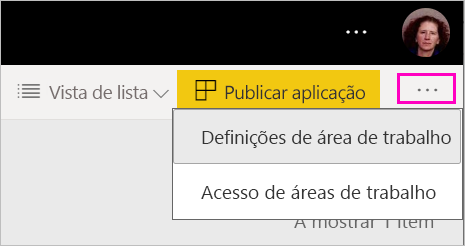

1. Expanda **Avançado** e selecione **Mudar para a área de trabalho clássica**. Se esta opção não estiver disponível, veja [Considerações para mudar para a área de trabalho clássica](#considerations-for-switching-back-to-classic) neste artigo.

    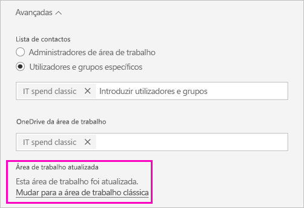

1. Quando estiver pronto, marque a caixa **Estou pronto para mudar para a área de trabalho clássica** e selecione **Mudar para a área de trabalho clássica**. Pode ver avisos ou bloqueadores nesta caixa de diálogo. Leia as [considerações para mudar para a área de trabalho clássica](#considerations-for-switching-back-to-classic) neste artigo caso se depare com estes problemas.

    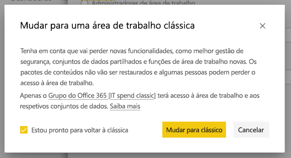

1. Quando a mudança concluída, será apresentada uma caixa de diálogo de confirmação.

    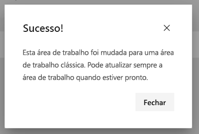

### Considerações para mudar para a área de trabalho clássica

Não pode mudar se alguma das instruções seguintes referentes à área de trabalho for verdadeira:

- O grupo Microsoft 365 foi eliminado.
- Já passaram mais de 30 dias desde a atualização.
- Os conjuntos de dados na área trabalho são utilizados pelos relatórios ou pelos dashboards noutras áreas de trabalho. Como funciona? Digamos que publicou um pacote de conteúdos a partir da área de trabalho antes da atualização e alguém instalou o pacote de conteúdos noutra área de trabalho. Imediatamente após a atualização, os conjuntos de dados são utilizados pelos relatórios e dashboards nesse pacote de conteúdos.
- A área de trabalho faz parte de um pipeline de gestão do ciclo de vida da aplicação.
- A área de trabalho é utilizada para as aplicações de modelos.
- A área de trabalho utiliza a capacidade de modelos grandes.
- A área de trabalho utiliza a nova funcionalidade de métricas de utilização.

Ao mudar para a área de trabalho clássica, não está a restaurar uma cópia exata da área de trabalho original. Decorrem as seguintes alterações:

- As permissões para a área de trabalho são definidas pelo grupo do Microsoft 365 ao qual a área de trabalho atualizada foi originalmente ligada.
  - Todos os administradores do grupo do Microsoft 365 tornam-se administradores da área de trabalho clássica.
  - Todos os membros do grupo do Microsoft 365 tornam-se membros da área de trabalho clássica. Se a área de trabalho clássica tiver sido definida como **Os membros apenas podem ler o conteúdo do Power BI**, esta definição será restaurada.
  - Todos os utilizadores ou grupos de utilizadores adicionados à área de trabalho após a conclusão da atualização (fora do grupo do Microsoft 365) perdem o acesso à área de trabalho. Adicione-os ao grupo do Microsoft 365 para lhes conceder acesso. Note que os grupos do Microsoft 365 não permitem aninhar grupos de segurança ou de distribuição na associação.
  - Os utilizadores que receberam acesso à aplicação na área de trabalho continuam a ter acesso à aplicação.
  - Os utilizadores que receberam acesso aos itens na área de trabalho através da partilha continuam a ter acesso a estes.
- Os pacotes de conteúdos publicados a partir da área de trabalho clássica antes da atualização não são restaurados.
- Os pacotes de conteúdos instalados na área de trabalho clássica antes da atualização não são restaurados.
- As subscrições criadas por utilizadores na área de trabalho após a atualização são removidas. As subscrições existentes antes da atualização continuam a funcionar conforme o esperado.
- Os alertas de dados não são preservados, são removidos.
- Se tiver mudado o nome da área de trabalho após a atualização, o nome da área de trabalho será restaurado para corresponder ao nome do grupo do Microsoft 365.
- As operações em curso, como as atualizações, não são afetadas pela atualização da área de trabalho.

## Gerir a migração para as novas áreas de trabalho no inquilino 

Algumas organizações querem mover muitas ou todas as áreas de trabalho para a experiência da nova área de trabalho. As ferramentas de atualização da área de trabalho concentram-se em permitir que os administradores das áreas de trabalho possam atualizar. Para as organizações que querem gerir tal processo, podem seguir os seguintes passos.

1. A lista de áreas de trabalho no portal de administração do Power BI e a API correspondente fornecem uma lista de todas as áreas de trabalho no Power BI. As áreas de trabalho clássicas são mostradas como tipo Grupo na lista.
2. Trabalhe com os proprietários individuais do grupo ou com o Administrador do Microsoft 365, para que atualizem as áreas de trabalho. Se quiser atualizar a área de trabalho, precisará de se tornar num Proprietário do grupo.

A funcionalidade de atualização da área de trabalho não fornece ferramentas para uma atualização em massa ou programática. Além disso, os novos grupos do Microsoft 365 criados na sua organização continuarão a aparecer no Power BI.
   
   
## Problemas conhecidos

Existem vários problemas conhecidos que poderá encontrar:
- Após a atualização, os utilizadores poderão ver uma caixa de diálogo de aviso "Falha ao carregar modelo". Esta mensagem é erradamente apresentada e pode ser ignorada. 
- Após a atualização, alguns nomes de áreas de trabalho estão diferentes. Quando tal acontecer, o nome da área de trabalho será revertido para um nome anterior ou ficará em branco. Para resolver este problema, mude o nome da área de trabalho para o nome pretendido.
- Após atualizar uma área de trabalho que tinha um pacote de conteúdos instalado, poderá ver dashboards adicionais na área de trabalho que não eram visíveis antes da atualização. Tal acontece em alguns casos, quando um pacote de conteúdos não foi atualizado recentemente. Pode remover estes dashboards com segurança.

## Próximos passos

* [Organizar o trabalho nas experiências das novas áreas de trabalho](service-new-workspaces.md)
* [Criar as novas áreas de trabalho](service-create-the-new-workspaces.md)
* [Create the classic workspaces](service-create-workspaces.md) (Criar as áreas de trabalho clássicas)
* Perguntas? [Experimente perguntar à Comunidade do Power BI](https://community.powerbi.com/)
