# Monitorizar métricas de utilização em áreas de trabalho clássicas

As métricas de utilização ajudam-no a compreender o impacto dos seus relatórios e dashboards. Quando executa as métricas de utilização de dashboards ou as métricas de utilização de relatórios, pode verificar como esses dashboards e relatórios estão a ser utilizados em toda a organização, quem os está a utilizar e com que finalidade. Este artigo descreve os relatórios de métricas de utilização para [áreas de trabalho clássicas](service-create-workspaces.md). Se os seus relatórios estiverem numa das novas áreas de trabalho, veja o artigo [Monitorizar as métricas de utilização na nova experiência de área de trabalho](service-modern-usage-metrics.md)  

Os relatórios de métricas de utilização são só de leitura. No entanto, pode copiar um relatório de métricas de utilização. A cópia cria um relatório padrão do Power BI que poderá editar. Também pode criar os seus próprios relatórios no Power BI Desktop com base no conjunto de dados subjacente, que contém as métricas de utilização para todos os dashboards ou relatórios numa área de trabalho. Para começar, o relatório copiado mostra métricas apenas para o dashboard ou relatório selecionados. Pode remover o filtro predefinido e ter acesso ao conjunto de dados subjacente, com todas as métricas de utilização da área de trabalho selecionada. Poderá até ver os nomes de utilizadores específicos, se o administrador tiver dado permissão para tal.

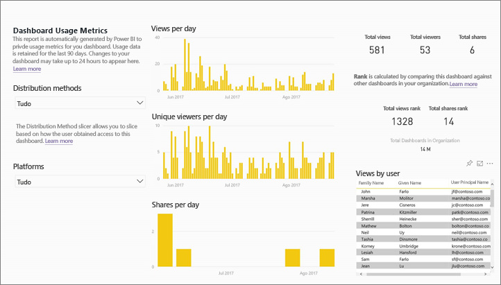

> [!NOTE]
> As métricas de utilização controlam a utilização de relatórios que estão incorporados no SharePoint Online. No entanto, as métricas de utilização não controlam os dashboards e relatórios incorporados através do fluxo "o utilizador possui credenciais" ou "a aplicação possui credenciais". De igual modo, as métricas de utilização não controlam a utilização de relatórios incorporados através da opção [Publicar na Web](service-publish-to-web.md).

## Por que razão são importantes as métricas de utilização

Saber como o seu conteúdo está a ser utilizado ajuda-o a demonstrar o impacto e a atribuir prioridades aos esforços. A métrica de utilização pode mostrar que um dos seus relatórios é utilizado diariamente por um vasto segmento da organização e mostrar que um dashboard que criou não está a ser visualizado. Este tipo de comentários são valiosos para ajudá-lo nos seus esforços de trabalho.

Pode executar relatórios de métricas de utilização apenas no serviço Power BI. No entanto, se guardar um relatório de métricas de utilização ou o afixar num dashboard, pode abrir e interagir com esse relatório em dispositivos móveis.

## Pré-requisitos

- Precisa de uma licença do Power BI Pro para executar e aceder aos dados de métricas de utilização. No entanto, a funcionalidade de métrica de utilização recolhe informações de utilização de todos os utilizadores, independentemente da licença que têm atribuída.
- Para aceder às métricas de utilização de um determinado dashboard ou relatório, deve ter acesso de edição a esse dashboard ou relatório.
- O administrador do Power BI tem de ter ativado as métricas de utilização para criadores de conteúdo. O administrador do Power BI pode também ter ativado a recolha de dados por utilizador em métricas de utilização. Saiba mais sobre como [ativar estas opções no portal de administração](../admin/service-admin-portal.md#control-usage-metrics). 

## Ver um relatório de Métrica de Utilização

1. Comece pela área de trabalho que contém o dashboard ou o relatório.
2. Na lista de conteúdo da área de trabalho ou a partir do dashboard ou do relatório propriamente dito, selecione o ícone de **Métrica de utilização** .

    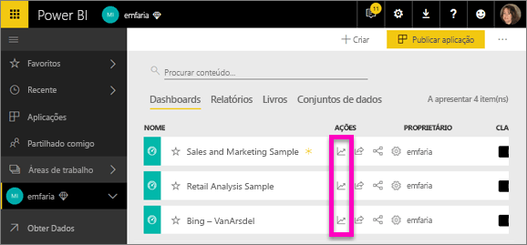

    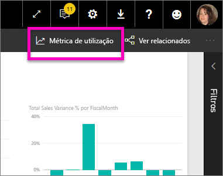
3. Quando o faz pela primeira vez, o Power BI cria o relatório de métrica de utilização e permite-lhe saber quando está pronto.

    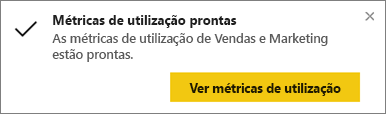
4. Para ver os resultados, selecione **Ver métricas de utilização**.

    As métricas de utilização são extremamente úteis ao implementar e fazer a manutenção dos dashboards e os relatórios do Power BI. Quer saber que páginas do relatório são mais úteis e quais podem ser suprimidos? Segmente por **Página do relatório** para descobrir. Quer saber se deve criar um esquema móvel para o seu dashboard? Segmente por **Plataformas** para saber quantos utilizadores estão a aceder ao seu conteúdo através de aplicações móveis e não através do Web browser.

5. Opcionalmente, passe o cursor sobre uma visualização e selecione o ícone do pino para adicionar a visualização a um dashboard. Em alternativa, na barra do menu superior, selecione **Afixar Página Dinâmica** para adicionar a página completa a um dashboard. No dashboard, pode monitorizar as métricas de utilização mais facilmente ou partilhá-las com outras pessoas.

    > [!NOTE]
    > Se afixar um mosaico de um relatório de métrica de utilização a um dashboard, não poderá adicionar esse dashboard a uma aplicação.

### Relatório da métrica de utilização do dashboard

### Relatório da métrica de utilização

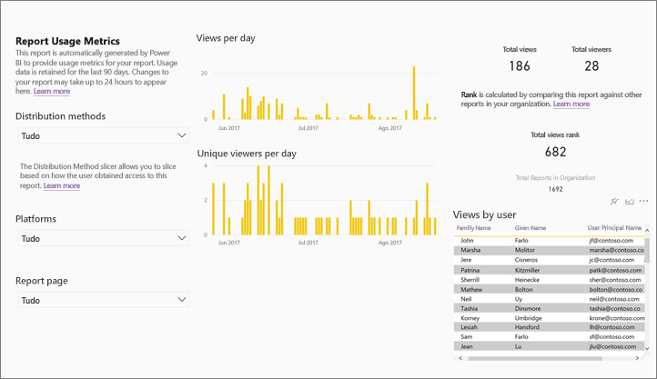

## Sobre o relatório da métrica de utilização

Quando seleciona **Métrica de utilização** ou o  junto a um dashboard ou relatório, o Power BI gera um relatório pré-concebido com as métricas de utilização para esse conteúdo relativo aos últimos 90 dias.  O relatório tem um aspeto semelhante aos relatórios do Power BI com que já está familiarizado. Poderá segmentar com base na forma como os utilizadores finais receberam acesso, quer estivessem a aceder através da Web ou da aplicação móvel e assim por diante. À medida que os seus dashboards e relatórios evoluem, o mesmo se passa com o relatório de métrica de utilização, que é atualizado todos os dias com novos dados.  

Os relatórios de métricas de utilização não aparecem em **Recente**, **Áreas de trabalho**, **Favoritos** ou outras listas de conteúdo. Não podem ser adicionados a uma aplicação. Se afixar um mosaico de um relatório de métrica de utilização a um dashboard, não poderá adicionar esse dashboard a uma aplicação.

Para examinar os dados do relatório ou criar os seus próprios relatórios face ao conjunto de dados subjacente, tem duas opções: 

- Crie uma cópia do relatório no serviço Power BI. Veja [Guardar uma cópia do relatório de Métrica de Utilização](#save-a-copy-of-the-usage-metrics-report) mais adiante neste artigo para obter detalhes.
- Ligue ao conjunto de dados do Power BI Desktop. Para cada área de trabalho, o conjunto de dados tem o nome "Relatório Modelo de Métrica de Utilização". Veja [Estabelecer uma ligação com um conjunto de dados publicado](../connect-data/desktop-report-lifecycle-datasets.md#establish-a-power-bi-service-live-connection-to-the-published-dataset) para obter detalhes.

    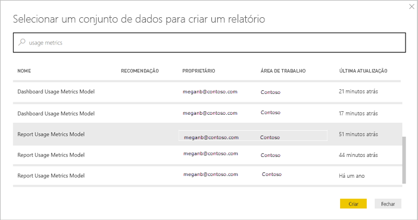

## Quais são as métricas reportadas?

| Metric | Dashboard | Relatório | Descrição |
| --- | --- | --- | --- |
| Segmentação de dados por método de distribuição |sim |sim |Como os utilizadores obtêm acesso ao conteúdo. Existem 3 métodos possíveis: os utilizadores podem aceder a dashboard ou ao relatório devido ao facto de serem membros de uma [área de trabalho](../consumer/end-user-experience.md), ao terem o conteúdo [partilhado com os mesmos](service-share-dashboards.md) ou ao instalarem uma aplicação/pacote de conteúdos.  Tenha em atenção que as vistas através de uma aplicação são contadas como "pacote de conteúdos". |
| Segmentação de dados de plataformas |sim |sim |O dashboard ou o relatório foram acedidos através do serviço Power BI (powerbi.com) ou de um dispositivo móvel? Mobile inclui todas as nossas aplicações iOS, Android e Windows. |
| Segmentação de dados de uma página de relatório |não |sim |Se o relatório tem mais de 1 página, segmente o relatório pela(s) página (s) que foi(ram) visualizada(s). "Em branco" significa que uma página do relatório foi adicionada recentemente (dentro de 24 horas, o nome real da nova página é apresentado na lista de segmentação de dados) ou as páginas de relatórios foram eliminadas. "Em branco" captura estes tipos de situações. |
| Views per day |sim |sim |Número total de visualizações por dia - uma visualização é definida como um utilizador a carregar uma página do relatório ou dashboard. |
| Unique viewers per day |sim |sim |Número de utilizadores *diferentes* que visualizaram o dashboard ou o relatório (com base na conta de utilizador do AAD). |
| Visualizações por utilizador |sim |sim |Número de visualizações nos últimos 90 dias, apresentadas por utilizadores individuais. |
| Shares per day |sim |não |Número de vezes que o dashboard foi partilhado com outro utilizador ou grupo. |
| Total views |sim |sim |Número de visualizações nos últimos 90 dias. |
| Total viewers |sim |sim |Número de visualizações exclusivas nos últimos 90 dias. |
| Total shares |sim |não |Número de vezes que o dashboard ou o relatório foi partilhado nos últimos 90 dias. |
| Total de organizações |sim |sim |Número de todos os dashboards ou relatórios em toda a organização que tiveram pelo menos uma visualização nos últimos 90 dias.  Utilizado para calcular a classificação. |
| Posição: Total views |sim |sim |Para saber o total de visualizações de todos os dashboards ou de relatórios na organização nos últimos 90 dias, qual é a classificação do dashboard ou do relatório. |
| Posição: Total shares |sim |não |Para saber o total de partilhas de todos os dashboards na organização nos últimos 90 dias, qual é a classificação do dashboard ou do relatório. |

## Guardar uma cópia do relatório de Métrica de Utilização

Utilize **Guardar como** para converter o relatório de métrica de utilização num relatório do Power BI normal que pode personalizar para atender às suas necessidades específicas. Também pode utilizar o Power BI Desktop para criar relatórios de métrica de utilização personalizados com base no conjunto de dados subjacente. Veja [Estabelecer uma ligação com um conjunto de dados publicado](../connect-data/desktop-report-lifecycle-datasets.md#establish-a-power-bi-service-live-connection-to-the-published-dataset) para obter detalhes.

Melhor ainda, o conjunto de dados subjacente inclui os detalhes de utilização de todos os dashboards ou de relatórios na área de trabalho. Tal abre mais possibilidades. Pode, por exemplo, criar um relatório que compara os dashboards na sua área de trabalho com base na utilização. Como alternativa, pode criar um dashboard de métrica de utilização para a sua aplicação do Power BI ao agregar a utilização de todo o conteúdo distribuído nessa aplicação.  Veja como remover o filtro e como [ver todas as métricas de utilização da área de trabalho](#see-all-workspace-usage-metrics) mais adiante neste artigo.

### Criar uma cópia do relatório de utilização

Quando cria uma cópia do relatório de utilização pré-concebido e só de leitura, o Power BI cria uma cópia editável do mesmo. À primeira vista, parece igual. Contudo, agora pode abrir o relatório na vista de Edição, adicionar novas visualizações, filtros e páginas, modificar ou eliminar visualizações existentes, etc. O Power BI guarda o relatório novo na área de trabalho atual.

1. A partir do relatório de métrica de utilização pré-construído, selecione **Ficheiro > Guardar como**. O Power BI cria um relatório do Power BI editável, guardado na área de trabalho atual.

    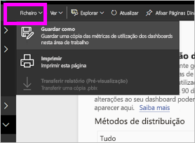
2. Abra o relatório na vista Editar e [interaja este, tal como faria com qualquer outro relatório do Power BI](../create-reports/service-interact-with-a-report-in-editing-view.md). Por exemplo, adicione novas páginas e crie novas visualizações, adicione filtros, formate os tipos de letra e cores, entre outros.

    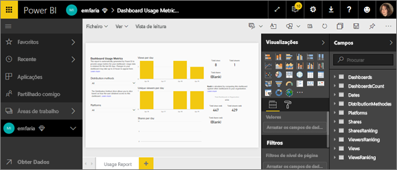
3. O novo relatório é guardado no separador **Relatórios** na área de trabalho atual e é adicionado à lista de conteúdo **Recente**.

    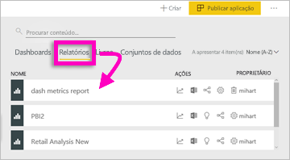

## Ver *todas* as métricas de utilização de áreas de trabalho

Para ver as métricas de todos os dashboards ou de todos os relatórios na área de trabalho, terá de remover um filtro. Por predefinição, o relatório está filtrado para apresentar métricas apenas do dashboard ou do relatório que utilizou para o criar.

1. Selecione **Editar relatório** para abrir o novo relatório editável na vista de Edição.

    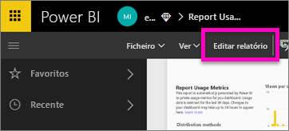
2. No painel Filtros, localize o registo **Filtros de nível de relatório** e remova o filtro ao selecionar a borracha junto a **ReportGuid**.

    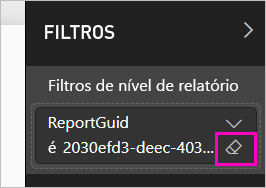

    O relatório apresenta agora métricas para toda a área de trabalho.

## Controlos de administrador do Power BI para as métricas de utilização

Os relatórios de métricas de utilização são uma funcionalidade que o administrador global ou o administrador do Power BI pode ativar ou desativar. Os administradores têm controlo granular sobre quais utilizadores têm acesso à métrica de utilização. Por predefinição, estão **Ativados** para todos os utilizadores na organização.

> [!NOTE]
> Apenas os administradores do inquilino do Power BI podem ver o portal de administração e editar as definições. 

Por predefinição, os dados por utilizador estão ativados para métricas de utilização e as informações da conta do consumidor de conteúdos estão incluídas no relatório de métricas. Se os administradores não quiserem incluir estas informações para alguns ou para todos os utilizadores, podem desativar a funcionalidade para grupos de segurança específicos ou para toda a organização. As informações da conta são apresentadas no relatório como *Sem nome*.

Ao desativar as métricas de utilização para toda a respetiva organização, os administradores podem utilizar a opção **Eliminar todo o conteúdo das métricas de utilização existente** para eliminar todos os relatórios e mosaicos de dashboards existentes que foram criados com os relatórios de métrica de utilização. Esta opção remove o acesso a dados da métrica de utilização por parte dos utilizadores na organização que possam estar a utilizá-lo. A eliminação do conteúdo das métricas de utilização existente é irreversível.

Veja [Controlar métricas de utilização](../admin/service-admin-portal.md#control-usage-metrics) no artigo do Portal de administração para obter detalhes sobre estas definições. 

## Métricas de utilização em clouds nacionais

O Power BI está disponível em clouds nacionais separadas. Estas clouds oferecem os mesmos níveis de segurança, privacidade, conformidade e transparência que a versão global do Power BI, combinado com um modelo exclusivo para regulamentações locais sobre a entrega do serviço, residência dos dados, acesso e controlo. Devido a este modelo exclusivo para regulamentações locais, as métricas de utilização não estão disponíveis em clouds nacionais. Para obter mais informações, veja as [clouds nacionais](https://powerbi.microsoft.com/clouds/).

## Considerações e limitações

### Discrepâncias entre os registos de auditoria e as métricas de utilização

É importante entender que podem existir diferenças na comparação dos registos de auditoria e de métricas de utilização, bem como os motivos para tal. Os *registos de auditoria* são recolhidos através dos dados do serviço Power BI e as *métricas de utilização* são recolhidas no cliente. As contagens acumuladas de atividades nos registos de auditoria podem nem sempre corresponder às métricas de utilização devido às seguintes diferenças:

* Por vezes, as métricas de utilização poderão contabilizar menos atividades devido a ligações de rede inconsistentes, bloqueadores de publicidade ou a outros problemas que podem interromper o envio de eventos do cliente.
* Determinados tipos de visualizações não são incluídos nas métricas de utilização, conforme descrito anteriormente neste artigo.
* Por vezes, as métricas de utilização poderão contabilizar atividades a mais, em situações em que o cliente atualiza sem a necessidade de enviar um pedido para o serviço Power BI. Por exemplo, mudar páginas de relatório não emite um pedido uma carga de relatório para o servidor uma vez que a definição de página já está no navegador.
* A partilha está desativada no relatório das métricas de utilização. Para atribuir às pessoas acesso de leitura ao relatório, primeiro é preciso dar-lhes acesso à área de trabalho.

### Discrepâncias entre as APIs REST e as métricas de utilização

As [APIs REST de Relatórios](/rest/api/power-bi/reports) e as [APIs REST de Administração](/rest/api/power-bi/admin) do Power BI também utilizam dados do serviço Power BI. Pelos motivos descritos na secção anterior, as contagens de relatório (o número de relatórios) das APIs podem ser diferentes das contagens de relatório nas métricas de utilização. As contagens de relatório derivadas das APIs não são afetadas por problemas de cliente e devem ser consideradas precisas. Note também que as APIs de administrador dão-lhe o "estado atual" da implantação do Power BI e apenas considerar o que existe no momento do pedido. O relatório clássico das métricas de utilização tem 90 dias de dados, e a "contagem total" lá representa relatórios únicos vistos ao longo de 90 dias. Se os relatórios forem eliminados após a visualização, não são contados pelas APIs de administração, mas serão contados nos dados históricos que alimentam o relatório de utilização.

### As Métricas de Utilização Clássicas não são suportadas com Ligações Privadas 

Se a sua organização utilizar [Ligações Privadas](../admin/service-security-private-links.md), os relatórios de métricas de utilização clássicas não irão incluir dados. Atualmente, existe uma limitação ao transferir informações de clientes através de ligações privadas. 

### Outras considerações

Tem de ver o conteúdo na sua área de trabalho, a partir dessa área de trabalho, pelo menos uma vez. Se não existirem visualizações do conteúdo a partir da própria área de trabalho pelo menos uma vez, os dados não serão correlacionados a partir das vistas da aplicação no Relatório de Métricas de Utilização. Para desbloquear o processamento de dados deste relatório, basta ver o conteúdo a partir da área de trabalho pelo menos uma vez.

## Perguntas frequentes

Além das possíveis diferenças entre os registos de auditoria e as métricas de utilização, as seguintes perguntas e respostas sobre as métricas de utilização podem ser úteis para os administradores e os utilizadores:

**P:**    Não consigo executar métricas de utilização num dashboard ou num relatório

**R:**    R: Só pode ver a métrica de utilização do conteúdo que detém ou tem permissões para editar.

**P:**    As métricas de utilização captam as visualizações de dashboards e relatórios incorporados?

**R:**    As métricas de utilização não suportam atualmente a captura de informações de utilização para dashboards incorporados, relatórios e o fluxo [publicar na Web](service-publish-to-web.md). Nesses casos, recomendamos a utilização de plataformas de análise da Web existentes para controlar a utilização da aplicação ou do portal de alojamento.

**P:**    Não consigo executar a métrica de utilização em qualquer conteúdo.

**R1:**    Os administradores podem desativar esta funcionalidade para a sua organização.  Contacte o administrador para verificar se isto se verifica.

**R2:**    A métrica de utilização é uma funcionalidade do Power BI Pro.

**P:**    Os dados não parecem estar atualizados. Por exemplo, os métodos de distribuição não aparecem, as páginas de relatório estão em falta, entre outros.

**R:**    Os dados demoram até 24 horas a aparecer.

**P:**    A área de trabalho tem quatro relatórios, mas o relatório de métricas de utilização só apresenta três.

**R:**    O relatório de métrica de utilização apenas inclui relatórios (ou dashboards) que tenham sido acedidos nos últimos 90 dias.  Se um relatório (ou dashboard) não for apresentado, é provável que não seja utilizado há mais de 90 dias.

## Próximos passos

[Administrar o Power BI no portal de administração](../admin/service-admin-portal.md)

Mais perguntas? [Pergunte à Comunidade do Power BI](https://community.powerbi.com/)
