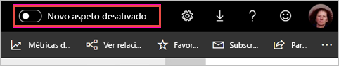
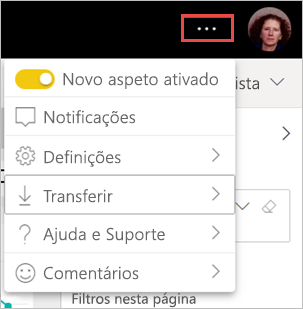

# Aceitar o “novo aspeto” da área de trabalho (pré-visualização)

As áreas de trabalho têm um novo aspeto que coincide com o [novo aspeto](../consumer/service-new-look.md) do serviço Power BI. Qualquer utilizador do serviço Power BI (app.powerbi.com) o pode aceitar. Quando ativa o **Novo aspeto** na barra de cabeçalho preta, está a aceitar o novo aspeto dos relatórios e das áreas de trabalho. Todas as áreas de trabalho, clássicas e novas, podem beneficiar do novo aspeto.

Procura informações sobre o novo aspeto do **Power BI Desktop**? Veja [Utilizar o friso atualizado no Power BI Desktop](../create-reports/desktop-ribbon.md).

## Funcionalidades do novo aspeto

:::image type="content" source="media/service-workspaces-new-look/power-bi-workspace-new-look-numbered.png" alt-text="O novo aspeto das áreas de trabalho, com notas numeradas para explicação":::

|Número  |Como funciona |
|---------|---------|
|    | **Obter dados**: é mais fácil adicionar conteúdo à área de trabalho. Selecione o botão **+ Novo** para ligar dados, abrir ficheiros, criar relatórios, dashboards e muito mais.  |
|   | **Ver comutador**: para ver as ligações entre os fluxos de dados, os conjuntos de dados, os relatórios e os dashboards, bem como as ligações a outras origens de dados, alterne entre a vista **Lista** e a vista **Linhagem**. |
|  | **Pesquisar numa área de trabalho**: pesquise todo o conteúdo numa área de trabalho na nova caixa de pesquisa.  |
|   | **Lista e separadores**: todo o conteúdo numa área de trabalho está numa lista não hierárquica de dashboards, relatórios, conjuntos de dados, etc., como o SharePoint. A área de trabalho já não é aberta num separador **Dashboards** que poderá estar vazio e não precisará de procurar o conteúdo. Veja a seguir a nova ordem do separador:  **Tudo**: mostra todo o conteúdo (dashboards, relatórios, livros, relatórios paginados, conjuntos de dados e fluxos de dados) na área de trabalho.  **Conteúdo**: recolhe todo o conteúdo criado para consumo (dashboards, relatórios, livros e relatórios paginados) na área de trabalho.  **Conjuntos de dados + fluxos de dados**: recolhe todos os conjuntos de dados e fluxos de dados na área de trabalho, para uma fácil gestão dos dados. |
|  | **Filtros**: em áreas de trabalho com centenas de artefactos, pode filtrar o conteúdo no painel Filtros. Quando um filtro é aplicado, verá o filtro acima da lista de conteúdos. |

**Ações rápidas**: quando paira sobre o conteúdo na lista, verá as ações mais comuns desse item, para além das outras disponíveis no menu **Mais opções** (...).

:::image type="content" source="media/service-workspaces-new-look/power-bi-workspace-new-look-quick-actions.png" alt-text="Ações rápidas na nova área de trabalho":::

## Ativar o novo aspeto

Qualquer utilizador do serviço Power BI pode utilizar o novo aspeto. Basta clicar em **Novo aspeto desligado** para a opção mudar para **Novo aspeto ligado**.

Se precisar de regressar ao aspeto antigo, só terá de o **desativar** . Se esta opção não for apresentada, selecione o menu de reticências no canto superior direito.

## Próximos passos

- [Utilizar o friso atualizado no Power BI Desktop](../create-reports/desktop-ribbon.md)
- [O “novo aspeto” do serviço Power BI](../consumer/service-new-look.md)
- Perguntas? [Pergunte à Comunidade do Power BI](https://community.powerbi.com/)
