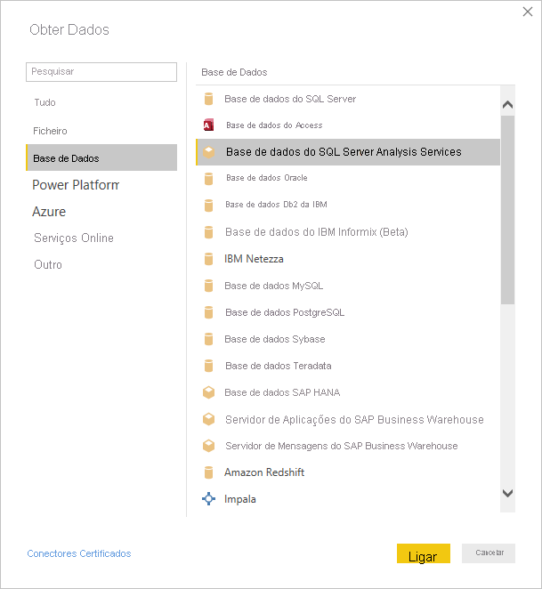
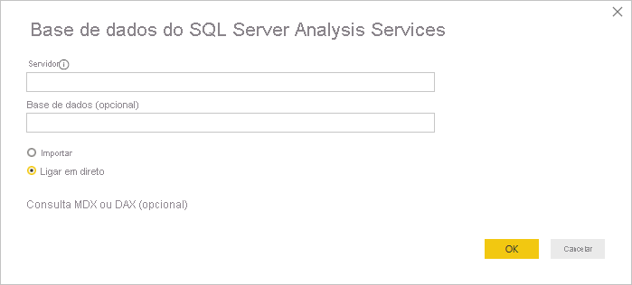
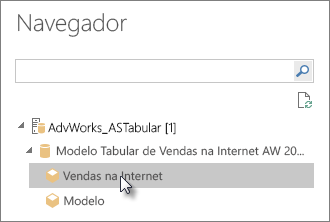
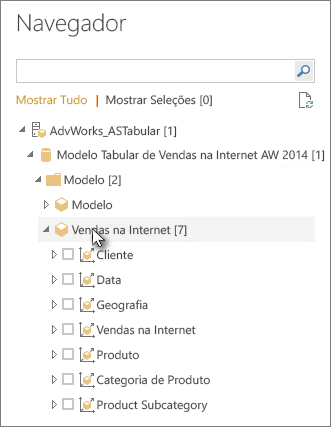

# Ligar aos dados de tabela do Analysis Services no Power BI Desktop
Com o Power BI Desktop, existem duas formas de ligar e obter dados dos modelos em tabela do SQL Server Analysis Services: explorar através de uma ligação dinâmica ou selecionar itens e importá-los para o Power BI Desktop.

Vamos ver isso mais de perto.

**Explorar através de uma ligação dinâmica**: ao utilizar uma ligação dinâmica, os itens no modelo em tabela ou uma perspetiva, como tabelas, colunas e medidas, aparecem na lista do painel **Campos** do Power BI Desktop. Pode utilizar as ferramentas avançadas de relatório e visualização do Power BI Desktop para explorar o modelo em tabela de formas novas e altamente interativas.

Ao ligar-se dinamicamente, não são importados dados do modelo em tabela para o Power BI Desktop. Cada vez que interagir com uma visualização, o Power BI Desktop consulta o modelo em tabela e calcula os resultados apresentados. Estará sempre a ver os dados mais recentes disponíveis no modelo em tabela, quer sejam da última hora de processamento ou das tabelas do DirectQuery disponíveis no modelo em tabela. 

Tenha em atenção que os modelos em tabelas são altamente seguros. Os itens que aparecem no Power BI Desktop dependem das suas permissões no modelo em tabela ao qual está ligado.

Quando tiver criado relatórios dinâmicos no Power BI Desktop, pode partilhá-los ao publicá-los no site do Power BI. Ao publicar um ficheiro do Power BI Desktop com uma ligação dinâmica para um modelo em tabela do site do Power BI, tem de ser instalado e configurado um gateway de dados no local por um administrador. Para saber mais, veja [Gateway de dados no local](service-gateway-onprem.md).

**Selecionar itens e importar para o Power BI Desktop**: ao ligar-se a esta opção, pode selecionar os itens como tabelas, colunas e medidas no modelo em tabela ou na perspetiva e carregá-los para um modelo do Power BI Desktop. Utilize o Editor do Power Query do Power BI Desktop para formatar o que pretende e as funcionalidades de modelação para modelar os dados. Como não existe uma ligação dinâmica entre o Power BI Desktop e o modelo em tabela é mantido, pode explorar o seu modelo offline do Power BI Desktop ou publicar no seu site do Power BI.

## Para ligar a um modelo em tabela
1. No Power BI Desktop, no separador **Home Page**, selecione **Obter Dados** > **Mais** > **Base de Dados**.
   
1. Selecione **Base de Dados do SQL Server Analysis Services** e, em seguida, **Ligar**.
   
   
3. Na janela **Base de Dados do SQL Server Analysis Services**, introduza o **Nome do servidor**, escolha um modo de ligação e, em seguida, selecione **OK**.
   
   
4. Este passo na janela **Navegador** depende do modo de ligação selecionado:

   - Se estiver a ligar dinamicamente, selecione um modelo em tabela ou uma perspetiva.
  
      
   - Se optar por selecionar itens e obter dados, selecione um modelo em tabela ou uma perspetiva e, em seguida, selecione uma determinada tabela ou coluna para carregar. Para formatar os dados antes de carregar, selecione **Editar Consultas** para abrir o Editor do Power Query. Quando estiver pronto, selecione **Carregar** para importar os dados para o Power BI Desktop.

      

## Perguntas frequentes
**Pergunta:** É necessário um gateway de dados no local?

**Resposta:** Depende. Se utilizar o Power BI Desktop para se ligar dinamicamente a um modelo em tabela, mas não tiver intenção de publicar no site do Power BI, não precisará de ter um gateway. Por outro lado, se pretende publicar no site do Power BI, é necessário ter um gateway de dados para garantir a comunicação segura entre o serviço Power BI e o servidor local do Analysis Services. Certifique-se de falar com o administrador do servidor do Analysis Services antes de instalar um gateway de dados.

Se optar por selecionar itens e obter dados, importará dados do modelo em tabela diretamente para o ficheiro do Power BI Desktop e, por isso, não será necessário ter um gateway.

**Pergunta:** Qual é a diferença entre a ligação dinâmica a um modelo em tabela a partir do serviço Power BI e uma ligação dinâmica a partir do Power BI Desktop?

**Resposta:** Durante a ligação dinâmica a um modelo em tabela a partir do site no serviço Power BI para uma base de dados no local do Analysis Services na sua organização, é necessário ter um gateway de dados no local para proteger a comunicação entre os mesmos. Durante a ligação dinâmica a um modelo em tabela a partir do Power BI Desktop, não é necessário ter um gateway, pois o Power BI Desktop e o servidor do Analysis Services ao qual está a ligar estão a ser executados localmente na sua organização. No entanto, se publicar o ficheiro do Power BI Desktop no site do Power BI, é necessário um gateway.

**Pergunta:** Se tiver criado uma ligação dinâmica, posso ligar a outra origem de dados no mesmo ficheiro do Power BI Desktop?

**Resposta:** Não. Não pode explorar dados dinâmicos e ligar a outro tipo de origem de dados no mesmo ficheiro. Se já tiver importado os dados ou ligado a uma origem de dados diferente num ficheiro do Power BI Desktop, tem de criar um novo ficheiro para explorar dinamicamente.

**Pergunta:** Se tiver criado uma ligação dinâmica, posso editar o modelo ou a consulta no Power BI Desktop?

**Resposta:** Pode criar medidas ao nível dos relatórios no Power BI Desktop, mas todas as outras funcionalidades de consulta e modelação estão desativadas ao explorar os dados dinâmicos.

**Pergunta:** Se tiver criado uma ligação dinâmica, esta é segura?

**Resposta:** Yes. As suas credenciais atuais do Windows são utilizadas para ligar ao servidor do Analysis Services. Não pode utilizar credenciais básicas ou armazenadas no serviço Power BI ou no Power BI Desktop quando explorar dinamicamente.

**Pergunta:** No Navegador, vejo um modelo e uma perspetiva. Qual é a diferença?

**Resposta:** Uma perspetiva é uma vista específica de um modelo em tabela. Pode incluir apenas determinadas tabelas, colunas ou medidas consoante uma necessidade de análise de dados exclusiva. Um modelo em tabela contém sempre pelo menos uma perspetiva, que pode incluir tudo no modelo. Se não tiver a certeza de qual perspetiva deve selecionar, contacte o seu administrador.

**Pergunta:** Há alguma funcionalidade do Analysis Services que altere o comportamento do Power BI?

**Resposta:** Yes. A experiência no Power BI Desktop pode variar consoante as funcionalidades que o seu modelo Tabular utiliza. Alguns exemplos incluem:
* Poderá ver as medidas no modelo agrupadas na parte superior da lista do painel **Campos** em vez de nas tabelas ao lado das colunas. Não se preocupe, poderá continuar a utilizá-las normalmente, mas é mais fácil encontrá-las desta forma.

* Se o modelo em tabela tiver grupos de cálculo definidos, só pode utilizá-los em conjunto com as medidas do modelo e não com as medidas implícitas que criar ao adicionar campos numéricos a um elemento visual. O modelo também poderá ter tido o sinalizador **DiscourageImplicitMeasures** definido manualmente, o que tem o mesmo efeito. Para saber mais, veja [Calculation groups in Analysis Services](https://docs.microsoft.com/analysis-services/tabular-models/calculation-groups#benefits) (Grupos de cálculo no Analysis Services).

## Para alterar o nome do servidor após a ligação inicial
Depois de criar um ficheiro do Power BI Desktop com uma ligação dinâmica de exploração, pode haver alguns casos em que quer alternar a ligação para um servidor diferente. Por exemplo, se tiver criado o ficheiro do Power BI Desktop ao ligar a um servidor de desenvolvimento e, antes da publicação no serviço Power BI, quer alternar a ligação para o servidor de produção.

Para alterar o nome de servidor:

1. Selecione **Editar Consultas** no separador **Home Page**.

2. Na janela **Base de Dados do SQL Server Analysis Services**, introduza o novo **Nome do servidor** e, em seguida, selecione **OK**.

   
## Resolução de problemas 
A lista seguinte descreve todos os problemas conhecidos ao ligar-se ao SQL Server Analysis Services (SSAS) ou ao Azure Analysis Services: 

* **Erro: Não foi possível carregar o esquema do modelo**: normalmente, este erro ocorre quando o utilizador que se liga ao Analysis Services não tem acesso à base de dados/modelo.

