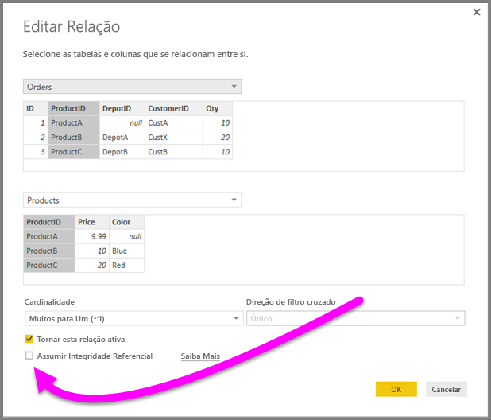
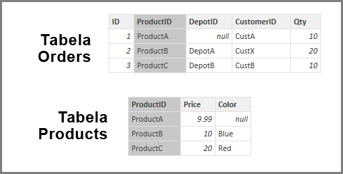
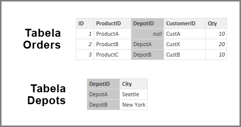
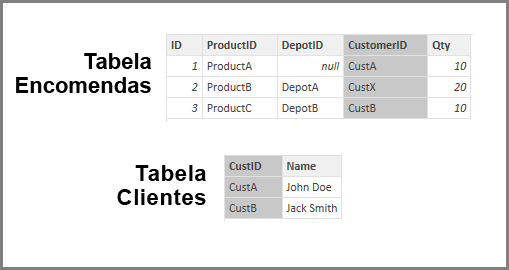

# Aplicar a definição Assumir Integridade Referencial no Power BI Desktop
Quando ligar a uma origem de dados através do **DirectQuery**, pode utilizar a seleção **Assumir Integridade Referencial** para ativar a execução de consultas mais eficientes relativamente à origem de dados. Esta funcionalidade tem alguns requisitos dos dados subjacentes e só está disponível quando utilizar o **DirectQuery**.

A definição **Assumir Integridade Referencial** permite às consultas na origem de dados utilizar instruções **INNER JOIN** em vez de **OUTER JOIN**, o que melhora a eficiência da consulta.

## Requisitos para utilizar Assumir Integridade Referencial
Esta é uma definição avançada e só é ativada quando ligar aos dados através do **DirectQuery**. Os requisitos seguintes são necessários para o correto funcionamento de **Assumir Integridade Referencial**:

* Os dados na coluna **De** na relação nunca são *Nulos* nem podem estar *em branco*
* Para cada valor na coluna **De**, existe um valor correspondente na coluna **Para**

Neste contexto, a coluna **De** é a parte *Muitos* na relação *Um-para-Muitos* ou é a coluna na primeira tabela numa relação *Um-para-Um*.

## Exemplo da utilização de Assumir Integridade Referencial
O exemplo seguinte demonstra como se comporta a funcionalidade **Assumir Integridade Referencial** quando utilizada em ligações de dados. O exemplo liga a uma origem de dados que inclui as tabelas **Orders**, **Products** e **Depots**.

1. Na imagem seguinte que mostra as tabelas **Orders** e **Products**, tenha em atenção que existe integridade referencial entre **Orders[ProductID]** e **Products[ProductID]** . A coluna **[ProductID]** na tabela **Orders** nunca é *Nula* e cada valor também aparece na tabela **Products**. Como tal, **Assumir Integridade Referencial** deve ser definido para obter consultas mais eficientes (esta definição não altera os valores apresentados nos elementos visuais).
   
   
2. Na imagem seguinte, tenha em atenção que não existe integridade referencial entre **Orders[DepotID]** e **Depots[DepotID]** , uma vez que o **DepotID** é *Nulo* para algumas *Orders*. Como tal, **Assumir Integridade Referencial***não* deve ser definido.
   
   
3. Por fim, não existe integridade referencial entre **Orders[CustomerID]** e **Customers[CustID]** nas tabelas seguintes. **CustomerID** contém alguns valores (neste caso, *CustX*) que não existem na tabela *Customers*. Como tal, **Assumir Integridade Referencial***não* deve ser definido.
   
   

## Definição Assumir Integridade Referencial
Para ativar esta funcionalidade, selecione a caixa de verificação junto a **Assumir Integridade Referencial**, conforme mostrado na imagem seguinte.

Quando selecionada, a definição é validada com os dados para assegurar que não existem linhas *Nulas* ou sem correspondência. *No entanto*, nos casos com um grande número de valores, a validação não é uma garantia de que não existem problemas de integridade referencial.

Além disso, a validação ocorre no momento da edição da relação e *não* reflete as alterações subsequentes aos dados.

## O que acontece se definir incorretamente a funcionalidade Assumir Integridade Referencial?
Se definir **Assumir Integridade Referencial** quando existem problemas de integridade referencial nos dados, não causará erros. No entanto, resultará em inconsistências aparentes nos dados. Por exemplo, no caso da relação com a tabela **Depots** descrita acima, iria originar o seguinte:

* Um elemento visual que mostra o total de *Order Qty* mostraria um valor de 40
* Um elemento visual que mostra o total de *Order Qty by Depot City* mostraria um valor total de apenas *30*, uma vez que não inclui o ID de Encomenda 1, em que **DepotID** é *Nulo*.

## Próximas etapas
Saiba mais sobre o [DirectQuery](desktop-use-directquery.md)

Obtenha mais informações sobre [Relações no Power BI](../transform-model/desktop-create-and-manage-relationships.md)

Saiba mais sobre [Vista de Relações no Power BI Desktop](../transform-model/desktop-relationship-view.md).
