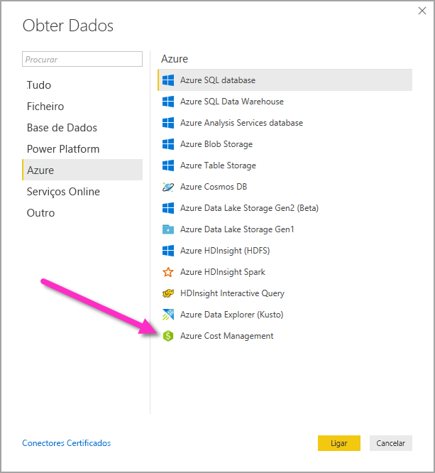
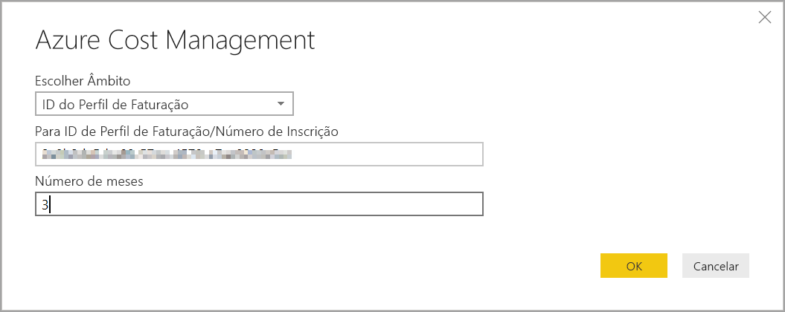
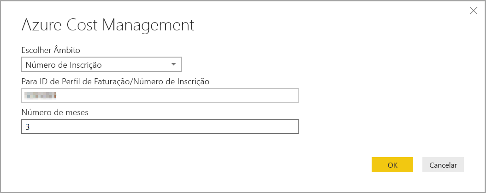
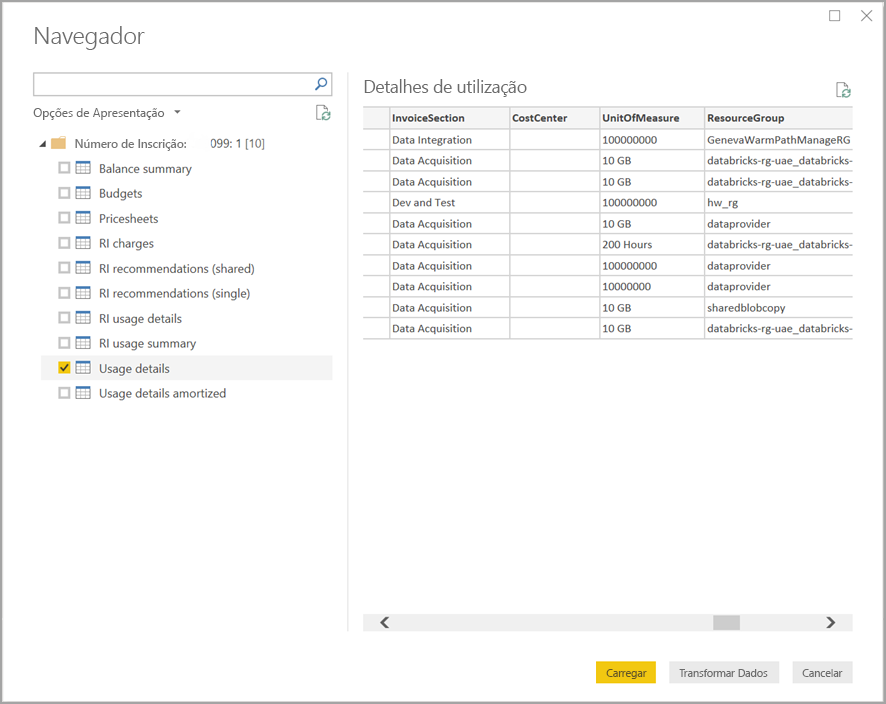

# Criar elementos visuais e relatórios com o conector do Azure Cost Management no Power BI Desktop

Pode utilizar o conector do Azure Cost Management do Power BI Desktop para criar relatórios e visualizações poderosos e personalizados para o ajudar a compreender melhor os gastos do Azure. O conector do Azure Cost Management suporta atualmente clientes com o [Contrato de Cliente da Microsoft](https://azure.microsoft.com/pricing/purchase-options/microsoft-customer-agreement/) ou um [Contrato Enterprise (EA)](https://azure.microsoft.com/pricing/enterprise-agreement/).  

O conector do Azure Cost Management utiliza o protocolo OAuth 2.0 para autenticação no Azure e identifica os utilizadores que vão utilizar o conector. Os tokens gerados neste processo são válidos por um período específico. O Power BI preserva o token para o próximo início de sessão. O OAuth 2.0 é uma norma do processo que ocorre em segundo plano para garantir o processamento seguro destas permissões. Para se ligar, deve utilizar uma conta de [Administrador do Enterprise](/azure/billing/billing-understand-ea-roles) para os Contratos Enterprise ou uma de [Proprietário da conta de faturação](/azure/billing/billing-understand-mca-roles) para os Contratos de Cliente da Microsoft. 

> [!NOTE]
> Este conector substitui o conector do [Azure Consumption Insights e Azure Cost Management (Beta)](desktop-connect-azure-consumption-insights.md) anteriormente disponível. Todos os relatórios criados com o conector anterior têm de ser recriados com este conector.

## Ligar com o Azure Cost Management

Para utilizar o conector do **Azure Cost Management** no Power BI Desktop, siga estes passos:

1.  No friso **Home Page**, selecione **Obter Dados**.
2.  Selecione **Azure**  na lista de categorias de dados.
3.  Selecione **Azure Cost Management**.

    

4. Na caixa de diálogo apresentada, introduza o **ID do Perfil de Faturação** para os **Contratos de Cliente da Microsoft** ou o **Número de Inscrição** para os **Contratos Enterprise (EA)** . 

## Ligar-se a uma conta a Contrato de Cliente da Microsoft 

Para se ligar a uma conta do **Contrato de Cliente da Microsoft**, pode obter o **ID do Perfil de Faturação** no portal do Azure:

1.  No [portal do Azure](https://portal.azure.com/), navegue para **Cost Management + Faturação**.
2.  Selecione o Perfil de faturação. 
3.  Em **Definições** no menu, selecione **Propriedades** na barra lateral.
4.  Em **Perfil de faturação**, copie o **ID**. 
5.  Para **Escolher Âmbito**, selecione **ID do Perfil de Faturação** e cole o ID do perfil de faturação do passo anterior. 
6.  Introduza o número de meses e selecione **OK**.

    

7.  Quando pedido, inicie sessão com a conta de utilizador e a palavra-passe do Azure. 

## Ligar-se a uma conta do Contrato Enterprise

Para se ligar com uma conta do Contrato Enterprise (EA), pode obter o ID de inscrição no portal do Azure:

1.  No [portal do Azure](https://portal.azure.com/), navegue para **Cost Management + Faturação**.
2.  Selecione a sua conta de faturação.
3.  No menu **Descrição geral** , copie o **ID da conta de faturação**.
4.  Para **Escolher Âmbito**, selecione **Número de Inscrição** e cole o ID da conta de faturação do passo anterior. 
5.  Introduza o número de meses e, em seguida, selecione **OK**.

    

6.  Quando pedido, inicie sessão com a conta de utilizador e a palavra-passe do Azure. 

## Dados disponíveis através do conector

Após ser autenticado com sucesso, é apresentada uma janela do **Navegador** com as seguintes tabelas de dados disponíveis:

| **Tabela** | **Descrição** |
| --- | --- |
| **Resumo de saldo** | Resumo do saldo de um Contrato Enterprise (EA). |
| **Billing events** (Eventos de faturação) | Registo de eventos das novas faturas, compras de crédito, etc. Apenas Contratos de Cliente da Microsoft. |
| **Orçamentos** | Detalhes dos orçamentos para ver os custos reais ou a utilização em comparação com os objetivos orçamentais existentes. |
| **Cobranças** | Um resumo mensal da utilização do Azure, cobranças do Marketplace e cobranças faturadas separadamente. Apenas Contratos de Cliente da Microsoft. |
| **Credit lots** (Lotes de crédito) | Os detalhes de compra de lotes de crédito do Azure para o perfil de faturação fornecido. Apenas Contratos de Cliente da Microsoft. |
| **Pricesheets** (Folhas de preços) | Taxas de medição aplicáveis para o perfil de faturação ou inscrição EA. |
| **RI charges** (Cobranças de RI) | Cobranças associadas às Instâncias Reservadas nos últimos 24 meses. |
| **RI recommendations (shared)** (Recomendações de RI [partilhado]) | Recomendações de compra de Instâncias Reservadas com base em todas as suas tendências de utilização de subscrição nos últimos 7, 30 ou 60 dias. |
| **RI recommendations (single)** (Recomendações de RI [individual]) | Recomendações de compra de Instâncias Reservadas com base nas suas tendências de utilização de subscrição individual nos últimos 7, 30 ou 60 dias. |
| **Detalhes de utilização de RI** | Detalhes de consumo das Instâncias Reservadas existentes no mês anterior. |
| **Resumo de utilização de RI** | Percentagem de utilização da reserva diária do Azure. |
| **Usage details** (Detalhes de utilização) | Uma análise das quantidades consumidas e da estimativa das cobranças para o perfil de faturação ou inscrição EA fornecido. |
| **Detalhes de utilização amortizados** | Uma análise das quantidades consumidas e da estimativa das cobranças amortizadas para o perfil de faturação ou inscrição EA fornecido. |

Pode selecionar uma tabela para ver uma caixa de diálogo de pré-visualização. Pode selecionar uma ou mais tabelas ao selecionar as caixas junto do nome e, em seguida, selecionar **Carregar**.

Quando selecionar **Carregar**, os dados serão carregados para o Power BI Desktop. 

Quando os dados selecionados tiverem sido carregados, os campos e as tabelas de dados são apresentados no painel **Campos**.

## Próximos passos

Pode ligar a muitas origens de dados diferentes através do Power BI Desktop. Para obter mais informações, veja os seguintes artigos:

* [O que é o Power BI Desktop?](../fundamentals/desktop-what-is-desktop.md)
* [Origens de Dados no Power BI Desktop](desktop-data-sources.md)
* [Formatar e Combinar Dados com o Power BI Desktop](desktop-shape-and-combine-data.md)
* [Ligar a livros do Excel no Power BI Desktop](desktop-connect-excel.md)   
* [Introduzir dados diretamente no Power BI Desktop](desktop-enter-data-directly-into-desktop.md)