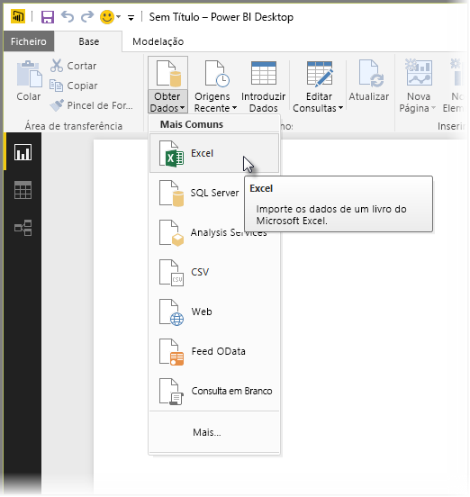

# Ligar a livros do Excel no Power BI Desktop
Ligar a um livro do Excel a partir do Power BI Desktop é simples, e este artigo explica os passos.

No Power BI Desktop, selecione **Obter Dados > Excel** no friso **Base**.

Selecione o livro na caixa de diálogo **Abrir** que é apresentada.

O Power BI Desktop apresenta as tabelas de outros elementos de dados do livro na janela **Navegador**. Quando seleciona uma tabela no painel esquerdo, uma pré-visualização dos dados é apresentada no painel direito.

Pode selecionar o botão Carregar para importar os dados ou, se pretender editar os dados com o **Editor de Consultas** antes de colocá-los no Power BI Desktop, selecione o botão **Editar**.

Ao carregar os dados, o Power BI Desktop apresenta a janela **Carregar** e apresenta a atividade associada ao carregamento dos dados.  

Quando terminar, o Power BI Desktop apresenta as tabelas e os campos importados do livro do Excel no painel **Campos**, no lado direito do Desktop.

E já está!

Está pronto para utilizar os dados importados do livro do Excel no Power BI Desktop para criar elementos visuais, relatórios ou interagir com outros dados aos quais possa querer ligar e importar, como outros livros do Excel, bases de dados ou qualquer outra origem de dados.

## Próximos passos
Existem diversos tipos de dados aos quais se pode ligar através do Power BI Desktop. Para obter mais informações sobre origens de dados, consulte os seguintes recursos:

* [O que é o Power BI Desktop?](../fundamentals/desktop-what-is-desktop.md)
* [Origens de Dados no Power BI Desktop](desktop-data-sources.md)
* [Formatar e Combinar Dados com o Power BI Desktop](desktop-shape-and-combine-data.md)
* [Ligar a ficheiros CSV no Power BI Desktop](desktop-connect-csv.md)   
* [Introduzir dados diretamente no Power BI Desktop](desktop-enter-data-directly-into-desktop.md)   
