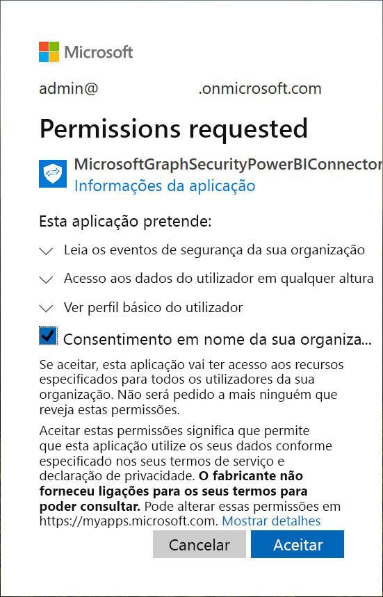

# Ligar-se à API de Segurança do Microsoft Graph no Power BI Desktop

Utilize o conector de Segurança do Microsoft Graph do Power BI Desktop para se ligar à [API de Segurança do Microsoft Graph](https://aka.ms/graphsecuritydocs). Em seguida, pode criar dashboards e relatórios para obter informações sobre os seus [alertas](https://docs.microsoft.com/graph/api/resources/alert?view=graph-rest-1.0) de segurança e [classificações de segurança](https://docs.microsoft.com/graph/api/resources/securescores?view=graph-rest-beta).

A API de Segurança do Microsoft Graph liga [múltiplas soluções de segurança](https://aka.ms/graphsecurityalerts) da Microsoft e dos respetivos parceiros do ecossistema para tornar a correlação de alertas mais fácil. Esta combinação disponibiliza acesso a informações contextuais avançadas e simplifica a automatização. Permite que as organizações obtenham informações e tomem medidas em múltiplos produtos de segurança, ao mesmo tempo que reduzem os custos e a complexidade.

## Pré-requisitos para utilizar o conector de Segurança do Microsoft Graph

Para utilizar o conector Segurança do Microsoft Graph, tem de obter autorização *explicitamente* por parte do administrador de inquilinos do Azure Active Directory (Azure AD). Veja [Requisitos de autenticação da Segurança do Microsoft Graph](https://aka.ms/graphsecurityauth).
Para obter autorização necessita do ID e nome da aplicação do conector, que é mencionado aqui e está disponível no [portal do Azure](https://portal.azure.com):

| Propriedade | Value |
|----------|-------|
| **Nome da aplicação** | `MicrosoftGraphSecurityPowerBIConnector` |
| **ID da Aplicação** | `cab163b7-247d-4cb9-be32-39b6056d4189` |
|||

Para conceder autorização para o conector, o seu administrador de inquilinos do Azure AD pode utilizar qualquer um dos seguintes métodos:

* [Conceda autorização para aplicações do Azure AD](https://docs.microsoft.com/azure/active-directory/develop/v2-permissions-and-consent)

* Responda a um pedido submetido pela sua aplicação lógica durante a primeira execução através da [experiência de autorização da aplicação](https://docs.microsoft.com/azure/active-directory/develop/application-consent-experience)
   
A conta do utilizador que inicia sessão no Conector de segurança do Microsoft Graph terá de ser atribuída à função Leitor de Segurança do Azure AD **se** o utilizador não for um membro da função *Administrador de Segurança*. Veja [Atribuir funções do Azure AD a utilizadores](https://docs.microsoft.com/graph/security-authorization#assign-azure-ad-roles-to-users).

## Utilizar o conector de Segurança do Microsoft Graph

Siga estes passos para utilizar o conector:

1. Selecione **Obter Dados** > **Mais** no friso **Base** do Power BI Desktop.
2. Selecione **Serviços Online** na lista de categorias à esquerda na janela.
3. Selecione **Microsoft Graph Security (Beta)** (Segurança do Microsoft Graph [Beta]).

    
    
4. Na janela **Microsoft Graph Security** (Segurança do Microsoft Graph) apresentada, selecione a versão da API de Segurança do Microsoft Graph para consulta: **v1.0** ou **beta**.

    
    
5. Inicie sessão na sua conta do Azure Active Directory quando lhe for pedido. Esta conta precisa de ter a função *Leitor de Segurança* ou *Administrador de Segurança*, conforme mencionado na secção anterior.

     
    
6. Se for o administrador do inquilino *e* se ainda não tiver concedido autorização ao conector de Segurança do Microsoft Graph do Power BI (aplicação), verá a seguinte caixa de diálogo. Selecione **Consentimento em nome da sua organização**.

    
    
7. Quando iniciar sessão, verá a seguinte janela a indicar que foi autenticado. Selecione **Ligar**.

    
    
8. Depois de ligar, a janela **Navegador** apresenta os alertas, classificações de segurança e outras entidades disponíveis na [API de Segurança do Microsoft Graph](https://aka.ms/graphsecuritydocs) referentes à versão que selecionou no passo 4. Selecione uma ou mais entidades para importar e utilizar no Power BI Desktop. Em seguida, selecione **Carregar** para obter a vista de resultados apresentada após o passo 9.

    
    
9. Se quiser utilizar uma consulta avançada com a API de Segurança do Microsoft Graph, selecione **Specify custom Microsoft Graph Security URL to filter results** (Especificar um URL de Segurança do Microsoft Graph personalizado para filtrar resultados). Utilize esta função para efetuar uma consulta [OData.Feed](https://docs.microsoft.com/power-bi/desktop-connect-odata) à API de Segurança do Microsoft Graph com as permissões necessárias.

   O seguinte exemplo utiliza o `https://graph.microsoft.com/v1.0/security/alerts?$filter=Severity eq 'High'` *serviceUri*. Para ver como criar consultas para filtrar, ordenar ou obter os resultados mais recentes, veja [Opções de consulta do sistema OData](https://docs.microsoft.com/graph/query-parameters).

   
    
   Ao selecionar **Invocar**, a função **OData.Feed** efetua uma chamada à API, que abre o Editor de Consultas. O utilizador filtra e refina o conjunto de dados que pretende utilizar. Em seguida, o utilizador carrega os dados para o Power BI Desktop.

Eis a janela de resultados para as entidades da Segurança do Microsoft Graph para as quais realizámos consultas:

   
    

Agora, está pronto para utilizar os dados importados do conector da Segurança do Microsoft Graph no Power BI Desktop. Pode criar gráficos ou relatórios. Em alternativa, pode interagir com outros dados que importa de livros do Excel, de bases de dados ou de outras origens de dados.

## Próximas etapas
* Consulte exemplos e modelos do Power BI que utilizam este conector no [Microsoft Graph Security GitHub Power BI sample repo](https://aka.ms/graphsecuritypowerbiconnectorsamples) (Repositório de Exemplos da Segurança do Microsoft Graph do Power BI no GitHub).

* Para cenários de utilizador e informações adicionais veja esta [mensagem de blogue sobre o Conector de Segurança do Microsoft Graph do Power BI](https://aka.ms/graphsecuritypowerbiconnectorblogpost).

* Pode ligar a todos os tipos de dados com o Power BI Desktop. Para obter mais informações, consulte os seguintes recursos:

    * [O que é o Power BI Desktop?](../fundamentals/desktop-what-is-desktop.md)
    * [Origens de dados no Power BI Desktop](desktop-data-sources.md)
    * [Formatar e combinar dados com o Power BI Desktop](desktop-shape-and-combine-data.md)
    * [Ligar a livros do Excel no Power BI Desktop](desktop-connect-excel.md)
    * [Introduzir dados diretamente no Power BI Desktop](desktop-enter-data-directly-into-desktop.md)
