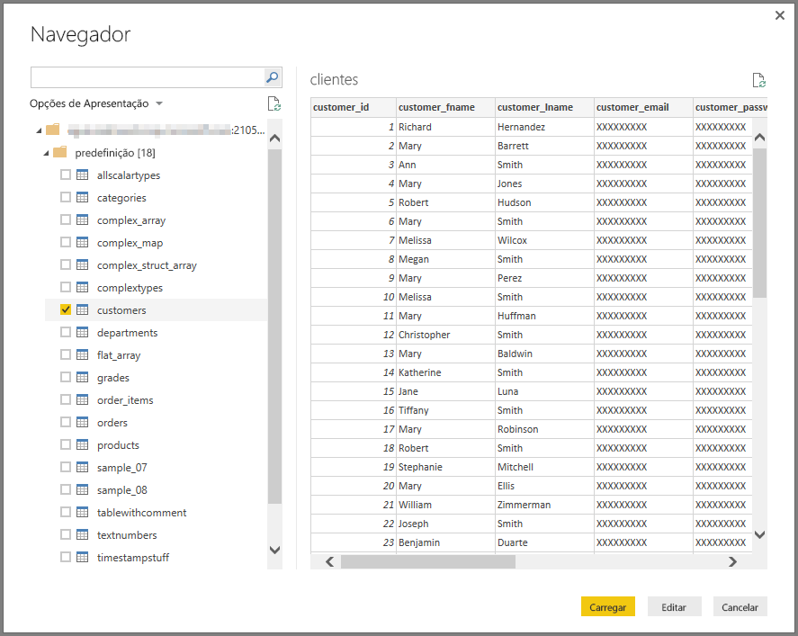

# Ligar a uma base de dados Impala no Power BI Desktop
No Power BI Desktop, pode ligar a uma base de dados **Impala** e utilizar os dados subjacentes, tal como faria com outra origem de dados no Power BI Desktop.

## Ligar a uma base de dados Impala
Para ligar a uma base de dados **Impala**, siga os passos seguintes: 

1. Selecione **Obter Dados** no friso **Base** do Power BI Desktop. 

2. Selecione **Base de Dados** nas categorias no lado esquerdo. Em seguida, verá **Impala**.

    

3. Na janela **Impala** apresentada, escreva ou cole o nome do seu servidor Impala na caixa. Em seguida, selecione **OK**. Pode **Importar** dados diretamente para o Power BI ou utilizar o **DirectQuery**. Saiba mais acerca da [utilização do DirectQuery](desktop-use-directquery.md).

    

4. Quando lhe for pedido, introduza as suas credenciais ou ligue-se de forma anónima. O conector Impala suporta a autenticação Anónima, Básica (nome de utilizador + palavra-passe) e do Windows.

    

    > [!NOTE]
    > Após introduzir o nome de utilizador e a palavra-passe para um determinado servidor **Impala**, o Power BI Desktop utiliza as mesmas credenciais nas tentativas de ligação subsequentes. Pode modificar essas credenciais, acedendo a **Ficheiro > Opções e definições > Definições da origem de dados**.

5. Depois de estabelecer ligação, uma janela **Navegador** aparece e apresenta os dados disponíveis no servidor. Escolha elementos a partir destes dados para importar e utilizar no **Power BI Desktop**.

    

## Considerações e limitações
Existem algumas limitações e considerações a ter em conta com o conector **Impala**:

* O conector Impala é suportado no gateway de dados no local, através de qualquer um dos três mecanismos de autenticação suportados.

## Próximas etapas
Existem bastantes origens de dados diferentes às quais se pode ligar com o Power BI Desktop. Para obter mais informações sobre as origens de dados, consulte os seguintes recursos:

* [O que é o Power BI Desktop?](../fundamentals/desktop-what-is-desktop.md)
* [Origens de dados no Power BI Desktop](desktop-data-sources.md)
* [Formatar e combinar dados com o Power BI Desktop](desktop-shape-and-combine-data.md)
* [Ligar a livros do Excel no Power BI Desktop](desktop-connect-excel.md)   
* [Introduzir dados diretamente no Power BI Desktop](desktop-enter-data-directly-into-desktop.md)   
