# Ligar-se ao LinkedIn Sales Navigator no Power BI Desktop

No **Power BI Desktop**, pode ligar-se ao **LinkedIn Sales Navigator** para ajudar a encontrar e a criar relações tal como qualquer outra origem de dados no Power BI Desktop, bem como criar relatórios prontos a utilizador acerca do progresso.

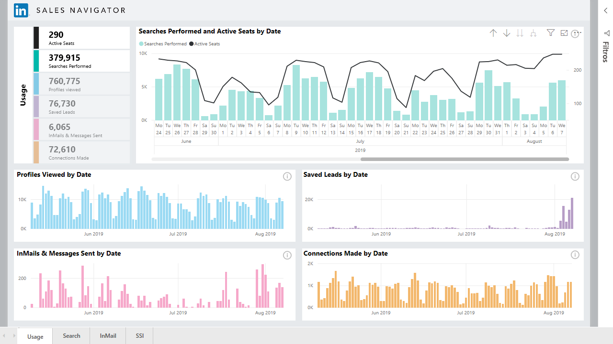

Para se ligar aos dados do LinkedIn com o **LinkedIn Sales Navigator**, precisa de um plano Enterprise do LinkedIn Sales Navigator e ser um Administrador ou um Utilizador de Relatório no Contrato do Sales Navigator.

O vídeo a seguir fornece uma visita guiada e um tutorial rápidos sobre a utilização da aplicação de modelo **LinkedIn Sales Navigator**, que é descrita em detalhes [mais adiante neste artigo](#using-the-linkedin-sales-navigator-template-app). 

> [!VIDEO https://www.youtube.com/embed/ZqhmaiORLw0]

## Ligar-se ao LinkedIn Sales Navigator

Para se ligar aos dados do **LinkedIn Sales Navigator**, selecione **Obter Dados** no friso **Base** do Power BI Desktop. Selecione **Serviços Online** nas categorias à esquerda e, em seguida, desloque-se até ver **LinkedIn Sales Navigator (Beta)** .

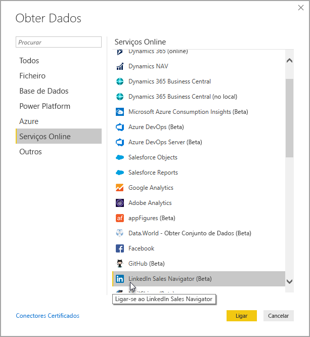

Será alertado de que está a ligar-se a um conetor de terceiros que ainda está em desenvolvimento. 

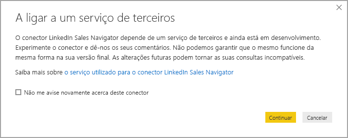

Ao selecionar **Continuar**, deverá especificar os dados pretendidos.

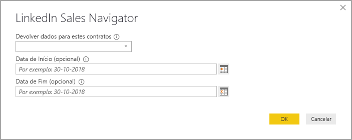

Na janela **LinkedIn Sales Navigator** apresentada, selecione os dados que quer devolver, *Todos os contactos* ou *Contactos selecionados* no primeiro seletor pendente. Em seguida, pode especificar as datas de início e de fim para restringir os dados recebidos numa janela de tempo específica.

Depois de ter fornecido as informações, o Power BI Desktop liga-se aos dados associados ao seu contrato do LinkedIn Sales Navigator. Utilize o mesmo endereço de e-mail que utiliza para iniciar sessão no LinkedIn Sales Navigator através do site. 

Depois de iniciar sessão, é-lhe pedido que selecione os dados do contrato do LinkedIn Sales Navigator numa janela **Navegador**.

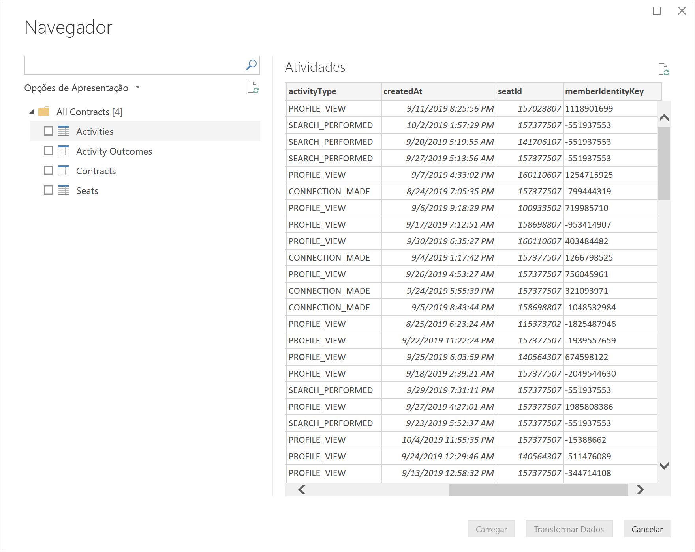

Pode criar os relatórios que quiser com os dados do LinkedIn Sales Navigator. Para facilitar as coisas, também há um ficheiro .PBIX do LinkedIn Sales Navigator. que pode transferir. Este possui dados de exemplo já fornecidos, para que possa familiarizar-se com os dados e relatórios, sem precisar de começar do zero.

Pode transferir o ficheiro PBIX a partir da seguinte localização:
* [PBIX para o LinkedIn Sales Navigator](service-template-apps-samples.md)

Além do ficheiro PBIX, o LinkedIn Sales Navigator também tem uma aplicação de modelo que pode transferir e utilizar. A próxima secção descreve a aplicação de modelo em detalhe.

## Utilizar a aplicação de modelo do LinkedIn Sales Navigator

Para facilitar ao máximo a utilização do **LinkedIn Sales Navigator**, pode utilizar a [aplicação de modelo](service-template-apps-overview.md) que cria automaticamente um relatório pronto a utilizar com base nos seus dados do LinkedIn Sales Navigator.

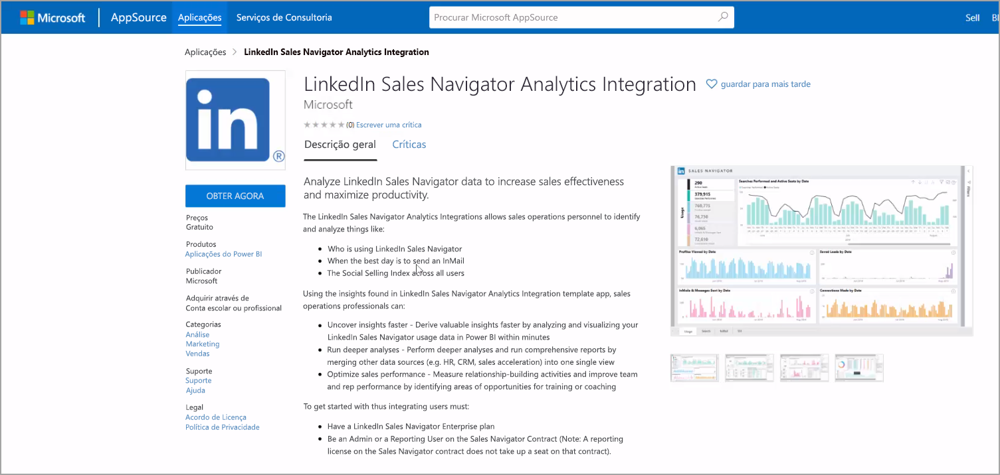

Ao transferir a aplicação, pode selecionar se quer ligar-se aos dados ou explorar a aplicação com os dados de exemplo. Pode sempre retroceder e ligar-se aos seus próprios dados do LinkedIn Sales Navigator depois de explorar os dados de exemplo. 

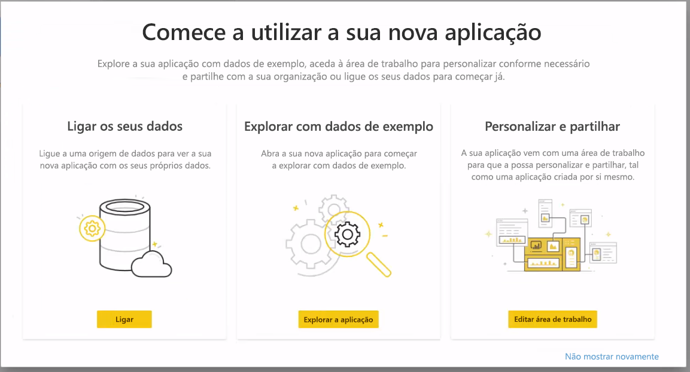

Pode obter a aplicação de modelo do **LinkedIn Sales Navigator** através da seguinte ligação:
* [Aplicação de modelo do LinkedIn Sales Navigator](https://appsource.microsoft.com/en-us/product/power-bi/pbi-contentpacks.linkedin_navigator)

A aplicação de modelo fornece quatro separadores para ajudar a analisar e partilhar as informações:

* Usage
* Procurar
* InMail
* SSI

O separador **Utilização** mostra os dados gerais do LinkedIn Sales Navigator.

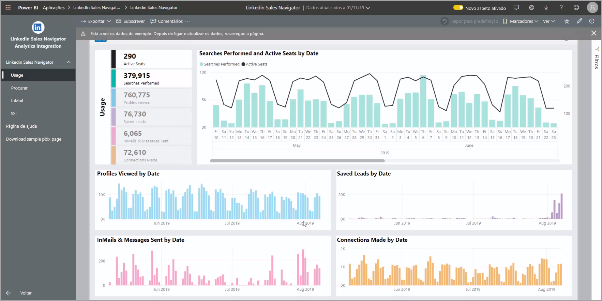

O separador **Procurar** permite-lhe realizar uma busca mais detalhada nos resultados de pesquisa:

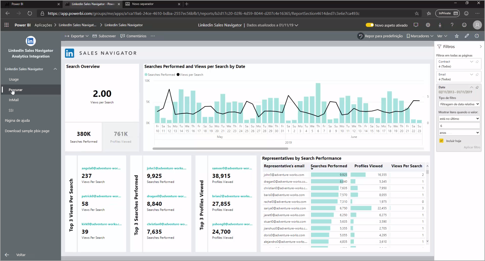

O **InMail** fornece informações sobre a utilização do InMail, incluindo o número de InMails enviados, as taxas de aceitação e outras informações úteis:

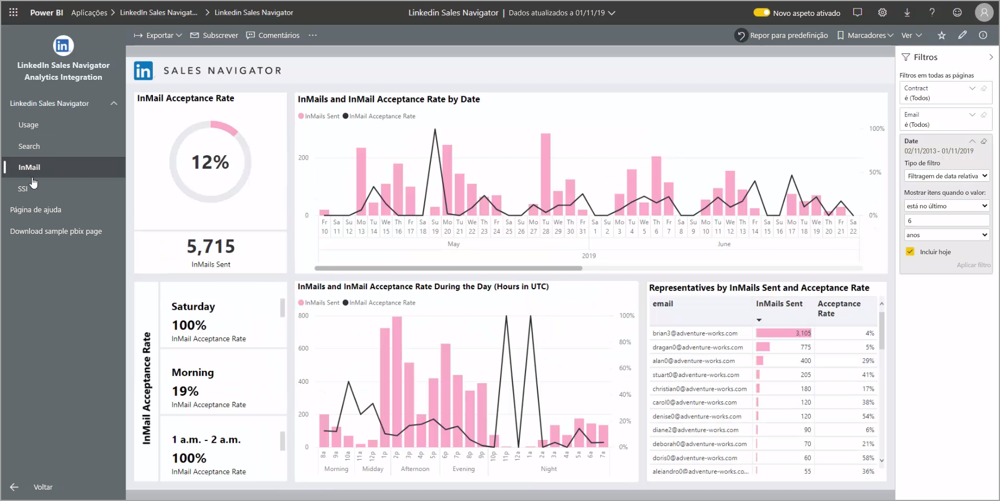

O separador **SSI** fornece detalhes adicionais sobre o SSI (índice de vendas sociais):

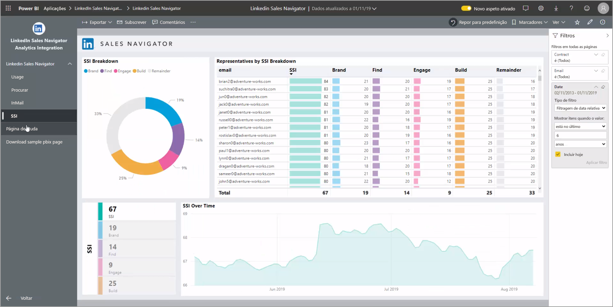

Para avançar dos dados de exemplo para os seus próprios dados, selecione **aplicação de edição** no canto superior direito (o ícone de lápis) e, em seguida, selecione **Ligar os dados** no ecrã apresentado.

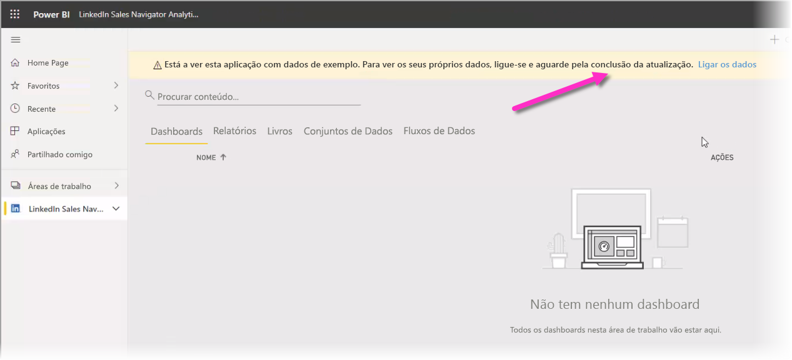

A partir daí, pode ligar-se aos seus próprios dados ao selecionar o número de dias de dados a carregar. Pode carregar até 365 dias de dados. Terá de iniciar sessão novamente com o mesmo endereço de e-mail que utiliza para iniciar sessão no LinkedIn Sales Navigator através do site. 

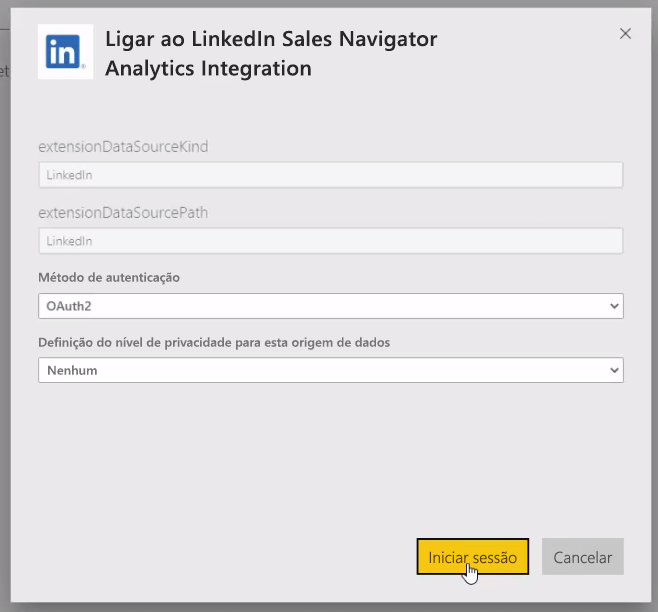

Em seguida, a aplicação de modelo atualiza os dados na aplicação com os seus dados. Também pode configurar uma atualização agendada, para que os dados na aplicação estejam tão atuais quanto especificado pela frequência das atualizações. 

Depois de os dados serem atualizados, poderá ver a aplicação a ser preenchida com os seus próprios dados.

## Obter ajuda

Caso se depare com problemas ao ligar-se aos seus dados, pode contactar o suporte do LinkedIn Sales Navigator através da ligação https://www.linkedin.com/help/sales-navigator. 

## Próximas etapas
Existem diversos tipos de dados aos quais se pode ligar através do Power BI Desktop. Para obter mais informações sobre origens de dados, consulte os seguintes recursos:

* [O que é o Power BI Desktop?](../fundamentals/desktop-what-is-desktop.md)
* [Origens de Dados no Power BI Desktop](desktop-data-sources.md)
* [Moldar e Combinar Dados com o Power BI Desktop](desktop-shape-and-combine-data.md)
* [Ligar a livros do Excel no Power BI Desktop](desktop-connect-excel.md)   
* [Introduzir dados diretamente no Power BI Desktop](desktop-enter-data-directly-into-desktop.md)   
