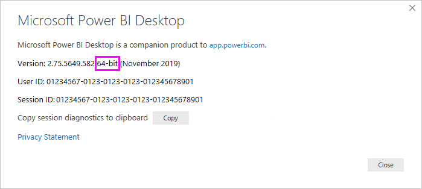
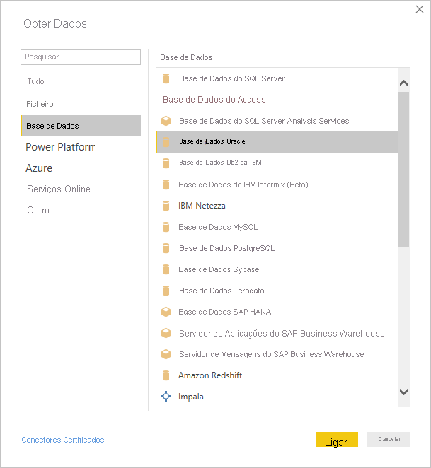
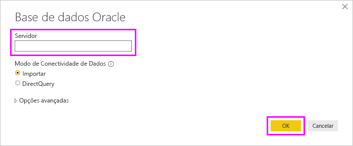
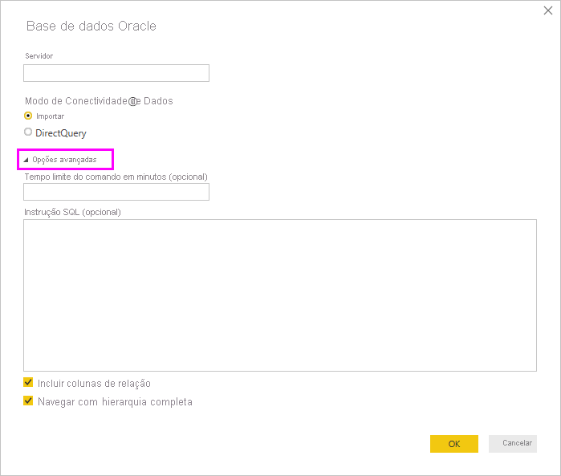

# Ligar a uma base de dados Oracle com o Power BI Desktop
Para se ligar a uma base de dados do Oracle com o Power BI Desktop, tem de ser instalado o software cliente Oracle correto no computador que está a executar o Power BI Desktop. O software cliente Oracle que utiliza depende da versão do Power BI Desktop que tem instalada: a versão de 32 bits ou a versão de 64 bits. Também depende da sua versão do servidor Oracle.

Versões do Oracle suportadas: 
- Oracle Server 9 e posterior
- Software Oracle Data Access Client (ODAC) 11.2 e posterior

> [!NOTE]
> Se estiver a configurar uma base de dados Oracle para o Power BI Desktop, o Gateway de Dados no Local ou o Power BI Report Server, veja as informações no artigo [Oracle Connection Type](/sql/reporting-services/report-data/oracle-connection-type-ssrs?view=sql-server-ver15) (Tipo de Ligação Oracle). 

## Determinar que versão do Power BI Desktop está instalada
Para determinar qual é a versão do Power BI Desktop que está instalada, selecione **Ficheiro** > **Ajuda** > **Acerca de** e, em seguida, veja a linha **Versão**. Na imagem seguinte, está instalada a versão de 64 bits do Power BI Desktop:

## Instalar o cliente Oracle
- Para a versão de 32 bits do Power BI Desktop, [transfira e instale o cliente Oracle de 32 bits](https://www.oracle.com/technetwork/topics/dotnet/utilsoft-086879.html).

- Para a versão de 64 bits do Power BI Desktop, [transfira e instale o cliente Oracle de 64 bits](https://www.oracle.com/database/technologies/odac-downloads.html).

> [!NOTE]
> Selecione uma versão do Oracle Data Access Client (ODAC) que seja compatível com o Oracle Server. Por exemplo, o ODAC 12.X nem sempre suporta a versão 9 do Oracle Server.
> Selecione o instalador do Windows do Cliente Oracle.
> Durante a configuração do cliente Oracle, certifique-se de que ativa a opção *Configurar ODP.NET e/ou Fornecedores Oracle para ASP.NET ao nível do computador* ao selecionar a caixa de verificação correspondente no assistente de configuração. Algumas versões do assistente do cliente Oracle selecionam a caixa de verificação por predefinição, outras não. Certifique-se de que a caixa de verificação está selecionada, para que o Power BI possa ligar-se à sua base de dados Oracle.

## Ligar a uma base de dados Oracle
Depois de instalar o controlador cliente Oracle adequado, pode estabelecer ligação com uma base de dados do Oracle. Para estabelecer ligação, efetue os seguintes passos:

1. No separador **Base**, selecione **Obter Dados**. 

2. Na janela **Obter Dados** que é apresentada, selecione **Mais** (se for necessário), selecione **Base de dados** > **Base de dados Oracle** e, em seguida, selecione **Ligar**.
   
   
3. Na caixa de diálogo **Base de dados Oracle** que é apresentada, indique o nome do **Servidor** e selecione **OK**. Se for necessário um SID, especifique-o com o formato: *ServerName/SID*, em que *SID* é o nome exclusivo da base de dados. Se o formato *ServerName/SID* não funcionar, utilize *ServerName/ServiceName*, em que *ServiceName* é o alias que utiliza para ligar.

   

   > [!NOTE]
   > Se estiver a utilizar uma base de dados local ou ligações de base de dados autónomas, poderá ser necessário colocar o nome do servidor entre aspas para evitar erros de ligação. 
      
4. Se pretender importar dados com recurso a uma consulta de base de dados nativa, coloque a sua consulta na caixa **Instrução SQL**, que aparece quando expande a secção **Opções avançadas** da caixa de diálogo **Base de dados Oracle**.
   
   

5. Depois de introduzir as informações da base de dados Oracle na caixa de diálogo **Base de dados Oracle** (incluindo informações opcionais, tais como um SID ou uma consulta de base de dados nativa), selecione **OK** para ligar.
5. Se a base de dados Oracle requerer credenciais de utilizador de base de dados, introduza essas credenciais na caixa de diálogo quando lhe for pedido.

## Resolução de problemas

Poderá deparar-se com vários erros do Oracle quando a sintaxe de nomenclatura estiver incorreta ou não estiver configurada corretamente:

* ORA-12154: TNS: não foi possível resolver o identificador de ligação especificado.
* ORA-12514: TNS: o serviço de escuta não conhece atualmente o serviço pedido no descritor de ligação.
* ORA-12541: TNS: nenhum serviço de escuta.
* ORA-12170: TNS: tempo limite da ligação excedido.
* ORA-12504: TNS: o serviço de escuta não foi atribuído a SERVICE_NAME em CONNECT_DATA.

Estes erros podem ocorrer se o cliente Oracle não estiver instalado ou se não estiver configurado corretamente. Se estiver instalado, certifique-se de que o ficheiro tnsnames.ora está configurado corretamente e está a utilizar o net_service_name adequado. Também terá de certificar-se de que o net_service_name é o mesmo entre o computador que está a utilizar o Power BI Desktop e o computador que está a executar o gateway. Para obter mais informações, veja [Instalar o cliente Oracle](#install-the-oracle-client).

Também poderá ocorrer um problema de compatibilidade entre a versão do servidor Oracle e a versão Oracle Data Access Client. Normalmente, pretende que estas versões correspondam, uma vez que algumas combinações são incompatíveis. Por exemplo, o ODAC 12.X não suporta a versão 9 do Oracle Server.

Se transferiu o Power BI Desktop a partir da Microsoft Store, é possível que não consiga ligar a bases de dados Oracle devido a um problema no controlador da Oracle. Caso se depare com este problema, será devolvida a mensagem de erro: *A referência do objeto não foi definida*. Para resolver o problema, siga um dos seguintes passos:

* Transfira o Power BI Desktop a partir do [Centro de Transferências](https://www.microsoft.com/download/details.aspx?id=58494) em vez de a partir da Microsoft Store.

* Se quiser utilizar a versão da Microsoft Store: no seu computador local, copie o ficheiro oraons.dll de _12.X.X\client_X_ para _12.X.X\client_X\bin_, em que _X_ representa os números da versão e do diretório.

Se vir a mensagem de erro *A referência do objeto não foi definida* no Power BI Gateway quando ligar a uma base de dados Oracle, siga as instruções presentes no artigo [Gerir a origem de dados – Oracle](service-gateway-onprem-manage-oracle.md).

Se estiver a utilizar o Power BI Report Server, consulte a orientação no artigo [Oracle Connection Type](/sql/reporting-services/report-data/oracle-connection-type-ssrs?view=sql-server-ver15) (Tipo de Ligação Oracle).