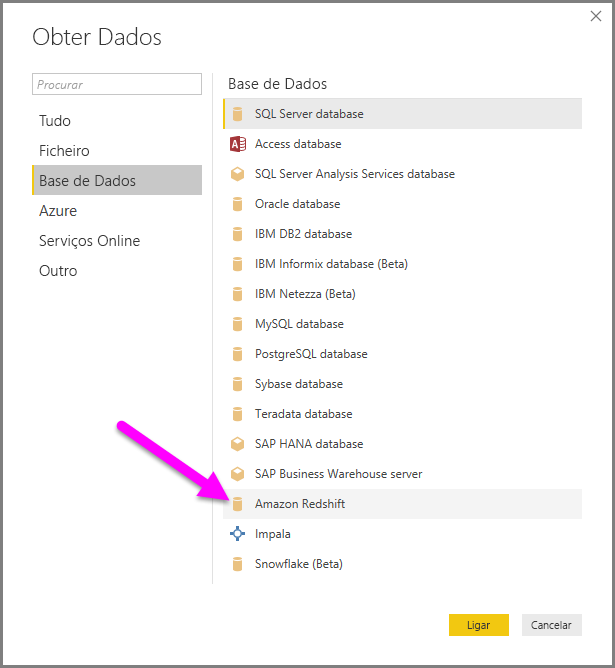
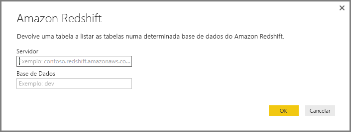
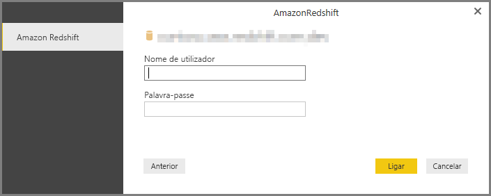
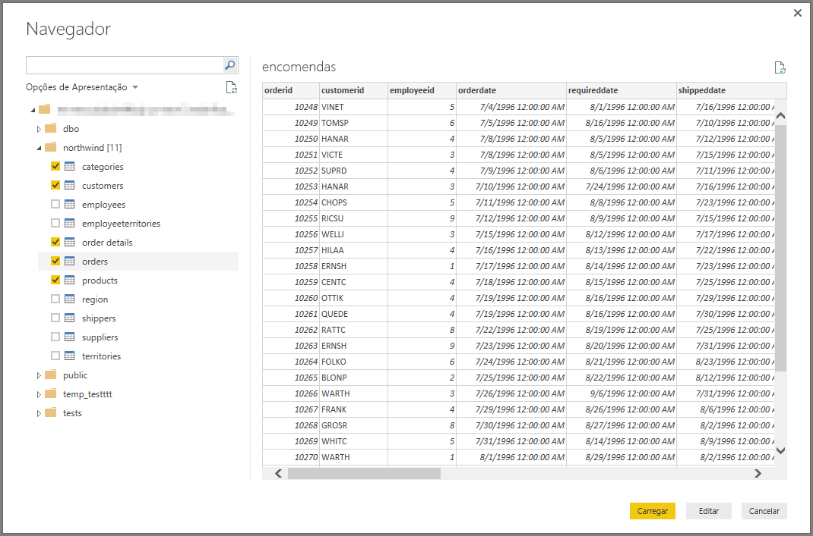

# Ligar a uma base de dados Amazon Redshift no Power BI Desktop
No **Power BI Desktop**, pode ligar a uma base de dados **Amazon Redshift** e utilizar os dados subjacentes, tal como faria com outra origem de dados no Power BI Desktop.

## Ligar a uma base de dados Amazon Redshift
Para ligar a uma base de dados **Amazon Redshift**, selecione **Obter Dados** a partir do friso **Base** no Power BI Desktop. Selecione **Base de Dados** nas categorias no lado esquerdo e verá **Amazon Redshift**.

Na janela **Amazon Redshift** que é apresentada, escreva ou cole o nome do servidor e base de dados **Amazon Redshift** na caixa. Como parte do campo *Servidor*, os utilizadores podem especificar uma porta no seguinte formato: *ServerURL:Port*

Quando lhe for pedido, introduza o seu nome de utilizador e a palavra-passe. Para evitar erros, deve utilizar o nome do servidor que corresponde exatamente ao certificado SSL. 

Depois de a ligação ser concluída com êxito, é apresentada uma janela **Navegador**, que apresenta os dados disponíveis no servidor, dos quais pode selecionar um ou vários elementos para importar e utilizar no **Power BI Desktop**.

Depois de efetuar as seleções na janela **Navegador** , pode **Carregar** ou **Editar** os dados.

* Se optar por **Carregar** os dados, ser-lhe-á pedido que utilize o modo de *Importação* ou o *DirectQuery* para carregar os dados. Para obter mais informações, veja este [artigo que explica o DirectQuery](desktop-use-directquery.md).
* Se optar por **Editar** os dados, o **Editor de Consultas** é apresentado, onde pode aplicar todos os tipos de transformações e filtros aos dados, muitos dos quais são aplicados à própria base de dados **Amazon Redshift** subjacente (caso seja suportada).

## Próximas etapas
Existem diversos tipos de dados aos quais se pode ligar através do Power BI Desktop. Para obter mais informações sobre origens de dados, consulte os seguintes recursos:

* [O que é o Power BI Desktop?](../fundamentals/desktop-what-is-desktop.md)
* [Origens de Dados no Power BI Desktop](desktop-data-sources.md)
* [Moldar e Combinar Dados com o Power BI Desktop](desktop-shape-and-combine-data.md)
* [Ligar a livros do Excel no Power BI Desktop](desktop-connect-excel.md)   
* [Introduzir dados diretamente no Power BI Desktop](desktop-enter-data-directly-into-desktop.md)   
