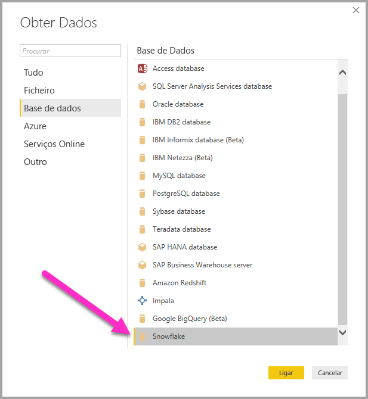
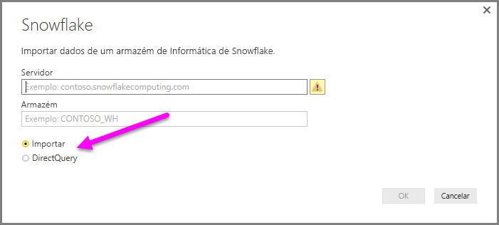
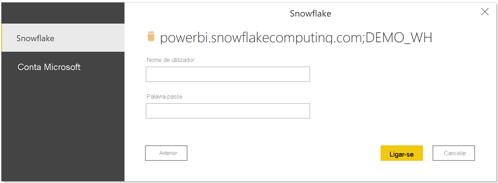
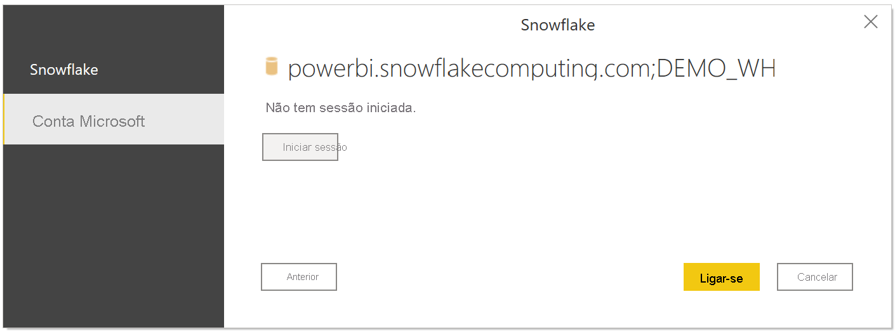
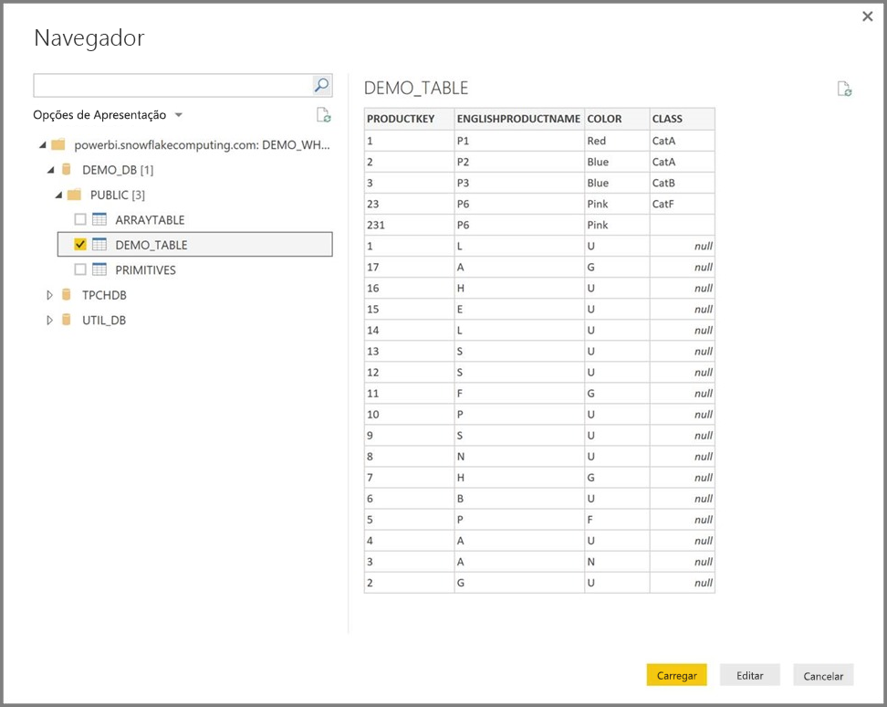

# Ligar ao Snowflake no Power BI Desktop
No Power BI Desktop, pode ligar a um armazém de informática de **Snowflake** e utilizar os dados subjacentes, tal como faria com outra origem de dados no Power BI Desktop. 

## Ligar a um armazém de informática de Snowflake
Para ligar a um armazém de informática de **Snowflake**, selecione **Obter Dados** a partir do friso **Base** no Power BI Desktop. Selecione **Base de Dados** nas categorias no lado esquerdo e verá **Snowflake**.

Na janela do **Snowflake** que é apresentada, escreva ou cole o nome do seu armazém de informática de Snowflake na caixa e selecione **OK**. Tenha em atenção que pode optar por **Importar** dados diretamente para o Power BI ou pode utilizar o **DirectQuery**. Pode saber mais sobre [utilizar o DirectQuery](desktop-use-directquery.md). Tenha em atenção que o SSO do AAD só suporta DirectQuery.

Quando lhe for pedido, introduza o seu nome de utilizador e a palavra-passe.

> [!NOTE]
> Depois de introduzir o seu nome de utilizador e a palavra-passe para um determinado servidor **Snowflake**, o Power BI Desktop utiliza as mesmas credenciais nas tentativas de ligação subsequentes. Pode modificar essas credenciais, acedendo a **Ficheiro > Opções e definições > Definições da origem de dados**.
> 
> 

Se quiser utilizar a opção de conta Microsoft, a integração do AAD no Snowflake tem de ser configurada do lado do Snowflake. Para tal, leia a secção Introdução da [documentação do Snowflake sobre o tópico](https://docs.snowflake.net/manuals/user-guide/oauth-powerbi.html#power-bi-sso-to-snowflake).

Depois de a ligação ser concluída com êxito, é apresentada uma janela **Navegador**, que apresenta os dados disponíveis no servidor, dos quais pode selecionar um ou vários elementos para importar e utilizar no **Power BI Desktop**.

Pode **Carregar** a tabela selecionada, que traz toda a tabela para o **Power BI Desktop**, ou pode **Editar** a consulta, que abre o **Editor de Consultas**, para poder filtrar e refinar o conjunto de dados que pretende utilizar, e carregar o conjunto de dados refinados para o **Power BI Desktop**.

## Funções Personalizadas

Atualmente, o suporte para 'Função Personalizada' no conector Snowflake só funcionará com a Autenticação Básica. Isto será resolvido num futuro próximo.

## Próximos passos
Existem diversos tipos de dados aos quais se pode ligar através do Power BI Desktop. Para obter mais informações sobre origens de dados, consulte os seguintes recursos:

* [O que é o Power BI Desktop?](../fundamentals/desktop-what-is-desktop.md)
* [Origens de Dados no Power BI Desktop](desktop-data-sources.md)
* [Formatar e Combinar Dados com o Power BI Desktop](desktop-shape-and-combine-data.md)
* [Ligar a livros do Excel no Power BI Desktop](desktop-connect-excel.md)   
* [Introduzir dados diretamente no Power BI Desktop](desktop-enter-data-directly-into-desktop.md)   
