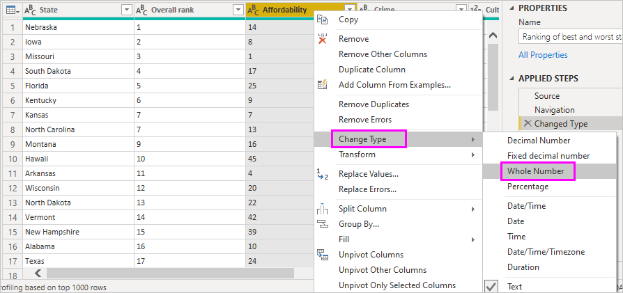

# Ligar a fontes de dados no Power BI Desktop

Com o Power BI Desktop, pode ligar facilmente ao mundo dos dados, que está em constante expansão. Se não tiver o Power BI Desktop, pode [transferir](https://go.microsoft.com/fwlink/?LinkID=521662) e instalá-lo.

Há *todos os tipos* de origens de dados disponíveis no Power BI Desktop. A imagem a seguir mostra como ligar-se a dados, ao selecionar **Obter Dados** > **Outros** > **Web**.

## Exemplo de ligação a dados

Neste exemplo, vamos ligar-nos a uma origem de dados **Web**.

Imagine que se vai reformar. Deseja viver onde há muito sol, impostos favoráveis e uma boa assistência médica. Ou... talvez seja um cientista de dados e queira essas informações para ajudar os seus clientes. Por exemplo, para ajudar o seu cliente que fabrica impermeáveis a direcionar as vendas para locais onde chove *muito*.

De qualquer modo, pode encontrar um recurso Web com dados interessantes sobre esses tópicos e muito mais:

[https://www.bankrate.com/finance/retirement/best-places-retire-how-state-ranks.aspx](https://www.bankrate.com/finance/retirement/best-places-retire-how-state-ranks.aspx)

Selecione **Obter Dados** > **Outros** > **Web**. Em **Da Web**, introduza o endereço.

Ao selecionar **OK**, a funcionalidade *Consulta* do Power BI Desktop começa a funcionar. O Power BI Desktop entra em contacto com o recurso da Web e a janela **Browser** devolve os resultados encontrados pela consulta nessa página da Web. Neste caso, encontrou uma tabela e o Documento geral. Estamos interessados na tabela, pelo que vamos selecioná-la na lista. A janela **Browser** apresenta uma pré-visualização.

Neste ponto, pode editar a consulta antes de carregar a tabela ao selecionar **Transformar Dados** na parte inferior da janela, ou pode carregar a tabela.

Selecione **Transformar Dados** para carregar a tabela e abrir o Editor do Power Query. O painel **Definições de Consulta** é apresentado. Se não for, selecione **Ver** no friso e, em seguida, **Definições de Consulta** para apresentar o painel **Definições de Consulta**. Eis o respetivo aspeto.

Todas essas pontuações são texto e não números e precisamos que sejam números. Sem problemas. Basta clicar com o botão direito do rato no cabeçalho da coluna e selecionar **Alterar Tipo** > **Número Inteiro** para alterá-lo. Para escolher mais de uma coluna, primeiro selecionamos uma coluna, mantemos pressionada a tecla Shift, selecionamos colunas adjacentes adicionais e clicamos com o botão direito do rato num título de coluna para alterar todas as colunas selecionadas. Prima Ctrl para selecionar colunas que não são adjacentes.

Em **Definições de Consultas**, os **PASSOS APLICADOS** refletem as alterações que foram feitas. Conforme realiza alterações adicionais aos dados, o Editor do Power Query vai registar essas alterações na secção **PASSOS APLICADOS** e poderá ajustar, revisitar, reorganizar ou eliminá-las conforme necessário.

Ainda podem ser feitas alterações adicionais à tabela depois de esta ser carregada, mas o que já fizemos é suficiente por enquanto. Quando terminar, selecione **Fechar e Aplicar** no friso **Home Page** e o Power BI Desktop aplica as alterações e fecha o Editor do Power Query.

Com o modelo de dados carregado, na vista de **Relatório** no Power BI Desktop, podemos começar a criar visualizações ao arrastar campos para o ecrã.

Claro que este modelo é simples, com uma única ligação de dados. A maioria dos relatórios do Power BI Desktop terá ligações a diferentes origens de dados, moldadas para satisfazer as suas necessidades, com relações que produzem um modelo de dados avançado.

## Próximas etapas
Existem inúmeras coisas que pode fazer com o Power BI Desktop. Para obter mais informações sobre as respetivas capacidades, consulte os seguintes recursos:

* [O que é o Power BI Desktop?](../fundamentals/desktop-what-is-desktop.md)
* [Acerca da utilização do Editor de Consultas no Power BI Desktop](../transform-model/desktop-query-overview.md)
* [Origens de dados no Power BI Desktop](desktop-data-sources.md)
* [Formatar e combinar dados no Power BI Desktop](desktop-shape-and-combine-data.md)
* [Executar tarefas comuns de consulta no Power BI Desktop](../transform-model/desktop-common-query-tasks.md)   

Pretende enviar-nos comentários? Ótimo! Utilize o item de menu **Submeter uma Ideia** no Power BI Desktop ou aceda ao [Feedback da Comunidade](https://community.powerbi.com/t5/Community-Feedback/bd-p/community-feedback). Aguardamos o seu contacto!

