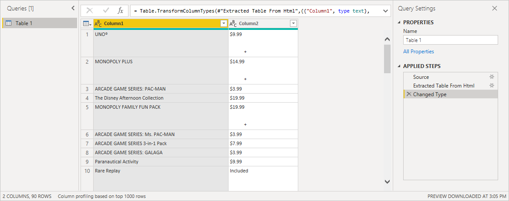

# Obter dados de página Web ao fornecer exemplos

A obtenção de dados de uma página Web permite aos utilizadores extrair facilmente dados de páginas Web e importar esses dados para o *Power BI Desktop*. No entanto, em muitos casos, os dados nas páginas Web não estão em tabelas organizadas e fáceis de extrair. Obter dados dessas páginas pode ser difícil, mesmo que os dados estejam estruturados e sejam consistentes.

Há uma solução. Com a funcionalidade *Obter Dados da Web por exemplo*, essencialmente, pode mostrar ao Power BI Desktop os dados que pretende extrair, ao fornecer um ou mais exemplos dentro da caixa de diálogo do conector. O Power BI Desktop recolhe outros dados na página que correspondam aos seus exemplos. Com esta solução, pode extrair variadíssimos tipos de dados de páginas Web, incluindo dados encontrados em tabelas *e* outros dados não provenientes de tabelas.

Os preços nos gráficos são apenas para fins de exemplo.

## Utilizar a funcionalidade Obter Dados da Web por exemplo

Selecione **Obter Dados** no menu do friso **Home Page**. Na caixa de diálogo apresentada, selecione **Outros** nas categorias no painel esquerdo e, em seguida, selecione **Web**. Selecione **Ligar** para continuar.

Em **Da Web**, introduza o URL da página Web a partir da qual pretende extrair dados. Neste artigo, vamos utilizar a página Web da Microsoft Store e mostrar como funciona este conector.

Se quiser acompanhar, pode utilizar o [URL da Microsoft Store](https://www.microsoft.com/store/top-paid/games/xbox?category=classics) que utilizamos neste artigo:

    https://www.microsoft.com/store/top-paid/games/xbox?category=classics

Quando seleciona **OK**, é aberta a caixa de diálogo **Navegador** onde são apresentadas todas as tabelas automaticamente detetadas a partir da página Web. No caso apresentado na imagem abaixo, não foram encontradas tabelas. Selecione **Adicionar tabela com exemplos** para fornecer exemplos.

**Adicionar tabela com exemplos** apresenta uma janela interativa na qual pode pré-visualizar os conteúdos da página Web. Introduza os valores de exemplo dos dados que pretende extrair.

Neste exemplo, vamos extrair o *Nome* e o *Preço* de cada um dos jogos na página. Podemos fazê-lo ao especificar alguns exemplos da página para cada coluna. Ao introduzir exemplos, o *Power Query* extrai dados que se enquadram no padrão de entradas de exemplo, com algoritmos inteligentes de extração de dados.

> [!NOTE]
> as sugestões de valor incluem apenas valores inferiores ou iguais a 128 carateres.

Quando estiver satisfeito com os dados extraídos da página Web, selecione **OK** para ir para o Editor do Power Query. Pode aplicar mais transformações ou formatar os dados, por exemplo, combinando estes dados com outros dados das nossas origens.

A partir daí, pode criar os elementos visuais ou utilizar os dados da página Web quando criar os seus relatórios do Power BI Desktop.

## Próximas etapas

Existem diversos tipos de dados aos quais se pode ligar através do Power BI Desktop. Para obter mais informações sobre origens de dados, consulte os seguintes recursos:

* [Adicionar uma coluna a partir de um exemplo no Power BI Desktop](../create-reports/desktop-add-column-from-example.md)
* [Ligar a páginas Web a partir do Power BI Desktop](desktop-connect-to-web.md)
* [Origens de dados no Power BI Desktop](desktop-data-sources.md)
* [Formatar e combinar dados no Power BI Desktop](desktop-shape-and-combine-data.md)
* [Ligar a livros do Excel no Power BI Desktop](desktop-connect-excel.md)
* [Ligar a ficheiros CSV no Power BI Desktop](desktop-connect-csv.md)
* [Introduzir dados diretamente no Power BI Desktop](desktop-enter-data-directly-into-desktop.md)
