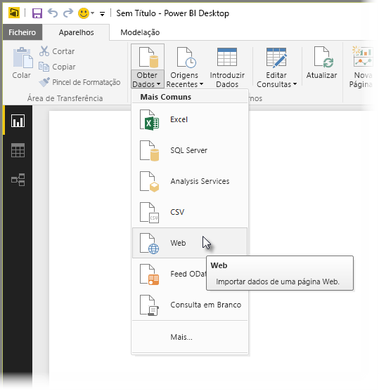
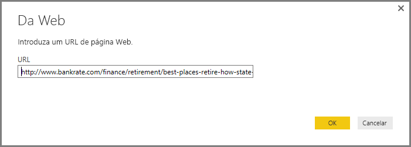
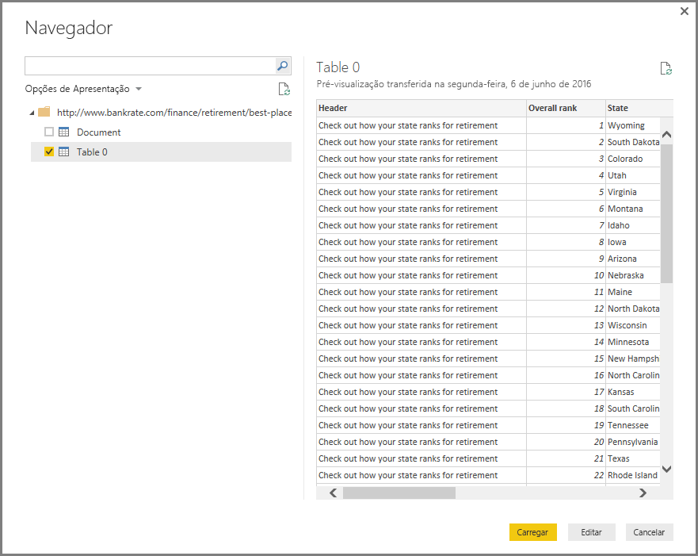
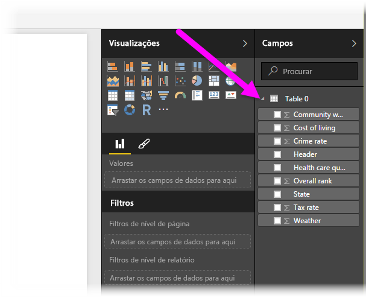

# Ligar a páginas Web a partir do Power BI Desktop

Pode ligar a uma página Web e importar os respetivos dados para o Power BI Desktop para utilizar nos seus elementos visuais e modelos de dados.

No Power BI Desktop, selecione **Obter Dados > Web** do friso **Base**.

Aparece uma caixa de diálogo a pedir o URL da página Web da qual pretende importar dados.

Após escrever (ou colar) o URL, selecione **OK**. O Power BI Desktop liga-se a essa página e apresenta os dados disponíveis da página na janela **Navegador**. Quando selecionar um dos elementos de dados disponíveis, como uma tabela da página inteira, a janela do **Navegador** mostra uma pré-visualização desses dados no lado direito da janela.

Pode selecionar o botão **Editar**, que faz abrir o **Editor de Consultas**, onde pode formatar e transformar os dados nessa página Web antes de importá-los para o Power BI Desktop. Pode também selecionar o botão **Carregar** e importar todos os elementos de dados que selecionou no painel à esquerda.

Quando selecionar **Carregar**, o Power BI Desktop importa os itens selecionados e disponibiliza-os no painel **Campos**, que se encontra no lado direito da vista Relatórios no Power BI Desktop.

É tudo o que precisa de saber sobre ligar a uma página Web e levar os seus dados ao Power BI Desktop.

A partir daí, pode arrastar esses campos para a tela de Relatório e criar as visualizações que pretender. Também pode utilizar os dados dessa página Web tal como faria com outro tipo de dados: pode formatá-los, criar relações entre os mesmos e outras origens de dados no modelo, bem como fazer o que pretende para criar o relatório do Power BI pretendido.

Para ver a ligação a páginas Web em ação e de forma mais aprofundada, consulte o [Guia de Introdução ao Power BI Desktop](../fundamentals/desktop-getting-started.md).

## Próximos passos
Existem diversos tipos de dados aos quais se pode ligar através do Power BI Desktop. Para obter mais informações sobre origens de dados, consulte os seguintes recursos:

* [Origens de Dados no Power BI Desktop](desktop-data-sources.md)
* [Formatar e Combinar Dados com o Power BI Desktop](desktop-shape-and-combine-data.md)
* [Ligar a livros do Excel no Power BI Desktop](desktop-connect-excel.md)   
* [Ligar a ficheiros CSV no Power BI Desktop](desktop-connect-csv.md)   
* [Introduzir dados diretamente no Power BI Desktop](desktop-enter-data-directly-into-desktop.md)   
