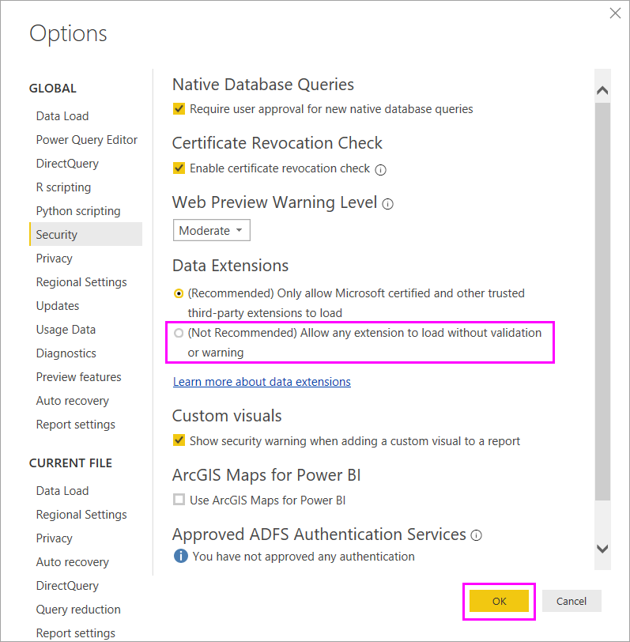
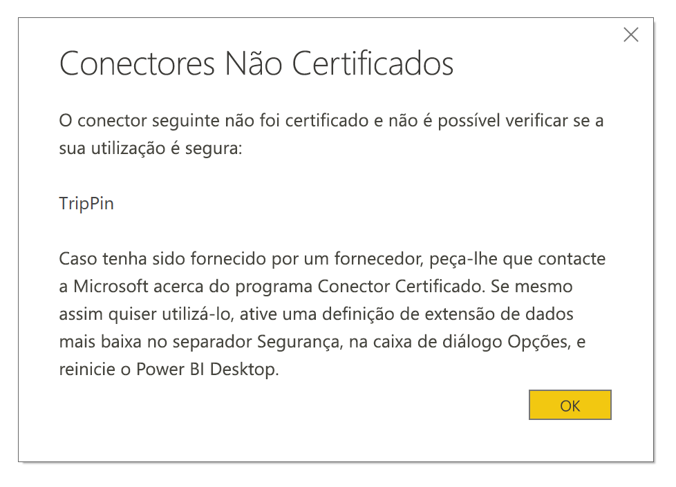

# Extensibilidade de conectores no Power BI

O Power BI pode ligar a dados ao utilizar conectores existentes e origens de dados genéricas, como ODBC, OData, OLE DB, Web, CSV, XML e JSON. Em alternativa, os programadores podem ativar novas origens de dados com extensões de dados personalizadas chamadas *conectores personalizados*. Alguns conectores personalizados são certificados e distribuídos pela Microsoft como *conectores certificados*.

Para utilizar conectores personalizados não certificados que você ou terceiros desenvolveram, tem de ajustar as definições de segurança do Power BI Desktop para permitir que as extensões carreguem sem validação ou aviso. Uma vez que este código é capaz de utilizar credenciais, incluindo o envio através de HTTP, e ignorar níveis de privacidade, só deve utilizar esta definição de segurança se confiar totalmente nos seus conectores personalizados.

Outra opção é que o programador assine o conector com um certificado e forneça as informações necessárias para utilizá-lo sem alterar as suas definições de segurança. Para obter mais informações, veja [Acerca dos conectores de terceiros fidedignos](desktop-trusted-third-party-connectors.md).

## Conectores personalizados

Os conectores personalizados não certificados podem variar desde pequenas APIs importantes para a sua empresa até grandes serviços específicos da indústria para os quais a Microsoft não lançou um conector. Muitos conectores são distribuídos pelos fornecedores. Se precisar de um conector de dados específico, contacte o fornecedor. 

Para utilizar um conector personalizado não certificado, coloque o ficheiro de conector *.pq*, *.pqx*, *.m* ou *.mez* na pasta *\[Documentos]\\Power BI Desktop\\Conectores Personalizados*. Se a pasta não existir, crie-a.

Ajuste as definições de segurança da extensão de dados da seguinte forma:

No Power BI Desktop, selecione **Ficheiro** > **Opções e definições** > **Opções** > **Segurança**.

Em **Extensões de Dados**, selecione **(Não Recomendado) Permitir o carregamento de qualquer extensão sem validação ou aviso**. Selecione **OK** e, em seguida, reinicie o Power BI Desktop. 

A predefinição de segurança da extensão de dados do Power BI Desktop é **(Recomendado) Permitir apenas o carregamento de extensões certificadas da Microsoft e de outras extensões de terceiros fidedignas**. Com esta definição, se existirem conectores personalizados não certificados no seu sistema, a caixa de diálogo **Conectores Não Certificados** aparece no arranque do Power BI Desktop e indica os conectores que não podem ser carregados de forma segura.

Para resolver o erro, pode alterar a definição de segurança **Extensões de Dados** ou remover os conectores não certificados da pasta *Conectores Personalizados*.

## Conectores certificados

Um subconjunto limitado de extensões de dados é considerado *certificado*. Apesar de distribuir os conectores, a Microsoft não é responsável pelo respetivo desempenho ou funcionamento contínuo. O programador de terceiros que criou o conector é responsável pela respetiva manutenção e suporte. 

No Power BI Desktop, os conectores de terceiros certificados aparecem na lista na caixa de diálogo **Obter Dados**, juntamente com conectores comuns e genéricos. Não precisa de ajustar as definições de segurança para utilizar conectores certificados.

Se pretender que um conector personalizado seja certificado, peça ao seu fornecedor que contacte dataconnectors@microsoft.com.
