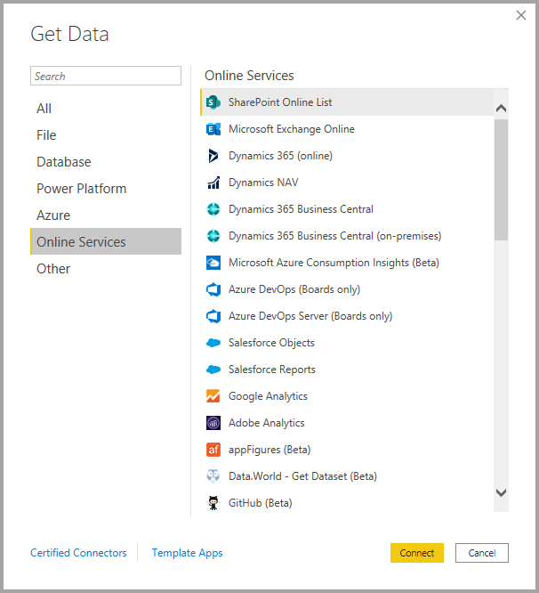
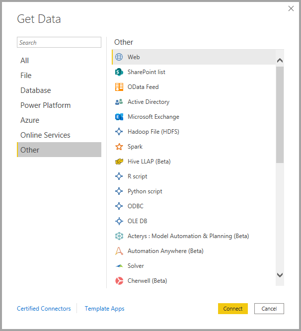
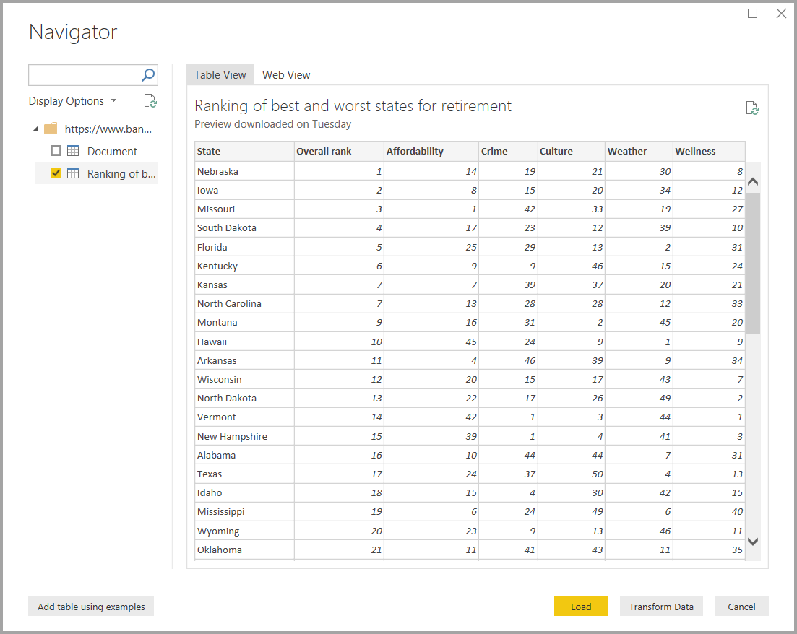

# <a name="data-sources-in-power-bi-desktop"></a>Origens de dados no Power BI Desktop

O Power BI Desktop permite ligar-se a dados de várias origens diferentes. Para obter uma lista completa de origens de dados, veja [Origens de dados do Power BI](power-bi-data-sources.md).

Liga-se aos dados através do friso **Página Inicial**. Para ver o menu de tipos de dados **Mais Comuns**, selecione a etiqueta do botão **Obter Dados** ou a seta para baixo.


Para aceder à caixa de diálogo **Obter Dados**, expanda o menu de tipos de dados **Mais Comuns** e selecione **Mais**. Também pode abrir a caixa de diálogo **Obter Dados** (e ignorar o menu **Mais Comuns**) ao selecionar o ícone **Obter Dados** diretamente.


> [!NOTE]
> A equipa do Power BI está continuamente a expandir as origens de dados disponíveis para o Power BI Desktop e o serviço Power BI. Como tal, verá frequentemente versões anteriores de origens de dados em construção marcadas como **Beta** ou **Pré-visualização**. As origens de dados marcadas como **Beta** ou **Pré-visualização** têm suporte e funcionamento limitados, pelo que não devem ser utilizadas em ambientes de produção. Além disso, as origens de dados marcadas como **Beta** ou **Pré-visualização** para o Power BI Desktop podem não estar disponíveis para utilização no serviço Power BI ou noutros serviços da Microsoft, até que fiquem disponíveis para o público.

> [!NOTE]
> Existem muitos conectores de dados para o Power BI Desktop que requerem o Internet Explorer 10 (ou mais recente) para autenticação. 


## <a name="data-sources"></a>Origens de dados

A caixa de diálogo **Obter Dados** organiza tipos de dados nas seguintes categorias:

* Tudo
* Ficheiro
* Base de Dados
* Power Platform
* Azure
* Serviços Online
* Outros

A categoria **Todos** inclui todos os tipos de ligação de dados de todas as categorias.

### <a name="file-data-sources"></a>Origens de dados de ficheiros

A categoria **Ficheiro** fornece as seguintes ligações de dados:

* Excel
* Texto/CSV
* XML
* JSON
* Pasta
* PDF
* Pasta do SharePoint

A imagem seguinte mostra a janela **Obter Dados** para **Ficheiro**.


### <a name="database-data-sources"></a>Origens de dados de bases de dados

A categoria **Base de dados** fornece as seguintes ligações de dados:

* Base de dados do SQL Server
* Base de dados do Access
* Base de dados do SQL Server Analysis Services
* Base de dados Oracle
* Base de dados DB2 da IBM
* Base de dados IBM Informix (Beta)
* IBM Netezza
* Base de dados MySQL
* Base de dados PostgreSQL
* Base de dados Sybase
* Base de dados Teradata
* Base de dados SAP HANA
* SAP Business Warehouse Application Server
* SAP Business Warehouse Message Server
* Amazon Redshift
* Impala
* Google BigQuery
* Vertica
* Snowflake
* Essbase
* Cubos AtScale
* Conector BI 
* Data Virtuality LDW (Beta)
* Denodo
* Dremio
* Exasol
* Indexima (Beta)
* InterSystems IRIS (Beta)
* Jethro (Beta)
* Kyligence
* Bases de dados Linkar PICK Style/MultiValue (Beta)
* MarkLogic

> [!NOTE]
> Alguns conectores de base de dados requerem que os ative ao selecionar **Ficheiro > Opções e definições > Opções** e, em seguida, selecionar **Funcionalidades de Pré-visualização** e ativar o conector. Se não vir alguns dos conectores mencionados acima e pretender utilizá-los, consulte as suas definições de **Funcionalidades de Pré-visualização**. Note também que qualquer origem de dados marcada como *Beta* ou *Pré-visualização* tem suporte e funcionamento limitados, não devendo ser utilizada em ambientes de produção.

A imagem a seguir mostra a janela **Obter Dados** para **Base de dados**.


### <a name="power-platform-data-sources"></a>Origens de dados do Power Platform

A categoria do **Power Platform** fornece as seguintes ligações de dados:

* Conjuntos de dados do Power BI
* Fluxos de dados do Power BI
* Common Data Service
* Power Platform dataflows (Fluxos de dados do Power Platform)

A seguinte imagem mostra a janela **Obter Dados** para o **Power Platform**.


### <a name="azure-data-sources"></a>Origens de dados do Azure

A categoria **Azure** fornece as seguintes ligações de dados:

* Base de Dados SQL do Azure
* Azure SQL Data Warehouse
* Base de dados do Azure Analysis Services
* Base de Dados do Azure para PostgreSQL
* Armazenamento de Blobs do Azure
* Armazenamento de Tabelas do Azure
* Azure Cosmos DB
* Azure Data Lake Storage Gen2
* Azure Data Lake Storage Gen1
* Azure HDInsight (HDFS)
* Azure HDInsight Spark
* Interactive Query do HDInsight
* Azure Data Explorer (Kusto)
* Azure Cost Management
* Azure Time Series Insights (Beta)


A imagem a seguir mostra a janela **Obter Dados** para **Azure**.


### <a name="online-services-data-sources"></a>Origens de dados dos Serviços Online

A categoria **Serviços Online** fornece as seguintes ligações de dados:

* Lista do SharePoint Online
* Microsoft Exchange Online
* Dynamics 365 (online)
* Dynamics NAV
* Dynamics 365 Business Central
* Dynamics 365 Business Central (no local)
* Microsoft Azure Consumption Insights (Beta)
* Azure DevOps (apenas Placas)
* Azure DevOps Server (apenas Placas)
* Objetos do Salesforce
* Relatórios do Salesforce
* Google Analytics
* Adobe Analytics
* appFigures (Beta)
* Data.World – Obter Conjunto de Dados (Beta)
* GitHub (Beta)
* LinkedIn Sales Navigator (Beta)
* Marketo (Beta)
* Mixpanel (Beta)
* Planview Enterprise One – PRM (Beta)
* Planview Projectplace (Beta)
* QuickBooks Online (Beta)
* Smartsheet
* SparkPost (Beta)
* SweetIQ (Beta)
* Planview Enterprise One – CTM (Beta)
* Twilio (Beta)
* tyGraph (Beta)
* Webtrends (Beta)
* ZenDesk (Beta)
* Asana (Beta)
* Dynamics 365 for Customer Insights (Beta)
* Origem de Dados Emigo
* Entersoft Business Suite (Beta)
* FactSet Analytics (Beta)
* Industrial App Store
* Intune Data Warehouse (Beta)
* Segurança do Microsoft Graph (Beta)
* Projectplace para o Power BI (Beta)
* Product Insights (Beta)
* Quick Base
* TeamDesk (Beta)
* Webtrends Analytics (Beta)
* Witivio (Beta)
* Informações sobre Tendências Empresariais (Beta)
* Zoho Creator (Beta)

A imagem a seguir mostra a janela **Obter Dados** para **Serviços Online**.



### <a name="other-data-sources"></a>Outras origens de dados

A categoria **Outros** fornece as seguintes ligações de dados:

* Web
* Lista do SharePoint
* Feed OData
* Active Directory
* Microsoft Exchange
* Ficheiro Hadoop (HDFS)
* Spark
* LLAP do Hive (Beta)
* Script R
* Script de Python
* ODBC
* OLEDB
* Solver
* Cognite Data Fusion (Beta)
* FHIR
* Information Grid (Beta)
* Jamf Pro (Beta)
* MicroStrategy for Power BI
* Paxata
* QubolePresto (Beta)
* Roamler (Beta)
* Shortcuts Business Insights (Beta)
* Siteimprove
* SurveyMonkey (Beta)
* Tenforce (Smart)List
* TIBCO(R) Data Virtualization (Beta)
* Vena (Beta)
* Workforce Dimensions (Beta)
* Zucchetti HR Infinity (Beta)
* Consulta em Branco

A imagem a seguir mostra a janela **Obter Dados** para **Outros**.



> [!NOTE]
> Atualmente, não é possível ligar-se a origens de dados personalizadas protegidas através do Azure Active Directory.

## <a name="connecting-to-a-data-source"></a>Ligar a uma origem de dados

Para se ligar a uma origem de dados, selecione a origem de dados na janela **Obter Dados** e selecione **Ligar**. Na imagem que se segue, a opção **Web** é selecionada da categoria de ligação de dados **Outros**.


É apresentada uma janela de ligação específica para o tipo de ligação de dados. Se as credenciais forem precisas, serão pedidas. A imagem a seguir mostra um URL a ser introduzido para ligar a uma origem de dados da Web.


Introduza o URL ou as informações de ligação do recurso e, em seguida, selecione **OK**. O Power BI Desktop estabelece a ligação à origem de dados e apresenta as origens de dados disponíveis no **Navegador**.



Para carregar os dados, selecione o botão **Carregar** na parte inferior do painel **Navegador**. Para transformar ou editar a consulta no Editor do Power Query antes de carregar os dados, selecione o botão **Transformar Dados**.

E é tudo o que precisa de saber sobre ligar-se a origens de dados no Power BI Desktop! Experimente ligar-se a dados da nossa cada vez maior lista de origens de dados e consulte esta secção com frequência, pois estamos constantemente a expandir esta lista.

## <a name="using-pbids-files-to-get-data"></a>Utilizar ficheiros PBIDS para obter dados

Os ficheiros PBIDS são ficheiros do Power BI Desktop que possuem uma estrutura específica e têm uma extensão .PBIDS para os identificar como um ficheiro de origem de dados do Power BI.

Pode criar um ficheiro PBIDS para simplificar a experiência de **Obter Dados** dos criadores de relatórios na sua organização. Para facilitar a utilização dos ficheiros PBIDS por parte de um novo autor de relatórios, recomendamos que um administrador crie estes ficheiros para ligações normalmente utilizadas.

Quando um autor abre um ficheiro PBIDS, o Power BI Desktop é aberto e solicita ao utilizador as credenciais para autenticar e ligar à origem de dados que é especificada no ficheiro. A caixa de diálogo **Navegação** é apresentada e o utilizador deve selecionar as tabelas dessa origem de dados a serem carregadas para o modelo. Os utilizadores também poderão ter de selecionar as bases de dados se não tiver sido especificada nenhuma no ficheiro PBIDS.

Deste ponto em diante, o utilizador pode começar a criar visualizações ou selecionar **Origens Recentes** para carregar um novo conjunto de tabelas para o modelo.

Atualmente, os ficheiros PBIDS só suportam uma única origem de dados num ficheiro. A especificação de mais do que uma origem de dados resulta num erro.

Para criar o ficheiro PBIDS, um administrador deve especificar as entradas necessárias para uma única ligação. Também pode especificar o modo de ligação como DirectQuery ou Importação. Se o **modo** estiver em falta ou for nulo no ficheiro, será pedido ao utilizador que abra o ficheiro no Power BI Desktop para selecionar **DirectQuery** ou **Importação**.

### <a name="pbids-file-examples"></a>Exemplos de ficheiros PBIDS

Esta seção fornece alguns exemplos de origens de dados utilizadas com frequência. O tipo de ficheiro PBIDS apenas suporta ligações de dados que também são suportadas no Power BI Desktop, com duas exceções: Live Connect e Consulta em Branco.

O ficheiro PBIDS *não* inclui informações de autenticação nem informações de tabela e de esquema.  

Os fragmentos de código seguintes mostram vários exemplos comuns de ficheiros PBIDS, mas estes não estão completos nem são exaustivos. Para outras origens de dados, pode consultar o [formato de Referência da Origem de Dados (DSR) para as informações de protocolo e endereço](https://docs.microsoft.com/azure/data-catalog/data-catalog-dsr#data-source-reference-specification).

Estes exemplos são apenas para conveniência, não pretendem ser exaustivos nem incluem todos os conectores suportados no formato DSR. Os administradores ou organizações podem criar as suas próprias origens de dados ao utilizar estes exemplos como guias, a partir dos quais podem criar e suportar os seus próprios ficheiros de origem de dados.

#### <a name="azure-as"></a>Azure AS

```json
{ 
    "version": "0.1", 
    "connections": [ 
    { 
        "details": { 
        "protocol": "analysis-services", 
        "address": { 
            "server": "server-here" 
        }, 
        } 
    } 
    ] 
}
```

#### <a name="folder"></a>Pasta

```json
{ 
  "version": "0.1", 
  "connections": [ 
    { 
      "details": { 
        "protocol": "folder", 
        "address": { 
            "path": "folder-path-here" 
        } 
      } 
    } 
  ] 
} 
```

#### <a name="odata"></a>OData

```json
{ 
  "version": "0.1", 
  "connections": [ 
    { 
      "details": { 
        "protocol": "odata", 
        "address": { 
            "url": "URL-here" 
        } 
      } 
    } 
  ] 
} 
```

#### <a name="sap-bw"></a>SAP BW

```json
{ 
  "version": "0.1", 
  "connections": [ 
    { 
      "details": { 
        "protocol": "sap-bw-olap", 
        "address": { 
          "server": "server-name-here", 
          "systemNumber": "system-number-here", 
          "clientId": "client-id-here" 
        }, 
      } 
    } 
  ] 
} 
```

#### <a name="sap-hana"></a>SAP Hana

```json
{ 
  "version": "0.1", 
  "connections": [ 
    { 
      "details": { 
        "protocol": "sap-hana-sql", 
        "address": { 
          "server": "server-name-here:port-here" 
        }, 
      } 
    } 
  ] 
} 
```

#### <a name="sharepoint-list"></a>Lista do SharePoint

O URL deve apontar para o site do SharePoint, não para uma lista no site. Os utilizadores obtêm um navegador que lhes permite selecionar uma ou mais listas desse site, cada uma delas torna-se uma tabela no modelo.

```json
{ 
  "version": "0.1", 
  "connections": [ 
    { 
      "details": { 
        "protocol": "sharepoint-list", 
        "address": { 
          "url": "URL-here" 
        }, 
       } 
    } 
  ] 
} 
```

#### <a name="sql-server"></a>SQL Server

```json
{ 
  "version": "0.1", 
  "connections": [ 
    { 
      "details": { 
        "protocol": "tds", 
        "address": { 
          "server": "server-name-here", 
          "database": "db-name-here (optional) "
        } 
      }, 
      "options": {}, 
      "mode": "DirectQuery" 
    } 
  ] 
} 
```

#### <a name="text-file"></a>Ficheiro de texto

```json
{ 
  "version": "0.1", 
  "connections": [ 
    { 
      "details": { 
        "protocol": "file", 
        "address": { 
            "path": "path-here" 
        } 
      } 
    } 
  ] 
} 
```

#### <a name="web"></a>Web

```json
{ 
  "version": "0.1", 
  "connections": [ 
    { 
      "details": { 
        "protocol": "http", 
        "address": { 
            "url": "URL-here" 
        } 
      } 
    } 
  ] 
} 
```

#### <a name="dataflow"></a>Fluxo de dados

```json
{
  "version": "0.1",
  "connections": [
    {
      "details": {
        "protocol": "powerbi-dataflows",
        "address": {
          "workspace":"workspace id (Guid)",
          "dataflow":"optional dataflow id (Guid)",
          "entity":"optional entity name"
        }
       }
    }
  ]
}
```

## <a name="next-steps"></a>Próximos passos

Pode fazer todo o tipo de coisas com o Power BI Desktop. Para obter mais informações sobre as suas capacidades, veja os seguintes recursos:

* [O que é o Power BI Desktop?](../fundamentals/desktop-what-is-desktop.md)
* [Descrição geral das consultas no Power BI Desktop](../transform-model/desktop-query-overview.md)
* [Tipos de dados no Power BI Desktop](desktop-data-types.md)
* [Formatar e combinar dados com o Power BI Desktop](desktop-shape-and-combine-data.md)
* [Tarefas comuns de consulta no Power BI Desktop](../transform-model/desktop-common-query-tasks.md)
