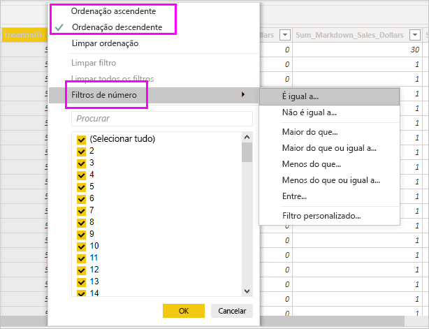

# Trabalhar com a Vista de dados no Power BI Desktop

A *Vista de Dados* ajuda a inspecionar, explorar e compreender os dados no modelo do *Power BI Desktop*. É diferente do modo como vê as tabelas, as colunas e os dados no *Editor do Power Query*. Com a Vista de Dados, está a ver os seus dados *após* estes terem sido carregados no modelo.

> [!NOTE]
> Uma vez que a vista de Dados mostra dados após serem carregados para o modelo, o ícone da vista de Dados não é visível se todas as origens de dados se basearem no DirectQuery. 

Quando está a modelar os seus dados, às vezes quer ver o que está realmente numa tabela ou coluna, sem criar um elemento visual na tela de relatório. Poderá querer ver a nível da linha. Esta capacidade é particularmente útil quando está a criar colunas calculadas e medidas ou quando precisa de identificar um tipo de dados ou uma categoria de dados.

Analisemos mais detalhadamente alguns dos elementos que se encontram na Vista de Dados.

1. **Ícone da Vista de Dados**. Selecione este ícone para aceder à Vista de Dados.

2. **Grelha de Dados**. Esta área mostra a tabela selecionada e todas as colunas e linhas presentes na mesma. As colunas ocultadas da vista *Relatório* aparecem a cinzento. Pode clicar com o botão direito do rato numa coluna para ver as opções.

3. **Friso de Modelação**. Aqui, pode gerir relações, criar cálculos ou alterar o tipo, formato ou categoria de dados de uma coluna.

4. **Barra de Fórmulas**. Introduza fórmulas DAX (Data Analysis Expression) para Medidas e Colunas calculadas.

5. **Pesquisa**. Procure uma tabela ou coluna no seu modelo.

6. **Lista de campos**. Selecione uma tabela ou coluna para ver na grelha de dados.

## Filtragem na Vista de Dados

Também pode filtrar e ordenar dados na Vista de Dados. Cada coluna mostra um ícone que identifica a direção de ordenação, se estiver aplicada.

Pode filtrar valores individuais ou utilizar a filtragem avançada com base nos dados na coluna.

> [!NOTE]
> Quando um modelo do Power BI é criado numa cultura diferente da utilizada na interface do utilizador atual, a caixa de pesquisa irá aparecer na interface do utilizador da Vista de Dados apenas para campos de texto. Por exemplo, isto aplica-se a um modelo criado em inglês dos EUA que vê em espanhol.

## Próximos passos

Pode fazer todo o tipo de coisas com o Power BI Desktop. Para obter mais informações sobre as suas capacidades, veja os seguintes recursos:

* [O que é o Power BI Desktop?](../fundamentals/desktop-what-is-desktop.md)
* [Descrição geral das consultas no Power BI Desktop](../transform-model/desktop-query-overview.md)
* [Tipos de dados no Power BI Desktop](desktop-data-types.md)
* [Formatar e combinar dados com o Power BI Desktop](desktop-shape-and-combine-data.md)
* [Tarefas comuns de consulta no Power BI Desktop](../transform-model/desktop-common-query-tasks.md)
