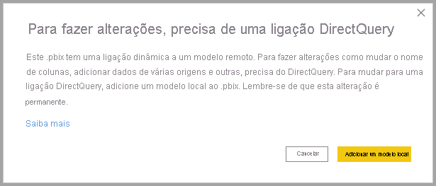
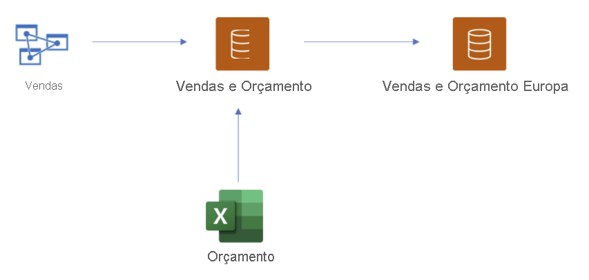
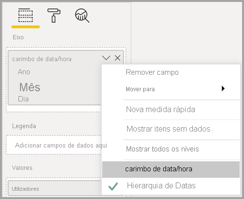

# Utilizar o DirectQuery para conjuntos de dados do Power BI e para o Azure Analysis Services (pré-visualização)

Com o **DirectQuery para conjuntos de dados do Power BI e para o Azure Analysis Services (AAS)** , pode utilizar o DirectQuery para estabelecer ligação ao AAS ou aos conjuntos de dados do Power BI e, se desejar, combiná-los com outros dados importados e do DirectQuery. Esta funcionalidade é especialmente útil para os autores de relatórios que queiram combinar os dados do modelo semântico empresarial com outros dados que possuam, como uma folha de cálculo do Excel, ou que queiram personalizar ou melhorar os metadados do modelo semântico empresarial.

## Ativar a funcionalidade de pré-visualização

Como a funcionalidade está atualmente em pré-visualização, primeiro tem de a ativar. Para o fazer, no Power BI Desktop, aceda a **Ficheiro > Opções e definições > Opções** e, na secção **Funcionalidades de pré-visualização**, marque a caixa de verificação **DirectQuery para conjuntos de dados do Power BI e para o Analysis Services** para ativar esta funcionalidade de pré-visualização. Poderá ter de reiniciar o Power BI Desktop para que a alteração entre em vigor.

## Utilizar o DirectQuery para ligações dinâmicas

A utilização do DirectQuery para conjuntos de dados do Power BI e para o Azure Analysis Services requer que o relatório tenha um modelo local. Pode começar com uma ligação dinâmica e adicionar ou atualizar para um modelo local ou começar com uma ligação ou dados importados do DirectQuery, o que cria automaticamente um modelo local no relatório.

Para ver que ligações estão a ser utilizadas no modelo, verifique a barra de estado no canto inferior direito do Power BI Desktop. Se apenas estiver ligado a uma origem do Azure Analysis Services, será apresentada uma mensagem semelhante à seguinte imagem:

Se estiver ligado a um conjunto de dados do Power BI, será apresentada uma mensagem que lhe indica o conjunto de dados do Power BI ao qual está ligado:

Se quiser personalizar os metadados dos campos no conjunto de dados com ligação dinâmica, selecione **Fazer alterações neste modelo** na barra de estado. Em alternativa, pode clicar no botão **Fazer alterações neste modelo** no friso, conforme mostrado na seguinte imagem. Na **Vista de Relatório**, o botão **Fazer alterações neste modelo** encontra-se no separador **Modelação**. Na Vista de Modelo, o botão encontra-se no separador **Base**.

Ao selecionar o botão, é apresenta uma caixa de diálogo que confirma a adição de um modelo local. Selecione **Adicionar um modelo local** para ativar a criação de novas colunas ou a modificação dos metadados para os campos dos conjuntos de dados do Power BI ou do Azure Analysis Services. A imagem a seguir mostra a caixa de diálogo que é apresentada. 

Quando tem uma ligação dinâmica a uma origem do Analysis Services, não existem modelos locais. Para utilizar o DirectQuery para origens com ligação dinâmica, como conjuntos de dados do Power BI e Azure Analysis Services, terá de adicionar um modelo local ao relatório. Quando publica um relatório com um modelo local no serviço Power BI, também é publicado um conjunto dados para esse modelo local.

## Encadeamento

Os conjuntos de dados, bem como os conjuntos de dados e modelos nos quais se baseiam, ativos formam uma *cadeia*. Este processo, denominado **encadeamento**, permite-lhe publicar um relatório e um conjunto de dados com base noutros conjuntos de dados do Power BI, uma funcionalidade que não era possível anteriormente.

Por exemplo, imagine que um colega publica um conjunto de dados do Power BI chamado *Vendas e Orçamento* com base num modelo do Azure Analysis Services chamado *Vendas* e combina-o com uma folha do Excel chamada *Orçamento*.

Quando publicar um novo relatório (e conjunto de dados) chamado *Vendas e Orçamento Europa* com base no conjunto de dados do Power BI *Vendas e Orçamento* publicado pelo seu colega, ao fazer algumas modificações ou extensões adicionais, está efetivamente a adicionar um relatório e um conjunto de dados a uma cadeia de comprimento três, que começou com o modelo do Azure Analysis Services *Vendas* e termina com o conjunto de dados do Power BI *Vendas e Orçamento Europa*. A seguinte imagem apresenta este processo de encadeamento.

A cadeia na imagem anterior é de tamanho três, que é o comprimento máximo durante este período de pré-visualização. A extensão para além de um comprimento de cadeia de três não é suportada e resulta em erros.

## Aviso de segurança

A utilização da funcionalidade **DirectQuery para conjuntos de dados do Power BI e para o Azure Analysis Services** apresentará uma caixa de diálogo de aviso de segurança, mostrada na imagem seguinte.

Os dados podem ser emitidos de uma origem de dados para outra, que é o mesmo aviso de segurança para combinar origens de importação e do DirectQuery num modelo de dados. Para saber mais sobre este comportamento, veja [Utilizar modelos compostos no Power BI Desktop](../transform-model/desktop-composite-models.md).

## Funcionalidades e cenários para experimentar

A lista seguinte apresenta sugestões sobre como pode explorar o **DirectQuery para conjuntos de dados do Power BI e para o Azure Analysis Services (AAS)** :

- Ligar a dados de várias origens: importar (por exemplo, ficheiros), conjuntos de dados do Power BI, Azure Analysis Services
- Criar relações entre diferentes origens de dados
- Escrever medidas que utilizam campos de diferentes origens de dados
- Criar novas colunas para tabelas de conjuntos de dados do Power BI ou para o Azure Analysis Services
- Criar elementos visuais que utilizam colunas de diferentes origens de dados

## Considerações e limitações

Existem algumas **considerações** a ter em mente ao utilizar o **DirectQuery para conjuntos de dados do Power BI e para o Azure Analysis Services (AAS)** :

- Se atualizar as origens de dados e existirem erros com nomes de campos ou tabelas em conflito, o Power BI resolverá automaticamente os erros.

- Para criar relatórios no serviço Power BI num modelo composto com base noutro conjunto de dados, todas as credenciais têm de estar definidas. Na página para atualizar as definições das credenciais, para origens do Azure Analysis Services, é apresentado o seguinte erro, mesmo que as credenciais tenham sido definidas:
    
    
- Uma vez que isto é confuso e incorreto, vamos tratar desta questão em breve.

- As regras RLS serão aplicadas na origem na qual estão definidas, mas não serão aplicadas a nenhum outro conjunto de dados no modelo. A RLS definida no relatório não será aplicada a origens remotas e a RLS definida em origens remotas não será aplicada a outras origens de dados.

- As pastas de apresentação, os KPIs, as tabelas de datas, a segurança ao nível de linha e as traduções não serão importadas da origem nesta versão de pré-visualização. Ainda pode criar pastas de apresentação no modelo local.

- É possível que observe algum comportamento inesperado ao utilizar uma hierarquia de datas. Para resolver este problema, em alternativa, utilize uma coluna de datas. Depois de adicionar uma hierarquia de datas a um elemento visual, pode mudar para uma coluna de datas ao clicar na seta para baixo no nome do campo e, em seguida, clicar no nome desse campo em vez de utilizar a *Hierarquia de Datas*:

    

    Para obter mais informações sobre como utilizar colunas de datas versus hierarquias de datas, veja este artigo.

- É possível que veja mensagens de erro inúteis ao utilizar as funcionalidades de IA com um modelo que tenha uma ligação do DirectQuery ao Azure Analysis Services. 

- A utilização ALLSELECTED com uma origem do DirectQuery devolve resultados incompletos.

- Filtros e relações:
    - Um filtro aplicado a partir de uma origem de dados numa tabela de outra origem do DirectQuery só pode ser definido numa única coluna

    - A filtragem cruzada de duas tabelas numa origem do DirectQuery ao filtrá-las com uma tabela fora da origem não é uma estrutura recomendada e não é suportada.

    - Um filtro só pode ser aplicado a uma tabela uma vez. A aplicação do mesmo filtro numa tabela duas vezes, através de uma ou mais tabelas fora da origem do DirectQuery, não é suportada.

- Durante a pré-visualização, o comprimento máximo de uma cadeia de modelos é três. A extensão para além do comprimento de cadeia de três não é suportada e resulta em erros. 

- Através de ferramentas de terceiros, é possível definir um sinalizador para *evitar o encadeamento* num modelo, de forma a impedir que uma cadeia seja criada ou estendida. Para o definir, procure a propriedade *DiscourageCompositeModels* num modelo. 

Também existem algumas **limitações** a ter em mente:

- Atualmente, os parâmetros para nomes de servidores e bases de dados estão desativados. 

- A definição RLS em tabelas de uma origem remota não é suportada.

- Atualmente, a utilização do SQL Server Analysis Services (SSAS) como uma origem do DirectQuery não é suportada. 

- Atualmente, a utilização do DirectQuery em conjuntos de dados de “A minha área de trabalho” não é suportada. 

- Atualmente, a eliminação de ligações a origens remotas que utilizam o DirectQuery não é suportada.

- Atualmente, a utilização do Power BI Embedded com conjuntos de dados que incluem uma ligação do DirectQuery a um conjunto de dados do Power BI ou modelo do Azure Analysis Services não é suportada.

- As cadeias de formato em colunas e medidas de uma origem remota não são importadas no modelo composto.

- Os grupos de cálculo em origens remotas não são suportados, com resultados de consulta indefinidos.

- Algumas consultas podem devolver resultados errados quando existe uma relação entre tabelas calculadas e tabelas numa origem remota. A criação de tabelas calculadas num conjunto de dados remoto não é suportada, apesar desta não estar atualmente bloqueada na interface.

- Neste momento, a ordenação por coluna não é suportada.

- A atualização automática de páginas (APR) só é suportada em alguns cenários, consoante o tipo da origem de dados. Para obter mais informações, veja o artigo [Atualização automática de páginas no Power BI](../create-reports/desktop-automatic-page-refresh.md).

## Próximos passos

Para obter mais informações sobre o DirectQuery, consulte os seguintes recursos:

- [Utilização do DirectQuery no Power BI Desktop](desktop-use-directquery.md)
- [Modelos do DirectQuery no Power BI Desktop](desktop-directquery-about.md)
- [Orientação do modelo do DirectQuery no Power BI Desktop](../guidance/directquery-model-guidance.md)
- Perguntas? [Experimente perguntar à Comunidade do Power BI](https://community.powerbi.com/)
