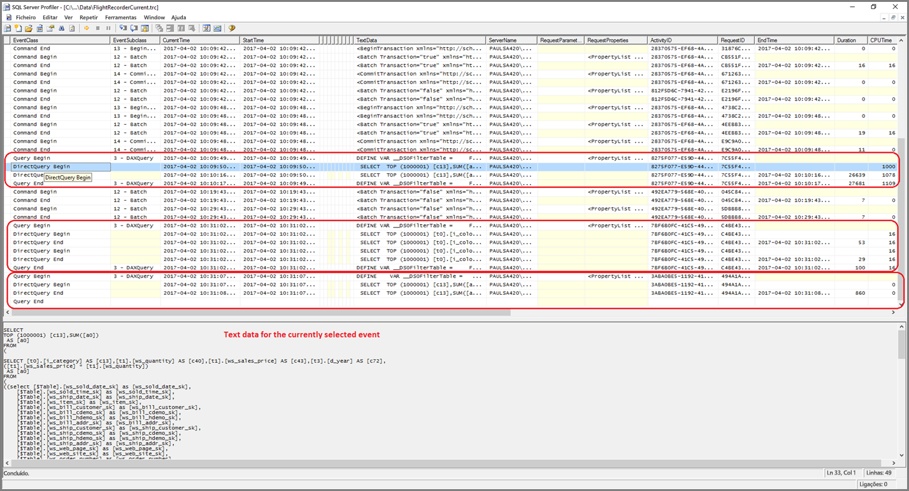
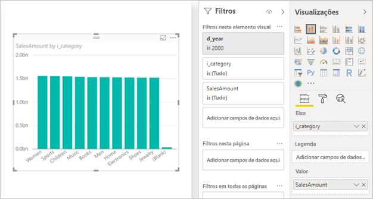

# <a name="troubleshoot-developing-directquery-models-in-power-bi-desktop"></a>Resolver problemas de criação de modelos do DirectQuery no Power BI Desktop

Este artigo destina-se aos modeladores de dados que desenvolvem modelos do DirectQuery no Power BI com o Power BI Desktop ou o serviço Power BI. Descreve como diagnosticar problemas de desempenho e como obter informações mais detalhadas para permitir a otimização dos relatórios.

## <a name="performance-analyzer"></a>Analisador de Desempenho

Recomenda-se vivamente que qualquer diagnóstico de problemas de desempenho seja iniciado no Power BI Desktop, em vez de no Power BI (o serviço ou o Power BI Report Server). Em muitos casos, os problemas de desempenho têm por base simplesmente o nível de desempenho da origem de dados subjacente e são mais facilmente identificados e diagnosticados no ambiente muito mais isolado do Power BI Desktop, que elimina inicialmente alguns componentes (como o gateway do Power BI). Só se não forem encontrados problemas de desempenho no Power BI Desktop é que a investigação se deve concentrar nas especificidades dos relatórios no Power BI. O [Analisador de Desempenho](../create-reports/desktop-performance-analyzer.md) é uma ferramenta útil para identificar problemas ao longo deste processo.

Da mesma forma, recomenda-se tentar primeiro isolar problemas num elemento visual individual em vez de em muitos elementos numa página.

Vamos supor que aqueles passos (nos parágrafos anteriores deste tópico) foram seguidos. Temos agora um único elemento visual numa página no Power BI Desktop que ainda está lenta. Para determinar que consultas estão a ser enviadas para a origem subjacente pelo Power BI Desktop, pode utilizar o Analisador de Desempenho. Também é possível ver rastreios/informações de diagnóstico que podem ser emitidos pela origem de dados subjacente. Estes rastreios também podem conter informações úteis relativamente aos detalhes de execução das consultas e como pode ser melhorada.

Além disso, mesmo que estes rastreios da origem não estejam disponíveis, é possível ver as consultas que o Power BI envia, juntamente com os tempos de execução, conforme descrito a seguir.

## <a name="review-trace-files"></a>Rever ficheiros de rastreio

Por predefinição, o Power BI Desktop regista os eventos durante uma determinada sessão num ficheiro de rastreio com o nome **FlightRecorderCurrent.trc**.

Em algumas origens do DirectQuery, este registo inclui todas as consultas enviadas para a origem de dados subjacente (as restantes origens do DirectQuery podem ser suportadas no futuro). As origens que escrevem consultas no registo são as seguintes:

- SQL Server
- Base de Dados SQL do Azure
- Azure SQL Data warehouse
- Oracle
- Teradata
- SAP HANA

Pode encontrar o ficheiro de rastreio na pasta **AppData** do utilizador atual: _\\\<User>\AppData\Local\Microsoft\Power BI Desktop\AnalysisServicesWorkspaces_

Eis uma forma fácil de chegar a esta pasta: no Power BI Desktop, selecione _Ficheiro > Opções e definições > Opções_ e, em seguida, selecione a página **Diagnósticos**. É apresentada a janela da caixa de diálogo abaixo:


Ao selecionar a ligação **Abrir pasta de informação de falha de sistema/rastreios**, em Recolha de Informação de Falha de Sistema, é aberta a seguinte pasta: _\\\<User>\AppData\Local\Microsoft\Power BI Desktop\Traces_

Navegar para a pasta principal dessa pasta mostra a pasta que contém _AnalysisServicesWorkspaces_, a qual vai conter uma subpasta de área de trabalho para cada instância aberta do Power BI Desktop. Estas subpastas incluem no nome um sufixo de número inteiro, como _AnalysisServicesWorkspace2058279583_.

Dentro dessa pasta está uma subpasta _\Data_, que contém o ficheiro de rastreio FlightRecorderCurrent.trc da sessão atual do Power BI. A pasta de área de trabalho correspondente é eliminada quando a sessão do Power BI Desktop associada é terminada.

Os ficheiros de rastreio podem ser abertos com a ferramenta SQL Server Profiler, que está disponível como transferência gratuita como parte do SQL Server Management Studio. Pode obtê-lo [nesta localização](/sql/ssms/download-sql-server-management-studio-ssms).

Depois de transferir e instalar o SQL Server Management Studio, execute o SQL Server Profiler.



Para abrir o ficheiro de rastreio, siga os passos abaixo:

1. No SQL Server Profiler, selecione _Ficheiro > Abrir > Ficheiro de rastreio_
2. Introduza o caminho para o ficheiro de rastreio para a sessão do Power BI atualmente aberta, tal como: _\\\<User>\AppData\Local\Microsoft\Power BI Desktop\AnalysisServicesWorkspaces\AnalysisServicesWorkspace2058279583\Data_
3. Abra _FlightRecorderCurrent.trc_

São apresentados todos os eventos da sessão atual. É mostrado um exemplo anotado abaixo, que destaca grupos de eventos. Cada grupo tem:

- Um evento de _Início de Consulta_ e de _Fim de Consulta_, os quais representam o início e o fim de uma consulta DAX gerada pela IU (por exemplo, a partir de um elemento visual ou do preenchimento de uma lista de valores na IU do filtro)
- Um ou mais pares de eventos _Início do DirectQuery_ e de _Fim do DirectQuery_, que representam uma consulta enviada para a origem de dados subjacente como parte da avaliação da consulta DAX

Tenha em conta que podem ser executadas várias consultas DAX em paralelo, pelo que é possível intercalar eventos de grupos diferentes. O valor de ActivityID pode ser utilizado para determinar que eventos pertencem ao mesmo grupo.


Seguem-se outras colunas importantes:

- **TextData:** o detalhe textual do evento. Em eventos _Início/Fim de Consulta_, será a consulta DAX. Em eventos _Início/Fim de DirectQuery_, será a consulta SQL enviada à origem subjacente. O valor _TextData_ para o evento selecionado atualmente também é apresentado na área na parte inferior.
- **EndTime:** quando o evento foi concluído.
- **Duration:** a duração, em milissegundos, que demorou a executar a consulta DAX ou SQL.
- **Error:** indica se ocorreu um erro, caso em que o evento também é apresentado a vermelho.

Na imagem acima, algumas das colunas menos interessantes foram reduzidas, de modo a permitir ver mais facilmente as colunas de interesse.

A abordagem recomendada para capturar um rastreio que ajude a diagnosticar potenciais problemas de desempenho é a seguinte:

- Abra uma sessão única do Power BI Desktop (para evitar confusões de ter múltiplas pastas de áreas de trabalho)
- Execute o conjunto de ações de interesse no Power BI Desktop. Inclua algumas ações adicionais para além dessas, para garantir que são enviados para o ficheiro de rastreio todos os eventos de interesse.
- Abra o SQL Server Profiler e examine o rastreio, conforme descrito anteriormente. Lembre-se de que o ficheiro de rastreio vai ser eliminado depois de fechar o Power BI Desktop. Além disso, não serão apresentadas imediatamente mais ações efetuadas no Power BI Desktop. Para ver os novos eventos, deverá fechar e voltar a abrir o ficheiro de rastreio.
- Mantenha as sessões individuais razoavelmente pequenas (dez segundos de ações em vez de centenas de segundos), para facilitar a interpretação do ficheiro de rastreio (como existe um limite para o tamanho deste ficheiro, é possível que em sessões longas os primeiros eventos sejam eliminados).

## <a name="understand-queries-sent-to-the-source"></a>Compreender as consultas enviadas para a origem

O formato geral das consultas geradas e enviadas pelo Power BI Desktop utiliza subconsultas para cada uma das tabelas de modelo referenciadas, em que a subconsulta é definida pela consulta do Power Query. Por exemplo, imaginemos as seguintes tabelas TPC-DS numa base de dados relacional do SQL Server:


Considere o seguinte elemento visual e a respetiva configuração e observe que a medida **SalesAmount** está definida com a seguinte expressão:

```dax

SalesAmount = SUMX(Web_Sales, [ws_sales_price] * [ws_quantity])

```



Atualizar este elemento visual resultará na consulta T-SQL mostrada abaixo do parágrafo seguinte. Como pode ver, existem três subconsultas para as tabelas de modelo **Web_Sales**, **Item** e **Date_dim**. Cada uma destas tabelas devolve todas as colunas da tabela de modelo, embora apenas quatro colunas sejam realmente referenciadas pelo elemento visual. Estas subconsultas (sombreadas) são exatamente a definição das consultas do Power Query. Não se registaram impactos no desempenho resultantes desta utilização das subconsultas nas origens de dados que o DirectQuery suporta até à data. As origens de dados, como o SQL Server, otimizam as referências às colunas não utilizadas.

Um motivo pelo qual o Power BI emprega este padrão é poder definir uma consulta do Power Query para utilizar uma instrução de consulta específica. Assim, é utilizado "conforme fornecido", sem uma tentativa de o reescrever. Tenha em atenção que estes padrões restringem a utilização de instruções de consulta que utilizam Expressões de Tabela Comuns (CTE) e procedimentos armazenados. Estas instruções não podem ser utilizadas em subconsultas.


## <a name="gateway-performance"></a>Desempenho de gateways

Para obter informações sobre a resolução de problemas do desempenho de gateways, leia o artigo [Resolver problemas de gateways – Power BI](service-gateway-onprem-tshoot.md).

## <a name="next-steps"></a>Próximos passos

Para obter mais informações sobre o DirectQuery, consulte os seguintes recursos:

- [Utilização do DirectQuery no Power BI Desktop](desktop-use-directquery.md)
- [Modelos do DirectQuery no Power BI Desktop](desktop-directquery-about.md)
- [Orientação do modelo do DirectQuery no Power BI Desktop](../guidance/directquery-model-guidance.md)
- Perguntas? [Experimente perguntar à Comunidade do Power BI](https://community.powerbi.com/)
