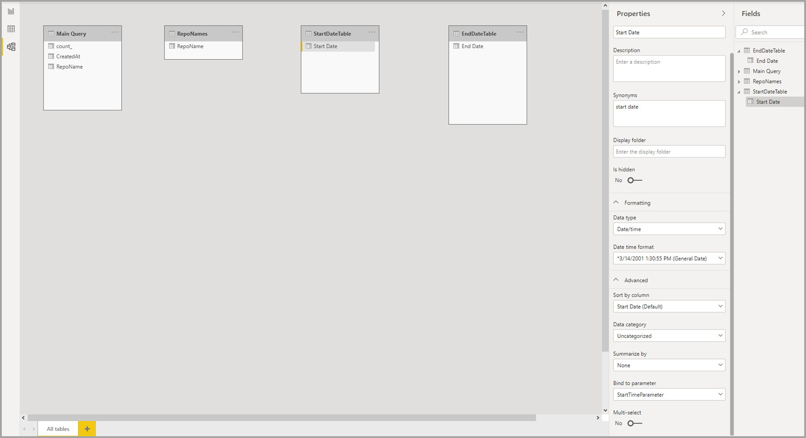

# <a name="dynamic-m-query-parameters-in-power-bi-desktop-preview"></a>Parâmetros de consulta M Dinâmicos no Power BI Desktop (pré-visualização)

Com **Parâmetros de Consulta M Dinâmicos**, os autores de modelo podem permitir que os **visualizadores de relatórios** usem filtros ou segmentações de utilizadores para definir os valores de um [Parâmetro de Consulta M](/power-query/power-query-query-parameters), o que pode ser especialmente útil para otimizações de desempenho de consulta. Com Parâmetros de Consulta M Dinâmicos, os autores de modelo têm controlo adicional sobre como as seleções de filtros são incorporadas em consultas de origem do DirectQuery. 

Quando os autores de modelo compreendem a semântica pretendida dos respetivos filtros, geralmente sabem como escrever consultas eficientes na respetiva origem de dados e, portanto, podem garantir que as seleções de filtros sejam incorporadas às consultas de origem no ponto certo, para atingir os resultados pretendidos com um desempenho melhorado.

## <a name="enabling-dynamic-m-query-parameters"></a>Ativar parâmetros de consulta M Dinâmicos

Os **Parâmetros de Consulta M Dinâmicos** estão atualmente em pré-visualização e têm de ser ativados para serem utilizados. Selecione **Ficheiro > Opções e definições > Opções** e, em seguida, selecione **Funcionalidades de pré-visualização** no painel esquerdo. A partir daí, confirme que a caixa de verificação **Parâmetros de Consulta M Dinâmicos** está selecionada. Poderá ter de reiniciar o Power BI Desktop para que a alteração seja ativada.


Como um pré-requisito para esta caraterística, tem de ter um [Parâmetro de Consulta M](/power-query/power-query-query-parameters) válido criado e referenciado numa ou mais tabelas de Consulta Direta. 

> [!NOTE]
> Certifique-se de que consulta a secção [Considerações e limitações](#considerations-and-limitations) neste artigo, pois nem todas as origens do DirectQuery são suportadas com esta funcionalidade.

Vamos percorrer um exemplo de passagem de um **valor individual** para um parâmetro dinamicamente:

1. No Power BI Desktop, inicie **Power Query** no separador **Dados** e selecione **Novos Parâmetros** no botão **Gerir Parâmetros** no friso.

    

2. Em seguida, preencha as seguintes informações sobre o Parâmetro.

    

3. Clique novamente em **Novo** se tiver mais parâmetros a adicionar.

    

4. Depois de criar os parâmetros, pode referenciá-los na consulta M. Para modificar a Consulta M, abra o editor Avançado, com a Consulta que quer modificar selecionada:

    

5. Em seguida, referencie os parâmetros na Consulta M, realçado a amarelo na imagem seguinte. 

    

6. Agora que criou os parâmetros e os referenciou na Consulta M, em seguida, terá de criar uma tabela com uma coluna que forneça os valores possíveis disponíveis para esse parâmetro. Isto permitirá que os parâmetros sejam definidos dinamicamente com base na seleção de filtros. Neste exemplo, queremos que o Parâmetro *StartTime* e o Parâmetro *EndTime* sejam dinâmicos. Dado que estes parâmetros exigem um parâmetro de Data/Hora, quero gerar entradas de data que possam servir para definir a data do parâmetro. Para começar, criamos uma nova tabela:

    

7. Aqui está a primeira tabela que criei para os valores do Parâmetro *StartTime*:

    ```StartDateTable = CALENDAR (DATE(2016,1,1), DATE(2016,12,31))```

    

8. Aqui está a segunda tabela que criei para os valores do Parâmetro EndTime:

    ```EndDateTable = CALENDAR (DATE(2016,1,1), DATE(2016,12,31))```

    

    > [!NOTE]
    > É recomendável a utilização de um nome de coluna diferente que não esteja numa tabela real. Se tiverem o mesmo nome, o valor selecionado será aplicado como um filtro para a consulta real.

9. Agora que as tabelas com o campo *Data* foram criadas, podemos vincular cada campo a um parâmetro. Vincular o campo a um parâmetro significa essencialmente que, à medida que o valor selecionado para o campo é alterado, o valor será passado para o parâmetro e atualizará a consulta em que o parâmetro é referenciado. Para vincular o campo, aceda ao separador **Modelagem**, selecione o campo acabado de criar e, em seguida, aceda às propriedades **Avançadas**:

    > [!NOTE]
    > O tipo Dados de Coluna deve corresponder ao tipo de parâmetro M.

    

10. Selecione a lista pendente em **Vincular a parâmetro** e selecione o Parâmetro que quer vincular ao campo:

    

    Como este exemplo se destina a um valor de seleção individual (definindo o parâmetro como um valor individual), recomendamos que mantenha **Seleção múltipla** definida como **Não**, que é a predefinição:

    

    Se os seus casos de utilização exigirem várias seleções (passar vários valores para um parâmetro individual), tem de alternar a opção para **Sim** e confirmar que a sua consulta M está configurada corretamente para aceitar vários valores na consulta M. Aqui está um exemplo de *RepoNameParameter*, que permite vários valores:

    

11. Pode repetir estes passos se tiver outros campos para vincular a outros parâmetros:

    

12. Por fim, pode fazer referência a este campo numa segmentação ou como um filtro:

    

Se a coluna mapeada for definida como **Não** para Seleção múltipla, tem de utilizar um modo de seleção individual na segmentação ou exigir uma seleção única no cartão de filtro.

## <a name="potential-security-risk"></a>Potencial risco de segurança

Quando permite aos leitores de relatórios definir dinamicamente os valores dos parâmetros da Consulta M, poderão conseguir aceder a dados adicionais ou acionar modificações no sistema de origem com **ataques de injeção**, consoante a forma como os parâmetros são referenciados na Consulta M e os valores que são passados a esse parâmetro.

Por exemplo, digamos que tem uma consulta Kusto parametrizada construída da seguinte maneira:

```
Products
| where Category == [Parameter inserted here] & HasReleased == 'True'
 | project ReleaseDate, Name, Category, Region```
```

Pode não ter problemas com um utilizador amigável que passe um valor apropriado para o parâmetro, por exemplo, *Jogos*:

```
| where Category == 'Games' & HasReleased == 'True'
```

No entanto, um atacante pode ser capaz de passar um valor que modifique a consulta para obter acesso a mais dados, por exemplo, *'Jogos' //* :

```
Products
| where Category == 'Games'// & HasReleased == 'True'
| project ReleaseDate, Name, Category, Region
```

Neste exemplo, o atacante pode obter acesso a informações sobre jogos que ainda não foram lançados, transformando parte da consulta num comentário.

**Como mitigar o risco**

Para mitigar o risco de segurança, é melhor evitar a concatenação de cadeias de carateres dos valores de parâmetro M dentro da consulta.  Em alternativa, consuma esses valores de parâmetro em operações M que se dobram para a consulta de origem, para que o mecanismo M e o conector construam a consulta final. Como alternativa, se disponível, use um mecanismo de passagem de parâmetros integrado na linguagem e nos conectores da consulta de origem. Por exemplo, o [Azure Data Explorer](/azure/data-explorer/kusto/query/queryparametersstatement?pivots=azuredataexplorer) tem capacidades de parâmetros de consulta integrados que são desenhados para proteger contra ataques de injeção.

Eis alguns exemplos:

* Exemplo de utilização de operações de filtragem da consulta M:
    ```
    Table.SelectRows(Source, (r) =\&gt; r[Columns] = Parameter)
    ```

* Exemplo de declaração do parâmetro na consulta de origem (ou de passagem do valor do parâmetro como uma entrada para uma função de consulta de origem):
    ```
    declare query\_parameters (Name of Parameter : Type of Parameter);
    ```

## <a name="considerations-and-limitations"></a>Considerações e limitações

Há algumas considerações e limitações a serem consideradas quando utilizar parâmetros de consulta M dinâmicos:

* Um parâmetro individual não pode ser dependente de vários campos e vice-versa.
* A funcionalidade só é suportada para origens de dados baseadas em M. Não são suportadas as seguintes origens do DirectQuery:
    * Origens de dados baseadas em T-SQL: SQL Server, Base de Dados SQL do Azure, conjuntos Synapse SQL (também conhecido como Azure SQL Data Warehouse) e conjuntos Synapse SQL OnDemand
    * Origens de dados do Live connect: Azure Analysis Services, SQL Server Analysis Services, Conjuntos de Dados do Power BI
    * Outras origens de dados não suportadas: Oracle, Teradata e SAP Hana Relacional
    * Suportado parcialmente através de programação de ponto final XMLA/TOM: SAP BW e SAP Hana 


* Os tipos de parâmetro prontos para utilização não suportados são os seguintes:
  * Qualquer
  * Duração
  * Verdadeiro/Falso
  * Binário

* Filtros não suportados:
  * Segmentação ou filtro de hora relativa
  * Data relativa
  * Segmentação de dados de hierarquia
  * Filtro de inclusão de vários campos
  * Filtro de exclusão/filtros Não
  * Realce cruzado
  * Filtro de desagregação
  * Filtros de desagregação cruzada
  * Filtro de N superior
* Operações não suportadas:
  * E
  * Contains
  * Menor do que
  * Maior do que
  * Starts with
  * Não começa por
  * Não é
  * Não contém
  * Selecionar tudo
  * Está em branco
  * Não está em branco


## <a name="next-steps"></a>Próximos passos

Pode fazer todo o tipo de coisas com o Power BI Desktop. Para obter mais informações sobre as suas capacidades, veja os seguintes recursos:

* [Acerca de utilizar o DirectQuery no Power BI](desktop-directquery-about.md)
* [O que é o Power BI Desktop?](../fundamentals/desktop-what-is-desktop.md)
* [Descrição geral das Consultas no Power BI Desktop](../transform-model/desktop-query-overview.md)
* [Tipos de dados no Power BI Desktop](desktop-data-types.md)
* [Formatar e combinar dados com o Power BI Desktop](desktop-shape-and-combine-data.md)
* [Tarefas comuns de consulta no Power BI Desktop](../transform-model/desktop-common-query-tasks.md)