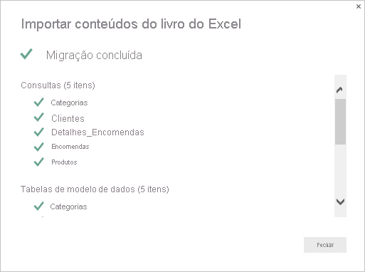

# Importar livros do Excel para o Power BI Desktop
Com o Power BI Desktop, pode importar facilmente livros do Excel que contêm consultas do Power Query, modelos do Power Pivot e folhas de cálculo do Power View para o Power BI Desktop. O Power BI Desktop cria automaticamente relatórios e visualizações com base no livro do Excel. Depois de importados, pode continuar a melhorar e otimizar os relatórios com o Power BI Desktop, através das funcionalidades existentes e novas funcionalidades lançadas em cada atualização mensal do Power BI Desktop.

## Como importar um livro do Excel?
1. Para importar um livro do Excel para o Power BI Desktop, selecione **Ficheiro** > **Importar** > **Power Query, Power Pivot, Power View**.

   

2. Na janela **Abrir**, selecione um livro do Excel para importar. 

   Embora não exista atualmente nenhuma limitação para o tamanho ou número de objetos no livro, o Power BI Desktop demora mais tempo a analisar e importar livros maiores.

   > [!NOTE]
   > Para carregar ou importar ficheiros do Excel a partir de pastas partilhadas do OneDrive para Empresas ou de pastas de um grupo do Microsoft 365, utilize o URL do ficheiro do Excel e introduza-o na origem de dados Web no Power BI Desktop. Tem de seguir alguns passos para formatar corretamente o URL do OneDrive para Empresas. Para obter mais informações e a série correta de passos, veja [Utilizar ligações do OneDrive para Empresas no Power BI Desktop](desktop-use-onedrive-business-links.md).
   > 
   > 

3. Na caixa de diálogo de importação apresentada, selecione **Iniciar**.

   

   O Power BI Desktop analisa o livro e converte-o num ficheiro do Power BI Desktop (.pbix). Esta ação é um evento único. Depois de criar o ficheiro do Power BI Desktop através destes passos, o ficheiro do Power BI Desktop não terá nenhuma dependência do livro original do Excel e poderá ser modificado, guardado e partilhado sem afetar o livro original.

   Quando a importação for concluída, será apresentada uma página de resumo a descrever os itens que foram convertidos e a listar os itens que não puderam ser importados.

   

4. Selecione **Fechar**. 

   O Power BI Desktop importa o livro do Excel e carrega um relatório com base nos conteúdos do livro.

   

Depois de o livro ser importado, pode continuar a trabalhar no relatório. Pode criar novas visualizações, adicionar dados ou criar novas páginas de relatório com qualquer uma das funcionalidades e capacidades incluídas no Power BI Desktop.

## Que elementos de livro são importados?
O Power BI Desktop pode importar os seguintes elementos, normalmente conhecidos como *objetos*, no Excel.

| Objeto no livro do Excel | Resultado final no ficheiro do Power BI Desktop |
| --- | --- |
| Consultas do Power Query |Todas as consultas do Power Query do Excel são convertidas em consultas no Power BI Desktop. Se existirem grupos de consulta definidos no Livro do Excel, a mesma organização será replicada no Power BI Desktop. Todas as consultas são carregadas, a menos que tenham sido definidas como **Apenas Criar Ligação** na caixa de diálogo **Importar Dados** do Excel. O comportamento de carregamento pode ser personalizado ao selecionar **Propriedades** no separador **Base** do Editor do Power Query no Power BI Desktop. |
| Ligações de dados externas do Power Pivot |Todas as ligações de dados externas do Power Pivot são convertidas em consultas no Power BI Desktop. |
| Tabelas ligadas ou tabelas do livro atual |Se existir uma tabela de folhas de cálculo no Excel ligada ao modelo de dados ou ligada a uma consulta (através da opção *Da Tabela* ou da função *Excel.CurrentWorkbook()* em M), serão apresentadas as seguintes opções: <ol><li><b>Importe a tabela para o ficheiro do Power BI Desktop</b>. Esta tabela é um instantâneo único dos dados, após o qual os dados são só de leitura na tabela no Power BI Desktop. Há um limite de tamanho de 1 milhão de carateres (no total, combinando todas as células e cabeçalhos de coluna) para tabelas criadas com essa opção.</li><li><b>Mantenha uma ligação ao livro original</b>. Em alternativa, pode manter uma ligação ao Livro do Excel original e o Power BI Desktop recupera o conteúdo mais recente nesta tabela com cada atualização, assim como qualquer outra consulta criada para um livro do Excel no Power BI Desktop.</li></ul> |
| Colunas calculadas, medidas, KPIs, categorias de dados e relações do modelo de dados |Estes objetos do modelo de dados são convertidos em objetos equivalentes no Power BI Desktop. Tenha em atenção que existem determinadas categorias de dados que não estão disponíveis no Power BI Desktop, tais como Imagem. Nestes casos, as informações de categoria de dados são respostas para as colunas em questão. |
| Folhas de cálculo do Power View |Uma nova página de relatório é criada para cada folha de cálculo do Power View no Excel. O nome e a ordem destas páginas de relatório correspondem aos do livro original do Excel. |

## Há alguma limitação para importar um livro?
Existem algumas limitações para importar um livro para o Power BI Desktop:

* **Ligações externas para modelos tabulares do SQL Server Analysis Services:** No Excel 2013, pode criar uma ligação aos modelos tabulares do SQL Server Analysis Services e criar relatórios do Power View sobre estes modelos, sem ter de importar os dados. Este tipo de ligação não é atualmente suportado como parte da importação de livros do Excel para o Power BI Desktop. Como solução, deve recriar estas ligações externas no Power BI Desktop.
* **Hierarquias:** Este tipo de objeto de modelo de dados não é atualmente suportado no Power BI Desktop. Como tal, as hierarquias são ignoradas como parte da importação de um livro do Excel para o Power BI Desktop.
* **Colunas de dados binários:** Este tipo de coluna de modelo de dados não é atualmente suportado no Power BI Desktop. As colunas de dados binários são removidas da tabela resultante no Power BI Desktop.
* **Elementos do Power View não suportados:** Algumas funcionalidades do Power View não estão disponíveis no Power BI Desktop, tais como temas ou determinados tipos de visualizações (gráfico de dispersão com eixo de reprodução, comportamentos de desagregação, etc.). Estas visualizações sem suporte resultam em mensagens de *Visualização Sem Suporte* nas respetivas localizações correspondentes no relatório do Power BI Desktop, que pode eliminar ou reconfigurar conforme necessário.
* **Intervalos com Nome ao utilizar** **_Da Tabela_ *_ _* no Power Query ou ao utilizar** **_Excel.CurrentWorkbook_ *_ _* em M:** A importação destes dados de intervalo com nome para o Power BI Desktop não é atualmente suportada, mas é uma atualização planeada. Atualmente, estes intervalos com nome são carregados para o Power BI Desktop como uma ligação ao livro externo do Excel.
* **PowerPivot para SSRS:** As ligações externas do PowerPivot ao SSRS (SQL Server Reporting Services) não são atualmente suportadas, porque essa origem de dados não está disponível atualmente no Power BI Desktop.

